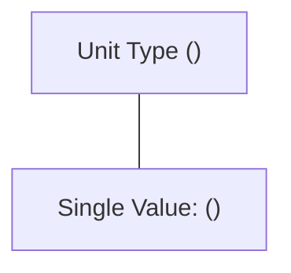
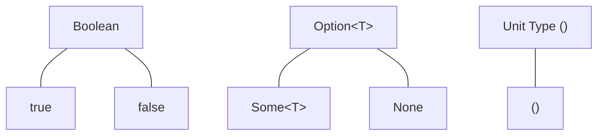

# Rust Unit Type

## Introduction

In Rust, the unit type `()` (pronounced "unit") is a special type that has exactly one value: the unit value, also written as `()`. While it may seem peculiar at first glance, the unit type is a fundamental concept in Rust that serves important purposes in the language. It's considered a compound type even though it doesn't contain any data!

Think of the unit type as Rust's way of saying "nothing" or "void" - it represents the absence of a meaningful value. Unlike other languages that might use `null` or `void`, Rust's unit type has its own unique characteristics and use cases that make it an important tool in your Rust programming toolkit.

## The Basics of Unit Type

### What is the Unit Type?

The unit type in Rust is written as an empty pair of parentheses: `()`. It has several key characteristics:

- It occupies no memory (it has a size of 0 bytes)
- It contains no actual data
- It has only one possible value (also written as `()`)
- It's used when a function doesn't return anything meaningful

Here's a simple example:

```rust
// A function that returns the unit type
fn say_hello() {
    println!("Hello, world!");
}

fn main() {
    // Calling the function returns the unit value
    let result = say_hello();
    
    // We can check that result is indeed the unit type
    println!("Type of result: {:?}", result);
}
```

Output:
```
Hello, world!
Type of result: ()
```

### Unit Type vs. Other "Nothing" Types in Programming

To help understand the unit type, let's compare it to similar concepts in other languages:

| Language | "Nothing" Type | Characteristics |
|----------|---------------|-----------------|
| Rust     | `()`          | A type with exactly one value |
| C/C++    | `void`        | No value can be returned |
| Java     | `void`        | No value can be returned |
| Python   | `None`        | A singleton object representing absence |
| Haskell  | `()`          | Similar to Rust's unit type |

## Common Uses of the Unit Type

### 1. Functions Without Meaningful Return Values

The most common use of the unit type is for functions that perform some action but don't need to return any meaningful value:

```rust
fn log_message(message: &str) -> () {  // The return type could be omitted
    println!("[LOG]: {}", message);
}

fn main() {
    log_message("This is a log entry");
}
```

In fact, the return type `-> ()` is so common that Rust allows you to omit it entirely, and it becomes the default return type when no other is specified.

### 2. Placeholder in Generic Types

The unit type is useful as a placeholder in generic types when you don't need to store any data:

```rust
struct Container<T>(T);

fn main() {
    // A container that holds an integer
    let number_container = Container(42);
    println!("Container with number: {:?}", number_container.0);
    
    // A container that holds nothing (unit type)
    let empty_container = Container(());
    println!("Container with unit: {:?}", empty_container.0);
}
```

Output:
```
Container with number: 42
Container with unit: ()
```

### 3. As a Signal or Marker

The unit type can be used to signal success in operations where we only care about whether an action succeeded, not what it returned:

```rust
fn process_data() -> Result<(), String> {
    // Do some processing...
    // If successful, return Ok with unit value
    Ok(())
    
    // If it fails, we could return an error message
    // Err(String::from("Processing failed"))
}

fn main() {
    match process_data() {
        Ok(()) => println!("Processing succeeded"),
        Err(e) => println!("Error: {}", e),
    }
}
```

## Real-World Applications

### Error Handling with `Result<(), E>`

One of the most common uses of the unit type in real Rust applications is in error handling with the `Result` type:

```rust
use std::fs::File;
use std::io::Write;

fn write_to_log_file(message: &str) -> Result<(), std::io::Error> {
    let mut file = File::create("log.txt")?;
    file.write_all(message.as_bytes())?;
    Ok(())
}

fn main() {
    match write_to_log_file("Important log entry") {
        Ok(()) => println!("Successfully wrote to log file"),
        Err(e) => println!("Failed to write to log file: {}", e),
    }
}
```

In this example, we don't care about what value is returned from `write_to_log_file` - we only care whether it succeeded or failed. The unit type is perfect for this situation.

### Event-Driven Programming

In event-driven systems, you might use the unit type to represent events that don't carry any data:

```rust
enum Event {
    ValueChanged(i32),
    ConnectionLost(String),
    Heartbeat(()),  // No additional data needed
    Shutdown,       // Implicitly uses unit type
}

fn process_event(event: Event) {
    match event {
        Event::ValueChanged(val) => println!("Value changed to {}", val),
        Event::ConnectionLost(reason) => println!("Connection lost: {}", reason),
        Event::Heartbeat(()) => println!("Heartbeat received"),
        Event::Shutdown => println!("Shutting down"),
    }
}

fn main() {
    process_event(Event::Heartbeat(()));
    process_event(Event::Shutdown);
}
```

Output:
```
Heartbeat received
Shutting down
```

### Implementing Traits with No Methods

Sometimes you need to implement a trait that doesn't require any methods. The unit type can be useful here:

```rust
trait Marker {}

impl Marker for () {}

fn process<T: Marker>(value: T) {
    println!("Processing a value that implements Marker");
}

fn main() {
    // We can use the unit value with our function
    process(());
}
```

## How Unit Type Works with Control Flow

The unit type integrates well with Rust's control flow constructs:

```rust
fn main() {
    // if expressions without else return unit when the condition is false
    let x = if false { 5 };
    println!("x: {:?}", x);  // Prints "x: ()"
    
    // Blocks return unit if their last expression is a statement
    let y = {
        let inner = 10;
        inner * 2;  // Note the semicolon - makes this a statement
    };
    println!("y: {:?}", y);  // Prints "y: ()"
    
    // loops without explicit returns return unit
    let z = loop {
        break;
    };
    println!("z: {:?}", z);  // Prints "z: ()"
}
```

## Visualizing the Unit Type

The unit type can be visualized as a type with exactly one possible value:



Contrast this with other types:



## Common Mistakes and Pitfalls

### Forgetting That Functions Return Unit by Default

A common mistake is forgetting that a function without an explicit return type returns `()`:

```rust
fn calculate_sum(a: i32, b: i32) {  // Returns () implicitly
    let sum = a + b;
    println!("Sum is: {}", sum);
    // Oops, we forgot to return the sum!
}

fn main() {
    let result = calculate_sum(5, 10);
    // We can't use result as a number because it's ()
    println!("Result: {:?}", result);  // Prints: Result: ()
}
```

### Confusion with Empty Tuples

The unit type looks like an empty tuple, and in fact, it is one! But don't confuse it with other tuple types:

```rust
fn main() {
    let unit = ();
    let empty_tuple = ();  // Same as unit
    let single_element_tuple = (1,);  // Not the same as unit!
    
    println!("unit: {:?}", unit);
    println!("empty_tuple: {:?}", empty_tuple);
    println!("single_element_tuple: {:?}", single_element_tuple);
    
    // These are the same type
    let _: () = unit;
    let _: () = empty_tuple;
    
    // This would cause a type error
    // let _: () = single_element_tuple;
}
```

Output:
```
unit: ()
empty_tuple: ()
single_element_tuple: (1,)
```

## Summary

The unit type `()` in Rust might seem like a small detail, but it's an important part of the language design:

1. It represents the absence of a meaningful value
2. It's used as the default return type for functions
3. It's crucial for error handling with `Result<(), E>`
4. It serves as a placeholder in generic types
5. It can signal success in operations where the return value isn't important

Understanding the unit type is essential for writing idiomatic Rust code, especially when dealing with error handling, generic programming, and functions that perform actions without producing meaningful return values.

## Exercises

1. Create a function that attempts to parse a string as an integer and returns `Result<(), String>`. If the parsing succeeds, return `Ok(())`, otherwise return an error message.

2. Implement a simple event system using an enum where some events carry data and others use the unit type.

3. Create a generic `Container<T>` type and implement different methods for `Container<i32>` and `Container<()>`.

## Additional Resources

- [Rust Book: The Unit Type](https://doc.rust-lang.org/book/ch03-02-data-types.html)
- [Rust By Example: Unit](https://doc.rust-lang.org/rust-by-example/primitives/tuples.html)
- [Rust Reference: Unit Values](https://doc.rust-lang.org/reference/types/tuple.html#tuple-types)

Happy coding with Rust's unit type!