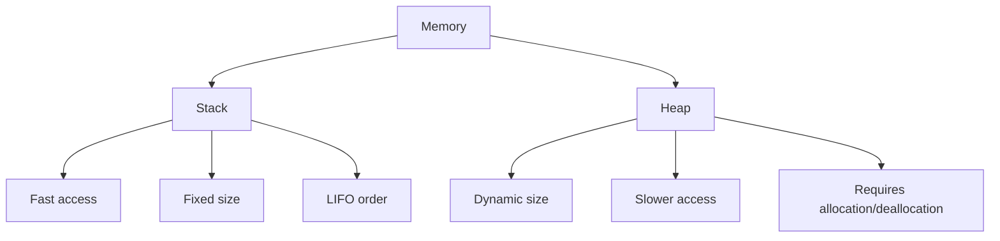

# Rust Ownership Basics

## Introduction

One of Rust's most distinctive features is its ownership system, which enables memory safety without needing a garbage collector. Understanding ownership is crucial for writing efficient and safe Rust code. In this tutorial, we'll explore the basic concepts of Rust's ownership model and see how it prevents common programming errors like null pointer dereferencing, double-free bugs, and memory leaks.

## What is Ownership?

Ownership is Rust's approach to memory management. Instead of relying on garbage collection (like Go or Java) or manual memory allocation/deallocation (like C/C++), Rust uses a set of rules checked at compile time. These rules govern how memory is allocated and freed in your program.

The three core ownership rules are:

1. Each value in Rust has a variable that's called its **owner**.
2. There can only be **one owner** at a time.
3. When the owner goes out of scope, the value will be **dropped** (deallocated).

Let's explore these rules with practical examples.

## Basic Ownership Example

Here's a simple example demonstrating Rust's ownership:

```rust
fn main() {
    // s1 is the owner of the String value
    let s1 = String::from("hello");
    
    // Ownership moves from s1 to s2
    let s2 = s1;
    
    // This would cause an error - s1 no longer owns the value
    // println!("{}", s1); // Error: value borrowed here after move
    
    // This works fine - s2 is now the owner
    println!("{}", s2); // Output: hello
}
```

In this example, when we assign `s1` to `s2`, the ownership of the string data moves from `s1` to `s2`. After this assignment, `s1` is no longer valid, and trying to use it would result in a compile-time error.

## Stack vs. Heap Allocation

To understand ownership better, we need to distinguish between stack and heap memory:



- **Stack**: Fast, fixed-size memory allocation for data with known, constant size (like integers, floats, booleans).
- **Heap**: Flexible memory allocation for data of variable size or when the size is unknown at compile time (like strings, vectors).

Rust's ownership primarily deals with heap-allocated data, since stack-allocated data is automatically handled by the CPU as functions are called and return.

## Ownership and Functions

When you pass a value to a function, ownership is transferred to the function's parameters:

```rust
fn main() {
    let s = String::from("hello");
    
    // Ownership of s is moved to the take_ownership function
    take_ownership(s);
    
    // This would cause an error - s was moved
    // println!("{}", s); // Error: value borrowed here after move
    
    let x = 5;
    
    // For primitive types, values are copied, not moved
    makes_copy(x);
    
    // This works fine - x is still valid
    println!("x is still valid: {}", x); // Output: x is still valid: 5
}

fn take_ownership(some_string: String) {
    println!("{}", some_string); // Output: hello
    // some_string goes out of scope and is dropped (memory is freed)
}

fn makes_copy(some_integer: i32) {
    println!("{}", some_integer); // Output: 5
    // some_integer goes out of scope, nothing special happens
}
```

Notice that primitive types like integers are simply copied when passed to a function, while complex types like `String` transfer ownership.

## Returning Ownership

Functions can also return ownership:

```rust
fn main() {
    let s1 = gives_ownership();         // gives_ownership moves its return value into s1
    println!("s1: {}", s1);             // Output: s1: hello
    
    let s2 = String::from("world");     // s2 comes into scope
    println!("s2 before: {}", s2);      // Output: s2 before: world
    
    let s3 = takes_and_gives_back(s2);  // s2 is moved into takes_and_gives_back, which also
                                        // moves its return value into s3
    
    // This would error - s2 was moved
    // println!("s2 after: {}", s2);    // Error: value borrowed here after move
    
    println!("s3: {}", s3);             // Output: s3: world
}

fn gives_ownership() -> String {
    let some_string = String::from("hello"); // some_string comes into scope
    some_string                              // some_string is returned and
                                             // moves out to the calling function
}

fn takes_and_gives_back(a_string: String) -> String { // a_string comes into scope
    a_string  // a_string is returned and moves out to the calling function
}
```

This works, but passing and returning ownership all the time would be tedious. That's where Rust's concept of borrowing comes in, which we'll explore in the next tutorial.

## Borrowing: References and Mutable References

Rather than transferring ownership, we can temporarily "borrow" a value using references:

```rust
fn main() {
    let s1 = String::from("hello");
    
    // We pass a reference to s1, not s1 itself
    let len = calculate_length(&s1);
    
    // s1 is still valid here because we only passed a reference
    println!("The length of '{}' is {}.", s1, len); // Output: The length of 'hello' is 5.
    
    // Mutable references
    let mut s2 = String::from("hello");
    println!("Before: {}", s2); // Output: Before: hello
    
    // We pass a mutable reference to s2
    change(&mut s2);
    
    println!("After: {}", s2);  // Output: After: hello, world!
}

fn calculate_length(s: &String) -> usize {
    s.len()
    // s goes out of scope, but it doesn't have ownership,
    // so nothing happens to the underlying data
}

fn change(s: &mut String) {
    s.push_str(", world!");
}
```

Key rules about borrowing:

1. You can have any number of immutable references (`&T`) at a time.
2. OR you can have exactly one mutable reference (`&mut T`).
3. References must always be valid (no dangling references).

## Real-world Example: Working with Collections

Let's see how ownership works with a more practical example using vectors:

```rust
fn main() {
    // Creating a vector of integers
    let mut numbers = vec![1, 2, 3, 4, 5];
    
    // Processing elements without taking ownership
    let sum = calculate_sum(&numbers);
    println!("Sum: {}", sum); // Output: Sum: 15
    
    // We can still use numbers because we only borrowed it
    println!("Original vector: {:?}", numbers); // Output: Original vector: [1, 2, 3, 4, 5]
    
    // Modifying the vector with a mutable reference
    double_values(&mut numbers);
    println!("After doubling: {:?}", numbers); // Output: After doubling: [2, 4, 6, 8, 10]
    
    // Finding values
    match find_value(&numbers, 6) {
        Some(index) => println!("Found value 6 at index {}", index), // Output: Found value 6 at index 2
        None => println!("Value not found"),
    }
}

fn calculate_sum(numbers: &Vec<i32>) -> i32 {
    let mut sum = 0;
    for num in numbers {
        sum += num;
    }
    sum
}

fn double_values(numbers: &mut Vec<i32>) {
    for num in numbers {
        *num *= 2;
    }
}

fn find_value(numbers: &Vec<i32>, target: i32) -> Option<usize> {
    for (i, &num) in numbers.iter().enumerate() {
        if num == target {
            return Some(i);
        }
    }
    None
}
```

This example demonstrates how we can process collections without taking ownership, allowing us to reuse the data for multiple operations.

## Ownership and Strings: A Closer Look

Working with strings in Rust requires understanding ownership well:

```rust
fn main() {
    // &str (string slice) - a reference to a string
    let greeting: &str = "Hello";
    
    // String - an owned, heap-allocated string
    let mut message = String::from("Hello");
    message.push_str(", world!");
    
    // Concatenating with the + operator
    let s1 = String::from("Hello, ");
    let s2 = String::from("world!");
    // + operator takes ownership of s1, but only borrows s2
    let s3 = s1 + &s2;
    
    // s1 is no longer valid here, but s2 is still valid
    println!("s2: {}", s2); // Output: s2: world!
    println!("s3: {}", s3); // Output: s3: Hello, world!
    
    // Alternative: using format! macro (which doesn't take ownership)
    let s1 = String::from("Hello");
    let s2 = String::from("world");
    let s3 = format!("{}, {}!", s1, s2);
    
    // Both s1 and s2 are still valid
    println!("s1: {}, s2: {}", s1, s2); // Output: s1: Hello, s2: world
    println!("s3: {}", s3);             // Output: s3: Hello, world!
}
```

This demonstrates how different string operations affect ownership and how you can choose approaches that preserve or transfer ownership as needed.

## Summary

Rust's ownership system might seem strict at first, but it's these rules that enable Rust to guarantee memory safety without a garbage collector. Let's recap:

1. Every value in Rust has a single owner.
2. When the owner goes out of scope, the value is dropped.
3. Ownership can be transferred (moved) to another variable or function.
4. Instead of transferring ownership, you can temporarily borrow a value using references.
5. You can have either multiple immutable references OR one mutable reference at a time.

By understanding these principles, you can write Rust code that's not only memory-safe but also efficient.

## Exercises

1. Create a function that takes a string, appends the text " (verified)" to it, and returns the result. Try implementing it both by taking ownership and by borrowing.

2. Write a program that creates a vector of strings, then finds the longest string in the vector without taking ownership of the vector.

3. Implement a function that swaps two values in a vector at specified indices. Make sure to use proper borrowing techniques.

## Additional Resources

- [Rust Book Chapter on Ownership](https://doc.rust-lang.org/book/ch04-00-understanding-ownership.html)
- [Rust By Example: Ownership and Borrowing](https://doc.rust-lang.org/rust-by-example/scope/move.html)
- [Rustlings: Interactive Exercises](https://github.com/rust-lang/rustlings) - Look for the "ownership" exercises
- [Rust Playground](https://play.rust-lang.org/) - Test your ownership knowledge with live code

Understanding ownership is fundamental to becoming proficient in Rust. In subsequent tutorials, we'll explore more advanced ownership concepts like lifetimes and smart pointers.