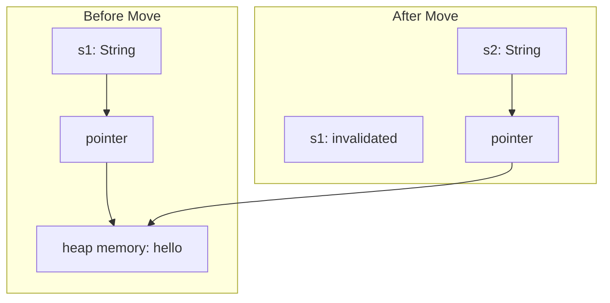

# Rust Move Semantics

## Introduction

In many programming languages, when you assign a value from one variable to another, the value gets copied. In Rust, things work differently due to its unique ownership system. By default, Rust uses **move semantics** instead of copy semantics, which is a fundamental concept that helps Rust manage memory efficiently without a garbage collector.

Move semantics means that when you assign a value from one variable to another, the ownership of that value is transferred (or "moved") to the new variable, and the original variable can no longer be used. This approach helps prevent memory issues like double-free errors and use-after-free bugs that plague languages with manual memory management.

## Basic Move Semantics

Let's start with a simple example to illustrate how move semantics works in Rust:

```rust
fn main() {
    // Create a String (allocated on the heap)
    let s1 = String::from("hello");
    
    // Move the value from s1 to s2
    let s2 = s1;
    
    // This would cause an error!
    // println!("s1: {}", s1);
    
    // This works fine
    println!("s2: {}", s2);
}
```

**Output:**
```
s2: hello
```

In this example, when we assign `s1` to `s2`, the data isn't copied. Instead, Rust moves the ownership of the heap data from `s1` to `s2`. After the move, `s1` is no longer valid, and attempting to use it would result in a compilation error.

### What's Happening Under the Hood?

Let's visualize what's happening with the String data structure:



A `String` in Rust consists of three parts:
1. A pointer to the memory that holds the contents
2. A length (how much memory is currently in use)
3. A capacity (how much memory is reserved)

When the move happens, only these three parts are copied to `s2`, not the heap data itself. Rust then invalidates `s1` to ensure the heap data is freed exactly once when `s2` goes out of scope.

## Move Semantics in Function Calls

Move semantics also apply when passing values to functions:

```rust
fn main() {
    let s = String::from("hello");
    
    // Ownership of s is moved to the take_ownership function
    take_ownership(s);
    
    // This would cause an error!
    // println!("s: {}", s);
    
    // We can create a new string
    let s2 = String::from("world");
    println!("s2 before function: {}", s2);
    
    // s2 is moved into the function and then back out through the return value
    let s3 = give_and_take_ownership(s2);
    
    // This would cause an error!
    // println!("s2 after function: {}", s2);
    
    // We can use s3 as it now has ownership
    println!("s3: {}", s3);
}

fn take_ownership(some_string: String) {
    println!("In function: {}", some_string);
    // some_string goes out of scope and `drop` is called
}

fn give_and_take_ownership(some_string: String) -> String {
    // We can modify the string
    let new_string = format!("{} has been modified", some_string);
    // Return ownership of the new string
    new_string
}
```

**Output:**
```
In function: hello
s2 before function: world
s3: world has been modified
```

In this example:
1. `s` is moved into `take_ownership` and can no longer be used in `main`
2. `s2` is moved into `give_and_take_ownership`
3. A new string is created inside the function and moved to `s3` in `main`
4. After the move, `s2` can no longer be used, but `s3` is valid

## Move Semantics vs. Copy Types

Not all types in Rust use move semantics. Types that implement the `Copy` trait use copy semantics instead. These types are typically simple values stored entirely on the stack, such as integers, floating-point numbers, booleans, and characters:

```rust
fn main() {
    // i32 has the Copy trait
    let x = 5;
    let y = x;
    
    // This works fine! x is still valid because i32 is Copy
    println!("x: {}, y: {}", x, y);
    
    // Tuples of Copy types are also Copy
    let tuple = (1, true, 3.14);
    let tuple_copy = tuple;
    
    // Both tuples are valid
    println!("Original: {:?}, Copy: {:?}", tuple, tuple_copy);
}
```

**Output:**
```
x: 5, y: 5
Original: (1, true, 3.14), Copy: (1, true, 3.14)
```

The following types implement the `Copy` trait:
- All integer types (`i32`, `u64`, etc.)
- Boolean type (`bool`)
- Floating point types (`f32`, `f64`)
- Character type (`char`)
- Tuples that only contain types that also implement `Copy`
- Arrays of fixed size containing types that implement `Copy`

## Practical Example: Managing Resources

Let's look at a practical example where move semantics helps manage resources safely:

```rust
struct DatabaseConnection {
    id: u32,
    server: String,
}

impl DatabaseConnection {
    fn new(server: &str) -> Self {
        println!("Opening connection to {}", server);
        DatabaseConnection {
            id: 42,
            server: String::from(server),
        }
    }

    fn query(&self, query: &str) -> Vec<String> {
        println!("Executing query '{}' on {}", query, self.server);
        // Simulate getting results
        vec![String::from("Result 1"), String::from("Result 2")]
    }
}

// This function takes ownership of the connection
fn process_data(conn: DatabaseConnection) {
    println!("Processing data using connection {}", conn.id);
    let results = conn.query("SELECT * FROM users");
    println!("Got {} results", results.len());
    // Connection will be closed when conn goes out of scope
}

fn main() {
    // Create a database connection
    let connection = DatabaseConnection::new("example.com");
    
    // Run a query
    let initial_results = connection.query("SELECT version()");
    println!("Initial query returned: {:?}", initial_results);
    
    // Move ownership to the process_data function
    process_data(connection);
    
    // This would cause an error!
    // connection.query("SELECT * FROM settings");
}
```

**Output:**
```
Opening connection to example.com
Executing query 'SELECT version()' on example.com
Initial query returned: ["Result 1", "Result 2"]
Processing data using connection 42
Executing query 'SELECT * FROM users' on example.com
Got 2 results
```

In this example, we're managing a database connection. When `process_data` takes ownership of the connection, it ensures that the main function can't use it anymore. This prevents potential issues like using a connection after it's been closed or trying to close it multiple times.

## Preventing Moves with Clone

Sometimes, you want to create a deep copy instead of moving ownership. The `clone` method allows you to explicitly create a duplicate of the data:

```rust
fn main() {
    let s1 = String::from("hello");
    
    // Create a deep copy of s1
    let s2 = s1.clone();
    
    // Both s1 and s2 are valid
    println!("s1: {}, s2: {}", s1, s2);
    
    // We can pass s1 to a function by cloning it
    process_string(s1.clone());
    
    // s1 is still valid
    println!("s1 after function call: {}", s1);
}

fn process_string(s: String) {
    println!("Processing: {}", s);
}
```

**Output:**
```
s1: hello, s2: hello
Processing: hello
s1 after function call: hello
```

Note that `clone` creates a new allocation on the heap with the same content. This is less efficient than moving but allows both variables to remain valid.

## Borrowing as an Alternative to Moving

While understanding move semantics is essential, Rust provides a powerful feature called "borrowing" that often lets you avoid moves altogether. Borrowing uses references (`&`) to allow functions to use values without taking ownership:

```rust
fn main() {
    let s1 = String::from("hello");
    
    // Pass a reference to s1 instead of moving it
    print_string(&s1);
    
    // s1 is still valid!
    println!("s1 is still here: {}", s1);
}

// This function borrows s, but doesn't take ownership
fn print_string(s: &String) {
    println!("From function: {}", s);
}
```

**Output:**
```
From function: hello
s1 is still here: hello
```

We'll cover borrowing in more detail in the next lesson, but it's important to know that it provides an alternative to moving ownership in many situations.

## Summary

Move semantics is a cornerstone of Rust's ownership system. Here's what we've learned:

1. When you assign a value to a new variable in Rust, the ownership is moved rather than copied
2. After a move, the original variable can no longer be used
3. This applies to passing values to functions and returning values from functions
4. Simple types that implement the `Copy` trait use copy semantics instead
5. You can explicitly create deep copies with the `clone` method
6. Borrowing with references often provides a way to use values without moving them

Move semantics might seem restrictive at first, but it's a powerful mechanism that helps Rust catch memory management bugs at compile time rather than at runtime. By understanding move semantics, you're building a strong foundation for writing safe and efficient Rust code.

## Exercises

1. Write a function that takes a `String` and returns it with all characters converted to uppercase. Make sure you handle ownership correctly.

2. Create a struct representing a `ShoppingCart` with items in it. Write functions to add items, calculate the total price, and print the contents. Consider how ownership should be handled for each operation.

3. Write a program that demonstrates the difference between types that implement `Copy` and those that don't by showing which variable assignments result in moves vs. copies.

## Additional Resources

- [Rust Book Chapter on Ownership](https://doc.rust-lang.org/book/ch04-01-what-is-ownership.html)
- [Rust By Example: Ownership and Moves](https://doc.rust-lang.org/rust-by-example/scope/move.html)
- [The Drop Trait](https://doc.rust-lang.org/book/ch15-03-drop.html) - Learn more about how Rust cleans up resources
- [Rust Design Patterns: RAII](https://rust-unofficial.github.io/patterns/patterns/behavioural/RAII.html) - Resource Acquisition Is Initialization, a pattern that Rust's ownership model supports well