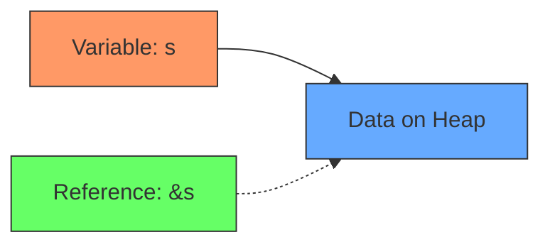

# Rust Borrowing

## Introduction

In the previous section, we explored Rust's ownership system - a fundamental concept that helps Rust ensure memory safety without a garbage collector. While ownership provides strong guarantees about memory management, it would be quite limiting if it meant that variables could only ever be used in one place. This is where **borrowing** comes in.

Borrowing is Rust's way of allowing multiple parts of your code to access data without transferring ownership. Think of it like borrowing a book from a library - you can read it for a while, but eventually, you need to return it, and there are rules about what you can do while borrowing it.

In this tutorial, we'll explore:
- What borrowing is and why it matters
- How to create references in Rust
- The rules of borrowing
- Mutable and immutable references
- Common borrowing patterns and real-world examples

## What is Borrowing in Rust?

Borrowing in Rust is the act of creating a **reference** to a value without taking ownership of it. A reference is like a pointer to the data owned by another variable, allowing you to access the data without owning it.

References are created using the `&` symbol:

```rust
fn main() {
    let s1 = String::from("hello");
    
    // Create a reference to s1
    let s2 = &s1;
    
    println!("s1: {}", s1);
    println!("s2: {}", s2);
}
```

Output:
```
s1: hello
s2: hello
```

In this example, `s2` "borrows" `s1`'s value. The ownership remains with `s1`, but `s2` can read the data. When `s2` goes out of scope, nothing special happens - because `s2` doesn't own the data, it doesn't need to free it.

## The Rules of Borrowing

Rust enforces two important rules when it comes to borrowing:

1. At any given time, you can have **either**:
   - One mutable reference (`&mut T`)
   - Any number of immutable references (`&T`)

2. References must always be valid (no dangling references)

Let's look at how these rules work in practice:

### Multiple Immutable Borrows

You can have multiple immutable references to a value:

```rust
fn main() {
    let s = String::from("hello");
    
    let r1 = &s;
    let r2 = &s;
    let r3 = &s;
    
    println!("{}, {}, and {}", r1, r2, r3);
}
```

Output:
```
hello, hello, and hello
```

This works because immutable references don't allow changing the data, so there's no risk of data races or inconsistencies.

### Mutable Borrows

To modify a borrowed value, you need a mutable reference:

```rust
fn main() {
    let mut s = String::from("hello");
    
    let r1 = &mut s;
    
    r1.push_str(", world");
    
    println!("{}", r1); // hello, world
}
```

Output:
```
hello, world
```

But you can only have one mutable reference at a time:

```rust
fn main() {
    let mut s = String::from("hello");
    
    let r1 = &mut s;
    let r2 = &mut s; // ERROR: cannot borrow `s` as mutable more than once
    
    println!("{}, {}", r1, r2);
}
```

This code won't compile because it violates Rust's rule of having only one mutable reference at a time.

### Cannot Mix Mutable and Immutable References

You also can't have both mutable and immutable references at the same time:

```rust
fn main() {
    let mut s = String::from("hello");
    
    let r1 = &s;     // immutable borrow
    let r2 = &s;     // immutable borrow
    let r3 = &mut s; // ERROR: cannot borrow `s` as mutable because it is also borrowed as immutable
    
    println!("{}, {}, and {}", r1, r2, r3);
}
```

This code fails because having both kinds of references could lead to unexpected behavior if the immutable references expect the data to remain unchanged while the mutable reference is modifying it.

## Reference Scopes and Lifetimes

A key concept to understand is that references have lifetimes - they're only valid for a specific portion of the code. The compiler ensures that references don't outlive the data they refer to.

The scope of a reference ends after its last usage:

```rust
fn main() {
    let mut s = String::from("hello");
    
    let r1 = &s; // immutable borrow starts here
    let r2 = &s; 
    
    println!("{} and {}", r1, r2); // immutable borrow ends here
    
    let r3 = &mut s; // this is OK because the immutable borrows are no longer in scope
    
    r3.push_str(", world");
    println!("{}", r3);
}
```

Output:
```
hello and hello
hello, world
```

This code works because the immutable borrows (`r1` and `r2`) are only used before the mutable borrow (`r3`) begins. Their scopes don't overlap.

## Borrowing in Functions

One of the most common uses of borrowing is passing references to functions:

```rust
fn main() {
    let s1 = String::from("hello");
    
    let len = calculate_length(&s1);
    
    println!("The length of '{}' is {}.", s1, len);
}

fn calculate_length(s: &String) -> usize {
    s.len()
}
```

Output:
```
The length of 'hello' is 5.
```

The function `calculate_length` takes a reference to a `String` rather than taking ownership of it. This means after calling the function, `s1` is still valid and usable in `main`.

### Mutable References in Functions

If a function needs to modify a borrowed value, it should take a mutable reference:

```rust
fn main() {
    let mut s = String::from("hello");
    
    append_world(&mut s);
    
    println!("s is now: {}", s);
}

fn append_world(s: &mut String) {
    s.push_str(", world");
}
```

Output:
```
s is now: hello, world
```

## Visualizing Borrowing

Let's visualize how borrowing works using a diagram:



When you create a reference, you're creating a new variable that points to the same data, without taking ownership.

## The Slice Type: A Special Kind of Borrow

Rust has a special kind of reference called a **slice** that refers to a contiguous sequence of elements in a collection rather than the whole collection.

String slices are written as `&str`:

```rust
fn main() {
    let s = String::from("hello world");
    
    let hello = &s[0..5];
    let world = &s[6..11];
    
    println!("{} {}", hello, world);
}
```

Output:
```
hello world
```

Slices are references, so they follow the same borrowing rules.

## Practical Examples

Let's look at some real-world examples of borrowing in Rust.

### Example 1: Building a Text Processor

```rust
fn main() {
    let mut essay = String::from("Rust is a systems programming language that runs blazingly fast.");
    
    // Count words without taking ownership
    let word_count = count_words(&essay);
    println!("Word count: {}", word_count);
    
    // Modify the text
    append_sentence(&mut essay, " It prevents segfaults and guarantees thread safety.");
    println!("Updated essay: {}", essay);
    
    // Get the first sentence - returns a slice
    let first_sentence = get_first_sentence(&essay);
    println!("First sentence: {}", first_sentence);
}

fn count_words(text: &String) -> usize {
    text.split_whitespace().count()
}

fn append_sentence(text: &mut String, sentence: &str) {
    text.push_str(sentence);
}

fn get_first_sentence(text: &String) -> &str {
    if let Some(period_pos) = text.find('.') {
        &text[0..=period_pos]
    } else {
        &text[..]
    }
}
```

Output:
```
Word count: 9
Updated essay: Rust is a systems programming language that runs blazingly fast. It prevents segfaults and guarantees thread safety.
First sentence: Rust is a systems programming language that runs blazingly fast.
```

In this example:
- `count_words` takes an immutable reference because it only needs to read the text
- `append_sentence` takes a mutable reference because it needs to modify the text
- `get_first_sentence` takes an immutable reference and returns a string slice

### Example 2: Managing a Collection of Items

Let's implement a simple inventory system:

```rust
struct Item {
    name: String,
    quantity: u32,
}

struct Inventory {
    items: Vec<Item>,
}

impl Inventory {
    fn new() -> Inventory {
        Inventory { items: Vec::new() }
    }
    
    fn add_item(&mut self, name: String, quantity: u32) {
        self.items.push(Item { name, quantity });
    }
    
    fn get_total_items(&self) -> u32 {
        self.items.iter().map(|item| item.quantity).sum()
    }
    
    fn display_inventory(&self) {
        println!("Inventory:");
        for item in &self.items {
            println!("  {} - {} units", item.name, item.quantity);
        }
    }
    
    fn update_quantity(&mut self, item_name: &str, new_quantity: u32) -> bool {
        for item in &mut self.items {
            if item.name == item_name {
                item.quantity = new_quantity;
                return true;
            }
        }
        false
    }
}

fn main() {
    let mut inventory = Inventory::new();
    
    inventory.add_item(String::from("Apple"), 10);
    inventory.add_item(String::from("Banana"), 5);
    inventory.add_item(String::from("Orange"), 7);
    
    inventory.display_inventory();
    
    println!("Total items: {}", inventory.get_total_items());
    
    if inventory.update_quantity("Banana", 8) {
        println!("Updated Banana quantity successfully.");
    }
    
    inventory.display_inventory();
}
```

Output:
```
Inventory:
  Apple - 10 units
  Banana - 5 units
  Orange - 7 units
Total items: 22
Updated Banana quantity successfully.
Inventory:
  Apple - 10 units
  Banana - 8 units
  Orange - 7 units
```

In this inventory system:
- Methods like `display_inventory` and `get_total_items` take `&self` (immutable reference) because they only read data
- Methods like `add_item` and `update_quantity` take `&mut self` (mutable reference) because they modify the inventory

## Common Borrowing Patterns

### Iterating Over Collections

When iterating over a collection, you typically borrow its elements:

```rust
fn main() {
    let numbers = vec![1, 2, 3, 4, 5];
    
    // Immutable borrow of each element
    for num in &numbers {
        println!("Number: {}", num);
    }
    
    // You can still use numbers here
    println!("Vector length: {}", numbers.len());
    
    let mut strings = vec![String::from("hello"), String::from("world")];
    
    // Mutable borrow of each element
    for s in &mut strings {
        s.push('!');
    }
    
    println!("{:?}", strings); // ["hello!", "world!"]
}
```

### Returning References from Functions

You need to be careful when returning references from functions to ensure they don't become dangling:

```rust
// This won't compile
fn return_reference() -> &String {
    let s = String::from("hello");
    &s // ERROR: returns a reference to data owned by the current function
}
```

This is where Rust's lifetime system comes in, which we'll cover in more advanced tutorials.

## Common Borrowing Errors and How to Fix Them

### Error: Cannot Move Out of Borrowed Content

```rust
fn main() {
    let s = String::from("hello");
    let r = &s;
    
    let s2 = *r; // ERROR: cannot move out of borrowed content
}
```

Fix: Use clone if you need to own the data:

```rust
fn main() {
    let s = String::from("hello");
    let r = &s;
    
    let s2 = r.clone(); // Clone creates a new owned copy
    
    println!("{}", s2);
}
```

### Error: Cannot Borrow as Mutable Because It Is Also Borrowed as Immutable

```rust
fn main() {
    let mut s = String::from("hello");
    
    let r1 = &s;
    let r2 = &mut s; // ERROR
    
    println!("{}", r1);
}
```

Fix: Make sure mutable and immutable borrows don't overlap:

```rust
fn main() {
    let mut s = String::from("hello");
    
    {
        let r1 = &s;
        println!("{}", r1);
    } // r1 goes out of scope here
    
    let r2 = &mut s; // Now this is valid
    r2.push_str(", world");
    
    println!("{}", r2);
}
```

## Summary

Borrowing is a cornerstone of Rust's memory safety guarantees. By allowing references to data without transferring ownership, Rust enables efficient data sharing while preventing common bugs like data races and use-after-free errors.

Key points to remember:
- Use `&T` for immutable references (reading)
- Use `&mut T` for mutable references (reading and writing)
- You can have either one mutable reference or any number of immutable references
- References cannot outlive the data they refer to
- References are automatically dereferenced when accessing their methods or fields

Mastering Rust's borrowing system takes practice, but it's an essential skill that will help you write safe, concurrent, and efficient programs.

## Exercises

1. **Basic Borrowing**: Write a function that takes a string slice and returns the number of vowels in it.

2. **Mutable Borrowing**: Create a function that accepts a mutable reference to a vector of integers and doubles each value in the vector.

3. **Combined Borrowing**: Implement a simple "bank account" struct with methods to check the balance (immutable borrow) and deposit/withdraw money (mutable borrow).

4. **Error Fixing**: Fix the following code so that it compiles and runs correctly:
   ```rust
   fn main() {
       let mut v = Vec::new();
       let first = get_first(&v);
       v.push(1);
       println!("First element: {:?}", first);
   }

   fn get_first(v: &Vec<i32>) -> &i32 {
       &v[0]
   }
   ```

## Additional Resources

- [The Rust Book: References and Borrowing](https://doc.rust-lang.org/book/ch04-02-references-and-borrowing.html)
- [Rust By Example: Borrowing](https://doc.rust-lang.org/rust-by-example/scope/borrow.html)
- [The Rustonomicon: Ownership and Lifetimes](https://doc.rust-lang.org/nomicon/ownership.html)
- [Rust Lang Forum](https://users.rust-lang.org/) - Great place to ask questions when you're stuck!