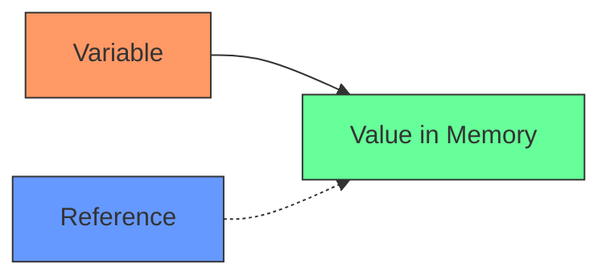

# Rust References

## Introduction

References are one of Rust's most powerful and distinctive features, allowing you to access data without taking ownership of it. This concept is often called "borrowing" in Rust terminology. Understanding references is crucial for writing efficient Rust code and leveraging the language's safety guarantees.

In this tutorial, we'll explore how references work in Rust, why they're important, and how to use them effectively in your programs.

## What are References?

A reference in Rust is similar to a pointer in other languages - it's a way to refer to a value without taking ownership of it. When you create a reference to a value, you're "borrowing" it rather than taking full control.

Let's visualize the difference between ownership and references:



In this diagram:
- The solid line represents ownership
- The dotted line represents a reference (borrowing)

## Creating References

In Rust, you create a reference by using the `&` symbol. Let's look at a simple example:

```rust
fn main() {
    let s1 = String::from("hello");
    
    // Create a reference to s1
    let s1_ref = &s1;
    
    println!("Original: {}", s1);
    println!("Reference: {}", s1_ref);
}
```

Output:
```
Original: hello
Reference: hello
```

In this example, `s1` owns the String value, while `s1_ref` is merely a reference to that value. This means:

1. `s1_ref` doesn't own the data
2. When `s1_ref` goes out of scope, the value it points to is not dropped
3. The original value is only dropped when the owner (`s1`) goes out of scope

## Borrowing Rules

Rust enforces strict rules for references to maintain memory safety:

1. **At any given time, you can have either:**
   - One mutable reference (`&mut T`)
   - Any number of immutable references (`&T`)

2. **References must always be valid** - Rust prevents dangling references by checking that data doesn't go out of scope before its references do.

Let's see these rules in action:

```rust
fn main() {
    let mut s = String::from("hello");
    
    // This works fine - multiple immutable references
    let r1 = &s;
    let r2 = &s;
    println!("{} and {}", r1, r2);
    
    // This works because r1 and r2 are no longer used after the previous line
    let r3 = &mut s;
    r3.push_str(", world");
    println!("{}", r3);
}
```

Output:
```
hello and hello
hello, world
```

However, if we try to create a mutable reference while immutable ones are still in use, we'll get an error:

```rust
fn main() {
    let mut s = String::from("hello");
    
    let r1 = &s;
    let r2 = &s;
    let r3 = &mut s; // ERROR: Cannot borrow `s` as mutable because it is also borrowed as immutable
    
    println!("{}, {}, and {}", r1, r2, r3);
}
```

This code doesn't compile because it violates Rust's borrowing rules.

## References and Functions

One of the most common uses for references is in function parameters. They allow functions to use values without taking ownership:

```rust
fn main() {
    let s1 = String::from("hello");
    
    // Pass a reference to calculate_length
    let len = calculate_length(&s1);
    
    // s1 is still valid here because calculate_length only borrowed it
    println!("The length of '{}' is {}.", s1, len);
}

// This function takes a reference to a String
fn calculate_length(s: &String) -> usize {
    s.len()
}
```

Output:
```
The length of 'hello' is 5.
```

Without references, we would need to return the String back to the caller to avoid destroying it:

```rust
fn main() {
    let s1 = String::from("hello");
    
    // Give ownership to the function and get it back
    let (s1, len) = calculate_length(s1);
    
    println!("The length of '{}' is {}.", s1, len);
}

// This function takes ownership and returns it back along with the result
fn calculate_length(s: String) -> (String, usize) {
    let length = s.len();
    (s, length)
}
```

The reference approach is clearly more concise and easier to use.

## Mutable References

So far, we've only looked at immutable references. If you want to modify a borrowed value, you need a mutable reference:

```rust
fn main() {
    let mut s = String::from("hello");
    
    change(&mut s);
    
    println!("After change: {}", s);
}

fn change(s: &mut String) {
    s.push_str(", world");
}
```

Output:
```
After change: hello, world
```

Remember that you can only have one mutable reference to a particular piece of data in a particular scope. This restriction prevents data races at compile time.

## Reference Scope

The scope of a reference starts from where it is introduced and continues until the last time that reference is used. This is important to understand when working with multiple references:

```rust
fn main() {
    let mut s = String::from("hello");
    
    let r1 = &s; // r1 comes into scope
    let r2 = &s; // r2 comes into scope
    println!("{} and {}", r1, r2); // r1 and r2 are used here
    // r1 and r2 are no longer used after this point
    
    let r3 = &mut s; // This is fine because r1 and r2 are no longer in scope
    println!("{}", r3);
}
```

## Real-World Application: Processing Data Without Copying

Let's look at a practical example of using references in a real-world scenario:

```rust
struct User {
    name: String,
    email: String,
    sign_in_count: u64,
    active: bool,
}

// This function takes a reference to a User
fn display_user_info(user: &User) {
    println!("Name: {}", user.name);
    println!("Email: {}", user.email);
    println!("Sign in count: {}", user.sign_in_count);
    println!("Active: {}", user.active);
}

// This function takes a mutable reference to a User
fn increment_sign_in_count(user: &mut User) {
    user.sign_in_count += 1;
}

fn main() {
    let mut user = User {
        name: String::from("John Doe"),
        email: String::from("john@example.com"),
        sign_in_count: 1,
        active: true,
    };
    
    // Display user info without taking ownership
    display_user_info(&user);
    
    // Modify user data without taking ownership
    increment_sign_in_count(&mut user);
    
    println!("
After incrementing sign in count:");
    display_user_info(&user);
}
```

Output:
```
Name: John Doe
Email: john@example.com
Sign in count: 1
Active: true

After incrementing sign in count:
Name: John Doe
Email: john@example.com
Sign in count: 2
Active: true
```

In this example, we can:
1. View the user information without moving the User value
2. Modify the user's sign-in count without taking full ownership
3. Continue to use the user value after both operations

This pattern is extremely common in Rust applications.

## Slice References

A special kind of reference in Rust is a slice. Slices let you reference a contiguous sequence of elements in a collection rather than the whole collection:

```rust
fn main() {
    let s = String::from("hello world");
    
    // This is a reference to a portion of the string
    let hello = &s[0..5];
    let world = &s[6..11];
    
    println!("{} {}", hello, world);
}
```

Output:
```
hello world
```

Slices are very useful for operations that need to work with part of a collection.

## Dangling References

Rust's compiler ensures that references never become "dangling" - pointing to memory that has been freed:

```rust
fn main() {
    let reference_to_nothing = dangle();
}

fn dangle() -> &String { // ERROR: this function's return type contains a borrowed value, but there is no value for it to be borrowed from
    let s = String::from("hello");
    &s // We're trying to return a reference to s
} // s goes out of scope and is dropped here, so its reference would be invalid
```

This code won't compile because Rust recognizes that the reference would be pointing to memory that's no longer valid.

## Summary

References are a cornerstone of Rust's memory safety guarantees. They allow you to:

- Access data without taking ownership
- Borrow values temporarily
- Modify data in place when needed
- Write functions that don't need to take and return ownership

Understanding Rust's reference and borrowing system is essential for writing efficient and correct Rust code. By enforcing strict borrowing rules at compile time, Rust prevents entire categories of bugs that plague other languages.

## Additional Resources

For further learning about Rust references:

1. [The Rust Book - References and Borrowing](https://doc.rust-lang.org/book/ch04-02-references-and-borrowing.html)
2. [Rust by Example - Borrowing](https://doc.rust-lang.org/rust-by-example/scope/borrow.html)

## Exercises

To solidify your understanding of references, try these exercises:

1. Write a function that takes a reference to a vector of integers and returns the sum of all elements.
2. Create a function that takes a mutable reference to a string and capitalizes the first letter of each word.
3. Implement a function that borrows two string slices and returns a new string that concatenates them.
4. Write a program that demonstrates a potential data race, and show how Rust's borrowing rules prevent it.