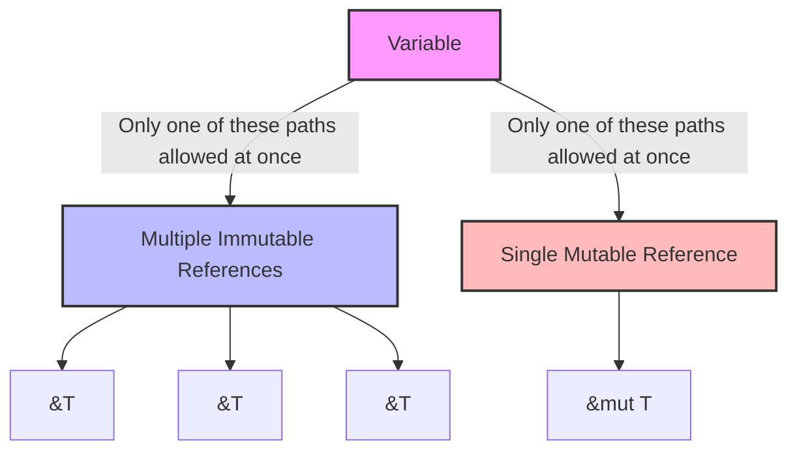

# Rust Mutable References

## Introduction

In Rust, references allow you to access data without taking ownership. We've previously explored immutable references (`&T`), which let you read data without modifying it. But what if you need to modify the data you're referencing?

Enter **mutable references** (`&mut T`), a crucial feature in Rust's ownership system that allows you to temporarily borrow and modify values while maintaining Rust's memory safety guarantees.

In this tutorial, we'll explore how mutable references work, their restrictions, and how they help prevent common programming errors like data races and dangling pointers.

## Understanding Mutable References

### What is a Mutable Reference?

A mutable reference gives you temporary permission to modify a value without taking ownership of it.

```rust
fn main() {
    let mut x = 5;
    
    // Create a mutable reference to x
    let y = &mut x;
    
    // Modify the value through the reference
    *y += 1;
    
    println!("x = {}", x); // Output: x = 6
}
```

In this example:
1. We declare a mutable variable `x`
2. We create a mutable reference `y` to `x` using `&mut`
3. We use the dereference operator `*` to modify the value that `y` points to
4. The value of `x` is changed to 6

### The Dereference Operator

To modify the value that a mutable reference points to, you need to use the dereference operator (`*`). This operator lets you access the underlying value.

```rust
fn main() {
    let mut name = String::from("Rust");
    
    // Create a mutable reference
    let reference = &mut name;
    
    // Use the dereference operator to modify the String
    *reference = String::from("Rust Programming");
    
    println!("Name: {}", name); // Output: Name: Rust Programming
}
```

## The Borrowing Rules

Rust enforces strict rules for mutable references to prevent data races and other memory issues at compile time:

### Rule 1: Only One Mutable Reference at a Time

You can have only one mutable reference to a piece of data in a particular scope.

```rust
fn main() {
    let mut value = 10;
    
    let ref1 = &mut value;
    // let ref2 = &mut value; // ERROR: Cannot borrow `value` as mutable more than once
    
    *ref1 += 10;
    println!("value = {}", value); // Output: value = 20
}
```

Trying to create a second mutable reference would cause a compiler error:

```
error[E0499]: cannot borrow `value` as mutable more than once at a time
 --> src/main.rs:5:19
  |
4 |     let ref1 = &mut value;
  |                 ---------- first mutable borrow occurs here
5 |     let ref2 = &mut value;
  |                 ^^^^^^^^^^ second mutable borrow occurs here
6 |     
7 |     *ref1 += 10;
  |     ------------ first borrow later used here
```

### Rule 2: No Mixing Mutable and Immutable References

You cannot have a mutable reference while having any immutable references to the same value.

```rust
fn main() {
    let mut value = 10;
    
    let ref1 = &value;     // Immutable reference
    // let ref2 = &mut value; // ERROR: Cannot borrow `value` as mutable
    
    println!("ref1 = {}", ref1);
}
```

This restriction prevents a scenario where one part of your code might unexpectedly change a value while another part is reading it.

### Understanding the Rules with a Diagram



## Scopes and Reference Lifetimes

The borrow checker enforces that references don't outlive the data they reference. Additionally, a reference's scope ends when it's last used.

```rust
fn main() {
    let mut value = 5;
    
    {
        let r1 = &mut value;
        *r1 += 1;
        println!("r1 = {}", r1);
        // r1's scope ends here since it's not used after this point
    } // r1 goes out of scope
    
    // Now we can create a new mutable reference
    let r2 = &mut value;
    *r2 += 1;
    
    println!("value = {}", value); // Output: value = 7
}
```

## Non-Lexical Lifetimes (NLL)

Modern versions of Rust use "non-lexical lifetimes" to determine when a reference is no longer needed. A reference's scope ends at its last usage, not at the end of the code block.

```rust
fn main() {
    let mut value = 5;
    
    let r1 = &mut value;
    *r1 += 1;
    println!("r1 = {}", r1);
    // r1's scope ends here
    
    // We can create a new mutable reference
    // because r1 is no longer used
    let r2 = &mut value;
    *r2 += 1;
    
    println!("value = {}", value); // Output: value = 7
}
```

## Practical Examples

### Example 1: Modifying a Vector

Here's how you can use mutable references to modify a vector:

```rust
fn add_element(vec: &mut Vec<i32>, element: i32) {
    vec.push(element);
}

fn main() {
    let mut numbers = vec![1, 2, 3];
    
    add_element(&mut numbers, 4);
    
    println!("Numbers: {:?}", numbers); // Output: Numbers: [1, 2, 3, 4]
}
```

### Example 2: Building a Simple Counter

Let's build a simple counter using mutable references:

```rust
struct Counter {
    count: i32,
}

impl Counter {
    fn new() -> Counter {
        Counter { count: 0 }
    }
    
    fn increment(&mut self) {
        self.count += 1;
    }
    
    fn get_count(&self) -> i32 {
        self.count
    }
}

fn main() {
    let mut counter = Counter::new();
    
    counter.increment();
    counter.increment();
    counter.increment();
    
    println!("Count: {}", counter.get_count()); // Output: Count: 3
}
```

In this example, `increment` takes a mutable reference to `self` so it can modify the counter's state, while `get_count` only needs an immutable reference since it's just reading data.

### Example 3: String Processing

Here's an example that processes a string in-place:

```rust
fn to_uppercase(s: &mut String) {
    *s = s.to_uppercase();
}

fn main() {
    let mut message = String::from("hello, rust!");
    
    to_uppercase(&mut message);
    
    println!("Message: {}", message); // Output: Message: HELLO, RUST!
}
```

## Common Patterns and Techniques

### Pattern: Temporary Mutation

Sometimes you need to temporarily modify a value:

```rust
fn main() {
    let mut names = vec!["Alice", "Bob", "Charlie"];
    
    // Sort the vector temporarily
    {
        let mut_ref = &mut names;
        mut_ref.sort();
    }
    
    // Now we can take immutable references again
    for name in &names {
        println!("Name: {}", name);
    }
}
```

### Pattern: Split Borrowing

You can borrow different parts of a collection mutably at the same time:

```rust
fn main() {
    let mut numbers = vec![1, 2, 3, 4, 5];
    
    // Get mutable references to different elements
    let first = &mut numbers[0];
    let last = &mut numbers[4];
    
    *first += 10;
    *last *= 2;
    
    println!("Numbers: {:?}", numbers); // Output: Numbers: [11, 2, 3, 4, 10]
}
```

### Pattern: Swapping with References

Rust makes it easy to swap values using mutable references:

```rust
fn swap(a: &mut i32, b: &mut i32) {
    let temp = *a;
    *a = *b;
    *b = temp;
}

fn main() {
    let mut x = 5;
    let mut y = 10;
    
    swap(&mut x, &mut y);
    
    println!("x = {}, y = {}", x, y); // Output: x = 10, y = 5
}
```

## Common Mistakes and How to Fix Them

### Mistake 1: Multiple Mutable Borrows

```rust
fn main() {
    let mut data = vec![1, 2, 3];
    
    let ref1 = &mut data;
    let ref2 = &mut data; // Error!
    
    ref1.push(4);
    ref2.push(5);
}
```

**Fix:** Use a single mutable reference or limit the scope:

```rust
fn main() {
    let mut data = vec![1, 2, 3];
    
    {
        let ref1 = &mut data;
        ref1.push(4);
    } // ref1 goes out of scope
    
    // Now we can borrow again
    let ref2 = &mut data;
    ref2.push(5);
    
    println!("Data: {:?}", data); // Output: Data: [1, 2, 3, 4, 5]
}
```

### Mistake 2: Mixing Mutable and Immutable References

```rust
fn main() {
    let mut data = vec![1, 2, 3];
    
    let ref1 = &data;
    let ref2 = &mut data; // Error!
    
    println!("Length: {}", ref1.len());
    ref2.push(4);
}
```

**Fix:** Ensure the immutable reference is no longer used before creating a mutable reference:

```rust
fn main() {
    let mut data = vec![1, 2, 3];
    
    {
        let ref1 = &data;
        println!("Length: {}", ref1.len());
    } // ref1 no longer used
    
    // Now we can borrow mutably
    let ref2 = &mut data;
    ref2.push(4);
    
    println!("Data: {:?}", data); // Output: Data: [1, 2, 3, 4]
}
```

## Comparing Mutable References with Other Approaches

### Mutable References vs. Cloning

```rust
// Using a mutable reference (efficient)
fn double_in_place(value: &mut i32) {
    *value *= 2;
}

// Using cloning (less efficient)
fn double_by_cloning(value: i32) -> i32 {
    value * 2
}

fn main() {
    let mut x = 5;
    double_in_place(&mut x);
    println!("Using reference: {}", x); // Output: Using reference: 10
    
    let y = 5;
    let result = double_by_cloning(y);
    println!("Using cloning: {}", result); // Output: Using cloning: 10
}
```

Mutable references are generally more efficient because they avoid unnecessary data copying.

## Summary

Mutable references (`&mut T`) are a powerful feature in Rust that allow you to:

1. Temporarily borrow and modify data without taking ownership
2. Maintain Rust's memory safety guarantees
3. Prevent data races and other concurrency issues at compile time

The key rules to remember are:
- You can have only one mutable reference to a particular piece of data at a time
- You cannot have a mutable reference while having immutable references to the same data
- References must never outlive the data they reference

By understanding and following these rules, you can write safe, efficient Rust code that modifies data while still benefiting from Rust's memory safety guarantees.

## Exercises

1. **Basic Mutation**: Write a function that takes a mutable reference to a vector of integers and doubles each value in place.

2. **Custom Data Structure**: Create a stack data structure with `push`, `pop`, and `peek` methods that use mutable and immutable references appropriately.

3. **Challenge**: Implement a function that takes a mutable reference to a string and removes all vowels from it without allocating a new string.

## Additional Resources

- [The Rust Book: References and Borrowing](https://doc.rust-lang.org/book/ch04-02-references-and-borrowing.html)
- [Rust By Example: Mutability](https://doc.rust-lang.org/rust-by-example/variable_bindings/mut.html)
- [The Rust Reference: Behavior considered undefined](https://doc.rust-lang.org/reference/behavior-considered-undefined.html)
- [Rust Blog: Non-Lexical Lifetimes](https://blog.rust-lang.org/2018/12/06/Rust-1.31-and-rust-2018.html#non-lexical-lifetimes)