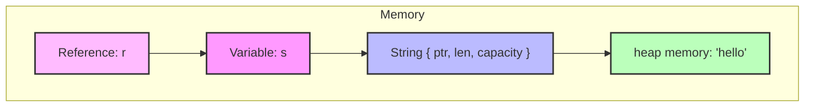

# Rust Reference Rules

## Introduction

In Rust, references are a powerful feature that allow you to access data without taking ownership of it. This concept, called "borrowing," is fundamental to Rust's memory safety guarantees. Unlike languages with garbage collection or manual memory management, Rust ensures memory safety at compile time through its ownership system and reference rules.

This guide will explain how references work in Rust, the rules you must follow when using them, and how they help prevent common programming errors like dangling pointers, data races, and memory leaks.

## What Are References in Rust?

A reference in Rust is like a pointer—it's an address we can follow to access data stored in memory. However, unlike pointers in languages like C or C++, Rust's references are guaranteed to be valid and follow strict rules enforced by the compiler.

References allow you to:
- Access data without taking ownership
- Pass data to functions without transferring ownership
- Access the same data from multiple places in your code (with limitations)

Let's look at the basic syntax for creating references:

```rust
fn main() {
    let x = 5;          // Regular variable
    let r = &x;         // Reference to x (immutable reference)
    
    println!("The value of x is: {}", x);
    println!("The reference r points to value: {}", *r); // Dereference with *
}
```

**Output:**
```
The value of x is: 5
The reference r points to value: 5
```

In this example, `r` is a reference to `x`. The `&` symbol creates a reference, and the `*` symbol dereferences it to access the value.

## The Two Types of References

Rust has two types of references:

1. **Immutable references**: `&T`
2. **Mutable references**: `&mut T`

### Immutable References

Immutable references allow you to read but not modify the data they point to:

```rust
fn main() {
    let s = String::from("hello");
    
    // Pass an immutable reference to the function
    calculate_length(&s);
    
    // We can still use s here because calculate_length only borrowed it
    println!("The original string is still: {}", s);
}

fn calculate_length(s: &String) -> usize {
    // s is a reference to a String
    s.len()
    
    // Note: we cannot modify s here
    // s.push_str(" world"); // This would cause a compile error
}
```

**Output:**
```
The length of 'hello' is 5
The original string is still: hello
```

### Mutable References

If you want to modify a value through a reference, you need a mutable reference:

```rust
fn main() {
    let mut s = String::from("hello");
    
    change(&mut s);
    
    println!("Modified string: {}", s);
}

fn change(s: &mut String) {
    s.push_str(" world");
}
```

**Output:**
```
Modified string: hello world
```

## The Reference Rules

Here are the fundamental rules that govern references in Rust:

### Rule 1: You can have either ONE mutable reference OR ANY NUMBER of immutable references

This rule prevents data races at compile time. A data race occurs when:
- Two or more pointers access the same data at the same time
- At least one of the pointers is used to write to the data
- There's no mechanism to synchronize access to the data

```rust
fn main() {
    let mut s = String::from("hello");
    
    // This works fine - multiple immutable references
    let r1 = &s;
    let r2 = &s;
    println!("{} and {}", r1, r2);
    
    // Now we can use a mutable reference because r1 and r2 are no longer used
    let r3 = &mut s;
    r3.push_str(" world");
    println!("{}", r3);
    
    // The following would NOT work if placed above:
    // let r1 = &s;
    // let r2 = &s;
    // let r3 = &mut s; // ERROR: cannot borrow `s` as mutable because it is also borrowed as immutable
    // println!("{}, {}, and {}", r1, r2, r3);
}
```

**Output:**
```
hello and hello
hello world
```

### Rule 2: References must always be valid

Rust prevents dangling references—references that point to memory that has been freed or is no longer valid:

```rust
fn main() {
    // This code will NOT compile
    // let reference_to_nothing = dangle();
    
    // This works fine
    let string = no_dangle();
    println!("Valid string: {}", string);
}

// This function tries to return a reference to a value created inside the function
// fn dangle() -> &String {
//     let s = String::from("hello");
//     &s // We return a reference to s
// } // s goes out of scope here, so its memory is freed!
  // The reference would be pointing to invalid memory

// This function works because it returns the value itself, not a reference
fn no_dangle() -> String {
    let s = String::from("hello");
    s // We return the value directly
}
```

**Output:**
```
Valid string: hello
```

## Reference Lifetimes

Lifetimes are Rust's way of ensuring that references are valid for as long as they're used. While we won't go deep into lifetimes in this beginner guide, it's important to know that the Rust compiler uses a "borrow checker" to verify that all references are valid.

```rust
fn main() {
    let x;
    
    {
        let y = 5;
        // x = &y; // This would cause an error: `y` does not live long enough
    }
    // y no longer exists here
    
    // println!("x: {}", x); // This would use the invalid reference
    
    // A valid example:
    let a = 10;
    let b = &a; // This is fine because `a` lives as long as `b`
    println!("b: {}", b);
}
```

**Output:**
```
b: 10
```

## Visualizing Rust References

Let's visualize how references work in memory:



In this diagram, `s` is a `String` that owns memory on the heap. The reference `r` points to `s`, allowing access to the string data without taking ownership.

## Practical Examples

### Example 1: Modifying a Complex Structure with References

```rust
struct User {
    username: String,
    email: String,
    active: bool,
}

fn main() {
    let mut user = User {
        username: String::from("johndoe"),
        email: String::from("john@example.com"),
        active: true,
    };
    
    // Pass a mutable reference to the function
    make_inactive(&mut user);
    
    println!("User {} is active: {}", user.username, user.active);
    
    // We can still use user here
    update_email(&mut user, "john.doe@newdomain.com");
    
    println!("Updated email: {}", user.email);
}

fn make_inactive(user: &mut User) {
    user.active = false;
}

fn update_email(user: &mut User, new_email: &str) {
    user.email = String::from(new_email);
}
```

**Output:**
```
User johndoe is active: false
Updated email: john.doe@newdomain.com
```

### Example 2: Working with Multiple References to Process Data

```rust
fn main() {
    let text = String::from("Hello world! This is a sample text.");
    
    // Creating immutable references for analysis
    let word_count = count_words(&text);
    let char_count = count_chars(&text);
    
    println!("Text: \"{}\"", text);
    println!("Word count: {}", word_count);
    println!("Character count: {}", char_count);
    
    // We can continue to use the original value
    let mut modified_text = text;
    
    // Now use a mutable reference to modify it
    to_uppercase(&mut modified_text);
    
    println!("Modified text: \"{}\"", modified_text);
}

fn count_words(text: &String) -> usize {
    text.split_whitespace().count()
}

fn count_chars(text: &String) -> usize {
    text.chars().count()
}

fn to_uppercase(text: &mut String) {
    *text = text.to_uppercase();
}
```

**Output:**
```
Text: "Hello world! This is a sample text."
Word count: 7
Character count: 32
Modified text: "HELLO WORLD! THIS IS A SAMPLE TEXT."
```

## Common Reference Patterns

### The "Pass-by-Reference" Pattern

In Rust, it's common to pass values by reference to functions when you don't want to transfer ownership:

```rust
fn main() {
    let numbers = vec![1, 2, 3, 4, 5];
    
    // Print the vector
    print_vector(&numbers);
    
    // Calculate and print the sum
    let sum = calculate_sum(&numbers);
    println!("Sum: {}", sum);
    
    // Calculate and print the average
    let average = calculate_average(&numbers);
    println!("Average: {}", average);
    
    // We can still use numbers here
    println!("First number: {}", numbers[0]);
}

fn print_vector(v: &Vec<i32>) {
    println!("Vector: {:?}", v);
}

fn calculate_sum(v: &Vec<i32>) -> i32 {
    v.iter().sum()
}

fn calculate_average(v: &Vec<i32>) -> f64 {
    let sum = calculate_sum(v);
    sum as f64 / v.len() as f64
}
```

**Output:**
```
Vector: [1, 2, 3, 4, 5]
Sum: 15
Average: 3.0
First number: 1
```

### The "Borrowing For a Limited Scope" Pattern

Sometimes you want to borrow mutably, but only for a limited scope:

```rust
fn main() {
    let mut data = vec![10, 20, 30, 40, 50];
    
    // First, we'll work with the data immutably
    let sum: i32 = data.iter().sum();
    println!("Sum before modification: {}", sum);
    
    // Now we'll modify the data in a limited scope
    {
        // Mutable borrow begins here
        let doubled_values = &mut data;
        
        for value in doubled_values.iter_mut() {
            *value *= 2;
        }
        // Mutable borrow ends here
    }
    
    // Now we can use the data immutably again
    let new_sum: i32 = data.iter().sum();
    println!("Sum after modification: {}", new_sum);
    println!("Modified data: {:?}", data);
}
```

**Output:**
```
Sum before modification: 150
Sum after modification: 300
Modified data: [20, 40, 60, 80, 100]
```

## Debugging Reference Issues

When working with references, you might encounter these common compiler errors:

1. **"cannot borrow as mutable because it is also borrowed as immutable"**

   This happens when you try to create a mutable reference while immutable references exist.

2. **"cannot borrow as mutable more than once at a time"**

   This occurs when you try to create multiple mutable references to the same value simultaneously.

3. **"borrowed value does not live long enough"**

   This happens when a reference outlives the data it refers to.

Let's see how to fix a problematic example:

```rust
fn main() {
    // Problem: Multiple mutable borrows
    let mut numbers = vec![1, 2, 3];
    
    // INCORRECT APPROACH:
    // let r1 = &mut numbers;
    // let r2 = &mut numbers; // Error: cannot borrow `numbers` as mutable more than once
    // println!("{:?} and {:?}", r1, r2);
    
    // CORRECT APPROACH:
    // Option 1: Use separate scopes
    {
        let r1 = &mut numbers;
        r1.push(4);
        println!("After first modification: {:?}", r1);
    } // r1 goes out of scope here
    
    // Now we can borrow mutably again
    {
        let r2 = &mut numbers;
        r2.push(5);
        println!("After second modification: {:?}", r2);
    }
    
    // Option 2: Don't use the first reference after creating the second
    let r3 = &mut numbers;
    r3.push(6);
    // Note: r3 is no longer used after this point
    
    let r4 = &mut numbers;
    r4.push(7);
    println!("Final vector: {:?}", r4);
}
```

**Output:**
```
After first modification: [1, 2, 3, 4]
After second modification: [1, 2, 3, 4, 5]
Final vector: [1, 2, 3, 4, 5, 6, 7]
```

## Summary

Rust's reference rules are a cornerstone of its memory safety guarantees. By enforcing these rules at compile time, Rust prevents many common programming errors:

1. You can have either ONE mutable reference OR ANY NUMBER of immutable references
2. References must always be valid (no dangling references)

These rules might seem restrictive at first, but they help eliminate entire classes of bugs that plague other systems programming languages. As you become more familiar with Rust, these rules will become second nature.

Remember:
- Use `&` to create an immutable reference
- Use `&mut` to create a mutable reference
- Use `*` to dereference and access the value

## Exercises

1. Write a function that takes a mutable reference to a vector and doubles all values in it.
2. Create a function that takes two string references and returns a new string with them concatenated.
3. Implement a function that takes both a mutable and an immutable reference to different variables and uses both.
4. Try to create a dangling reference and observe the compiler error.
5. Create a program that demonstrates the non-lexical lifetimes feature (allowing references to be valid for just the portion of code where they're actually used).

## Additional Resources

- [The Rust Book: References and Borrowing](https://doc.rust-lang.org/book/ch04-02-references-and-borrowing.html)
- [Rust By Example: Borrowing](https://doc.rust-lang.org/rust-by-example/scope/borrow.html)
- [The Rust Reference: Lifetimes](https://doc.rust-lang.org/reference/lifetime-elision.html)
- [Visualizing Memory Layout in Rust](https://rufflewind.com/2016-12-30/rust-into-raw)
- [Common Rust Lifetime Misconceptions](https://github.com/pretzelhammer/rust-blog/blob/master/posts/common-rust-lifetime-misconceptions.md)