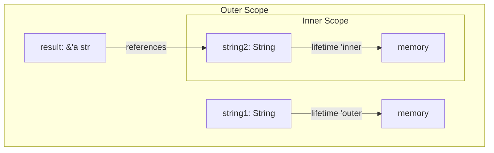

# Rust Lifetime Annotations

## Introduction

In Rust's ownership system, one of the most powerful yet initially challenging concepts is **lifetime annotations**. While Rust's compiler often handles memory management automatically, sometimes it needs your help to understand how long references should live. This is where lifetime annotations come in.

Lifetime annotations don't change how long values actually live - they help Rust's compiler understand the relationships between references so it can ensure memory safety without a garbage collector. By the end of this tutorial, you'll understand what lifetime annotations are, when you need them, and how to use them effectively.

## Understanding References and Lifetimes

Before diving into lifetime annotations, let's quickly review what references are in Rust:

```rust
fn main() {
    let x = 5;            // A value
    let y = &x;           // A reference to x
    
    println!("The value of y is: {}", y);
}

// Output:
// The value of y is: 5
```

In this example, `y` is a reference to `x`. Rust needs to ensure that `y` doesn't outlive `x` - otherwise, `y` would be pointing to invalid memory.

Every reference in Rust has a **lifetime**, which is the scope where the reference is valid. Most of the time, lifetimes are implicit and inferred by the Rust compiler. However, sometimes the compiler needs our help.

## When Do You Need Lifetime Annotations?

You typically need lifetime annotations when:

1. You have functions that return references
2. You have structs that store references
3. The compiler can't determine on its own how references relate to each other

The Rust compiler follows a set of rules called **lifetime elision rules** that allow it to infer lifetimes in many cases. But when these rules don't provide enough information, you'll get a compiler error asking for explicit lifetime annotations.

## Lifetime Annotation Syntax

Lifetime annotations start with an apostrophe (`'`) followed by a name, typically a single lowercase letter. The most common lifetime annotation is `'a` (pronounced "tick a").

Here's the basic syntax:

```rust
&'a i32        // A reference with an explicit lifetime 'a
&'a mut i32     // A mutable reference with lifetime 'a
```

## Using Lifetime Annotations in Functions

Let's look at a function that returns a reference:

```rust
// This won't compile without lifetime annotations
fn longest(x: &str, y: &str) -> &str {
    if x.len() > y.len() {
        x
    } else {
        y
    }
}
```

If you try to compile this, Rust will complain that it can't determine the lifetime of the returned reference. Here's how we fix it with lifetime annotations:

```rust
fn longest<'a>(x: &'a str, y: &'a str) -> &'a str {
    if x.len() > y.len() {
        x
    } else {
        y
    }
}

fn main() {
    let string1 = String::from("long string is long");
    let string2 = String::from("short");
    
    let result = longest(&string1, &string2);
    println!("The longest string is: {}", result);
}

// Output:
// The longest string is: long string is long
```

Here's what the annotations mean:
- `<'a>` declares a lifetime parameter
- `x: &'a str` and `y: &'a str` specify that both parameters live at least as long as lifetime `'a`
- `-> &'a str` indicates the return value lives at least as long as lifetime `'a`

The function can now be used safely because Rust ensures references won't outlive the data they point to.

## Lifetime Annotations in Structs

If a struct holds references, you need to annotate their lifetimes:

```rust
struct BookExcerpt<'a> {
    content: &'a str,
}

fn main() {
    let novel = String::from("Call me Ishmael. Some years ago...");
    let first_sentence = novel.split('.').next().unwrap();
    
    let excerpt = BookExcerpt {
        content: first_sentence,
    };
    
    println!("Excerpt: {}", excerpt.content);
}

// Output:
// Excerpt: Call me Ishmael
```

The `BookExcerpt` struct has a lifetime parameter `'a` which means:
1. An instance of `BookExcerpt` can't outlive the reference it holds in its `content` field
2. The compiler will enforce this relationship

## Multiple Lifetime Parameters

Sometimes you need different lifetime parameters for different references:

```rust
fn longest_with_announcement<'a, 'b>(
    x: &'a str,
    y: &'a str,
    announcement: &'b str,
) -> &'a str {
    println!("Announcement: {}", announcement);
    
    if x.len() > y.len() {
        x
    } else {
        y
    }
}

fn main() {
    let string1 = String::from("long string is long");
    let string2 = String::from("short");
    let announcement = String::from("Today's winner is...");
    
    let result = longest_with_announcement(&string1, &string2, &announcement);
    println!("The longest string is: {}", result);
}

// Output:
// Announcement: Today's winner is...
// The longest string is: long string is long
```

Here:
- `'a` connects the lifetimes of `x`, `y`, and the return value
- `'b` is a separate lifetime for the `announcement` parameter
- This indicates that `announcement` has no relationship with the lifetime of the returned value

## Static Lifetime

The `'static` lifetime is special - it means the reference can live for the entire duration of the program:

```rust
let s: &'static str = "I have a static lifetime.";
```

String literals have a `'static` lifetime because they're stored directly in the program's binary.

## How Lifetimes Work: A Visual Explanation

Here's a diagram showing how lifetimes work in a simple program:



This illustrates:
1. `string1` has lifetime `'outer`
2. `string2` has lifetime `'inner`
3. The reference `result` is bound by the shorter of these lifetimes

## Common Lifetime Patterns

### 1. One Input, One Output

When a function takes one reference and returns a reference:

```rust
fn first_word<'a>(s: &'a str) -> &'a str {
    let bytes = s.as_bytes();
    
    for (i, &item) in bytes.iter().enumerate() {
        if item == b' ' {
            return &s[0..i];
        }
    }
    
    &s[..]
}
```

The lifetime annotation ensures the returned reference doesn't outlive the input.

### 2. Self-Referential Structs

Creating self-referential structures in Rust is challenging but possible with lifetime annotations:

```rust
struct Parser<'a> {
    source: &'a str,
    current_position: usize,
}

impl<'a> Parser<'a> {
    fn new(source: &'a str) -> Parser<'a> {
        Parser {
            source,
            current_position: 0,
        }
    }
    
    fn parse_word(&mut self) -> &'a str {
        // Find the start of the next word
        let start = self.current_position;
        
        // Find the end of the word
        while self.current_position < self.source.len() && 
              !self.source.as_bytes()[self.current_position].is_ascii_whitespace() {
            self.current_position += 1;
        }
        
        // Skip whitespace to prepare for the next word
        while self.current_position < self.source.len() && 
              self.source.as_bytes()[self.current_position].is_ascii_whitespace() {
            self.current_position += 1;
        }
        
        &self.source[start..self.current_position]
    }
}

fn main() {
    let text = "Hello world! This is a simple parser.";
    let mut parser = Parser::new(text);
    
    println!("First word: {}", parser.parse_word());
    println!("Second word: {}", parser.parse_word());
    println!("Third word: {}", parser.parse_word());
}

// Output:
// First word: Hello 
// Second word: world! 
// Third word: This 
```

## Real-World Application: Configuration Parser

Let's see a more practical example - a configuration parser that returns references to configuration values:

```rust
struct Config<'a> {
    content: &'a str,
}

impl<'a> Config<'a> {
    fn new(content: &'a str) -> Config<'a> {
        Config { content }
    }
    
    fn get_value(&self, key: &str) -> Option<&'a str> {
        for line in self.content.lines() {
            if let Some(index) = line.find('=') {
                let (k, v) = line.split_at(index);
                if k.trim() == key {
                    return Some(v[1..].trim());
                }
            }
        }
        None
    }
}

fn main() {
    let config_text = r#"
        database_url = postgres://localhost/mydb
        port = 8080
        environment = development
    "#;
    
    let config = Config::new(config_text);
    
    if let Some(database_url) = config.get_value("database_url") {
        println!("Database URL: {}", database_url);
    }
    
    if let Some(port) = config.get_value("port") {
        println!("Port: {}", port);
    }
}

// Output:
// Database URL: postgres://localhost/mydb
// Port: 8080
```

This example demonstrates how to use lifetime annotations to safely return references to parts of the input data.

## Common Lifetime Challenges and Solutions

### Challenge 1: Returning References from Functions with Local Data

This doesn't work because the local data is dropped at the end of the function:

```rust
// This will not compile!
fn return_local_reference() -> &String {
    let s = String::from("hello");
    &s  // ERROR: s goes out of scope here
}
```

**Solution**: Either return an owned value or take the data as a parameter:

```rust
// Return an owned value:
fn return_owned() -> String {
    String::from("hello")
}

// Or use input data:
fn return_reference<'a>(input: &'a String) -> &'a String {
    input
}
```

### Challenge 2: Mixing Borrowed and Owned Data

Sometimes you need to mix references with owned data:

```rust
struct User<'a> {
    username: &'a str,
    email: String,  // Owned
}

fn main() {
    let name = "John Doe";
    
    let user = User {
        username: name,
        email: String::from("john@example.com"),
    };
    
    println!("User: {} ({})", user.username, user.email);
}

// Output:
// User: John Doe (john@example.com)
```

This works because `username` borrows `name` while `email` owns its data.

## Summary

Rust's lifetime annotations might seem complex at first, but they serve a critical purpose: helping the compiler ensure memory safety without a garbage collector. Here's what we've covered:

1. Lifetimes are named regions of code where references are valid
2. Most of the time, Rust can infer lifetimes automatically (lifetime elision)
3. When the compiler needs help, we use lifetime annotations like `<'a>`
4. Functions that return references and structs that store references often need lifetime annotations
5. The `'static` lifetime is special and indicates a reference can live for the program's entire duration

By understanding lifetime annotations, you've mastered one of Rust's most powerful features for ensuring memory safety.

## Exercises

1. Write a function `last_char` that takes a string slice and returns a reference to its last character.
2. Create a struct `Highlighter` that stores a text reference and a pattern reference, with a method that returns references to all parts of the text that match the pattern.
3. Implement a function `longest_word` that returns the longest word from a string slice.

## Additional Resources

- [The Rust Book: Validating References with Lifetimes](https://doc.rust-lang.org/book/ch10-03-lifetime-syntax.html)
- [Rust By Example: Lifetimes](https://doc.rust-lang.org/rust-by-example/scope/lifetime.html)
- [Rust Reference: Lifetimes](https://doc.rust-lang.org/reference/lifetime-elision.html)