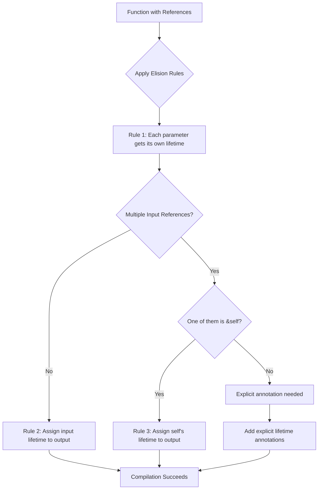

# Rust Lifetime Elision

## Introduction

When working with Rust's ownership system, you'll often encounter lifetimes - a concept that helps the compiler ensure memory safety without garbage collection. While explicit lifetime annotations are sometimes necessary, Rust provides **lifetime elision** - a set of rules that automatically infer lifetimes in common scenarios, making your code cleaner and more readable.

In this guide, we'll explore how lifetime elision works, when it applies, and how it helps you write safer code with less effort.

## What is Lifetime Elision?

Lifetime elision refers to Rust's ability to automatically determine lifetimes in functions and methods without requiring explicit annotations. This feature was introduced to make Rust code more concise while maintaining its strong safety guarantees.

Before diving into the rules, let's understand why lifetimes exist and when they're needed.

## A Quick Refresher on Lifetimes

Lifetimes ensure that references remain valid for as long as they're used. Consider this example:

```rust
fn main() {
    let r;
    {
        let x = 5;
        r = &x; // borrowing `x`
    } // `x` goes out of scope here
    
    println!("r: {}", r); // Error: `x` doesn't live long enough
}
```

This code fails because the reference `r` outlives the value it points to. To prevent such errors, Rust uses lifetimes.

When passing references to functions, Rust needs to know how the lifetimes of these references relate to each other and to the function's output. This is where lifetime annotations come in:

```rust
// Explicit lifetime annotation
fn longest<'a>(x: &'a str, y: &'a str) -> &'a str {
    if x.len() > y.len() {
        x
    } else {
        y
    }
}
```

However, writing these annotations for every function would be tedious. That's where lifetime elision comes in!

## The Three Lifetime Elision Rules

Rust follows three rules to automatically determine lifetimes without explicit annotations:

### Rule 1: Each input parameter gets its own lifetime

When a function has parameters that are references, each parameter gets its own implicit lifetime parameter:

```rust
fn foo(x: &str, y: &str);
// Implicitly becomes:
fn foo<'a, 'b>(x: &'a str, y: &'b str);
```

### Rule 2: If there is exactly one input lifetime, assign it to all output lifetimes

If a function has exactly one input reference, its lifetime is assigned to all output references:

```rust
fn first_word(s: &str) -> &str;
// Implicitly becomes:
fn first_word<'a>(s: &'a str) -> &'a str;
```

### Rule 3: If there are multiple input lifetimes, but one of them is `&self` or `&mut self`, the lifetime of `self` is assigned to all output references

In methods (functions within `impl` blocks), if one parameter is `&self` or `&mut self`, its lifetime is used for all output references:

```rust 
impl SomeStruct {
    fn get_field(&self) -> &str;
    // Implicitly becomes:
    fn get_field<'a>(&'a self) -> &'a str;
}
```

Let's look at more examples to better understand these rules.

## Examples of Lifetime Elision in Action

### Example 1: Basic Function

```rust
fn first_char(s: &str) -> &char {
    &s.chars().next().unwrap()
}
```

Using the elision rules:
1. Input parameter `s` gets lifetime `'a`
2. Since there's exactly one input lifetime, it's assigned to the output
3. The function signature becomes `fn first_char<'a>(s: &'a str) -> &'a char`

### Example 2: Multiple Parameters

```rust
fn longest(x: &str, y: &str) -> &str {
    if x.len() > y.len() {
        x
    } else {
        y
    }
}
```

This won't compile without explicit lifetime annotations because:
1. Input parameters `x` and `y` get lifetimes `'a` and `'b` respectively
2. Rust can't determine which lifetime to assign to the output
3. None of the elision rules apply to this case

The corrected version requires explicit annotations:

```rust
fn longest<'a>(x: &'a str, y: &'a str) -> &'a str {
    if x.len() > y.len() {
        x
    } else {
        y
    }
}
```

### Example 3: Method with `&self`

```rust
struct Person {
    name: String,
}

impl Person {
    fn get_name(&self) -> &str {
        &self.name
    }
}
```

Using the elision rules:
1. Input parameter `&self` gets lifetime `'a`
2. Since there's a `&self` parameter, rule 3 applies and the output gets lifetime `'a`
3. The method signature becomes `fn get_name<'a>(&'a self) -> &'a str`

## Real-world Applications

Let's look at some practical examples where lifetime elision simplifies our code.

### String Processing Utility

```rust
// A utility to extract the first line from a string
fn first_line(text: &str) -> &str {
    match text.find('
') {
        Some(pos) => &text[0..pos],
        None => text,
    }
}

fn main() {
    let paragraph = "Hello, world!
Welcome to Rust.";
    let first = first_line(paragraph);
    println!("First line: {}", first);
}
```

**Output:**
```
First line: Hello, world!
```

The function `first_line` returns a slice of the input string. Thanks to lifetime elision, we don't need to write:

```rust
fn first_line<'a>(text: &'a str) -> &'a str {
    // ...
}
```

### Custom Data Structure with Methods

```rust
struct TextAnalyzer<'a> {
    content: &'a str,
}

impl<'a> TextAnalyzer<'a> {
    fn new(content: &'a str) -> TextAnalyzer<'a> {
        TextAnalyzer { content }
    }
    
    fn get_first_word(&self) -> &str {
        match self.content.find(' ') {
            Some(pos) => &self.content[0..pos],
            None => self.content,
        }
    }
    
    fn count_words(&self) -> usize {
        self.content.split_whitespace().count()
    }
}

fn main() {
    let text = "Rust makes memory safety easy!";
    let analyzer = TextAnalyzer::new(text);
    
    println!("First word: {}", analyzer.get_first_word());
    println!("Word count: {}", analyzer.count_words());
}
```

**Output:**
```
First word: Rust
Word count: 5
```

In the `get_first_word` method, we benefit from rule 3 of lifetime elision. The method implicitly has the signature:

```rust
fn get_first_word<'a>(&'a self) -> &'a str
```

## When Lifetime Elision Doesn't Apply

Despite these helpful rules, there are cases where you must explicitly specify lifetimes:

1. When a function returns a reference derived from multiple input references
2. When the output reference's lifetime isn't related to any input reference
3. When you need to express complex relationships between different lifetimes

Let's see an example:

```rust
// This won't compile with elision
fn merge_strings(a: &str, b: &str) -> &str {
    if a.len() > b.len() {
        a
    } else {
        b
    }
}
```

We need to explicitly annotate lifetimes:

```rust
fn merge_strings<'a>(a: &'a str, b: &'a str) -> &'a str {
    if a.len() > b.len() {
        a
    } else {
        b
    }
}
```

## Understanding Lifetime Elision with Diagrams

Let's visualize how lifetime elision works:



## Summary

Lifetime elision is a powerful feature that makes Rust more ergonomic without sacrificing safety. Here's what we've learned:

- Lifetime elision automatically infers lifetimes based on three rules
- Rule 1: Each parameter gets its own lifetime
- Rule 2: If there's only one input lifetime, it's assigned to all outputs
- Rule 3: In methods, the lifetime of `&self` is assigned to all outputs
- Elision simplifies common patterns but doesn't cover all cases
- When elision rules aren't sufficient, explicit annotations are needed

By understanding these rules, you can write cleaner code while still benefiting from Rust's memory safety guarantees.

## Exercises

1. Write a function `last_char` that returns a reference to the last character in a string.
2. Create a struct `Pair` that holds two string slices and implement a method to return the longer of the two.
3. Try to implement a function that takes two string slices and returns a reference to a new string containing both. Why doesn't this work with lifetimes alone?

## Additional Resources

- [The Rust Book: Validating References with Lifetimes](https://doc.rust-lang.org/book/ch10-03-lifetime-syntax.html)
- [Rust By Example: Lifetimes](https://doc.rust-lang.org/rust-by-example/scope/lifetime.html)
- [The Rustonomicon: Lifetimes](https://doc.rust-lang.org/nomicon/lifetimes.html)