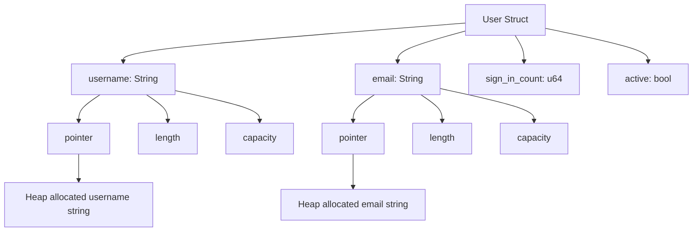

# Rust Structs Basics

## Introduction

Structs (short for "structures") are one of Rust's fundamental building blocks for creating custom data types. They allow you to group related values together into a meaningful unit. If you're coming from an object-oriented programming background, structs are similar to classes but without methods (though methods can be added separately using implementations).

In this tutorial, we'll explore the basics of Rust structs, how to define them, create instances, access their fields, and use them effectively in your programs.

## What are Structs?

Structs are custom data types that let you package together and name multiple related values that make up a meaningful group. Each piece of data in a struct is called a **field**. Structs help organize your code by grouping related data together, making it easier to pass around multiple values and represent real-world concepts in your programs.

## Defining a Struct

Let's start by defining a simple struct. The syntax uses the `struct` keyword followed by a name and a set of fields within curly braces:

```rust
struct User {
    username: String,
    email: String,
    sign_in_count: u64,
    active: bool,
}
```

In this example:
- `User` is the name of our struct
- Inside the curly braces, we define four fields with their respective types
- Each field is separated by a comma

Notice how each field has a name and a type, similar to variables. The struct definition is like a template for the data structure.

## Creating Instances of a Struct

Once we've defined a struct, we can create instances by specifying concrete values for each field:

```rust
fn main() {
    let user1 = User {
        email: String::from("someone@example.com"),
        username: String::from("someusername123"),
        active: true,
        sign_in_count: 1,
    };
    
    println!("User {} has email {}", user1.username, user1.email);
}
```

Output:
```
User someusername123 has email someone@example.com
```

When creating an instance:
- We create a new instance by writing the struct name
- Inside curly braces, we provide key: value pairs for each field
- We don't need to specify fields in the same order as in the struct definition
- We must initialize all fields (Rust doesn't have default field values)

## Accessing Struct Fields

You can access the fields of a struct using dot notation:

```rust
fn main() {
    let mut user1 = User {
        email: String::from("someone@example.com"),
        username: String::from("someusername123"),
        active: true,
        sign_in_count: 1,
    };
    
    // Access fields using dot notation
    println!("Before update: {}", user1.email);
    
    // Update email field (note the struct must be mutable)
    user1.email = String::from("newemail@example.com");
    
    println!("After update: {}", user1.email);
}
```

Output:
```
Before update: someone@example.com
After update: newemail@example.com
```

Important points:
- Field access uses dot notation: `instance.field_name`
- To modify fields, the entire struct instance must be mutable
- You cannot mark only certain fields as mutable

## Shorthand Field Initialization

If you have variables with the same names as struct fields, you can use a shorthand syntax:

```rust
fn build_user(email: String, username: String) -> User {
    User {
        email,      // same as email: email
        username,   // same as username: username
        active: true,
        sign_in_count: 1,
    }
}

fn main() {
    let user1 = build_user(
        String::from("someone@example.com"),
        String::from("someusername123")
    );
    println!("Created user {} with email {}", user1.username, user1.email);
}
```

Output:
```
Created user someusername123 with email someone@example.com
```

This field init shorthand is convenient when you have variables that match field names.

## Creating Instances from Other Instances

Often, we need to create a new struct instance that uses most of the values from another instance but changes a few. The struct update syntax makes this easy:

```rust
fn main() {
    let user1 = User {
        email: String::from("someone@example.com"),
        username: String::from("someusername123"),
        active: true,
        sign_in_count: 1,
    };
    
    // Create user2 with most values from user1, but with a different email
    let user2 = User {
        email: String::from("another@example.com"),
        ..user1  // uses remaining fields from user1
    };
    
    println!("User1: {} with {}", user1.username, user1.email);
    println!("User2: {} with {}", user2.username, user2.email);
}
```

Output:
```
User1: someusername123 with someone@example.com
User2: someusername123 with another@example.com
```

The `..user1` syntax means "use the remaining fields from user1." This is a convenient way to create a new instance with a few changes.

**Important note**: When you use the struct update syntax, Rust moves the data from the old struct to the new one for fields that implement the `Copy` trait. For fields like `String` that don't implement `Copy`, ownership is moved, and you can no longer use those fields in the original struct.

## Tuple Structs

Rust also supports "tuple structs," which are structs without named fields. They're a hybrid between a tuple and a struct:

```rust
struct Color(i32, i32, i32);
struct Point(i32, i32, i32);

fn main() {
    let black = Color(0, 0, 0);
    let origin = Point(0, 0, 0);
    
    println!("First value of color: {}", black.0);
    println!("Second value of point: {}", origin.1);
}
```

Output:
```
First value of color: 0
Second value of point: 0
```

Tuple structs:
- Have a name that gives meaning to the structure
- Access fields using dot notation with index numbers (like tuples)
- Are useful when you want to give a name to a tuple and make it a different type from other tuples
- Are particularly useful for simple wrappers around primitive types

## Unit-Like Structs

Rust allows structs without any fields at all, called unit-like structs:

```rust
struct AlwaysEqual;

fn main() {
    let subject = AlwaysEqual;
    
    // We can use this struct as a marker
    process_item(subject);
}

fn process_item(_item: AlwaysEqual) {
    println!("Processing an AlwaysEqual item");
}
```

Output:
```
Processing an AlwaysEqual item
```

Unit-like structs:
- Are defined without any curly braces or parentheses
- Behave similarly to the unit type `()`
- Are useful when implementing a trait on a type where you don't need to store any data

## Real-World Example: Rectangle Area Calculator

Let's use structs to model rectangles and calculate their areas:

```rust
struct Rectangle {
    width: u32,
    height: u32,
}

fn calculate_area(rectangle: &Rectangle) -> u32 {
    rectangle.width * rectangle.height
}

fn main() {
    let rect1 = Rectangle {
        width: 30,
        height: 50,
    };
    
    println!(
        "The area of the rectangle is {} square pixels.",
        calculate_area(&rect1)
    );
}
```

Output:
```
The area of the rectangle is 1500 square pixels.
```

This example shows how structs can help us group related data (width and height) into a meaningful unit (Rectangle).

## Visualizing Structs with Debug

To print out the entire struct for debugging, we need to opt into the Debug functionality:

```rust
#[derive(Debug)]
struct Rectangle {
    width: u32,
    height: u32,
}

fn main() {
    let rect1 = Rectangle {
        width: 30,
        height: 50,
    };
    
    // Using the debug print format
    println!("rect1 is {:?}", rect1);
    
    // Using the pretty debug print format
    println!("rect1 is {:#?}", rect1);
}
```

Output:
```
rect1 is Rectangle { width: 30, height: 50 }
rect1 is Rectangle {
    width: 30,
    height: 50,
}
```

The `#[derive(Debug)]` attribute enables debug printing for our struct. The `{:?}` and `{:#?}` formatting specifiers are used to print debug information.

## Memory Layout of Structs

Let's visualize how structs are laid out in memory:



The diagram shows:
- Structs are stored on the stack
- String fields contain metadata (pointer, length, capacity) on the stack
- The actual string data is stored on the heap
- Other primitive types like `u64` and `bool` are stored directly in the struct

## Summary

In this tutorial, we've learned:

- **Struct basics**: How to define and create custom data structures
- **Creating instances**: How to instantiate structs with specific values
- **Field access**: How to access and modify struct fields
- **Creation shortcuts**: Shorthand initialization and instance creation from other instances
- **Tuple structs**: How to create unnamed field structs
- **Unit-like structs**: How to create structs without fields
- **Debugging**: How to print struct contents for debugging
- **Real-world usage**: How structs help model domain concepts

Structs are fundamental to organizing data in Rust and are the building blocks for implementing more complex data structures and object-oriented patterns.

## Additional Resources and Exercises

### Resources
- [Rust Book - Structs Chapter](https://doc.rust-lang.org/book/ch05-00-structs.html)
- [Rust by Example - Structs](https://doc.rust-lang.org/rust-by-example/custom_types/structs.html)

### Exercises

1. **Create a Person Struct**:
   Define a `Person` struct with fields for name, age, and address. Create several instances and print their information.

2. **Book Library**:
   Create structs to model a library with books, authors, and borrowers. Include fields like title, author, ISBN, publication year, etc.

3. **Improved Rectangle**:
   Extend the Rectangle example to include methods for determining if one rectangle can fit inside another.

4. **Nested Structs**:
   Create a `Car` struct that contains another struct `Engine` as one of its fields. Explore how to create and access nested struct fields.

5. **Convert Between Types**:
   Create a tuple struct `RGB(u8, u8, u8)` and a regular struct `Color{red: u8, green: u8, blue: u8}`. Write functions to convert between these two representations.