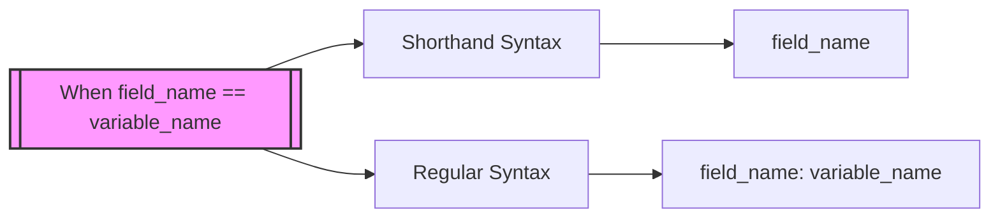

# Rust Field Init Shorthand

## Introduction

When working with Rust structs, you'll often find yourself initializing struct fields with variables that have the same names as the fields themselves. Rust provides a convenient feature known as **field init shorthand** to make this process more concise and readable. This shorthand syntax helps you eliminate redundancy in your code while maintaining clarity.

In this guide, we'll explore how field init shorthand works in Rust, when to use it, and how it can improve your code.

## The Long Way: Regular Struct Initialization

Before diving into the shorthand syntax, let's look at how we would normally initialize a struct in Rust. Consider a simple `User` struct:

```rust
struct User {
    username: String,
    email: String,
    active: bool,
    login_count: u64,
}

fn main() {
    // Variables with data to put in a User struct
    let username = String::from("rusty_coder");
    let email = String::from("rusty@example.com");
    let active = true;
    let login_count = 1;
    
    // Creating a new User with regular syntax
    let user1 = User {
        username: username,
        email: email,
        active: active,
        login_count: login_count,
    };
    
    println!("User {} has email {}", user1.username, user1.email);
}
```

**Output:**
```
User rusty_coder has email rusty@example.com
```

Notice how we have to repeat each field name and variable name, even though they're identical. This repetition can make your code more verbose and harder to read, especially with structs that have many fields.

## The Short Way: Field Init Shorthand

Rust's field init shorthand allows you to simply write the field name when the variable name matches the field name. Here's the same example using the shorthand syntax:

```rust
struct User {
    username: String,
    email: String,
    active: bool,
    login_count: u64,
}

fn main() {
    // Variables with data to put in a User struct
    let username = String::from("rusty_coder");
    let email = String::from("rusty@example.com");
    let active = true;
    let login_count = 1;
    
    // Creating a new User with field init shorthand
    let user1 = User {
        username,  // shorthand for username: username
        email,     // shorthand for email: email
        active,    // shorthand for active: active
        login_count, // shorthand for login_count: login_count
    };
    
    println!("User {} has email {}", user1.username, user1.email);
}
```

**Output:**
```
User rusty_coder has email rusty@example.com
```

Much cleaner, right? When the variable name matches the field name, you can simply write the name once, and Rust understands that you want to assign the variable to the field of the same name.

## How Field Init Shorthand Works

The field init shorthand works based on a simple principle:

1. You have a variable with a certain name
2. Your struct has a field with the exact same name
3. You can just write the name once when initializing the struct

The compiler automatically expands this shorthand to the full `field: variable` syntax during compilation.

Here's a visual representation of this principle:



## Practical Examples

### Example 1: Function that creates a User

A common pattern is to have a function that creates and returns a struct. Field init shorthand makes these functions cleaner:

```rust
struct User {
    username: String,
    email: String,
    active: bool,
    login_count: u64,
}

fn create_user(username: String, email: String) -> User {
    User {
        username,  // shorthand!
        email,     // shorthand!
        active: true,
        login_count: 1,
    }
}

fn main() {
    let user1 = create_user(
        String::from("rust_lover"),
        String::from("rustlover@example.com"),
    );
    
    println!("New user created: {}", user1.username);
}
```

**Output:**
```
New user created: rust_lover
```

### Example 2: Mixing shorthand with regular syntax

You can mix shorthand with regular syntax in the same struct initialization:

```rust
struct Point3D {
    x: f64,
    y: f64,
    z: f64,
    label: String,
}

fn main() {
    let x = 1.0;
    let y = 2.0;
    
    // Using shorthand for x and y, but regular syntax for z and label
    let point = Point3D {
        x,
        y,
        z: 3.0,
        label: String::from("Origin Point"),
    };
    
    println!("Point at ({}, {}, {}) labeled: {}", 
             point.x, point.y, point.z, point.label);
}
```

**Output:**
```
Point at (1, 2, 3) labeled: Origin Point
```

### Example 3: Using with update syntax

Field init shorthand works great with Rust's struct update syntax:

```rust
struct BlogPost {
    title: String,
    content: String,
    author: String,
    published: bool,
    views: u32,
}

fn main() {
    let author = String::from("Rusty Writer");
    
    let draft = BlogPost {
        title: String::from("Rust Field Init Shorthand"),
        content: String::from("Draft content..."),
        author, // shorthand!
        published: false,
        views: 0,
    };
    
    // Update the draft to a published post
    let content = String::from("Final content with examples and code...");
    let published = true;
    
    let published_post = BlogPost {
        content,    // shorthand!
        published,  // shorthand!
        ..draft     // take the rest from draft
    };
    
    println!("Post '{}' by {} is now published!", 
             published_post.title, published_post.author);
}
```

**Output:**
```
Post 'Rust Field Init Shorthand' by Rusty Writer is now published!
```

## When to Use Field Init Shorthand

Field init shorthand is most useful when:

1. You have variables with the same names as your struct fields
2. The variables are already in scope before initializing the struct
3. You want to make your code more concise and readable

This pattern often occurs when:
- Creating a new struct from function parameters
- Converting from one struct type to another
- Updating a struct with new values

## Best Practices

Here are some best practices for using field init shorthand:

1. **Be consistent**: If most of your fields use shorthand, consider renaming other variables to match field names for consistency

2. **Use meaningful variable names**: Since the variable names will be used directly in the struct, ensure they accurately describe the data

3. **Consider readability**: Sometimes using the longer form might be clearer, especially if the context isn't obvious

4. **Document when necessary**: If the shorthand might confuse new Rust developers, consider adding a brief comment

## Common Mistakes

### Mistake 1: Assuming shorthand works with different names

```rust
struct User {
    username: String,
    email: String,
}

fn main() {
    let name = String::from("rusty_coder");  // Doesn't match field name
    let email = String::from("rusty@example.com");
    
    // This won't work!
    // let user = User { name, email };
    
    // This is correct
    let user = User {
        username: name,  // Different names, can't use shorthand
        email,           // Same names, can use shorthand
    };
}
```

### Mistake 2: Using shorthand without having the variable in scope

```rust
struct User {
    username: String,
    email: String,
}

fn main() {
    // This won't work!
    // let user = User { username, email };
    
    // Variables must be defined first
    let username = String::from("rusty_coder");
    let email = String::from("rusty@example.com");
    
    // Now this works
    let user = User { username, email };
}
```

## Summary

Rust's field init shorthand is a simple but powerful feature that helps make your code more concise and readable. When initializing a struct with variables that have the same names as the struct fields, you can omit the redundant field names and just write the variable names.

Key takeaways:
- Field init shorthand eliminates the need to repeat field names when they match variable names
- It works seamlessly with Rust's other struct features like the update syntax
- It's especially useful in functions that create and return structs
- The variable must be in scope and have the exact same name as the field

By understanding and using field init shorthand appropriately, you can write cleaner, more maintainable Rust code.

## Additional Resources and Exercises

### Resources
- [Rust Book Chapter on Structs](https://doc.rust-lang.org/book/ch05-00-structs.html)
- [Rust By Example: Structs](https://doc.rust-lang.org/rust-by-example/custom_types/structs.html)

### Exercises

1. **Basic Conversion**: Create a function that converts a `UserInput` struct to a `UserProfile` struct using field init shorthand wherever possible.

2. **Mixed Initialization**: Create a struct with at least 5 fields and initialize it using a mix of shorthand and regular syntax. Try to make it as readable as possible.

3. **Refactoring Challenge**: Take the following code and refactor it to use field init shorthand:
   ```rust
   struct Product {
       name: String,
       price: f64,
       stock: u32,
       description: String,
   }
   
   fn create_product(name: String, price: f64, stock: u32, description: String) -> Product {
       Product {
           name: name,
           price: price,
           stock: stock,
           description: description,
       }
   }
   ```

4. **Advanced Pattern**: Create a complex data structure with nested structs, and use field init shorthand to simplify its initialization.