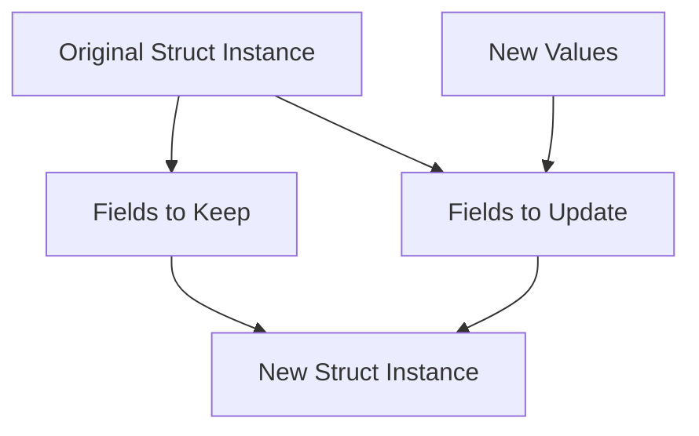

# Rust Struct Update Syntax

## Introduction

When working with structs in Rust, you'll often need to create a new instance that's similar to an existing one, with just a few fields changed. Instead of manually setting every field, Rust provides a convenient shorthand called the **struct update syntax** (sometimes referred to as the **struct spread operator**).

This feature allows you to create a new struct instance by specifying which fields to update while copying the rest from an existing instance. It's especially useful when dealing with structs that have many fields, saving you from repetitive code and potential errors.

## Basic Syntax

The struct update syntax uses the `..` operator followed by an existing instance to indicate that unspecified fields should be copied from that instance.

Here's the general pattern:

```rust
let new_instance = StructName {
    field1: new_value1,
    field2: new_value2,
    ..existing_instance
};
```

## Simple Example

Let's start with a basic example to see how the struct update syntax works:

```rust
struct User {
    username: String,
    email: String,
    sign_in_count: u64,
    active: bool,
}

fn main() {
    // Create an original user
    let user1 = User {
        username: String::from("johndoe"),
        email: String::from("john@example.com"),
        sign_in_count: 1,
        active: true,
    };
    
    // Create a new user, updating only the email and username
    let user2 = User {
        email: String::from("jane@example.com"),
        username: String::from("janedoe"),
        ..user1 // Copy the remaining fields from user1
    };
    
    println!("User 2 details:");
    println!("Username: {}", user2.username);  // janedoe
    println!("Email: {}", user2.email);        // jane@example.com
    println!("Sign in count: {}", user2.sign_in_count); // 1 (copied from user1)
    println!("Active: {}", user2.active);      // true (copied from user1)
}
```

In this example, `user2` gets its `sign_in_count` and `active` fields from `user1`, while `username` and `email` are explicitly provided.

## Understanding Ownership and the Update Syntax

When using the struct update syntax, it's crucial to understand how Rust's ownership rules apply. If a field implements the `Copy` trait, the value is copied. If not, ownership is moved from the original struct.

### Example with Moved Ownership

```rust
struct Article {
    title: String,
    content: String,
    author: String,
    published: bool,
}

fn main() {
    let article1 = Article {
        title: String::from("Rust Basics"),
        content: String::from("This is an article about Rust..."),
        author: String::from("John Doe"),
        published: false,
    };
    
    // Create a new article, updating the title and published status
    let article2 = Article {
        title: String::from("Advanced Rust"),
        published: true,
        ..article1 // This moves ownership of non-Copy fields
    };
    
    // This would cause an error - article1's String fields are moved
    // println!("Original article title: {}", article1.title);
    
    println!("New article title: {}", article2.title);
    println!("New article published: {}", article2.published);
}
```

In this example, after creating `article2`, you can no longer access the `title`, `content`, or `author` fields of `article1` because their ownership has been moved to `article2`.

### Example with Copy Types

With fields that implement the `Copy` trait, the values are copied rather than moved:

```rust
struct Point {
    x: i32,
    y: i32,
    label: String,
}

fn main() {
    let point1 = Point {
        x: 5,
        y: 10,
        label: String::from("Original Point"),
    };
    
    // Create a new point, updating only x
    let point2 = Point {
        x: 15,
        ..point1 // y is copied, label ownership is moved
    };
    
    // This is valid because x and y implement Copy
    println!("Original point coordinates: ({}, {})", point1.x, point1.y);
    
    // This would cause an error - label ownership was moved
    // println!("Original point label: {}", point1.label);
    
    println!("New point coordinates: ({}, {})", point2.x, point2.y);
    println!("New point label: {}", point2.label);
}
```

Here, the numeric fields (`x` and `y`) implement `Copy`, so they're copied, while the `String` field (`label`) is moved.

## Practical Applications

### Updating Configuration Settings

The struct update syntax is particularly useful for configuration objects where you might want to change just a few settings:

```rust
struct AppConfig {
    dark_mode: bool,
    font_size: u8,
    auto_save: bool,
    language: String,
    notifications_enabled: bool,
}

fn main() {
    let default_config = AppConfig {
        dark_mode: false,
        font_size: 12,
        auto_save: true,
        language: String::from("en"),
        notifications_enabled: true,
    };
    
    // User wants to switch to dark mode and increase font size
    let user_config = AppConfig {
        dark_mode: true,
        font_size: 14,
        ..default_config
    };
    
    println!("User Config:");
    println!("Dark Mode: {}", user_config.dark_mode);            // true
    println!("Font Size: {}", user_config.font_size);            // 14
    println!("Auto Save: {}", user_config.auto_save);            // true (from default)
    println!("Language: {}", user_config.language);              // "en" (from default)
    println!("Notifications: {}", user_config.notifications_enabled); // true (from default)
}
```

### Creating Modified Versions of Immutable Data

When working with immutable data structures, the update syntax lets you create modified versions without changing the original:

```rust
#[derive(Debug)]
struct Rectangle {
    width: u32,
    height: u32,
    color: String,
}

fn main() {
    let blue_rectangle = Rectangle {
        width: 30,
        height: 20,
        color: String::from("blue"),
    };
    
    // Create variations of the original rectangle
    let red_rectangle = Rectangle {
        color: String::from("red"),
        ..blue_rectangle
    };
    
    let wide_blue_rectangle = Rectangle {
        width: 50,
        ..blue_rectangle
    };
    
    println!("Original: {:?}", blue_rectangle);
    println!("Red variation: {:?}", red_rectangle);
    println!("Wide blue variation: {:?}", wide_blue_rectangle);
}
```

Output:
```
Original: Rectangle { width: 30, height: 20, color: "blue" }
Red variation: Rectangle { width: 30, height: 20, color: "red" }
Wide blue variation: Rectangle { width: 50, height: 20, color: "blue" }
```

Note: This example will not actually compile as written because `blue_rectangle.color` is moved to `red_rectangle`, and then we try to use it again for `wide_blue_rectangle`. To make this work, you would need to use `clone()` on the `color` field.

## Combining with Struct Field Init Shorthand

The struct update syntax works nicely with Rust's struct field init shorthand:

```rust
struct User {
    username: String,
    email: String,
    sign_in_count: u64,
    active: bool,
}

fn main() {
    let username = String::from("johndoe");
    let email = String::from("john@example.com");
    
    let user1 = User {
        username,  // Using field init shorthand
        email,     // Using field init shorthand
        sign_in_count: 1,
        active: true,
    };
    
    // Create a new user with a different sign_in_count
    let new_email = String::from("john.doe@company.com");
    
    let user2 = User {
        email: new_email, // Explicitly providing a new email
        sign_in_count: 2,
        ..user1 // Copy username and active from user1
    };
    
    println!("Updated user:");
    println!("Username: {}", user2.username);
    println!("Email: {}", user2.email);
    println!("Sign in count: {}", user2.sign_in_count);
    println!("Active: {}", user2.active);
}
```

## Limitations and Considerations

### 1. Partial Moves and Field Access

As shown in the ownership examples, if a field doesn't implement `Copy`, its ownership will be moved. This means you can no longer access the moved fields of the original struct, though you can still access fields that weren't moved.

### 2. Position in Struct Definition

The struct update syntax (`..existing_instance`) must come last in the struct initialization.

```rust
// This is valid
let user2 = User {
    email: String::from("new@example.com"),
    ..user1
};

// This would NOT be valid
// let user2 = User {
//     ..user1,
//     email: String::from("new@example.com"),
// };
```

### 3. Type Matching

The struct update syntax can only be used with structs of the same type. You cannot use it to copy fields between different struct types, even if they have fields with the same names and types.

## Visual Representation

Here's a diagram showing how the struct update syntax works:



## Summary

The struct update syntax in Rust provides an elegant way to create new struct instances based on existing ones, with just a few modifications. Key points to remember:

- Use the `..existing_instance` syntax to copy unspecified fields from an existing instance
- Place the struct update syntax at the end of the struct initialization
- Be mindful of ownership rules: non-`Copy` fields will be moved, potentially making the original struct's fields inaccessible
- This syntax is especially useful for configuration objects, immutable data structures, and reducing redundant code

## Exercises

1. Create a `Profile` struct with fields for `name`, `bio`, `age`, and `location`. Then, create two instances of this struct, using the struct update syntax to modify only the `age` and `location` fields for the second instance.

2. Define a `Car` struct with fields for `make`, `model`, `year`, `color`, and `mileage`. Create an original car and then use the struct update syntax to create "upgraded" versions with different colors and higher mileage.

3. Challenge: Create a struct with both `Copy` and non-`Copy` fields, then experiment with the struct update syntax to observe which fields remain accessible in the original struct after creating a new instance.

## Additional Resources

- [Rust Book: Structs](https://doc.rust-lang.org/book/ch05-00-structs.html)
- [Rust By Example: Structs](https://doc.rust-lang.org/rust-by-example/custom_types/structs.html)
- [Rust Documentation on Struct Types](https://doc.rust-lang.org/reference/expressions/struct-expr.html)