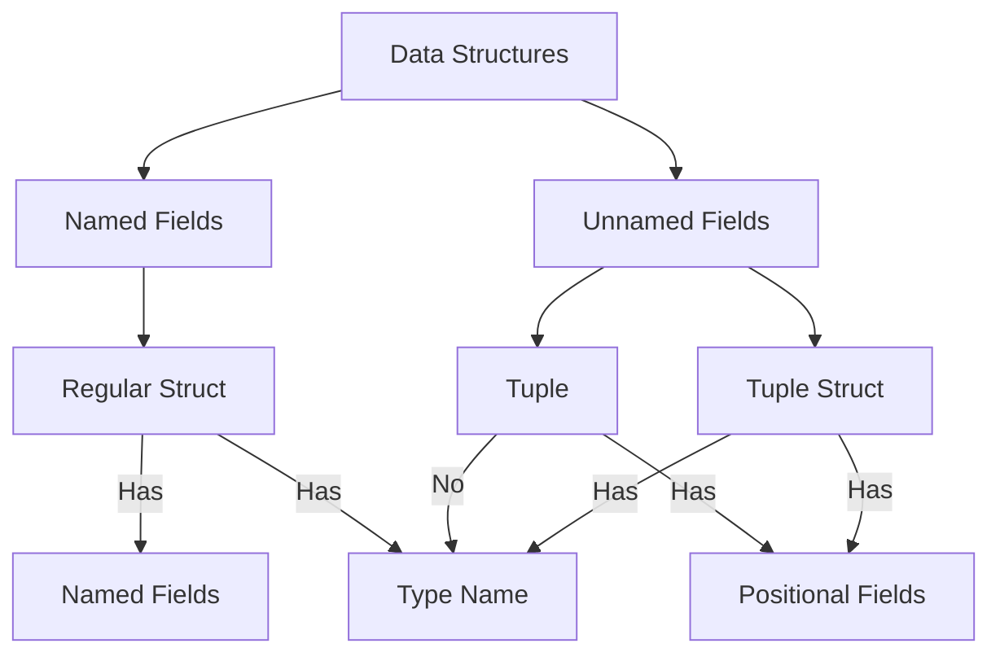

# Rust Tuple Structs

## Introduction

Tuple structs are a unique feature in Rust that combine the characteristics of tuples and structs. They provide a way to define types that are essentially named tuples. While regular structs use named fields, tuple structs have unnamed fields that are accessed by their position, just like normal tuples.

Tuple structs are particularly useful when you want to create a distinct type for a specific purpose but don't need to name each field individually. They're perfect for simple data structures where the field names aren't necessary, but you still want the type-checking benefits of creating a custom type.

## Basic Syntax

Here's the basic syntax for defining a tuple struct:

```rust
struct TupleStructName(Type1, Type2, Type3, ...);
```

Let's create a simple tuple struct to represent a point in 2D space:

```rust
struct Point(i32, i32);

fn main() {
    // Creating a tuple struct instance
    let origin = Point(0, 0);
    
    // Accessing tuple struct fields using index notation
    println!("The origin point is at ({}, {})", origin.0, origin.1);
}
```

**Output:**
```
The origin point is at (0, 0)
```

## Understanding Tuple Structs

### Key Characteristics

1. **Named Type**: A tuple struct has a name, making it distinct from other tuples with the same field types.
2. **Unnamed Fields**: Unlike regular structs, tuple structs don't have named fields.
3. **Field Access**: Fields are accessed using numerical indices (0, 1, 2, etc.) rather than names.
4. **Type Safety**: Despite their simplicity, tuple structs provide full type safety.

### When to Use Tuple Structs

Tuple structs are ideal when:

- You need a distinct type (for type checking) but don't need field names
- The meaning of each field is obvious from context or the order is well-understood
- You want a simpler, more concise syntax than regular structs
- You're working with a data structure where field positions are more natural than names

## Creating and Using Tuple Structs

### Basic Creation and Usage

```rust
// Define a tuple struct for RGB color values
struct RGB(u8, u8, u8);

// Define a tuple struct for RGBA color values (with alpha channel)
struct RGBA(u8, u8, u8, u8);

fn main() {
    // Creating instances
    let red = RGB(255, 0, 0);
    let transparent_blue = RGBA(0, 0, 255, 128);
    
    // Using the values
    println!("Red color has RGB values: ({}, {}, {})", red.0, red.1, red.2);
    println!("Transparent blue has RGBA values: ({}, {}, {}, {})",
             transparent_blue.0, transparent_blue.1, transparent_blue.2, transparent_blue.3);
}
```

**Output:**
```
Red color has RGB values: (255, 0, 0)
Transparent blue has RGBA values: (0, 0, 255, 128)
```

### Pattern Matching with Tuple Structs

You can use pattern matching with tuple structs, which is particularly useful for destructuring:

```rust
struct Point(i32, i32);

fn main() {
    let point = Point(10, 20);
    
    // Destructuring in a let statement
    let Point(x, y) = point;
    println!("Coordinates: x = {}, y = {}", x, y);
    
    // Destructuring in a match statement
    match point {
        Point(0, 0) => println!("Origin"),
        Point(0, _) => println!("On the y-axis"),
        Point(_, 0) => println!("On the x-axis"),
        Point(x, y) => println!("Point at ({}, {})", x, y),
    }
}
```

**Output:**
```
Coordinates: x = 10, y = 20
Point at (10, 20)
```

## Methods on Tuple Structs

Just like regular structs, you can implement methods on tuple structs using the `impl` keyword:

```rust
struct Vector3D(f64, f64, f64);

impl Vector3D {
    // Create a new vector
    fn new(x: f64, y: f64, z: f64) -> Self {
        Vector3D(x, y, z)
    }
    
    // Calculate the magnitude of the vector
    fn magnitude(&self) -> f64 {
        (self.0 * self.0 + self.1 * self.1 + self.2 * self.2).sqrt()
    }
    
    // Calculate the dot product with another vector
    fn dot(&self, other: &Vector3D) -> f64 {
        self.0 * other.0 + self.1 * other.1 + self.2 * other.2
    }
}

fn main() {
    let v1 = Vector3D::new(3.0, 4.0, 0.0);
    let v2 = Vector3D(1.0, 2.0, 3.0);
    
    println!("Magnitude of v1: {}", v1.magnitude());
    println!("Dot product of v1 and v2: {}", v1.dot(&v2));
}
```

**Output:**
```
Magnitude of v1: 5
Dot product of v1 and v2: 11
```

## Newtype Pattern

One common use of tuple structs is the "newtype" pattern, where you create a new type that wraps a single value:

```rust
// A newtype for user IDs
struct UserId(u64);

// A newtype for product codes
struct ProductCode(String);

fn register_user(id: UserId) {
    println!("Registering user with ID: {}", id.0);
}

fn main() {
    let user_id = UserId(12345);
    let product = ProductCode(String::from("ABC-123"));
    
    register_user(user_id);
    
    // This would cause a type error:
    // register_user(12345);
    
    println!("Product code: {}", product.0);
}
```

**Output:**
```
Registering user with ID: 12345
Product code: ABC-123
```

The newtype pattern is incredibly useful for:

1. **Type Safety**: Prevents mixing up different values that have the same underlying type
2. **API Design**: Provides clear expectations about what kind of values a function accepts
3. **Abstraction**: Hides implementation details of a type
4. **Adding Behavior**: Allows you to add methods to existing types without modifying them

## Tuple Structs vs. Regular Structs vs. Tuples

Let's compare the three approaches to understand when to use each:

```rust
// Regular struct
struct Point {
    x: i32,
    y: i32,
}

// Tuple struct
struct TuplePoint(i32, i32);

fn main() {
    // Regular struct
    let p1 = Point { x: 10, y: 20 };
    println!("Regular struct: p1.x = {}, p1.y = {}", p1.x, p1.y);
    
    // Tuple struct
    let p2 = TuplePoint(10, 20);
    println!("Tuple struct: p2.0 = {}, p2.1 = {}", p2.0, p2.1);
    
    // Regular tuple
    let p3: (i32, i32) = (10, 20);
    println!("Tuple: p3.0 = {}, p3.1 = {}", p3.0, p3.1);
}
```

**Output:**
```
Regular struct: p1.x = 10, p1.y = 20
Tuple struct: p2.0 = 10, p2.1 = 20
Tuple: p3.0 = 10, p3.1 = 20
```

Here's a diagram showing the relationship between these three concepts:



### When to Use Each:

- **Regular Struct**: When field names add clarity to your code
- **Tuple Struct**: When you need a distinct type but field names aren't necessary
- **Tuple**: When you need a temporary grouping of values without creating a new type

## Real-World Applications

### Example 1: Network Packet Headers

```rust
struct IPv4Header(u8, u32, u32, u16, u8);

fn parse_packet(packet: &[u8]) -> IPv4Header {
    // Simplified parsing logic
    IPv4Header(
        packet[0],                        // Version & header length
        u32::from_be_bytes([packet[1], packet[2], packet[3], packet[4]]), // Source IP
        u32::from_be_bytes([packet[5], packet[6], packet[7], packet[8]]), // Dest IP
        u16::from_be_bytes([packet[9], packet[10]]), // Length
        packet[11],                       // Protocol
    )
}

fn main() {
    // Simulated packet data
    let packet_data = [
        0x45, 0xc0, 0xa8, 0x01, 0x01, 0xc0, 0xa8, 0x01, 
        0x02, 0x00, 0x50, 0x06
    ];
    
    let header = parse_packet(&packet_data);
    
    println!("Packet version: {}", header.0 >> 4);
    println!("From: {}.{}.{}.{}", 
             (header.1 >> 24) & 0xFF,
             (header.1 >> 16) & 0xFF,
             (header.1 >> 8) & 0xFF,
             header.1 & 0xFF);
}
```

### Example 2: RGB Color Conversion

```rust
struct RGB(u8, u8, u8);
struct HSV(f64, f64, f64); // Hue (0-360), Saturation (0-1), Value (0-1)

impl RGB {
    fn to_hsv(&self) -> HSV {
        let r = self.0 as f64 / 255.0;
        let g = self.1 as f64 / 255.0;
        let b = self.2 as f64 / 255.0;
        
        let max = r.max(g.max(b));
        let min = r.min(g.min(b));
        let delta = max - min;
        
        // Calculate hue
        let h = if delta == 0.0 {
            0.0
        } else if max == r {
            60.0 * (((g - b) / delta) % 6.0)
        } else if max == g {
            60.0 * (((b - r) / delta) + 2.0)
        } else {
            60.0 * (((r - g) / delta) + 4.0)
        };
        
        // Calculate saturation
        let s = if max == 0.0 { 0.0 } else { delta / max };
        
        // Value is the maximum
        let v = max;
        
        HSV(h, s, v)
    }
}

fn main() {
    let red = RGB(255, 0, 0);
    let hsv = red.to_hsv();
    
    println!("RGB({}, {}, {}) converts to HSV({:.1}, {:.2}, {:.2})",
             red.0, red.1, red.2, hsv.0, hsv.1, hsv.2);
}
```

**Output:**
```
RGB(255, 0, 0) converts to HSV(0.0, 1.00, 1.00)
```

## Summary

Tuple structs in Rust provide a powerful way to create named types with unnamed fields. They strike a balance between the flexibility of tuples and the type safety of structs. Key points to remember:

- Tuple structs are named types with unnamed, positional fields
- They're accessed using index notation (like `.0`, `.1`)
- They're perfect for the newtype pattern to create type-safe wrappers
- They support methods, traits, and all the features of regular structs
- They're ideal when field names would be redundant or unnecessary

Tuple structs are most useful when:
1. You need a distinct type but don't need named fields
2. You're implementing the newtype pattern
3. The meaning of fields is obvious from their position
4. You want concise code without sacrificing type safety

## Exercises

1. Create a tuple struct `Complex` to represent complex numbers with real and imaginary parts, and implement methods for addition and multiplication.

2. Implement the newtype pattern to create a `NonEmptyString` type that guarantees a string is never empty.

3. Create tuple structs for both `Celsius` and `Fahrenheit` temperatures, and implement conversion methods between them.

4. Use a tuple struct to represent a geographical coordinate (latitude, longitude), and write a method to calculate the distance between two coordinates.

## Additional Resources

- [Rust Book: Tuple Structs](https://doc.rust-lang.org/book/ch05-01-defining-structs.html#using-tuple-structs-without-named-fields-to-create-different-types)
- [Rust by Example: Structs](https://doc.rust-lang.org/rust-by-example/custom_types/structs.html)
- [The Newtype Pattern in Rust](https://doc.rust-lang.org/1.0.0/style/features/types/newtype.html)