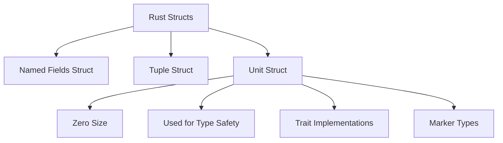

# Rust Unit Structs

## Introduction

When learning about data structures in Rust, structs (structures) are fundamental building blocks that allow you to create custom data types. While regular structs with named fields are common, Rust offers a special type called **unit structs** that serve unique purposes in your code.

Unit structs are the simplest form of structs in Rust - they don't contain any data! Despite this seeming limitation, they are incredibly useful in specific scenarios that we'll explore in this tutorial.

## What are Unit Structs?

A unit struct is a struct without any fields. It's called a "unit" struct because it resembles the unit type `()` in Rust, which also contains no data.

### Defining a Unit Struct

Here's how you define a unit struct:

```rust
struct UnitStruct;
```

That's it! Notice there are no curly braces or fields - just the struct name followed by a semicolon.

## Creating Instances of Unit Structs

Creating an instance of a unit struct is equally simple:

```rust
let instance = UnitStruct;
```

Since there are no fields to initialize, you don't need parentheses or curly braces.

## When to Use Unit Structs

Despite their simplicity, unit structs have several practical applications:

### 1. Type Safety with Zero Memory Overhead

Unit structs create distinct types without adding any memory overhead. This is useful for type-level programming.

```rust
// Define two different unit structs
struct Kilometers;
struct Miles;

// Function that only accepts Kilometers
fn process_distance(_: Kilometers) {
    println!("Processing distance in kilometers");
}

fn main() {
    let km = Kilometers;
    process_distance(km); // Works fine
    
    // let miles = Miles;
    // process_distance(miles); // Compilation error: expected Kilometers, found Miles
}
```

**Output:**
```
Processing distance in kilometers
```

This example shows how unit structs can help prevent type confusion without any runtime overhead.

### 2. Implementing Traits

Unit structs are often used as carriers for trait implementations:

```rust
struct Logger;

impl Logger {
    fn log(&self, message: &str) {
        println!("[LOG]: {}", message);
    }
}

fn main() {
    let logger = Logger;
    logger.log("Application started");
    logger.log("Processing data");
}
```

**Output:**
```
[LOG]: Application started
[LOG]: Processing data
```

In this example, `Logger` doesn't need to store any state, but it provides a namespace for logging functionality.

### 3. As Markers in Generic Programming

Unit structs can serve as markers or phantom types in generic programming:

```rust
struct Uninitialized;
struct Initialized;

struct Config<State> {
    // Configuration fields would go here
    connection_string: String,
    _state: std::marker::PhantomData<State>,
}

impl Config<Uninitialized> {
    fn new(connection_string: &str) -> Config<Uninitialized> {
        Config {
            connection_string: connection_string.to_string(),
            _state: std::marker::PhantomData,
        }
    }
    
    fn initialize(self) -> Config<Initialized> {
        // Do initialization...
        println!("Initializing with connection: {}", self.connection_string);
        
        Config {
            connection_string: self.connection_string,
            _state: std::marker::PhantomData,
        }
    }
}

impl Config<Initialized> {
    fn connect(&self) {
        println!("Connecting to: {}", self.connection_string);
        // Only initialized configs can connect
    }
}

fn main() {
    let config = Config::new("database://example.com");
    // config.connect(); // This would fail to compile
    
    let initialized_config = config.initialize();
    initialized_config.connect(); // This works
}
```

**Output:**
```
Initializing with connection: database://example.com
Connecting to: database://example.com
```

In this example, `Uninitialized` and `Initialized` are unit structs that act as markers for the state of the `Config` object, enforcing that only initialized configurations can connect.

### 4. As Enumerations Alternatives

Sometimes, unit structs can provide a cleaner alternative to enums with a single variant:

```rust
// Instead of:
// enum DatabaseError {
//     ConnectionFailed
// }

// You could use:
struct ConnectionFailed;

fn try_connect() -> Result<(), ConnectionFailed> {
    // Simulate a failed connection
    Err(ConnectionFailed)
}

fn main() {
    match try_connect() {
        Ok(()) => println!("Connected successfully"),
        Err(ConnectionFailed) => println!("Failed to connect to database"),
    }
}
```

**Output:**
```
Failed to connect to database
```

## Unit Structs vs. Empty Structs

It's worth noting the difference between unit structs and empty structs with curly braces:

```rust
struct UnitStruct; // Unit struct
struct EmptyStruct {} // Empty struct with no fields
```

While similar, unit structs have a special status in Rust's type system. They're guaranteed to be zero-sized and optimized away during compilation. Empty structs with braces are also zero-sized, but they're conceptually different and may be treated differently by Rust's implementation.

## Visualizing Unit Structs

A simple way to visualize how unit structs fit into Rust's type system:



## Real-World Applications

Let's explore a more realistic example of unit structs in action:

### Permission System

```rust
// Define permission types as unit structs
struct ReadPermission;
struct WritePermission;
struct AdminPermission;

// Define traits for each permission type
trait CanRead {}
trait CanWrite {}
trait CanAdmin {}

// Implement permissions
impl CanRead for ReadPermission {}
impl CanRead for WritePermission {}
impl CanRead for AdminPermission {}

impl CanWrite for WritePermission {}
impl CanWrite for AdminPermission {}

impl CanAdmin for AdminPermission {}

// Resource accessor functions
fn read_resource<T: CanRead>(_permission: &T, resource: &str) {
    println!("Reading resource: {}", resource);
}

fn modify_resource<T: CanWrite>(_permission: &T, resource: &str) {
    println!("Modifying resource: {}", resource);
}

fn delete_resource<T: CanAdmin>(_permission: &T, resource: &str) {
    println!("Deleting resource: {}", resource);
}

fn main() {
    let user_permission = ReadPermission;
    let editor_permission = WritePermission;
    let admin_permission = AdminPermission;
    
    let document = "Important Data";
    
    read_resource(&user_permission, document);
    // modify_resource(&user_permission, document); // Would not compile
    
    read_resource(&editor_permission, document);
    modify_resource(&editor_permission, document);
    // delete_resource(&editor_permission, document); // Would not compile
    
    read_resource(&admin_permission, document);
    modify_resource(&admin_permission, document);
    delete_resource(&admin_permission, document);
}
```

**Output:**
```
Reading resource: Important Data
Reading resource: Important Data
Modifying resource: Important Data
Reading resource: Important Data
Modifying resource: Important Data
Deleting resource: Important Data
```

This example shows how unit structs can model a permission system with different access levels, enforcing type safety at compile time.

## Summary

Unit structs are a unique feature of Rust that provide:

1. **Type Safety**: Create distinct types with zero memory overhead
2. **Namespacing**: Group related functions under a common name
3. **Marker Types**: Enable advanced type-level programming techniques
4. **Trait Implementation**: Serve as carriers for trait implementations

Though they contain no data, unit structs are powerful tools in Rust programming that help enforce correctness at compile time rather than runtime.

## Exercises

1. Create a unit struct `Temperature` and implement methods to convert between Celsius and Fahrenheit.
2. Implement a marker type system for validated and unvalidated user input using unit structs.
3. Create a simple state machine using unit structs to represent different states.
4. Design a type-safe ID system using unit structs to differentiate between different types of IDs (UserId, ProductId, etc.).

## Additional Resources

- [Rust Book: Structs Chapter](https://doc.rust-lang.org/book/ch05-00-structs.html)
- [Rust By Example: Structs](https://doc.rust-lang.org/rust-by-example/custom_types/structs.html)
- [The Rust Reference: Type Layout](https://doc.rust-lang.org/reference/type-layout.html)