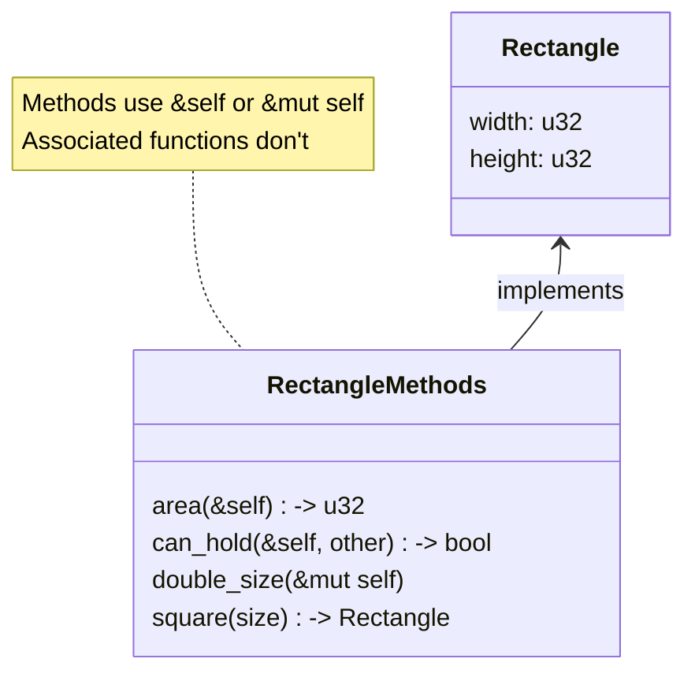

# Rust Struct Methods

## Introduction

In Rust, **struct methods** allow you to associate functions with your struct types. Methods are similar to regular functions but are defined within the context of a struct and can access the struct's data. This organization helps group related functionality together, making your code more modular and easier to understand.

Methods are a key feature that make Rust structs more powerful and enable a style of programming that will feel familiar if you've used object-oriented languages before.

## Defining Methods

To define methods for a struct, we use an `impl` (implementation) block. The `impl` block contains all functions associated with the struct.

### Basic Syntax

```rust
struct Rectangle {
    width: u32,
    height: u32,
}

impl Rectangle {
    // Methods go here
    fn area(&self) -> u32 {
        self.width * self.height
    }
}
```

Let's break down what's happening here:

1. We define a `Rectangle` struct with `width` and `height` fields
2. We create an `impl` block for `Rectangle`
3. Inside the block, we define the `area` method that calculates the rectangle's area

## The `&self` Parameter

The first parameter of a method is always `self` in some form, which represents the instance of the struct the method is being called on:

- `&self` - borrows the instance immutably (most common)
- `&mut self` - borrows the instance mutably
- `self` - takes ownership of the instance (rare)

Using `&self` means we're borrowing the struct instance immutably - we can read its data but not modify it.

### Example: Using Methods

```rust
fn main() {
    let rect = Rectangle {
        width: 30,
        height: 50,
    };
    
    println!("The area of the rectangle is {} square pixels.", rect.area());
}
```

**Output:**
```
The area of the rectangle is 1500 square pixels.
```

Notice how we call the method using dot notation: `rect.area()`. Rust automatically adds the `&self` parameter for us, so we don't need to pass it explicitly.

## Methods with Parameters

Methods can take additional parameters beyond `self`:

```rust
impl Rectangle {
    fn area(&self) -> u32 {
        self.width * self.height
    }
    
    fn can_hold(&self, other: &Rectangle) -> bool {
        self.width > other.width && self.height > other.height
    }
}
```

Here, `can_hold` takes a reference to another `Rectangle` and checks if the current rectangle is large enough to hold it.

### Example: Methods with Parameters

```rust
fn main() {
    let rect1 = Rectangle {
        width: 30,
        height: 50,
    };
    
    let rect2 = Rectangle {
        width: 10,
        height: 40,
    };
    
    let rect3 = Rectangle {
        width: 60,
        height: 45,
    };
    
    println!("Can rect1 hold rect2? {}", rect1.can_hold(&rect2));
    println!("Can rect1 hold rect3? {}", rect1.can_hold(&rect3));
}
```

**Output:**
```
Can rect1 hold rect2? true
Can rect1 hold rect3? false
```

## Methods That Modify Self

If we want a method to modify the struct instance, we need to use `&mut self`:

```rust
impl Rectangle {
    fn double_size(&mut self) {
        self.width *= 2;
        self.height *= 2;
    }
}
```

### Example: Mutable Methods

```rust
fn main() {
    let mut rect = Rectangle {
        width: 30,
        height: 50,
    };
    
    println!("Original dimensions: {}x{}", rect.width, rect.height);
    
    rect.double_size();
    
    println!("New dimensions: {}x{}", rect.width, rect.height);
}
```

**Output:**
```
Original dimensions: 30x50
New dimensions: 60x100
```

Note that we had to declare `rect` as `mut` to use this method, since it modifies the struct fields.

## Associated Functions

Rust structs can also have **associated functions**, which are functions defined within `impl` blocks that don't take `self` as a parameter. These are not methods in the traditional sense but are associated with the struct type rather than an instance of the struct.

Associated functions are often used for constructors:

```rust
impl Rectangle {
    // This is an associated function, not a method
    fn square(size: u32) -> Rectangle {
        Rectangle {
            width: size,
            height: size,
        }
    }
}
```

To call an associated function, we use the struct name with the `::` syntax:

```rust
fn main() {
    let square = Rectangle::square(25);
    println!("Square dimensions: {}x{}", square.width, square.height);
}
```

**Output:**
```
Square dimensions: 25x25
```

Associated functions are particularly useful for creating constructor functions that return new instances of the struct.

## Multiple `impl` Blocks

You can have multiple `impl` blocks for a single struct. This is useful for organizing code or when implementing traits:

```rust
impl Rectangle {
    fn area(&self) -> u32 {
        self.width * self.height
    }
}

impl Rectangle {
    fn perimeter(&self) -> u32 {
        2 * (self.width + self.height)
    }
}
```

Both implementations work exactly the same as if they were in a single `impl` block.

## Real-World Example: Building a Simple Game Character

Let's create a more practical example by implementing a game character with methods:

```rust
struct Character {
    name: String,
    health: u32,
    level: u32,
    experience: u32,
}

impl Character {
    // Constructor
    fn new(name: &str) -> Character {
        Character {
            name: String::from(name),
            health: 100,
            level: 1,
            experience: 0,
        }
    }
    
    // Methods
    fn take_damage(&mut self, damage: u32) {
        if damage >= self.health {
            self.health = 0;
            println!("{} has been defeated!", self.name);
        } else {
            self.health -= damage;
            println!("{} took {} damage. Health: {}", self.name, damage, self.health);
        }
    }
    
    fn heal(&mut self, amount: u32) {
        self.health += amount;
        if self.health > 100 {
            self.health = 100;
        }
        println!("{} healed {} health. Health: {}", self.name, amount, self.health);
    }
    
    fn gain_experience(&mut self, exp: u32) {
        self.experience += exp;
        println!("{} gained {} experience points!", self.name, exp);
        
        // Check for level up
        let exp_needed = self.level * 100;
        if self.experience >= exp_needed {
            self.level_up();
        }
    }
    
    fn level_up(&mut self) {
        self.level += 1;
        self.health = 100;
        println!("{} leveled up! Now level {}!", self.name, self.level);
    }
    
    fn status(&self) {
        println!("Character Status:");
        println!("Name: {}", self.name);
        println!("Level: {}", self.level);
        println!("Health: {}/100", self.health);
        println!("Experience: {}/{}", self.experience, self.level * 100);
    }
}
```

Now let's use this character in a simple game scenario:

```rust
fn main() {
    // Create a new character
    let mut hero = Character::new("Rustacean");
    hero.status();
    
    // Simulate some game actions
    println!("
--- Adventure begins ---");
    hero.take_damage(30);
    hero.gain_experience(50);
    hero.heal(15);
    hero.take_damage(25);
    hero.gain_experience(60);  // This should trigger a level up
    
    println!("
--- Final status ---");
    hero.status();
}
```

**Output:**
```
Character Status:
Name: Rustacean
Level: 1
Health: 100/100
Experience: 0/100

--- Adventure begins ---
Rustacean took 30 damage. Health: 70
Rustacean gained 50 experience points!
Rustacean healed 15 health. Health: 85
Rustacean took 25 damage. Health: 60
Rustacean gained 60 experience points!
Rustacean leveled up! Now level 2!

--- Final status ---
Character Status:
Name: Rustacean
Level: 2
Health: 100/100
Experience: 110/200
```

This example shows how methods can encapsulate behavior and help manage state in a structured way.

## Visualization of Methods and Associated Functions

Here's a diagram illustrating the relationship between structs, methods, and associated functions:



## Summary

Struct methods in Rust allow you to associate functions with your struct types, creating a more organized approach to working with data and behavior. Here's what we've covered:

- Methods are defined in `impl` blocks
- The first parameter is usually `&self`, `&mut self`, or `self`
- Methods can read or modify the struct's data based on the `self` parameter
- Associated functions don't take `self` and are often used as constructors
- Multiple `impl` blocks can be used for organization
- Methods help group related functionality together, making code more maintainable

## Exercises

1. **Basic Calculator**: Create a `Calculator` struct with methods for addition, subtraction, multiplication, and division. Add a method to keep track of calculation history.

2. **Bank Account**: Implement a `BankAccount` struct with methods for deposit, withdrawal, and checking balance. Include validation to prevent overdrawing.

3. **Inventory System**: Create an `Inventory` struct and a `Product` struct. Implement methods to add products, remove products, and check inventory levels.

4. **Enhanced Character**: Extend the game character example by adding inventory items, abilities, and more advanced leveling mechanics.

## Additional Resources

- [Rust Book Chapter on Methods](https://doc.rust-lang.org/book/ch05-03-method-syntax.html)
- [Rust by Example: Methods](https://doc.rust-lang.org/rust-by-example/fn/methods.html)
- [Rust Design Patterns](https://rust-unofficial.github.io/patterns/)

Happy coding with Rust structs and methods!