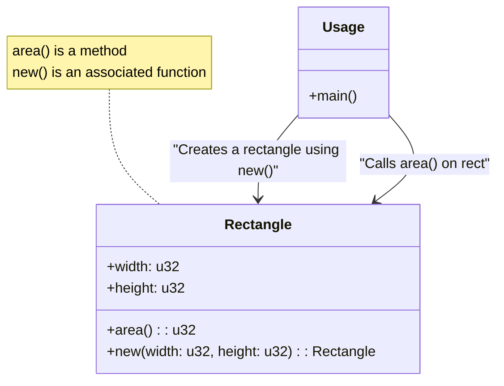

# Rust Associated Functions

## Introduction

In Rust, **associated functions** are functions that are associated with a struct type, rather than with a specific instance of that struct. They're similar to static methods in object-oriented programming languages like Java or C#. Associated functions are defined within an `impl` block, just like methods, but they don't take `self` as their first parameter.

Associated functions are particularly useful for creating constructors and utility functions that logically belong to a type but don't need to operate on a specific instance.

## Basic Syntax

Here's the basic syntax for defining associated functions:

```rust
struct Rectangle {
    width: u32,
    height: u32,
}

impl Rectangle {
    // This is an associated function
    fn new(width: u32, height: u32) -> Rectangle {
        Rectangle { width, height }
    }
    
    // This is a method (not an associated function)
    fn area(&self) -> u32 {
        self.width * self.height
    }
}
```

The key difference is:
- Associated functions don't take `self` as a parameter
- Methods take `self`, `&self`, or `&mut self` as their first parameter

## Calling Associated Functions

To call an associated function, you use the struct name followed by the `::` syntax, like this:

```rust
fn main() {
    // Using the associated function to create a new Rectangle
    let rect = Rectangle::new(10, 5);
    
    // Now we can call methods on our instance
    println!("Area: {}", rect.area());
}
```

**Output:**
```
Area: 50
```

## Common Use Cases

### 1. Constructors

The most common use for associated functions is to implement constructors. Rust doesn't have built-in constructors like some languages, but the convention is to create an associated function named `new`:

```rust
struct Point {
    x: f64,
    y: f64,
}

impl Point {
    // Basic constructor
    fn new(x: f64, y: f64) -> Point {
        Point { x, y }
    }
    
    // Constructor with default values
    fn origin() -> Point {
        Point { x: 0.0, y: 0.0 }
    }
    
    // Constructor from polar coordinates
    fn from_polar(radius: f64, angle: f64) -> Point {
        Point {
            x: radius * angle.cos(),
            y: radius * angle.sin(),
        }
    }
}

fn main() {
    let p1 = Point::new(3.0, 4.0);
    let p2 = Point::origin();
    let p3 = Point::from_polar(5.0, 0.5);
    
    println!("p1: ({}, {})", p1.x, p1.y);
    println!("p2: ({}, {})", p2.x, p2.y);
    println!("p3: ({}, {})", p3.x, p3.y);
}
```

**Output:**
```
p1: (3, 4)
p2: (0, 0)
p3: (4.387912809451864, 2.397076226373619)
```

### 2. Utility Functions

Associated functions can also be used to provide utility functions that are related to the type:

```rust
struct Vec2D {
    x: f64,
    y: f64,
}

impl Vec2D {
    fn new(x: f64, y: f64) -> Vec2D {
        Vec2D { x, y }
    }
    
    // Instance method - calculates length of this vector
    fn length(&self) -> f64 {
        (self.x * self.x + self.y * self.y).sqrt()
    }
    
    // Associated function - calculates distance between two points
    fn distance(a: &Vec2D, b: &Vec2D) -> f64 {
        let dx = a.x - b.x;
        let dy = a.y - b.y;
        (dx * dx + dy * dy).sqrt()
    }
}

fn main() {
    let v1 = Vec2D::new(1.0, 2.0);
    let v2 = Vec2D::new(4.0, 6.0);
    
    println!("Length of v1: {}", v1.length());
    println!("Distance between v1 and v2: {}", Vec2D::distance(&v1, &v2));
}
```

**Output:**
```
Length of v1: 2.23606797749979
Distance between v1 and v2: 5.0
```

## Real-World Example: A Simple String Builder

Here's a more practical example that shows how associated functions can be used to create a simple string builder:

```rust
struct StringBuilder {
    content: String,
}

impl StringBuilder {
    // Associated function to create a new StringBuilder
    fn new() -> StringBuilder {
        StringBuilder {
            content: String::new(),
        }
    }
    
    // Associated function to create from existing string
    fn from_string(s: &str) -> StringBuilder {
        StringBuilder {
            content: s.to_string(),
        }
    }
    
    // Method to append string
    fn append(&mut self, s: &str) -> &mut Self {
        self.content.push_str(s);
        self
    }
    
    // Method to append line
    fn append_line(&mut self, s: &str) -> &mut Self {
        self.content.push_str(s);
        self.content.push('
');
        self
    }
    
    // Method to get the final string
    fn to_string(&self) -> &str {
        &self.content
    }
}

fn main() {
    // Using associated function to create a new StringBuilder
    let mut sb = StringBuilder::new();
    
    // Using methods to build a string
    sb.append("Hello, ")
      .append("World!")
      .append_line("")
      .append_line("This is a simple example")
      .append("of a string builder in Rust.");
    
    // Print the result
    println!("Result:
{}", sb.to_string());
    
    // Using another associated function
    let mut sb2 = StringBuilder::from_string("Starting with content. ");
    sb2.append("More content added.");
    println!("
Second example:
{}", sb2.to_string());
}
```

**Output:**
```
Result:
Hello, World!
This is a simple example
of a string builder in Rust.

Second example:
Starting with content. More content added.
```

## Visualization: Methods vs. Associated Functions

Here's a diagram showing the difference between methods and associated functions:



## When to Use Associated Functions vs. Methods

| Associated Functions             | Methods                            |
|----------------------------------|------------------------------------|
| Don't operate on an instance     | Operate on an instance (`self`)    |
| Used for constructors            | Used for behaviors of instances    |
| Called with `Type::function()`   | Called with `instance.method()`    |
| Similar to static methods in OOP | Similar to instance methods in OOP |

## Summary

Associated functions in Rust are powerful tools that allow you to define functions that belong to a struct type rather than to a specific instance. They are especially useful for:

1. Creating constructors (conventionally named `new`)
2. Providing utility functions related to the type
3. Implementing factory methods that create instances in different ways

The key distinguishing feature is that associated functions don't take `self` as a parameter, and they're called using the `::` syntax instead of the `.` syntax used for methods.

By using associated functions appropriately, you can make your Rust code more organized, readable, and expressive.

## Exercises

1. Create a `Circle` struct with fields for radius and center coordinates. Implement:
   - An associated function `new` that creates a circle at a given position with a specified radius
   - An associated function `unit` that creates a unit circle at the origin
   - A method `area` that calculates the circle's area

2. Extend the `Vec2D` struct from our examples with:
   - An associated function `zero` that creates a zero vector
   - An associated function `dot_product` that calculates the dot product of two vectors
   - A method `normalize` that returns a new normalized vector

3. Create a `Temperature` struct that can:
   - Be created from Celsius, Fahrenheit, or Kelvin via associated functions
   - Convert between different units via methods

## Additional Resources

- [Rust Book: Methods](https://doc.rust-lang.org/book/ch05-03-method-syntax.html)
- [Rust by Example: Methods](https://doc.rust-lang.org/rust-by-example/fn/methods.html)
- [Rust Reference: Associated Items](https://doc.rust-lang.org/reference/items/associated-items.html)