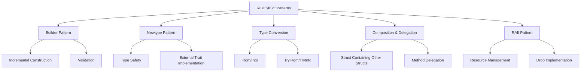

# Rust Struct Patterns

## Introduction

Structs are one of Rust's most powerful features for organizing and managing data. While understanding the basic syntax of structs is important, knowing common patterns and best practices for using them effectively is equally valuable. In this tutorial, we'll explore various struct patterns in Rust that will help you write more elegant, maintainable, and idiomatic code.

## Builder Pattern

One common challenge when working with structs that have many fields is initialization. The Builder pattern provides a clean solution by allowing incremental construction of complex structs.

### Basic Implementation

```rust
#[derive(Debug)]
struct User {
    username: String,
    email: String,
    sign_in_count: u64,
    active: bool,
    preferences: Option<UserPreferences>,
}

#[derive(Debug)]
struct UserPreferences {
    theme: String,
    notifications_enabled: bool,
}

#[derive(Default)]
struct UserBuilder {
    username: Option<String>,
    email: Option<String>,
    sign_in_count: u64,
    active: bool,
    preferences: Option<UserPreferences>,
}

impl UserBuilder {
    fn new() -> Self {
        UserBuilder {
            username: None,
            email: None,
            sign_in_count: 0,
            active: false,
            preferences: None,
        }
    }

    fn username(mut self, username: String) -> Self {
        self.username = Some(username);
        self
    }

    fn email(mut self, email: String) -> Self {
        self.email = Some(email);
        self
    }

    fn sign_in_count(mut self, count: u64) -> Self {
        self.sign_in_count = count;
        self
    }

    fn active(mut self, active: bool) -> Self {
        self.active = active;
        self
    }

    fn preferences(mut self, preferences: UserPreferences) -> Self {
        self.preferences = Some(preferences);
        self
    }

    fn build(self) -> Result<User, &'static str> {
        let username = self.username.ok_or("Username is required")?;
        let email = self.email.ok_or("Email is required")?;

        Ok(User {
            username,
            email,
            sign_in_count: self.sign_in_count,
            active: self.active,
            preferences: self.preferences,
        })
    }
}

fn main() {
    // Creating a user with the builder pattern
    let user = UserBuilder::new()
        .username(String::from("johndoe"))
        .email(String::from("john@example.com"))
        .active(true)
        .build();

    match user {
        Ok(user) => println!("User created successfully: {:?}", user),
        Err(e) => println!("Error creating user: {}", e),
    }
}
```

**Output:**
```
User created successfully: User { username: "johndoe", email: "john@example.com", sign_in_count: 0, active: true, preferences: None }
```

### Benefits of the Builder Pattern

- **Optional fields** handled cleanly
- **Method chaining** makes code more readable
- **Validation** can be performed before creating the final struct
- **Default values** are easy to implement

## Newtype Pattern

The Newtype pattern involves creating a new type by wrapping a single field in a tuple struct. This pattern is useful for:

1. Adding type safety
2. Implementing traits on types that you don't own
3. Hiding implementation details

### Example: Type Safety with Newtype

```rust
// Define wrapper types for different kinds of IDs
struct UserId(u64);
struct ProductId(u64);

fn process_user(user_id: UserId) {
    println!("Processing user with ID: {}", user_id.0);
}

fn process_product(product_id: ProductId) {
    println!("Processing product with ID: {}", product_id.0);
}

fn main() {
    let user_id = UserId(123);
    let product_id = ProductId(456);

    process_user(user_id);
    // This would cause a compilation error:
    // process_user(product_id);
    
    process_product(product_id);
}
```

**Output:**
```
Processing user with ID: 123
Processing product with ID: 456
```

### Implementing External Traits

```rust
use std::fmt;

struct Meters(f64);

impl fmt::Display for Meters {
    fn fmt(&self, f: &mut fmt::Formatter) -> fmt::Result {
        write!(f, "{} m", self.0)
    }
}

fn main() {
    let height = Meters(1.85);
    println!("My height is {}", height);
}
```

**Output:**
```
My height is 1.85 m
```

## Type Conversion Patterns

Rust provides several ways to convert between struct types.

### Using `From` and `Into` Traits

```rust
#[derive(Debug)]
struct Point2D {
    x: f64,
    y: f64,
}

#[derive(Debug)]
struct Point3D {
    x: f64,
    y: f64,
    z: f64,
}

impl From<Point2D> for Point3D {
    fn from(point: Point2D) -> Self {
        Point3D {
            x: point.x,
            y: point.y,
            z: 0.0,
        }
    }
}

fn main() {
    let point2d = Point2D { x: 1.0, y: 2.0 };
    
    // Using From
    let point3d_from = Point3D::from(point2d);
    println!("Using From: {:?}", point3d_from);
    
    // Create a new 2D point
    let another_point2d = Point2D { x: 3.0, y: 4.0 };
    
    // Using Into (automatically implemented when From is implemented)
    let point3d_into: Point3D = another_point2d.into();
    println!("Using Into: {:?}", point3d_into);
}
```

**Output:**
```
Using From: Point3D { x: 1.0, y: 2.0, z: 0.0 }
Using Into: Point3D { x: 3.0, y: 4.0, z: 0.0 }
```

## Struct Composition and Delegation

Composition is a powerful way to build complex structs from simpler ones.

```rust
struct Engine {
    horsepower: u32,
    electric: bool,
}

impl Engine {
    fn new(horsepower: u32, electric: bool) -> Self {
        Engine { horsepower, electric }
    }
    
    fn start(&self) -> String {
        if self.electric {
            String::from("Humming...")
        } else {
            String::from("Vroom!")
        }
    }
}

struct Car {
    make: String,
    model: String,
    year: u32,
    engine: Engine,
}

impl Car {
    fn new(make: String, model: String, year: u32, engine: Engine) -> Self {
        Car { make, model, year, engine }
    }
    
    // Delegating to the engine
    fn start(&self) -> String {
        format!("{} {} starts: {}", self.make, self.model, self.engine.start())
    }
}

fn main() {
    let electric_engine = Engine::new(240, true);
    let gas_engine = Engine::new(180, false);
    
    let tesla = Car::new(
        String::from("Tesla"),
        String::from("Model 3"),
        2023,
        electric_engine
    );
    
    let honda = Car::new(
        String::from("Honda"),
        String::from("Civic"),
        2022,
        gas_engine
    );
    
    println!("{}", tesla.start());
    println!("{}", honda.start());
}
```

**Output:**
```
Tesla Model 3 starts: Humming...
Honda Civic starts: Vroom!
```

## RAII Pattern (Resource Acquisition Is Initialization)

In Rust, the RAII pattern is commonly used to manage resources through structs.

```rust
struct DatabaseConnection {
    connection_string: String,
    connected: bool,
}

impl DatabaseConnection {
    fn new(connection_string: String) -> Self {
        println!("Creating a new database connection...");
        DatabaseConnection {
            connection_string,
            connected: false,
        }
    }
    
    fn connect(&mut self) {
        println!("Connecting to database at {}...", self.connection_string);
        // In a real implementation, this would actually connect to a database
        self.connected = true;
    }
}

impl Drop for DatabaseConnection {
    fn drop(&mut self) {
        if self.connected {
            println!("Closing database connection...");
            // Clean up code would go here
        }
    }
}

fn main() {
    {
        let mut db = DatabaseConnection::new(String::from("postgres://localhost/mydb"));
        db.connect();
        println!("Doing work with the database...");
        // When db goes out of scope, its Drop implementation will be called
    }
    
    println!("After database work");
}
```

**Output:**
```
Creating a new database connection...
Connecting to database at postgres://localhost/mydb...
Doing work with the database...
Closing database connection...
After database work
```

## Struct Patterns Visualization

Here's a visual representation of how these patterns relate:



## Enum and Struct Combinations

Enums and structs often work together to create powerful data structures:

```rust
enum Shape {
    Circle(Circle),
    Rectangle(Rectangle),
}

struct Circle {
    radius: f64,
}

struct Rectangle {
    width: f64,
    height: f64,
}

trait Area {
    fn area(&self) -> f64;
}

impl Area for Circle {
    fn area(&self) -> f64 {
        std::f64::consts::PI * self.radius * self.radius
    }
}

impl Area for Rectangle {
    fn area(&self) -> f64 {
        self.width * self.height
    }
}

impl Area for Shape {
    fn area(&self) -> f64 {
        match self {
            Shape::Circle(circle) => circle.area(),
            Shape::Rectangle(rectangle) => rectangle.area(),
        }
    }
}

fn main() {
    let shapes = vec![
        Shape::Circle(Circle { radius: 2.0 }),
        Shape::Rectangle(Rectangle { width: 3.0, height: 4.0 }),
    ];
    
    for (i, shape) in shapes.iter().enumerate() {
        println!("Area of shape {}: {}", i + 1, shape.area());
    }
}
```

**Output:**
```
Area of shape 1: 12.566370614359172
Area of shape 2: 12
```

## Summary

In this tutorial, we've explored several common struct patterns in Rust:

1. **Builder Pattern**: For incremental construction of complex structs
2. **Newtype Pattern**: For type safety and external trait implementation
3. **Type Conversion Patterns**: Using From/Into for transforming between struct types
4. **Composition and Delegation**: Building complex structures from simpler ones
5. **RAII Pattern**: Managing resources with structs
6. **Enum and Struct Combinations**: Creating flexible type hierarchies

By applying these patterns in your Rust code, you'll be able to create more maintainable, type-safe, and idiomatic applications.

## Exercises

1. **Builder Exercise**: Implement a builder pattern for a `Computer` struct with fields for CPU, RAM, storage, and graphics card.
2. **Newtype Exercise**: Create a newtype for an email address with validation.
3. **Conversion Exercise**: Implement `From` and `Into` traits for converting between Celsius and Fahrenheit temperature structs.
4. **Composition Exercise**: Create a `Library` struct that contains a collection of `Book` structs, with methods for adding and removing books.

## Additional Resources

- [The Rust Programming Language Book - Chapter on Structs](https://doc.rust-lang.org/book/ch05-00-structs.html)
- [Rust Design Patterns - Official Repository](https://rust-unofficial.github.io/patterns/)
- [Effective Rust: Builder Pattern](https://www.lurklurk.org/effective-rust/builders.html)
- [Rust By Example - Conversion traits](https://doc.rust-lang.org/rust-by-example/conversion.html)