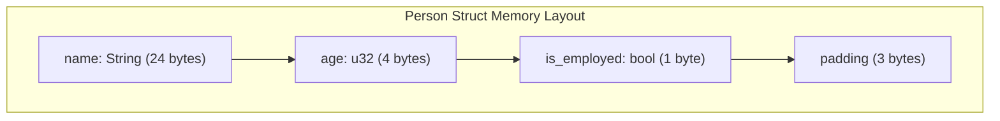

# Rust Struct Memory Layout

## Introduction

When you create a struct in Rust, your data doesn't just exist as abstract concepts—it must be stored somewhere in your computer's memory. How Rust organizes this memory can affect your program's performance, especially when working with large datasets or performance-critical applications. 

In this guide, we'll explore how Rust lays out structs in memory, covering important concepts like alignment, padding, and techniques for optimizing your struct definitions. Understanding these concepts will help you write more efficient Rust code and give you deeper insight into how the language works under the hood.

## Memory Basics

Before diving into struct layout, let's quickly refresh some memory fundamentals:

- **Memory Address**: A unique identifier that specifies a location in memory
- **Byte**: The smallest addressable unit of memory (8 bits)
- **Alignment**: A memory address constraint that requires data to be placed at addresses divisible by specific values

## Default Struct Memory Layout in Rust

By default, Rust arranges fields in a struct in the order they are declared. Let's look at a simple example:

```rust
struct Person {
    name: String,
    age: u32,
    is_employed: bool,
}

fn main() {
    let employee = Person {
        name: String::from("Alice"),
        age: 30,
        is_employed: true,
    };
    
    println!("Size of Person: {} bytes", std::mem::size_of::<Person>());
}
```

Output:
```
Size of Person: 32 bytes
```

You might wonder, "Why 32 bytes?" Let's break it down:
- `String` is 24 bytes (it's a fat pointer containing a pointer to the data, the length, and the capacity)
- `u32` is 4 bytes
- `bool` is 1 byte

That adds up to 29 bytes, but we got 32. Why? This is where **memory alignment** comes in.

## Memory Alignment and Padding

Modern CPUs don't access memory one byte at a time—they typically read and write data in chunks (like 4 or 8 bytes). For optimal performance, data types should be aligned to addresses divisible by their size:

- An `i32` (4 bytes) should be at an address divisible by 4
- An `i64` (8 bytes) should be at an address divisible by 8

Rust adds padding (extra unused bytes) between fields to maintain proper alignment. Let's visualize this with a diagram:



The 3 bytes of padding after the boolean ensure that the overall struct size is properly aligned (to 8 bytes in this case).

Let's see another example with different field types:

```rust
struct Measurement {
    byte_value: u8,      // 1 byte
    // 3 bytes padding here
    integer_value: u32,  // 4 bytes
    float_value: f32,    // 4 bytes
}

fn main() {
    println!("Size of Measurement: {} bytes", std::mem::size_of::<Measurement>());
    println!("Offset of byte_value: {} bytes", std::mem::offset_of!(Measurement, byte_value));
    println!("Offset of integer_value: {} bytes", std::mem::offset_of!(Measurement, integer_value));
    println!("Offset of float_value: {} bytes", std::mem::offset_of!(Measurement, float_value));
}
```

Output:
```
Size of Measurement: 12 bytes
Offset of byte_value: 0 bytes
Offset of integer_value: 4 bytes
Offset of float_value: 8 bytes
```

Note: To use the `offset_of!` macro, you'll need to add `#[feature(offset_of)]` at the top of your file and use the nightly compiler, or use the `memoffset` crate.

## Field Reordering for Optimization

The order of fields in your struct can significantly impact memory usage due to padding. Here's a simple rule of thumb: **declare fields in decreasing order of size** to minimize wasted space.

Let's compare two struct definitions:

```rust
// Inefficient ordering
struct Inefficient {
    a: u8,
    b: u64,
    c: u16,
    d: u32,
}

// Efficient ordering
struct Efficient {
    b: u64,
    d: u32,
    c: u16,
    a: u8,
}

fn main() {
    println!("Size of Inefficient: {} bytes", std::mem::size_of::<Inefficient>());
    println!("Size of Efficient: {} bytes", std::mem::size_of::<Efficient>());
}
```

Output:
```
Size of Inefficient: 24 bytes
Size of Efficient: 16 bytes
```

By reordering fields from largest to smallest, we've saved 8 bytes of memory per struct instance!

## Controlling Memory Layout with Attributes

### `#[repr(C)]`

By default, Rust doesn't guarantee field order for optimization reasons. If you need a specific memory layout (e.g., for FFI with C code), you can use the `#[repr(C)]` attribute:

```rust
#[repr(C)]
struct CCompatible {
    a: u8,
    b: u64,
    c: u16,
}

fn main() {
    println!("Size of CCompatible: {} bytes", std::mem::size_of::<CCompatible>());
}
```

This ensures the fields are laid out in exactly the order specified, following C's layout rules.

### `#[repr(packed)]`

If you want to eliminate padding completely (at the cost of performance), you can use `#[repr(packed)]`:

```rust
#[repr(packed)]
struct PackedData {
    a: u8,
    b: u64,
    c: u16,
}

fn main() {
    println!("Size of PackedData: {} bytes", std::mem::size_of::<PackedData>());
}
```

Output:
```
Size of PackedData: 11 bytes
```

**Warning**: Packed structs can cause unaligned memory access, which might be significantly slower or even cause crashes on some architectures. Use only when necessary!

### Combining Representations

You can combine attributes for more control:

```rust
#[repr(C, packed(2))]
struct CustomLayout {
    a: u8,
    b: u64,
    c: u16,
}
```

This uses C-compatible layout but with 2-byte alignment.

## Nested Structs

Memory layout works recursively for nested structs:

```rust
struct Point {
    x: f32,
    y: f32,
}

struct Rectangle {
    top_left: Point,
    bottom_right: Point,
}

fn main() {
    println!("Size of Point: {} bytes", std::mem::size_of::<Point>());
    println!("Size of Rectangle: {} bytes", std::mem::size_of::<Rectangle>());
}
```

Output:
```
Size of Point: 8 bytes
Size of Rectangle: 16 bytes
```

The layout of `Rectangle` includes the layout of both `Point` instances.

## Practical Applications

### Optimizing Cache Performance

Modern CPUs use caches to speed up memory access. Structs that fit within a single cache line (typically 64 bytes) can be accessed more efficiently:

```rust
// Cache-friendly struct for a simple particle system
struct Particle {
    position: [f32; 3],  // 12 bytes
    velocity: [f32; 3],  // 12 bytes
    mass: f32,           // 4 bytes
    lifetime: f32,       // 4 bytes
}

fn main() {
    println!("Size of Particle: {} bytes", std::mem::size_of::<Particle>());
    let particles = vec![Particle {
        position: [0.0, 0.0, 0.0],
        velocity: [0.0, 0.0, 0.0],
        mass: 1.0,
        lifetime: 10.0,
    }; 1000];
    
    // Process particles (cache-friendly access pattern)
    for particle in &particles {
        // Processing code would go here
    }
}
```

### Data-Oriented Design

When working with large collections, consider organizing data in a structure-of-arrays pattern instead of an array-of-structures:

```rust
// Array of structures (AoS)
struct GameObject {
    position: [f32; 3],
    velocity: [f32; 3],
    health: f32,
    name: String,
    // ... many more fields
}

// Structure of arrays (SoA)
struct GameWorld {
    positions: Vec<[f32; 3]>,
    velocities: Vec<[f32; 3]>,
    healths: Vec<f32>,
    names: Vec<String>,
    // ... same fields, but as separate collections
}
```

The SoA approach can improve cache efficiency when you only need to process certain fields at a time.

## Memory Layout Analysis Tools

Rust provides several ways to inspect struct memory layout:

### `std::mem` Functions

```rust
fn main() {
    println!("Size: {}", std::mem::size_of::<MyStruct>());
    println!("Alignment: {}", std::mem::align_of::<MyStruct>());
}
```

### External Tools

- The `rustc-demangle` tool can help understand name mangling
- `cargo-inspect` crate provides visualization of Rust type layouts

## Summary

Understanding struct memory layout in Rust allows you to:

1. **Optimize memory usage** by ordering fields efficiently
2. **Improve performance** by aligning data properly for CPU access
3. **Interface with other languages** using representation attributes
4. **Debug memory-related issues** more effectively

While Rust abstracts away many memory details, knowing how your data is laid out gives you finer control over your program's efficiency, especially in performance-critical applications.

## Exercises

1. Create a struct with mixed field types and predict its size before using `std::mem::size_of`.
2. Rearrange the fields in a struct to reduce its memory footprint.
3. Create a struct that needs to be compatible with a C API using appropriate attributes.
4. Design a cache-friendly data structure for a game with thousands of entities.

## Additional Resources

- [Rust Reference: Type Layout](https://doc.rust-lang.org/reference/type-layout.html)
- [Rust Performance Book](https://nnethercote.github.io/perf-book/)
- [The `memoffset` crate](https://crates.io/crates/memoffset) for calculating field offsets
- ["Systems Performance" by Brendan Gregg](https://www.brendangregg.com/systems-performance-2nd-edition-book.html) for deeper understanding of hardware interactions