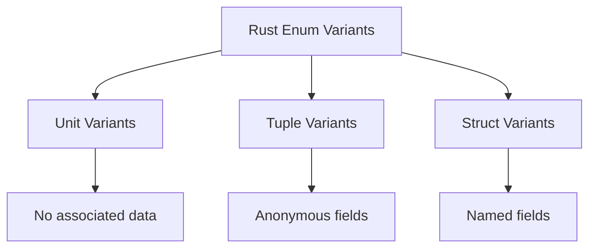

# Rust Enum Variants

## Introduction

Enumerations (or enums) are one of Rust's most powerful features, allowing you to define a type that can be one of several variants. While the basic concept of enums exists in many programming languages, Rust's implementation is particularly rich and flexible. In this tutorial, we'll explore the different types of enum variants in Rust and how they can be used effectively in your code.

After completing this tutorial, you'll understand:
- Unit variants (simple enums)
- Tuple variants (enums with anonymous fields)
- Struct variants (enums with named fields)
- How to use each variant type appropriately
- Patterns for working with different variant types

## Basic Enum Concepts

Before diving into variants, let's quickly review what enums are in Rust:

```rust
enum Direction {
    North,
    East,
    South,
    West,
}

fn main() {
    let heading = Direction::North;
    
    match heading {
        Direction::North => println!("Heading north!"),
        Direction::East => println!("Heading east!"),
        Direction::South => println!("Heading south!"),
        Direction::West => println!("Heading west!"),
    }
}
```

Output:
```
Heading north!
```

This simple enum defines a type called `Direction` that can be exactly one of four possible values. Each possible value (North, East, etc.) is called a variant.

## Types of Enum Variants

Rust offers three distinct styles of enum variants, each with different capabilities and use cases:



Let's explore each one in detail.

## 1. Unit Variants

Unit variants are the simplest form of enum variants. They don't contain any data - they're just names.

```rust
enum ServerStatus {
    Online,
    Offline,
    Maintenance,
}

fn check_server(status: ServerStatus) {
    match status {
        ServerStatus::Online => println!("Server is up and running"),
        ServerStatus::Offline => println!("Server is down"),
        ServerStatus::Maintenance => println!("Server is under maintenance"),
    }
}

fn main() {
    let status = ServerStatus::Maintenance;
    check_server(status);
}
```

Output:
```
Server is under maintenance
```

**When to use unit variants:**
- When you need to represent distinct states without additional data
- For simple flags or status indicators
- When working with patterns similar to traditional C-style enums

## 2. Tuple Variants

Tuple variants allow you to associate data with each enum variant. The data is stored in an anonymous tuple-like structure.

```rust
enum NetworkPacket {
    Connect(String, u16),  // Host, port
    Disconnect(u32),       // Connection ID
    Data(Vec<u8>),         // Raw data
    Ping,                  // No associated data (unit variant)
}

fn process_packet(packet: NetworkPacket) {
    match packet {
        NetworkPacket::Connect(host, port) => {
            println!("Connecting to {}:{}", host, port);
        }
        NetworkPacket::Disconnect(id) => {
            println!("Disconnecting connection {}", id);
        }
        NetworkPacket::Data(bytes) => {
            println!("Received {} bytes of data", bytes.len());
        }
        NetworkPacket::Ping => {
            println!("Received ping, sending pong...");
        }
    }
}

fn main() {
    let packet1 = NetworkPacket::Connect(String::from("example.com"), 8080);
    let packet2 = NetworkPacket::Data(vec![1, 2, 3, 4, 5]);
    
    process_packet(packet1);
    process_packet(packet2);
}
```

Output:
```
Connecting to example.com:8080
Received 5 bytes of data
```

**When to use tuple variants:**
- When you need to associate simple data with variants
- When field names are not necessary or would be redundant
- For lightweight data structures where the meaning of each field is obvious from context

## 3. Struct Variants

Struct variants are similar to tuple variants, but allow you to name each field. This creates more self-documenting code and can be easier to work with in larger codebases.

```rust
enum Shape {
    Circle {
        radius: f64,
        center_x: f64,
        center_y: f64,
    },
    Rectangle {
        width: f64,
        height: f64,
        x: f64,
        y: f64,
    },
    Triangle {
        x1: f64, y1: f64,
        x2: f64, y2: f64,
        x3: f64, y3: f64,
    },
}

fn calculate_area(shape: &Shape) -> f64 {
    match shape {
        Shape::Circle { radius, .. } => {
            std::f64::consts::PI * radius * radius
        }
        Shape::Rectangle { width, height, .. } => {
            width * height
        }
        Shape::Triangle { x1, y1, x2, y2, x3, y3 } => {
            // Area using the Shoelace formula
            0.5 * ((x1 * (y2 - y3) + x2 * (y3 - y1) + x3 * (y1 - y2))).abs()
        }
    }
}

fn main() {
    let shapes = [
        Shape::Circle { radius: 5.0, center_x: 0.0, center_y: 0.0 },
        Shape::Rectangle { width: 10.0, height: 5.0, x: 0.0, y: 0.0 },
        Shape::Triangle { 
            x1: 0.0, y1: 0.0, 
            x2: 1.0, y2: 0.0, 
            x3: 0.0, y3: 1.0 
        },
    ];
    
    for (i, shape) in shapes.iter().enumerate() {
        println!("Area of shape {}: {:.2}", i + 1, calculate_area(shape));
    }
}
```

Output:
```
Area of shape 1: 78.54
Area of shape 2: 50.00
Area of shape 3: 0.50
```

**When to use struct variants:**
- When you have multiple fields that need clear names
- For complex data structures where field context is important
- When you want self-documenting code
- When you might need to extract specific fields without getting all data

## Mixing Variant Types

One of the powerful features of Rust enums is that you can mix different variant types within the same enum:

```rust
enum Message {
    Quit,                              // Unit variant
    Move { x: i32, y: i32 },           // Struct variant
    Write(String),                     // Tuple variant with one element
    ChangeColor(u8, u8, u8),           // Tuple variant with three elements
}

fn process_message(msg: Message) {
    match msg {
        Message::Quit => {
            println!("Quitting application");
        }
        Message::Move { x, y } => {
            println!("Moving to position: ({}, {})", x, y);
        }
        Message::Write(text) => {
            println!("Text message: {}", text);
        }
        Message::ChangeColor(r, g, b) => {
            println!("Changing color to RGB: ({}, {}, {})", r, g, b);
        }
    }
}

fn main() {
    let messages = [
        Message::Quit,
        Message::Move { x: 10, y: 15 },
        Message::Write(String::from("Hello, Rust!")),
        Message::ChangeColor(255, 128, 0),
    ];
    
    for msg in messages {
        process_message(msg);
    }
}
```

Output:
```
Quitting application
Moving to position: (10, 15)
Text message: Hello, Rust!
Changing color to RGB: (255, 128, 0)
```

## Real-World Example: Result Type

Rust's standard library makes extensive use of enums. One of the most commonly used is the `Result` type, which is defined as:

```rust
enum Result<T, E> {
    Ok(T),
    Err(E),
}
```

This is a generic enum with two tuple variants. Let's see it in action with file handling:

```rust
use std::fs::File;
use std::io::{self, Read};

fn read_file_contents(path: &str) -> Result<String, io::Error> {
    let mut file = match File::open(path) {
        Ok(file) => file,
        Err(error) => return Err(error),
    };
    
    let mut contents = String::new();
    match file.read_to_string(&mut contents) {
        Ok(_) => Ok(contents),
        Err(error) => Err(error),
    }
}

fn main() {
    let filename = "example.txt";
    
    match read_file_contents(filename) {
        Ok(contents) => {
            println!("File contents:
{}", contents);
        }
        Err(error) => {
            println!("Error reading file: {}", error);
        }
    }
}
```

Output (if file doesn't exist):
```
Error reading file: No such file or directory (os error 2)
```

## Another Real-World Example: JSON Representation

Enums are perfect for representing JSON data, which can take many forms:

```rust
enum JsonValue {
    Null,
    Boolean(bool),
    Number(f64),
    String(String),
    Array(Vec<JsonValue>),
    Object(std::collections::HashMap<String, JsonValue>),
}

fn describe_json(value: &JsonValue, indent: usize) {
    let indent_str = " ".repeat(indent);
    
    match value {
        JsonValue::Null => println!("{}Null value", indent_str),
        JsonValue::Boolean(b) => println!("{}Boolean: {}", indent_str, b),
        JsonValue::Number(n) => println!("{}Number: {}", indent_str, n),
        JsonValue::String(s) => println!("{}String: \"{}\"", indent_str, s),
        JsonValue::Array(items) => {
            println!("{}Array with {} items:", indent_str, items.len());
            for (i, item) in items.iter().enumerate() {
                print!("{}- Item {}: ", indent_str, i);
                describe_json(item, indent + 2);
            }
        }
        JsonValue::Object(map) => {
            println!("{}Object with {} properties:", indent_str, map.len());
            for (key, value) in map {
                print!("{}- {}: ", indent_str, key);
                describe_json(value, indent + 2);
            }
        }
    }
}

fn main() {
    use std::collections::HashMap;
    
    // Create a complex JSON structure
    let mut user = HashMap::new();
    user.insert("name".to_string(), JsonValue::String("John Doe".to_string()));
    user.insert("age".to_string(), JsonValue::Number(30.0));
    user.insert("is_active".to_string(), JsonValue::Boolean(true));
    
    let mut address = HashMap::new();
    address.insert("street".to_string(), JsonValue::String("123 Main St".to_string()));
    address.insert("city".to_string(), JsonValue::String("Springfield".to_string()));
    
    user.insert("address".to_string(), JsonValue::Object(address));
    
    let hobbies = vec![
        JsonValue::String("coding".to_string()),
        JsonValue::String("reading".to_string()),
        JsonValue::String("hiking".to_string()),
    ];
    
    user.insert("hobbies".to_string(), JsonValue::Array(hobbies));
    
    let json = JsonValue::Object(user);
    
    describe_json(&json, 0);
}
```

Output:
```
Object with 5 properties:
- name: String: "John Doe"
- age: Number: 30
- is_active: Boolean: true
- address: Object with 2 properties:
  - street: String: "123 Main St"
  - city: String: "Springfield"
- hobbies: Array with 3 items:
  - Item 0: String: "coding"
  - Item 1: String: "reading"
  - Item 2: String: "hiking"
```

## Best Practices for Enum Variants

1. **Choose the appropriate variant type for your needs:**
   - Use unit variants for simple states with no data
   - Use tuple variants for simple, anonymous data
   - Use struct variants when field names add clarity

2. **Match exhaustively:**
   - Rust requires matches to be exhaustive (covering all variants)
   - Use the `_` wildcard to catch any unhandled cases if necessary
   - Consider using `if let` for simple cases where you only care about one variant

3. **Use pattern matching effectively:**
   - Destructure tuple and struct variants in match arms
   - Use `..` to ignore fields you don't need
   - Combine patterns with guards for more complex conditions

4. **Consider visibility:**
   - Enum variants inherit the visibility of the enum
   - If you need more control, consider using modules

## Summary

Rust's enum variants provide a powerful way to express different types of data and state within a single type. The three types of variants (unit, tuple, and struct) each have their own strengths and use cases:

- **Unit variants** are ideal for simple state representation without associated data
- **Tuple variants** allow you to associate anonymous data with each variant
- **Struct variants** provide named fields for clearer, more self-documenting code

By understanding and properly utilizing these variant types, you can write more expressive, type-safe Rust code that effectively models your domain.

## Exercises

1. Create an enum `Calculator` with variants for different operations (Add, Subtract, Multiply, Divide) using appropriate variant types.

2. Implement a function `evaluate` that takes a `Calculator` variant and returns the result of the operation.

3. Create an enum `LogEntry` with different types of log messages (Info, Warning, Error) where:
   - Info just has a message
   - Warning has a message and warning code
   - Error has a message, error code, and file location

4. Write a `Vehicle` enum with different types (Car, Motorcycle, Bicycle) where each has appropriate properties (e.g., cars have doors, motorcycles have engine size).

5. Create a `Command` enum for a text editor with commands like Insert, Delete, Copy, and Paste, each with appropriate data.

## Additional Resources

- [Rust Book: Enums and Pattern Matching](https://doc.rust-lang.org/book/ch06-00-enums.html)
- [Rust by Example: Enums](https://doc.rust-lang.org/rust-by-example/custom_types/enum.html)
- [Enum standard library documentation](https://doc.rust-lang.org/std/keyword.enum.html)
- [The Little Book of Rust Macros (covers enum manipulation)](https://veykril.github.io/tlborm/introduction.html)