# Rust Option Enum

## Introduction

In many programming languages, when a value might be absent, we often use `null` or `nil`. However, these can lead to runtime errors if not handled properly. Rust takes a different approach with the `Option` enum - a powerful tool that forces developers to explicitly handle both the presence and absence of values, eliminating an entire class of bugs before your code even runs.

The `Option` enum is one of Rust's most commonly used types and understanding it is essential for writing safe and robust Rust code.

## What is the Option Enum?

The `Option` enum is defined in Rust's standard library as:

```rust
enum Option<T> {
    None,    // Represents no value
    Some(T), // Represents the presence of a value of type T
}
```

This simple yet powerful construct is automatically included in the prelude, meaning you don't need to explicitly import it. The `<T>` syntax indicates that `Option` is a generic type that can hold any type `T`.

## Why Does Rust Use Option Instead of Null?

Before diving deeper, let's understand why Rust chose this approach:

1. **Safety**: Rust's compiler forces you to handle both cases (Some and None), preventing null pointer exceptions
2. **Explicitness**: The type system clearly communicates which values might be absent
3. **Consistency**: The approach fits Rust's philosophy of making potential problems visible at compile time

## Basic Usage of Option

Let's look at some simple examples:

```rust
fn main() {
    // Creating Some variants
    let some_number = Some(5);
    let some_string = Some("a string");
    
    // Creating a None variant - Note that we need to specify the type
    let absent_number: Option<i32> = None;
    
    println!("{:?}", some_number);    // Output: Some(5)
    println!("{:?}", some_string);    // Output: Some("a string")
    println!("{:?}", absent_number);  // Output: None
}
```

Notice that when creating a `None` value, we need to tell Rust what type the `Option` might hold when it's `Some`. This is because Rust needs to know how much memory to allocate.

## Working with Option Values

### Checking if an Option Contains a Value

You can use the methods `is_some()` and `is_none()` to check whether an Option contains a value:

```rust
fn main() {
    let some_number = Some(42);
    let no_number: Option<i32> = None;
    
    println!("some_number.is_some(): {}", some_number.is_some()); // true
    println!("some_number.is_none(): {}", some_number.is_none()); // false
    
    println!("no_number.is_some(): {}", no_number.is_some());     // false
    println!("no_number.is_none(): {}", no_number.is_none());     // true
}
```

### Extracting the Value from an Option

There are several ways to get the value from an `Option`:

#### Using `unwrap()` (Be Careful!)

The `unwrap()` method extracts the value from `Some`, but panics if the Option is `None`:

```rust
fn main() {
    let some_value = Some("Hello, world!");
    println!("{}", some_value.unwrap()); // Output: Hello, world!
    
    // The line below would cause a panic with the message "called `Option::unwrap()` on a `None` value"
    // let none_value: Option<&str> = None;
    // println!("{}", none_value.unwrap());
}
```

#### Using `expect()` (Similar to `unwrap()`, but with a Custom Error Message)

```rust
fn main() {
    let some_value = Some("Hello, world!");
    println!("{}", some_value.expect("This won't panic")); // Output: Hello, world!
    
    // The line below would panic with our custom message
    // let none_value: Option<&str> = None;
    // println!("{}", none_value.expect("We expected a string but got None!"));
}
```

#### Using `unwrap_or()` (Safer Alternative with Default Value)

The `unwrap_or()` method provides a default value to use when the Option is `None`:

```rust
fn main() {
    let some_value = Some("Something");
    let none_value: Option<&str> = None;
    
    println!("{}", some_value.unwrap_or("Default")); // Output: Something
    println!("{}", none_value.unwrap_or("Default")); // Output: Default
}
```

#### Using `unwrap_or_else()` (With a Function for Default Value)

This is similar to `unwrap_or()` but allows you to provide a function that computes the default value:

```rust
fn main() {
    let none_value: Option<&str> = None;
    
    let default = || {
        println!("Computing default value...");
        "Computed default"
    };
    
    println!("{}", none_value.unwrap_or_else(default)); 
    // Output:
    // Computing default value...
    // Computed default
}
```

## Pattern Matching with Option

Pattern matching is a powerful way to handle Option values in Rust:

```rust
fn main() {
    let some_value = Some(42);
    let none_value: Option<i32> = None;
    
    match some_value {
        Some(value) => println!("Got a value: {}", value),
        None => println!("No value found"),
    }
    // Output: Got a value: 42
    
    match none_value {
        Some(value) => println!("Got a value: {}", value),
        None => println!("No value found"),
    }
    // Output: No value found
}
```

### The `if let` Syntax for Concise Matching

When you only care about one case of the match, `if let` provides a more concise syntax:

```rust
fn main() {
    let some_value = Some("Hello");
    
    // Using if let when we only care about the Some case
    if let Some(value) = some_value {
        println!("Got a value: {}", value);
    }
    // Output: Got a value: Hello
    
    // You can also add an else
    let none_value: Option<&str> = None;
    if let Some(value) = none_value {
        println!("Got a value: {}", value);
    } else {
        println!("No value found");
    }
    // Output: No value found
}
```

## Transforming Option Values

### Using `map()` to Transform the Inner Value

The `map()` method allows you to apply a function to the inner value if it exists:

```rust
fn main() {
    let some_number = Some(5);
    let none_number: Option<i32> = None;
    
    // Multiply the value by 2 if it exists
    let doubled = some_number.map(|n| n * 2);
    let doubled_none = none_number.map(|n| n * 2);
    
    println!("{:?}", doubled);      // Output: Some(10)
    println!("{:?}", doubled_none); // Output: None
}
```

### Chaining Operations with `and_then()`

The `and_then()` method is like `map()`, but the function returns an Option:

```rust
fn main() {
    // A function that returns an Option
    fn half(x: i32) -> Option<i32> {
        if x % 2 == 0 {
            Some(x / 2)
        } else {
            None
        }
    }
    
    let some_even = Some(8);
    let some_odd = Some(9);
    let none_number: Option<i32> = None;
    
    // Try to compute half of the number
    println!("{:?}", some_even.and_then(half));    // Output: Some(4)
    println!("{:?}", some_odd.and_then(half));     // Output: None
    println!("{:?}", none_number.and_then(half));  // Output: None
}
```

## Combining Multiple Options

### The `and()` and `or()` Methods

```rust
fn main() {
    let some_number = Some(2);
    let some_string = Some("text");
    let none_number: Option<i32> = None;
    
    // and() returns the second option if the first is Some, otherwise None
    println!("{:?}", some_number.and(some_string)); // Output: Some("text")
    println!("{:?}", none_number.and(some_string)); // Output: None
    
    // or() returns the first option if it's Some, otherwise the second
    println!("{:?}", some_number.or(none_number));  // Output: Some(2)
    println!("{:?}", none_number.or(some_number));  // Output: Some(2)
}
```

## Real-World Examples

### Example 1: Finding an Element in a Collection

```rust
fn main() {
    let numbers = vec![10, 20, 30, 40, 50];
    
    let found = numbers.iter().find(|&&x| x == 30);
    
    match found {
        Some(&value) => println!("Found the value: {}", value),
        None => println!("Value not found"),
    }
    // Output: Found the value: 30
    
    // Using methods on Option for a more concise approach
    let not_found = numbers.iter().find(|&&x| x == 100);
    let message = not_found.map_or(
        "Value not found", 
        |&x| &format!("Found the value: {}", x)
    );
    println!("{}", message);
    // Output: Value not found
}
```

### Example 2: Parsing Strings to Numbers

```rust
fn main() {
    let valid_number = "42".parse::<i32>();
    let invalid_number = "not a number".parse::<i32>();
    
    println!("Valid: {:?}", valid_number);     // Output: Valid: Ok(42)
    println!("Invalid: {:?}", invalid_number); // Output: Invalid: Err(ParseIntError { kind: InvalidDigit })
    
    // Using Option methods to handle the results
    let doubled = valid_number.ok().map(|x| x * 2);
    println!("Doubled: {:?}", doubled);        // Output: Doubled: Some(84)
    
    // Providing a default for invalid input
    let value = invalid_number.unwrap_or(0);
    println!("With default: {}", value);       // Output: With default: 0
}
```

### Example 3: Implementing a Simple Cache

```rust
struct Cache {
    data: Option<String>,
}

impl Cache {
    fn new() -> Self {
        Cache { data: None }
    }
    
    fn get_data(&self) -> Option<&String> {
        self.data.as_ref()
    }
    
    fn set_data(&mut self, value: String) {
        self.data = Some(value);
    }
    
    fn clear(&mut self) {
        self.data = None;
    }
}

fn main() {
    let mut cache = Cache::new();
    
    // Initially the cache is empty
    match cache.get_data() {
        Some(data) => println!("Cache hit: {}", data),
        None => println!("Cache miss"),
    }
    // Output: Cache miss
    
    // Set some data
    cache.set_data("Important information".to_string());
    
    // Now we get a cache hit
    if let Some(data) = cache.get_data() {
        println!("Cache hit: {}", data);
    }
    // Output: Cache hit: Important information
    
    // Clear the cache
    cache.clear();
    
    // Use unwrap_or to provide a default when cache is empty
    let data = cache.get_data().unwrap_or(&"Default value".to_string());
    println!("Data: {}", data);
    // Output: Data: Default value
}
```

## Visualizing the Option Enum

```mermaid
graph TD
    A[Option&lt;T&gt;] --> B[Some&#40;T&#41;]
    A --> C[None]
    B -->|"unwrap()"| D[Value of type T]
    C -->|"unwrap()"| E[PANIC!]
    B -->|"is_some()"| F[true]
    C -->|"is_some()"| G[false]
    B -->|"is_none()"| H[false]
    C -->|"is_none()"| I[true]
    B -->|"unwrap_or(default)"| J[Original value]
    C -->|"unwrap_or(default)"| K[Default value]
```



## Common Option Methods Reference

Here's a quick reference of the most commonly used Option methods:

| Method               | Description                                                            | Example                                  |
|----------------------|------------------------------------------------------------------------|------------------------------------------|
| `is_some()`          | Returns `true` if the option is a `Some` value                         | `Some(42).is_some()` → `true`            |
| `is_none()`          | Returns `true` if the option is a `None` value                         | `None::<i32>.is_none()` → `true`         |
| `unwrap()`           | Returns the contained value or panics if None                          | `Some("hi").unwrap()` → `"hi"`           |
| `expect(msg)`        | Like unwrap() but with a custom panic message                          | `Some(4).expect("Failed")` → `4`         |
| `unwrap_or(default)` | Returns the contained value or a default                               | `None.unwrap_or(10)` → `10`              |
| `unwrap_or_else(f)`  | Returns the contained value or computes it from a closure              | `None.unwrap_or_else(                    || expensive_computation())` |
| `map(f)`             | Applies a function to the contained value (if any)                     | `Some(2).map(                            |x| x * 2)` → `Some(4)` |
| `map_or(default, f)` | Applies a function to the contained value or returns a default         | `None.map_or(42,                         |v| v * 3)` → `42` |
| `ok_or(err)`         | Transforms `Option<T>` into `Result<T, E>`                                 | `Some(v).ok_or(err)` → `Ok(v)`           |
| `and(optb)`          | Returns None if self is None, otherwise returns optb                   | `Some(2).and(Some("hi"))` → `Some("hi")` |
| `or(optb)`           | Returns self if it is Some, otherwise returns optb                     | `None.or(Some(100))` → `Some(100)`       |
| `and_then(f)`        | Returns None if self is None, otherwise calls f and returns the result | Chain operations that might fail         |
| `filter(predicate)`  | Returns None if self is None or the predicate returns false            | Keep only values matching a condition    |

## Summary

Rust's `Option` enum is a cornerstone of the language's approach to safety and explicitness. By forcing developers to handle the possibility of missing values at compile time, Rust eliminates an entire class of bugs that plague other languages.

Key takeaways from this tutorial:

1. Use `Option<T>` whenever a value might be absent
2. Pattern matching with `match` or `if let` is the most idiomatic way to handle Options
3. Methods like `unwrap_or()` and `map()` provide convenient ways to work with Option values
4. Always consider what should happen when a value is absent before using methods like `unwrap()` that can panic

By understanding and properly using the Option enum, you're not only writing safer code, but also code that clearly communicates its intentions to other developers.

## Exercises

1. Create a function that finds the first even number in a vector and returns it as an Option.
2. Implement a function that takes an `Option<String>` and returns its length if the string exists, or 0 if it's None.
3. Create a simple "config" struct that uses Option for optional configuration parameters.
4. Write a function that safely divides two numbers, returning None if the divisor is zero.
5. Implement a chain of operations that finds a number in a vector, doubles it, and converts it to a string.

## Additional Resources

- [Rust Documentation on Option](https://doc.rust-lang.org/std/option/enum.Option.html)
- [Rust By Example: Option](https://doc.rust-lang.org/rust-by-example/std/option.html)
- [The Rust Programming Language Book, Chapter 6](https://doc.rust-lang.org/book/ch06-01-defining-an-enum.html)
- [Blog: "The Option Type Pattern"](https://blog.rust-lang.org/2016/04/15/pattern-matching-improvements.html)