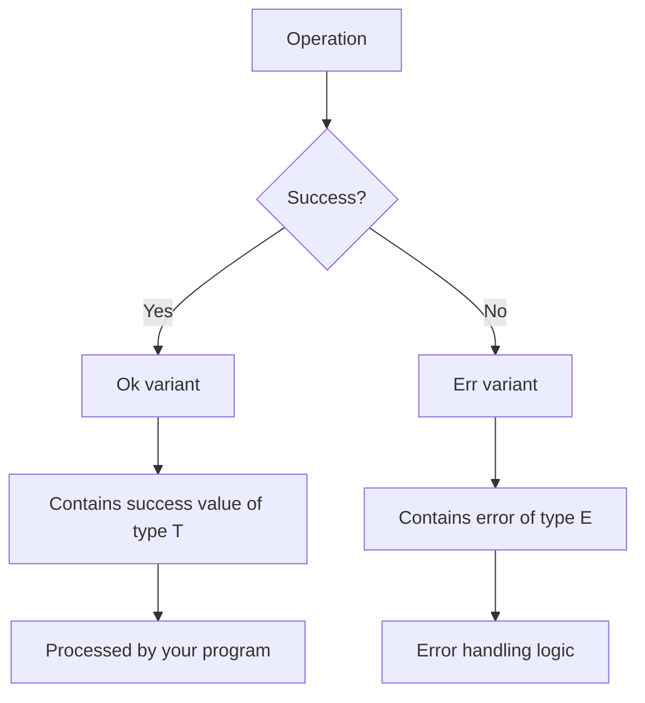

# Rust Result Enum

## Introduction

Error handling is a critical aspect of writing robust software. In many programming languages, errors are handled using exceptions, which can interrupt the normal flow of your program. Rust takes a different approach with its `Result` enum, providing a more explicit and type-safe way to handle operations that might fail.

The `Result<T, E>` enum is one of Rust's most important types, representing either success (`Ok`) with a value of type `T`, or failure (`Err`) with an error of type `E`. This approach forces developers to explicitly handle potential errors, leading to more reliable code.

## The Result Enum Definition

In the Rust standard library, the `Result` enum is defined as:

```rust
enum Result<T, E> {
    Ok(T),    // Represents success and contains a value
    Err(E),   // Represents failure and contains an error
}
```

This is a generic enum with two type parameters:
- `T`: The type of the value returned in the success case
- `E`: The type of the error returned in the failure case

## Basic Usage of Result

Let's look at a simple example of using `Result`:

```rust
fn divide(a: f64, b: f64) -> Result<f64, String> {
    if b == 0.0 {
        Err(String::from("Cannot divide by zero"))
    } else {
        Ok(a / b)
    }
}

fn main() {
    // Successful case
    let result1 = divide(10.0, 2.0);
    
    // Error case
    let result2 = divide(5.0, 0.0);
    
    println!("Result 1: {:?}", result1); // Output: Result 1: Ok(5.0)
    println!("Result 2: {:?}", result2); // Output: Result 2: Err("Cannot divide by zero")
}
```

In this example:
1. We define a `divide` function that returns a `Result<f64, String>`
2. If the divisor is zero, we return an `Err` with a string message
3. Otherwise, we return an `Ok` with the division result

## Handling Result Values

There are several ways to handle `Result` values in Rust:

### Using match

The most straightforward way is using a `match` expression:

```rust
fn main() {
    let result = divide(10.0, 2.0);
    
    match result {
        Ok(value) => println!("The result is: {}", value),
        Err(error) => println!("Error: {}", error),
    }
    
    // With the error case
    let result = divide(5.0, 0.0);
    
    match result {
        Ok(value) => println!("The result is: {}", value),
        Err(error) => println!("Error: {}", error), // This will run
    }
}
```

### Using if let

For simpler cases when you only care about one variant:

```rust
fn main() {
    let result = divide(10.0, 2.0);
    
    if let Ok(value) = result {
        println!("The result is: {}", value);
    }
    
    // Or if you just care about the error:
    let result = divide(5.0, 0.0);
    
    if let Err(error) = result {
        println!("An error occurred: {}", error);
    }
}
```

### Using unwrap() and expect()

Rust provides methods to extract the value directly:

```rust
fn main() {
    // unwrap() returns the value if Ok, panics if Err
    let value = divide(10.0, 2.0).unwrap(); // Returns 5.0
    println!("The result is: {}", value);
    
    // This will panic with the default error message
    // let value = divide(5.0, 0.0).unwrap(); 
    
    // expect() is like unwrap() but with a custom panic message
    let value = divide(10.0, 2.0).expect("Division failed"); // Returns 5.0
    
    // This will panic with our custom message
    // let value = divide(5.0, 0.0).expect("Division failed");
}
```

⚠️ **Important:** `unwrap()` and `expect()` should generally be avoided in production code as they can cause your program to crash. They're mainly useful for prototyping or when you're absolutely certain the operation won't fail.

## The ? Operator

Rust provides the `?` operator to simplify error handling. It works like this:
- If the `Result` is `Ok`, it extracts the value
- If the `Result` is `Err`, it immediately returns from the function with that error

Here's an example:

```rust
fn divide(a: f64, b: f64) -> Result<f64, String> {
    if b == 0.0 {
        Err(String::from("Cannot divide by zero"))
    } else {
        Ok(a / b)
    }
}

fn calculate_and_print(a: f64, b: f64) -> Result<(), String> {
    // The ? will extract the value if Ok, or return the error if Err
    let result = divide(a, b)?;
    
    println!("The result is: {}", result);
    
    Ok(())
}

fn main() {
    // This will succeed
    match calculate_and_print(10.0, 2.0) {
        Ok(_) => println!("Calculation successful"),
        Err(e) => println!("Calculation failed: {}", e),
    }
    
    // This will show the error
    match calculate_and_print(5.0, 0.0) {
        Ok(_) => println!("Calculation successful"),
        Err(e) => println!("Calculation failed: {}", e),
    }
}
```

The `?` operator greatly simplifies error propagation in functions that return `Result`.

## Chaining Result Methods

The `Result` type provides many useful methods for working with errors:

```rust
fn main() {
    // map: Transform the success value
    let result = divide(10.0, 2.0).map(|x| x * 2.0);
    println!("{:?}", result); // Output: Ok(10.0)
    
    // map_err: Transform the error value
    let result = divide(5.0, 0.0).map_err(|e| format!("Math error: {}", e));
    println!("{:?}", result); // Output: Err("Math error: Cannot divide by zero")
    
    // unwrap_or: Provide a default value if there's an error
    let value = divide(5.0, 0.0).unwrap_or(0.0);
    println!("{}", value); // Output: 0.0
    
    // unwrap_or_else: Compute a default value if there's an error
    let value = divide(5.0, 0.0).unwrap_or_else(|_| {
        println!("Using default value due to error");
        0.0
    });
    println!("{}", value); // Output: 0.0
}
```

## Combining Multiple Results

When working with multiple `Result` values, you can combine them using various methods:

```rust
fn main() {
    // and_then: Chain operations that might fail
    let result = divide(10.0, 2.0)
        .and_then(|x| divide(x, 2.0));
    println!("{:?}", result); // Output: Ok(2.5)
    
    // or_else: Try an alternative if the first operation fails
    let result = divide(10.0, 0.0)
        .or_else(|_| divide(8.0, 2.0));
    println!("{:?}", result); // Output: Ok(4.0)
}
```

## Real-World Example: File I/O

One common use case for `Result` is file operations, which might fail for various reasons:

```rust
use std::fs::File;
use std::io::{self, Read};

fn read_file_contents(path: &str) -> Result<String, io::Error> {
    // Open the file (might fail)
    let mut file = File::open(path)?;
    
    // Read the contents (might fail)
    let mut contents = String::new();
    file.read_to_string(&mut contents)?;
    
    Ok(contents)
}

fn main() {
    match read_file_contents("hello.txt") {
        Ok(contents) => println!("File contents: {}", contents),
        Err(error) => println!("Error reading file: {}", error),
    }
}
```

Notice how the `?` operator simplifies handling multiple operations that might fail.

## Custom Error Types

In larger applications, it's common to define custom error types:

```rust
#[derive(Debug)]
enum MathError {
    DivisionByZero,
    Overflow,
    Underflow,
}

fn divide_with_custom_error(a: i32, b: i32) -> Result<i32, MathError> {
    if b == 0 {
        Err(MathError::DivisionByZero)
    } else if a == i32::MAX && b == -1 {
        Err(MathError::Overflow)
    } else {
        Ok(a / b)
    }
}

fn main() {
    let result = divide_with_custom_error(10, 0);
    
    match result {
        Ok(value) => println!("Result: {}", value),
        Err(MathError::DivisionByZero) => println!("Cannot divide by zero!"),
        Err(MathError::Overflow) => println!("Operation would cause overflow!"),
        Err(MathError::Underflow) => println!("Operation would cause underflow!"),
    }
}
```

## Visual Representation of Result

Here's a visual representation of how the `Result` enum works:



## When to Use Result

You should use `Result` when:
1. An operation might fail in an expected way
2. You want to give the caller the choice of how to handle errors
3. The failure is recoverable

Common examples include:
- File I/O operations
- Network requests
- Parsing data
- Database operations

## Result vs. Option

It's important to understand the difference between `Result` and `Option`:

- `Option<T>` represents the presence (`Some(T)`) or absence (`None`) of a value
- `Result<T, E>` represents success (`Ok(T)`) or failure (`Err(E)`) of an operation

```rust
// Option example - no error information, just presence or absence
fn divide_option(a: f64, b: f64) -> Option<f64> {
    if b == 0.0 {
        None
    } else {
        Some(a / b)
    }
}

// Result example - includes error information
fn divide_result(a: f64, b: f64) -> Result<f64, String> {
    if b == 0.0 {
        Err(String::from("Cannot divide by zero"))
    } else {
        Ok(a / b)
    }
}

fn main() {
    let option_result = divide_option(10.0, 0.0);
    let result_result = divide_result(10.0, 0.0);
    
    println!("Option: {:?}", option_result); // Output: Option: None
    println!("Result: {:?}", result_result); // Output: Result: Err("Cannot divide by zero")
}
```

Use `Result` when you need to explain why something failed.

## Summary

The `Result` enum is a powerful tool in Rust for handling operations that might fail:

- It has two variants: `Ok(T)` for success and `Err(E)` for failure
- It forces explicit error handling, leading to more robust code
- It can be handled with `match`, `if let`, methods like `unwrap()`, or the `?` operator
- It provides a rich set of methods for transforming and combining results
- It's used extensively in Rust's standard library, especially for I/O operations

By understanding and using `Result` effectively, you'll write Rust code that handles errors gracefully and deliberately, making your applications more reliable and maintainable.

## Further Exercises

1. Write a function that reads a number from a string and returns a `Result`
2. Modify the `divide` function to handle more error cases (e.g., overflow)
3. Implement a chain of operations using `and_then` that might fail at different steps
4. Create a custom error type with multiple variants for a specific domain
5. Rewrite a function that uses `Option` to use `Result` instead, providing more context about failures

## Additional Resources

- [Rust Book: Error Handling](https://doc.rust-lang.org/book/ch09-00-error-handling.html)
- [Rust by Example: Result](https://doc.rust-lang.org/rust-by-example/error/result.html)
- [Rust API Documentation: Result](https://doc.rust-lang.org/std/result/enum.Result.html)
- [Error Handling in Rust Blog Post](https://blog.burntsushi.net/rust-error-handling/)