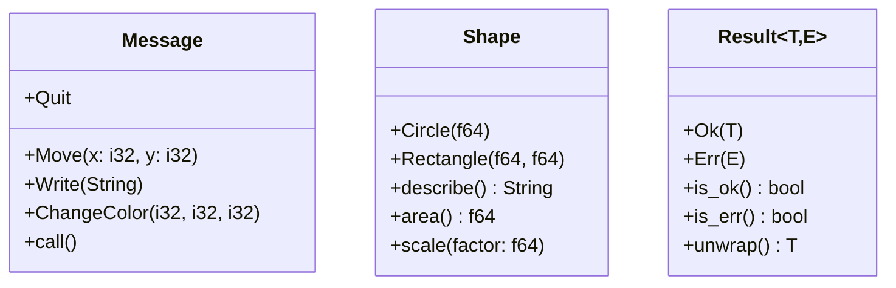

# Rust Enum Methods

## Introduction

In Rust, enums (short for enumerations) are a powerful feature that allow you to define a type by enumerating its possible variants. While we've already explored the basics of enums, this guide focuses specifically on how to add methods to enums, which lets you associate behavior with your enum types.

Methods on enums follow the same pattern as methods on structs, using the `impl` block to add functionality. This capability transforms enums from simple tagged unions into more powerful abstractions that combine both data and behavior.

## Defining Methods on Enums

Just like with structs, you can implement methods on enums using the `impl` keyword. Let's start with a simple example:

```rust
enum Message {
    Quit,
    Move { x: i32, y: i32 },
    Write(String),
    ChangeColor(i32, i32, i32),
}

impl Message {
    fn call(&self) {
        // Method body would define behavior based on the Message variant
        match self {
            Message::Quit => println!("Quitting..."),
            Message::Move { x, y } => println!("Moving to position ({}, {})", x, y),
            Message::Write(text) => println!("Text message: {}", text),
            Message::ChangeColor(r, g, b) => println!("Changing color to ({}, {}, {})", r, g, b),
        }
    }
}

fn main() {
    let msg1 = Message::Move { x: 10, y: 20 };
    msg1.call(); // Output: Moving to position (10, 20)
    
    let msg2 = Message::Write(String::from("Hello, Rust!"));
    msg2.call(); // Output: Text message: Hello, Rust!
}
```

In this example:
1. We define an enum called `Message` with four variants
2. We implement a method called `call()` on the `Message` enum
3. Inside the method, we use pattern matching to handle each variant differently
4. We create instances of the enum and call the method on them

## Self Parameter Types

Like with structs, enum methods can take different forms of `self`:

```rust
enum Shape {
    Circle(f64),         // radius
    Rectangle(f64, f64), // width, height
}

impl Shape {
    // Method that takes ownership of self
    fn describe(self) -> String {
        match self {
            Shape::Circle(radius) => format!("Circle with radius {}", radius),
            Shape::Rectangle(width, height) => format!("Rectangle with width {} and height {}", width, height),
        }
    }
    
    // Method that borrows self
    fn area(&self) -> f64 {
        match self {
            Shape::Circle(radius) => std::f64::consts::PI * radius * radius,
            Shape::Rectangle(width, height) => width * height,
        }
    }
    
    // Method that takes a mutable reference to self
    fn scale(&mut self, factor: f64) {
        *self = match self {
            Shape::Circle(radius) => Shape::Circle(radius * factor),
            Shape::Rectangle(width, height) => Shape::Rectangle(width * factor, height * factor),
        };
    }
}

fn main() {
    // Create a circle with radius 5.0
    let mut circle = Shape::Circle(5.0);
    
    // Get the area (using &self)
    println!("Circle area: {}", circle.area()); // Output: Circle area: 78.53981633974483
    
    // Scale the circle (using &mut self)
    circle.scale(2.0);
    println!("After scaling, area: {}", circle.area()); // Output: After scaling, area: 314.1592653589793
    
    // This method consumes the shape
    let description = circle.describe();
    println!("{}", description); // Output: Circle with radius 10
    
    // Can't use circle after this point as it's been moved
    // println!("Area: {}", circle.area()); // This would cause a compile error
}
```

The three types of methods shown are:

1. `describe(self)` - Takes ownership of the enum instance
2. `area(&self)` - Borrows the enum instance immutably
3. `scale(&mut self)` - Borrows the enum instance mutably

## Associated Functions

Just like with structs, you can also define associated functions for enums. These are functions that are associated with the enum type but don't take `self` as a parameter. They're often used as constructors.

```rust
enum TrafficLight {
    Red,
    Yellow,
    Green,
}

impl TrafficLight {
    // Associated function (no self parameter)
    fn new_red() -> TrafficLight {
        TrafficLight::Red
    }
    
    fn new_yellow() -> TrafficLight {
        TrafficLight::Yellow
    }
    
    fn new_green() -> TrafficLight {
        TrafficLight::Green
    }
    
    // Method (uses self)
    fn get_wait_time(&self) -> u32 {
        match self {
            TrafficLight::Red => 30,
            TrafficLight::Yellow => 5,
            TrafficLight::Green => 45,
        }
    }
}

fn main() {
    // Using associated functions to create instances
    let red_light = TrafficLight::new_red();
    let yellow_light = TrafficLight::new_yellow();
    
    println!("Wait time for red light: {} seconds", red_light.get_wait_time());
    println!("Wait time for yellow light: {} seconds", yellow_light.get_wait_time());
}
```

Output:
```
Wait time for red light: 30 seconds
Wait time for yellow light: 5 seconds
```

Associated functions are called using the `::` syntax, while methods are called using the `.` syntax.

## Methods With Pattern Matching

One of the most powerful applications of enum methods is pattern matching within the method body. This allows you to provide different implementations depending on the variant:

```rust
enum Result<T, E> {
    Ok(T),
    Err(E),
}

impl<T, E> Result<T, E> {
    fn is_ok(&self) -> bool {
        match self {
            Result::Ok(_) => true,
            Result::Err(_) => false,
        }
    }
    
    fn is_err(&self) -> bool {
        !self.is_ok()
    }
    
    fn unwrap(self) -> T where E: std::fmt::Debug {
        match self {
            Result::Ok(value) => value,
            Result::Err(err) => panic!("Called unwrap on an Err value: {:?}", err),
        }
    }
}

fn main() {
    let ok_result: Result<i32, &str> = Result::Ok(42);
    let err_result: Result<i32, &str> = Result::Err("Something went wrong");
    
    println!("ok_result is_ok: {}", ok_result.is_ok()); // Output: ok_result is_ok: true
    println!("err_result is_err: {}", err_result.is_err()); // Output: err_result is_err: true
    
    // Safely unwrap the Ok value
    let value = ok_result.unwrap();
    println!("Unwrapped value: {}", value); // Output: Unwrapped value: 42
    
    // This would panic
    // let value = err_result.unwrap();
}
```

This example implements methods like those in Rust's actual `Result` type, which is an enum used for error handling.

## Real-World Example: Command Pattern

Let's look at a more practical example using the Command pattern with enums:

```rust
enum Command {
    AddText(String),
    DeleteText(usize), // number of characters to delete
    SaveFile(String),  // filename
    LoadFile(String),  // filename
    Undo,
    Redo,
}

struct Editor {
    content: String,
    history: Vec<Command>,
    undo_history: Vec<Command>,
}

impl Editor {
    fn new() -> Self {
        Editor {
            content: String::new(),
            history: Vec::new(),
            undo_history: Vec::new(),
        }
    }
    
    fn execute(&mut self, command: Command) {
        match &command {
            Command::AddText(text) => {
                self.content.push_str(text);
            },
            Command::DeleteText(count) => {
                let new_len = self.content.len().saturating_sub(*count);
                self.content.truncate(new_len);
            },
            Command::SaveFile(filename) => {
                println!("Saving content to file: {}", filename);
                // In a real implementation, this would actually save to a file
            },
            Command::LoadFile(filename) => {
                println!("Loading content from file: {}", filename);
                // In a real implementation, this would load content from a file
            },
            Command::Undo => {
                if let Some(last_command) = self.history.pop() {
                    self.undo_command(&last_command);
                    self.undo_history.push(last_command);
                }
                return; // Skip adding Undo to history
            },
            Command::Redo => {
                if let Some(last_undone) = self.undo_history.pop() {
                    self.execute(last_undone);
                }
                return; // Skip adding Redo to history
            },
        }
        
        // Add the executed command to history
        if !matches!(command, Command::Undo | Command::Redo) {
            self.history.push(command);
            self.undo_history.clear(); // Clear redo history when a new command is executed
        }
    }
    
    fn undo_command(&mut self, command: &Command) {
        match command {
            Command::AddText(text) => {
                let text_len = text.len();
                let new_len = self.content.len().saturating_sub(text_len);
                self.content.truncate(new_len);
            },
            Command::DeleteText(_) => {
                println!("Cannot undo delete operation in this simple example");
            },
            _ => println!("Undo not implemented for this command"),
        }
    }
    
    fn display_content(&self) {
        println!("Content: {}", self.content);
    }
}

fn main() {
    let mut editor = Editor::new();
    
    // Add some text
    editor.execute(Command::AddText(String::from("Hello, ")));
    editor.execute(Command::AddText(String::from("Rust!")));
    editor.display_content(); // Output: Content: Hello, Rust!
    
    // Undo the last operation
    editor.execute(Command::Undo);
    editor.display_content(); // Output: Content: Hello, 
    
    // Redo the undone operation
    editor.execute(Command::Redo);
    editor.display_content(); // Output: Content: Hello, Rust!
    
    // Save the file
    editor.execute(Command::SaveFile(String::from("document.txt")));
}
```

This example demonstrates:
1. Using an enum (`Command`) to represent different operations
2. Implementing methods that handle each variant differently
3. Building complex behavior (an editor with undo/redo functionality) using enum methods

## Visualizing Enum Methods

Here's a diagram showing how methods relate to enum variants:



## Advanced Pattern Matching in Methods

You can use advanced pattern matching techniques within methods to handle enum variants:

```rust
enum Json {
    Null,
    Boolean(bool),
    Number(f64),
    String(String),
    Array(Vec<Json>),
    Object(std::collections::HashMap<String, Json>),
}

impl Json {
    fn to_string(&self) -> String {
        match self {
            Json::Null => String::from("null"),
            Json::Boolean(b) => b.to_string(),
            Json::Number(n) => n.to_string(),
            Json::String(s) => format!("\"{}\"", s),
            Json::Array(arr) => {
                let items: Vec<String> = arr.iter().map(|item| item.to_string()).collect();
                format!("[{}]", items.join(", "))
            },
            Json::Object(obj) => {
                let pairs: Vec<String> = obj.iter()
                    .map(|(k, v)| format!("\"{}\":{}", k, v.to_string()))
                    .collect();
                format!("{{{}}}", pairs.join(", "))
            },
        }
    }
    
    fn is_primitive(&self) -> bool {
        matches!(self, Json::Null | Json::Boolean(_) | Json::Number(_) | Json::String(_))
    }
}

fn main() {
    // Create a simple JSON object
    use std::collections::HashMap;
    
    let mut person = HashMap::new();
    person.insert(String::from("name"), Json::String(String::from("Alice")));
    person.insert(String::from("age"), Json::Number(30.0));
    person.insert(String::from("is_student"), Json::Boolean(true));
    
    let json = Json::Object(person);
    
    println!("JSON: {}", json.to_string());
    println!("Is primitive: {}", json.is_primitive());
    
    // Create another JSON value
    let num = Json::Number(42.5);
    println!("Number JSON: {}", num.to_string());
    println!("Is primitive: {}", num.is_primitive());
}
```

Output:
```
JSON: {"name":"Alice", "age":30, "is_student":true}
Is primitive: false
Number JSON: 42.5
Is primitive: true
```

Note the use of the `matches!` macro in the `is_primitive` method, which provides a concise way to check if a value matches one of several patterns.

## Summary

In this guide, we've explored how to define and use methods on enums in Rust:

1. **Basic Methods** - Adding behavior to enum types using `impl` blocks
2. **Different Self Types** - Using `self`, `&self`, and `&mut self` for different kinds of methods
3. **Associated Functions** - Creating functions associated with the enum type itself
4. **Pattern Matching** - Using pattern matching within methods to handle different variants
5. **Real-World Examples** - Practical applications like the Command pattern and JSON representation

Methods on enums are a powerful feature of Rust that allow you to combine data and behavior in a type-safe way. They make enums more than just simple sum types, enabling complex, expressive designs that are both safe and efficient.

## Exercises

1. Create an enum `Calculator` with variants for basic operations (Add, Subtract, Multiply, Divide) and implement a method to perform the calculations.

2. Implement an enum `Option<T>` with variants `Some(T)` and `None`, then add methods like `is_some()`, `is_none()`, and `unwrap_or(default: T)`.

3. Create an enum to represent different geometric shapes (Circle, Square, Triangle) and implement methods to calculate area and perimeter.

4. Implement a simple state machine using an enum with methods to transition between states.

## Additional Resources

- [Rust Book: Defining Methods](https://doc.rust-lang.org/book/ch05-03-method-syntax.html)
- [Rust By Example: Enums](https://doc.rust-lang.org/rust-by-example/custom_types/enum.html)
- [Rust Documentation: Enum](https://doc.rust-lang.org/std/keyword.enum.html)
- [Rust Design Patterns: Command Pattern](https://rust-unofficial.github.io/patterns/patterns/behavioural/command.html)

Happy coding with Rust enums!