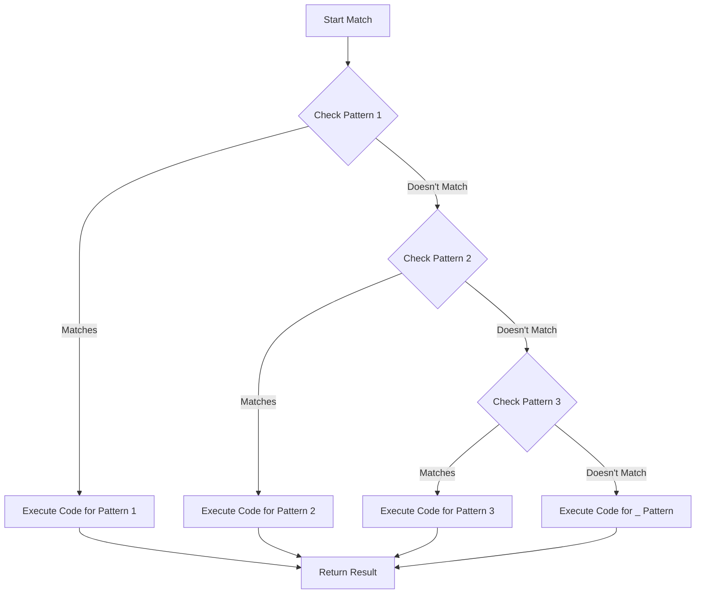

# Rust Pattern Matching

Pattern matching is one of Rust's most powerful features. It allows you to compare a value against a series of patterns and then execute code based on which pattern matches. When combined with enums, pattern matching becomes an elegant way to handle different variants of data.

## Introduction to Pattern Matching

Pattern matching in Rust is primarily done through the `match` expression. Think of it as an advanced version of a switch statement from other languages, but with extra powers:

- It's exhaustive, meaning you must handle all possible cases
- It can destructure values to access their inner components
- It allows binding variables to parts of the matched value

Let's dive into how pattern matching works with enums and explore the different ways we can use it in Rust!

## Basic Pattern Matching with `match`

The `match` expression is the cornerstone of pattern matching in Rust. Here's a simple example using an enum:

```rust
enum Coin {
    Penny,
    Nickel,
    Dime,
    Quarter,
}

fn value_in_cents(coin: Coin) -> u8 {
    match coin {
        Coin::Penny => 1,
        Coin::Nickel => 5,
        Coin::Dime => 10,
        Coin::Quarter => 25,
    }
}

fn main() {
    let coin = Coin::Dime;
    println!("Value: {} cents", value_in_cents(coin)); // Output: Value: 10 cents
}
```

In this example:
1. We define a `Coin` enum with four variants
2. The `value_in_cents` function uses a `match` expression to return the corresponding value for each coin
3. Each arm of the match consists of a pattern (`Coin::Penny`, etc.) and the code to run if the pattern matches

The compiler ensures we've covered all possible variants of the enum, making our code more robust.

## Matching with Data

Enums become even more powerful when they can hold data. Let's extend our `Coin` example:

```rust
#[derive(Debug)]
enum UsState {
    Alabama,
    Alaska,
    // ... other states
    Wyoming,
}

enum Coin {
    Penny,
    Nickel,
    Dime,
    Quarter(UsState), // Quarter now contains a UsState
}

fn value_in_cents(coin: Coin) -> u8 {
    match coin {
        Coin::Penny => 1,
        Coin::Nickel => 5,
        Coin::Dime => 10,
        Coin::Quarter(state) => {
            println!("State quarter from {:?}!", state);
            25
        }
    }
}

fn main() {
    let coin = Coin::Quarter(UsState::Alaska);
    println!("Value: {} cents", value_in_cents(coin));
    // Output:
    // State quarter from Alaska!
    // Value: 25 cents
}
```

Notice how we can:
1. Bind the inner `UsState` value to the variable `state`
2. Use that variable in the code block for that match arm
3. Access the data inside the enum variant without complex extraction code

## Pattern Matching with `Option<T>`

One of the most common uses of pattern matching is to handle `Option<T>` values. This helps eliminate null-related bugs by forcing you to handle both the `Some` and `None` cases:

```rust
fn find_square_root(number: i32) -> Option<f64> {
    if number >= 0 {
        Some((number as f64).sqrt())
    } else {
        None
    }
}

fn main() {
    let number = 16;
    
    match find_square_root(number) {
        Some(root) => println!("The square root of {} is {}", number, root),
        None => println!("{} doesn't have a real square root", number),
    }
    // Output: The square root of 16 is 4
    
    let negative = -5;
    match find_square_root(negative) {
        Some(root) => println!("The square root of {} is {}", negative, root),
        None => println!("{} doesn't have a real square root", negative),
    }
    // Output: -5 doesn't have a real square root
}
```

This pattern is so common that Rust provides a more concise way to handle it with `if let`.

## The `if let` Syntax

When you only care about one pattern and want to ignore the rest, `if let` provides a more concise syntax:

```rust
fn main() {
    let some_value = Some(42);
    
    // Using match
    match some_value {
        Some(value) => println!("Found a value: {}", value),
        None => (), // We don't do anything for None
    }
    
    // Same functionality with if let
    if let Some(value) = some_value {
        println!("Found a value: {}", value);
    }
    // Both output: Found a value: 42
}
```

You can also use `else` with `if let`:

```rust
fn main() {
    let coin = Coin::Penny;
    
    if let Coin::Quarter(state) = coin {
        println!("Quarter from {:?}!", state);
    } else {
        println!("Not a quarter!");
    }
    // Output: Not a quarter!
}
```

Use `if let` when:
- You only care about one pattern
- You want more concise code
- You don't need the exhaustiveness check that `match` provides

## Matching Multiple Patterns

You can match multiple patterns using the `|` (or) operator:

```rust
fn main() {
    let dice_roll = 3;
    
    match dice_roll {
        1 | 2 => println!("Not great"),
        3 | 4 => println!("Pretty good!"),
        5 | 6 => println!("Excellent!"),
        _ => println!("Invalid dice roll"), // Default case
    }
    // Output: Pretty good!
}
```

## The `_` Placeholder

The underscore `_` is a special pattern that matches any value but doesn't bind to it:

```rust
fn main() {
    let some_number = Some(7);
    
    match some_number {
        Some(1) => println!("One!"),
        Some(2) => println!("Two!"),
        Some(_) => println!("Some other number"),
        None => println!("No number"),
    }
    // Output: Some other number
}
```

## Range Patterns

You can match ranges of values:

```rust
fn main() {
    let x = 5;
    
    match x {
        1..=5 => println!("One through five"),
        6..=10 => println!("Six through ten"),
        _ => println!("Something else"),
    }
    // Output: One through five
}
```

## Destructuring Structs and Tuples

Pattern matching can also destructure complex data types:

```rust
struct Point {
    x: i32,
    y: i32,
}

fn main() {
    let point = Point { x: 0, y: 7 };
    
    // Destructuring a struct
    match point {
        Point { x: 0, y } => println!("On y-axis at y={}", y),
        Point { x, y: 0 } => println!("On x-axis at x={}", x),
        Point { x, y } => println!("At coordinates ({}, {})", x, y),
    }
    // Output: On y-axis at y=7
    
    // Destructuring a tuple
    let triple = (0, -2, 3);
    match triple {
        (0, y, z) => println!("First is 0, y={}, z={}", y, z),
        (1, ..) => println!("First is 1, rest doesn't matter"),
        _ => println!("Other case"),
    }
    // Output: First is 0, y=-2, z=3
}
```

## Match Guards

For more complex conditions, you can use match guards with the `if` keyword:

```rust
fn main() {
    let num = Some(4);
    
    match num {
        Some(x) if x % 2 == 0 => println!("{} is even", x),
        Some(x) => println!("{} is odd", x),
        None => println!("No number"),
    }
    // Output: 4 is even
}
```

## Bindings with `@`

The `@` operator lets you create a variable that holds a value while testing that same value against a pattern:

```rust
fn main() {
    let msg = Message::Hello(5);
    
    match msg {
        Message::Hello(id @ 3..=7) => println!("Hello with id in range: {}", id),
        Message::Hello(id) => println!("Hello with id: {}", id),
        _ => println!("Other message"),
    }
    // Output: Hello with id in range: 5
}
```

## Visualizing Pattern Matching Flow

Here's a diagram showing how a typical match expression evaluates:



## Real-World Example: Command Processing

Let's look at a practical example of using pattern matching to process commands in a simple text editor:

```rust
enum Command {
    Quit,
    Save(String),
    Move { x: i32, y: i32 },
    Write(String),
    ChangeColor(i32, i32, i32),
}

fn process_command(command: Command) {
    match command {
        Command::Quit => {
            println!("Exiting the program");
            // Code to clean up and exit
        }
        Command::Save(filename) => {
            println!("Saving file as: {}", filename);
            // Code to save to file
        }
        Command::Move { x, y } => {
            println!("Moving cursor to position ({}, {})", x, y);
            // Code to move cursor
        }
        Command::Write(text) => {
            println!("Writing: {}", text);
            // Code to write text
        }
        Command::ChangeColor(r, g, b) => {
            println!("Changing color to RGB: ({}, {}, {})", r, g, b);
            // Code to change color
        }
    }
}

fn main() {
    let commands = vec![
        Command::Move { x: 10, y: 15 },
        Command::Write(String::from("Hello, Rust!")),
        Command::ChangeColor(255, 0, 0),
        Command::Save(String::from("document.txt")),
        Command::Quit,
    ];
    
    for command in commands {
        process_command(command);
    }
}
```

This example shows how pattern matching can make command processing clear and maintainable, even with different types of commands containing different data.

## Error Handling with Pattern Matching

Pattern matching shines when handling errors with `Result<T, E>`:

```rust
use std::fs::File;
use std::io::ErrorKind;

fn main() {
    let file_result = File::open("hello.txt");
    
    let file = match file_result {
        Ok(file) => file,
        Err(error) => match error.kind() {
            ErrorKind::NotFound => match File::create("hello.txt") {
                Ok(fc) => {
                    println!("Created a new file");
                    fc
                }
                Err(e) => panic!("Problem creating the file: {:?}", e),
            },
            other_error => {
                panic!("Problem opening the file: {:?}", other_error)
            }
        },
    };
    
    println!("File handle: {:?}", file);
}
```

This example demonstrates:
1. Matching on a `Result` to handle success or failure
2. Further matching on the error type to provide specific handling
3. Nested match expressions to handle complex logic

## Summary

Pattern matching in Rust is a powerful mechanism that allows you to:

- Handle different enum variants with clarity and type safety
- Destructure complex data to access inner components
- Write concise, expressive code that's also exhaustive
- Handle errors in a structured way

Key pattern matching tools:
- `match` expressions for exhaustive matching
- `if let` for simpler, non-exhaustive matching
- Pattern combinators like `|` (or), `..=` (range), and `_` (wildcard)
- Destructuring for complex data types
- Match guards for additional condition checking

By mastering pattern matching with enums, you gain the ability to write more maintainable, safer code that elegantly handles complex data and control flow.

## Exercises

Try these exercises to practice pattern matching:

1. Create an enum `Shape` with variants for `Circle`, `Rectangle`, and `Triangle`, each containing appropriate data. Write a function that calculates the area for each shape using pattern matching.

2. Implement a simple calculator that takes an enum `Operation` (Add, Subtract, Multiply, Divide) and two numbers, then returns the result using pattern matching.

3. Create a function that processes a `Vec<Option<i32>>` and returns the sum of all `Some` values while counting how many `None` values were encountered.

## Additional Resources

- [Rust Book: Pattern Syntax](https://doc.rust-lang.org/book/ch18-03-pattern-syntax.html)
- [Rust By Example: Match](https://doc.rust-lang.org/rust-by-example/flow_control/match.html)
- [Rust Documentation: Patterns](https://doc.rust-lang.org/reference/patterns.html)