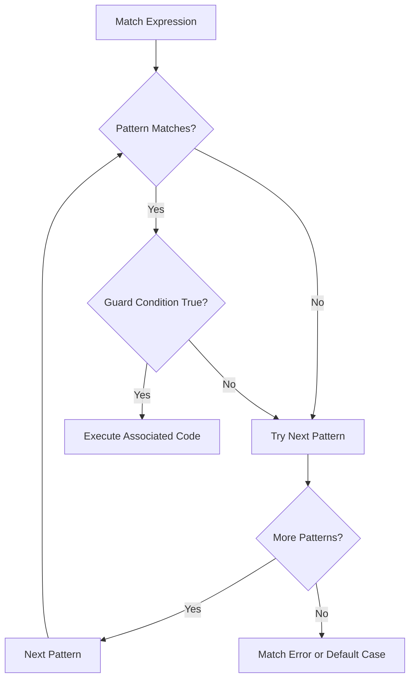

# Rust Match Guards

## Introduction

When working with Rust's powerful pattern matching system, you'll sometimes need to add extra conditions to your match patterns. This is where **match guards** come in. Match guards are conditional expressions that are evaluated after a pattern matches but before the associated code is executed.

Match guards allow you to make your pattern matching more specific by adding conditions using the `if` keyword. They provide an elegant way to express complex matching logic without having to nest multiple match statements or use complicated boolean expressions.

In this tutorial, we'll explore how match guards work, when to use them, and examine practical examples to help you leverage this powerful feature in your Rust code.

## Basic Syntax

A match guard is added to a match arm using the `if` keyword followed by a boolean expression:

```rust
match value {
    pattern if condition => expression,
    // other arms...
}
```

The match arm will only be selected if:
1. The pattern matches the value AND
2. The condition in the match guard evaluates to `true`

## Simple Example

Let's start with a basic example to understand the syntax:

```rust
fn main() {
    let number = 4;
    
    match number {
        n if n < 0 => println!("{} is negative", n),
        n if n > 0 => println!("{} is positive", n),
        _ => println!("The number is zero"),
    }
}
```

**Output:**
```
4 is positive
```

In this example:
- Each match arm receives the value (`number`) and binds it to the variable `n`
- The match guard `if n < 0` or `if n > 0` then checks if the condition is true
- Only the arm with both a matching pattern and a true condition will execute

## Match Guards with Enums

Match guards are particularly useful when working with enums. Let's consider an example using a `Person` enum:

```rust
enum Person {
    Adult(String, i32),    // Name, Age
    Child(String, i32),    // Name, Age
}

fn main() {
    let people = vec![
        Person::Adult("Alice", 30),
        Person::Adult("Bob", 17),  // Technically an incorrect use of Adult
        Person::Child("Charlie", 12),
        Person::Child("David", 18), // Technically an incorrect use of Child
    ];
    
    for person in people {
        match person {
            Person::Adult(name, age) if age >= 18 => {
                println!("{} is a valid adult aged {}", name, age);
            },
            Person::Adult(name, age) => {
                println!("{} is classified as an Adult but is only {} years old!", name, age);
            },
            Person::Child(name, age) if age < 18 => {
                println!("{} is a valid child aged {}", name, age);
            },
            Person::Child(name, age) => {
                println!("{} is classified as a Child but is already {} years old!", name, age);
            },
        }
    }
}
```

**Output:**
```
Alice is a valid adult aged 30
Bob is classified as an Adult but is only 17 years old!
Charlie is a valid child aged 12
David is classified as a Child but is already 18 years old!
```

In this example, match guards help validate the age values associated with our enum variants. This allows us to catch inconsistencies where someone might be classified as an `Adult` but have an age less than 18, or be classified as a `Child` but have an age of 18 or greater.

## Match Guards with Complex Conditions

Match guards can contain more complex boolean expressions, including references to variables in the current scope:

```rust
fn main() {
    let temperature = 25;
    let humidity = 70;
    
    match temperature {
        t if t < 0 => println!("Freezing!"),
        t if t < 15 => println!("Cold"),
        t if t < 25 && humidity > 80 => println!("Cool but humid"),
        t if t < 25 => println!("Cool"),
        t if t < 35 && humidity > 80 => println!("Warm but humid"),
        t if t < 35 => println!("Warm"),
        _ => println!("Hot!"),
    }
}
```

**Output:**
```
Cool
```

Notice how we can use the `humidity` variable from the outer scope inside our match guard conditions.

## Multiple Patterns with a Single Guard

You can also use match guards with multiple patterns using the `|` (OR) operator:

```rust
fn main() {
    let value = 5;
    
    match value {
        1 | 2 | 3 if value % 2 == 0 => println!("Low even number"),
        1 | 2 | 3 => println!("Low odd number"),
        4..=10 if value % 2 == 0 => println!("Medium even number"),
        4..=10 => println!("Medium odd number"),
        _ => println!("Large number"),
    }
}
```

**Output:**
```
Medium odd number
```

In this example, the match guard applies to the entire pattern. The pattern `1 | 2 | 3` will match if `value` is 1, 2, or 3, and then the guard `if value % 2 == 0` checks if the value is even.

## Shadowing Variables in Match Guards

Match guards can lead to variable shadowing, which is important to understand:

```rust
fn main() {
    let x = 4;
    let y = false;

    match x {
        4 | 5 if y => println!("yes"),
        _ => println!("no"),
    }
}
```

**Output:**
```
no
```

Even though `x` matches the pattern `4 | 5`, the match guard `if y` evaluates to `false`, so the second arm is selected.

## Practical Example: Result Handling

Match guards are extremely useful when handling `Result` types:

```rust
fn divide(numerator: f64, denominator: f64) -> Result<f64, String> {
    if denominator == 0.0 {
        Err(String::from("Cannot divide by zero"))
    } else {
        Ok(numerator / denominator)
    }
}

fn main() {
    let calculations = vec![
        divide(10.0, 2.0),
        divide(5.0, 0.0),
        divide(0.0, 5.0),
    ];
    
    for result in calculations {
        match result {
            Ok(value) if value == 0.0 => println!("The result is zero"),
            Ok(value) if value < 1.0 => println!("The result is a fraction: {:.2}", value),
            Ok(value) => println!("The result is: {:.2}", value),
            Err(msg) => println!("Error: {}", msg),
        }
    }
}
```

**Output:**
```
The result is: 5.00
Error: Cannot divide by zero
The result is zero
```

This approach gives us fine-grained control over how we handle different values within the `Ok` variant.

## Match Guards with Structs

Match guards work well with structs and struct patterns:

```rust
struct Point {
    x: i32,
    y: i32,
}

fn classify_point(point: Point) {
    match point {
        Point { x, y } if x > 0 && y > 0 => println!("First quadrant: ({}, {})", x, y),
        Point { x, y } if x < 0 && y > 0 => println!("Second quadrant: ({}, {})", x, y),
        Point { x, y } if x < 0 && y < 0 => println!("Third quadrant: ({}, {})", x, y),
        Point { x, y } if x > 0 && y < 0 => println!("Fourth quadrant: ({}, {})", x, y),
        Point { x, y: 0 } if x != 0 => println!("On the x-axis: ({}, 0)", x),
        Point { x: 0, y } if y != 0 => println!("On the y-axis: (0, {})", y),
        Point { x: 0, y: 0 } => println!("At the origin: (0, 0)"),
        _ => unreachable!(),
    }
}

fn main() {
    let points = vec![
        Point { x: 5, y: 10 },
        Point { x: -2, y: 3 },
        Point { x: 0, y: 0 },
        Point { x: 3, y: 0 },
    ];
    
    for point in points {
        classify_point(point);
    }
}
```

**Output:**
```
First quadrant: (5, 10)
Second quadrant: (-2, 3)
At the origin: (0, 0)
On the x-axis: (3, 0)
```

This example shows how match guards help create a clean and readable way to classify points on a coordinate plane.

## When to Use Match Guards

Match guards are particularly useful in the following scenarios:

1. **Validating values within enums or structs**: When you need to check if values inside a matched pattern meet certain criteria.

2. **Conditional pattern execution**: When you need different behavior based on both the pattern and additional constraints.

3. **Simplifying complex matching logic**: When you want to avoid nested match statements or complicated boolean expressions.

4. **Accessing context variables**: When your match condition needs to reference variables from outside the match statement.

## Visualizing Match Guards

Here's a diagram showing the flow of evaluation in a match statement with guards:



## Match Guards vs. If-Let

While match guards add conditions to pattern matching, `if let` combines a pattern match with a conditional in a different way:

```rust
// Using match with a guard
match some_option {
    Some(value) if value > 10 => println!("Got a value > 10: {}", value),
    Some(value) => println!("Got a value <= 10: {}", value),
    None => println!("Got nothing"),
}

// Using if let with a condition
if let Some(value) = some_option {
    if value > 10 {
        println!("Got a value > 10: {}", value);
    } else {
        println!("Got a value <= 10: {}", value);
    }
} else {
    println!("Got nothing");
}
```

The match guard approach is often more concise and readable when you have multiple conditions.

## Common Gotchas

1. **Order matters**: Just like regular match arms, match guards are evaluated in order. Make sure to place more specific patterns before more general ones.

2. **Shadowing awareness**: Be careful with variable names in pattern bindings to avoid unintended shadowing.

3. **Guard scope**: The guard condition can use variables from the outer scope as well as those bound in the pattern.

4. **Exhaustiveness**: Rust's exhaustiveness checking still applies. Make sure all possible values are covered.

## Summary

Match guards are a powerful feature in Rust that allows you to add additional conditions to pattern matching expressions. They help you write more concise and readable code by avoiding nested conditionals or complex boolean expressions.

Key points to remember:
- Match guards use the `if` keyword followed by a boolean expression
- They only trigger when both the pattern matches AND the guard condition is true
- Guards can access variables from both the pattern binding and the outer scope
- They work with all types of patterns: literals, ranges, enums, structs, etc.
- Match arms are evaluated in order, so more specific patterns should come first

By mastering match guards, you'll be able to write more expressive and elegant Rust code when dealing with complex pattern matching scenarios.

## Exercises

1. Create a function that categorizes temperatures with match guards:
   - Below 0°C: "Freezing"
   - 0-15°C: "Cold"
   - 16-25°C: "Comfortable"
   - 26-35°C: "Warm"
   - Above 35°C: "Hot"

2. Implement a `calculate` function that takes an enum `Operation` which can be `Add(i32, i32)`, `Subtract(i32, i32)`, `Multiply(i32, i32)`, or `Divide(i32, i32)`. Use match guards to handle division by zero.

3. Create a `Person` struct with fields for name, age, and salary. Write a function that uses match guards to categorize people based on combinations of age and salary.

## Additional Resources

- [Rust Book - Pattern Syntax](https://doc.rust-lang.org/book/ch18-03-pattern-syntax.html)
- [Rust by Example - Match Guards](https://doc.rust-lang.org/rust-by-example/flow_control/match/guard.html)
- [Rust Reference - Patterns](https://doc.rust-lang.org/reference/patterns.html)