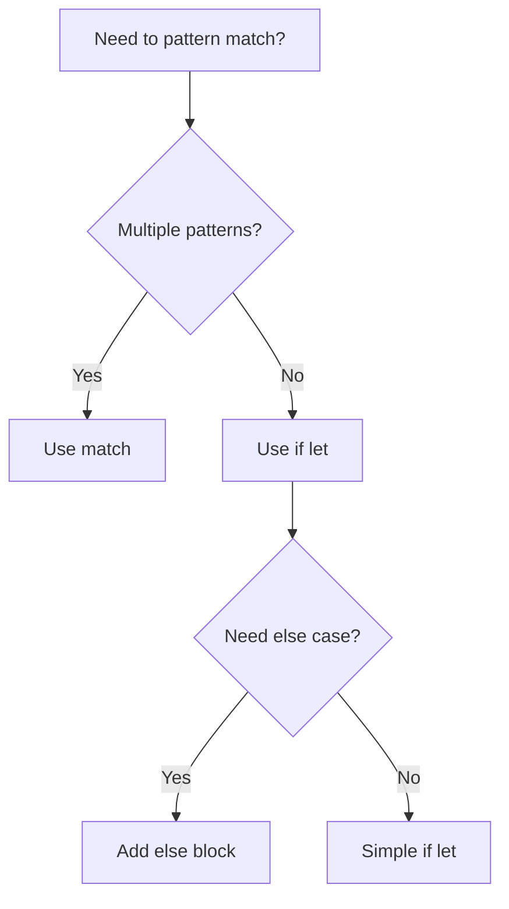

# Rust If Let

## Introduction

In Rust programming, working with enums and `Option` types often involves pattern matching to extract and use their values. While the `match` expression is powerful for handling multiple patterns, it can be verbose when you only care about one specific pattern. This is where the `if let` syntax comes in—it provides a more concise way to handle single pattern matches, making your code cleaner and more readable.

In this tutorial, we'll explore the `if let` syntax, understand when and how to use it, and see how it compares to the traditional `match` expression.

## Understanding `if let` Syntax

The `if let` syntax combines an `if` statement with pattern matching, allowing you to handle a specific pattern while ignoring others. Here's the general structure:

```rust
if let Pattern = expression {
    // Code to run if the pattern matches
} else {
    // Optional: Code to run if the pattern doesn't match
}
```

The `if let` construction reads almost like English: "If the expression matches this pattern, then run this code."

## Basic Example: Working with `Option`

Let's start with a simple example using the `Option` enum:

```rust
fn main() {
    let some_number = Some(42);
    
    // Using if let
    if let Some(number) = some_number {
        println!("Found a number: {}", number);
    }
    
    // Equivalent match expression
    match some_number {
        Some(number) => println!("Found a number: {}", number),
        None => (), // Do nothing for None
    }
}
```

Output:
```
Found a number: 42
Found a number: 42
```

As you can see, the `if let` version is more concise when we only care about the `Some` variant.

## When to Use `if let`

The `if let` syntax is particularly useful in these situations:

1. **When you only care about one pattern** - If you're only interested in handling one specific case and want to ignore all others.
  
2. **Working with `Option` or `Result` types** - When you only want to execute code if an `Option` is `Some` or a `Result` is `Ok`.

3. **Destructuring complex enum variants** - When you need to extract values from specific enum variants.

4. **Avoiding boilerplate code** - When you want to write cleaner, more readable code.

## Adding an `else` Block

You can add an `else` block to handle cases when the pattern doesn't match:

```rust
fn main() {
    let maybe_number = None;
    
    if let Some(number) = maybe_number {
        println!("Found a number: {}", number);
    } else {
        println!("No number found");
    }
}
```

Output:
```
No number found
```

## Working with Custom Enums

`if let` is especially useful with custom enums. Let's define a simple enum representing different message types:

```rust
enum Message {
    Text(String),
    Coords(i32, i32),
    UserStatus(bool),
}

fn main() {
    let message = Message::Coords(10, 20);
    
    // Using if let to handle only Coords variant
    if let Message::Coords(x, y) = message {
        println!("Received coordinates: ({}, {})", x, y);
    }
    
    // Another message
    let message = Message::Text(String::from("Hello, world!"));
    
    // Using if let to handle only Text variant
    if let Message::Text(text) = message {
        println!("Text message: {}", text);
    }
}
```

Output:
```
Received coordinates: (10, 20)
Text message: Hello, world!
```

## Combining `if let` with `else if` and `else if let`

You can chain `if let` with `else if` and even `else if let` for more complex pattern matching scenarios:

```rust
fn main() {
    let message = Message::UserStatus(true);
    
    if let Message::Text(text) = message {
        println!("Text message: {}", text);
    } else if let Message::Coords(x, y) = message {
        println!("Coordinates: ({}, {})", x, y);
    } else if let Message::UserStatus(online) = message {
        if online {
            println!("User is online");
        } else {
            println!("User is offline");
        }
    }
}
```

Output:
```
User is online
```

## Real-World Example: Configuration Settings

Let's look at a practical example where `if let` shines. Imagine a scenario where we have configuration settings that might be present or absent:

```rust
enum Setting {
    DatabaseUrl(String),
    MaxConnections(u32),
    Timeout(u64),
}

fn process_settings(settings: Vec<Option<Setting>>) {
    for setting in settings {
        if let Some(Setting::DatabaseUrl(url)) = setting {
            println!("Database URL configured: {}", url);
        } else if let Some(Setting::MaxConnections(max)) = setting {
            println!("Maximum connections set to: {}", max);
        } else if let Some(Setting::Timeout(seconds)) = setting {
            println!("Timeout configured for {} seconds", seconds);
        } else {
            println!("Missing or unknown setting");
        }
    }
}

fn main() {
    let settings = vec![
        Some(Setting::DatabaseUrl(String::from("postgres://localhost/mydb"))),
        None,
        Some(Setting::MaxConnections(100)),
        Some(Setting::Timeout(30)),
    ];
    
    process_settings(settings);
}
```

Output:
```
Database URL configured: postgres://localhost/mydb
Missing or unknown setting
Maximum connections set to: 100
Timeout configured for 30 seconds
```

## `if let` vs. `match`

To better understand when to use `if let` versus `match`, here's a comparison:



### When to prefer `match`:
- You need to handle all possible variants
- You want exhaustiveness checking (the compiler ensures all cases are handled)
- You have several patterns you want to match against

### When to prefer `if let`:
- You only care about one specific pattern
- You want more concise code
- You're working with an `Option` or `Result` when you only care about `Some` or `Ok`

## Guards with `if let`

You can also add conditional guards to your `if let` patterns:

```rust
fn main() {
    let number = Some(42);
    
    if let Some(n) = number && n > 30 {
        println!("Got a number greater than 30: {}", n);
    }
}
```

Output:
```
Got a number greater than 30: 42
```

## Summary

The `if let` syntax in Rust provides a concise way to handle pattern matching when you only care about one specific pattern. It's particularly useful when working with `Option` types, custom enums, and other scenarios where traditional `match` expressions would be overly verbose.

Key points to remember:

1. Use `if let` when you only need to match against one pattern
2. It's more concise than `match` for single pattern cases
3. You can add an `else` block to handle non-matching cases
4. It's commonly used with `Option` and `Result` types
5. You can chain it with `else if` and `else if let` for more complex scenarios

By mastering `if let`, you'll write cleaner, more idiomatic Rust code that's both more readable and maintainable.

## Exercises

1. Write a function that takes an `Option<String>` and prints the string in uppercase if it exists, or "No string provided" otherwise.

2. Create a custom enum `Temperature` with variants `Celsius(f64)` and `Fahrenheit(f64)`. Write a function that converts any temperature to Celsius using `if let`.

3. Modify the configuration settings example to add a new setting type and handle it appropriately.

## Additional Resources

- [Rust Book: Pattern Syntax](https://doc.rust-lang.org/book/ch18-03-pattern-syntax.html)
- [Rust By Example: if let](https://doc.rust-lang.org/rust-by-example/flow_control/if_let.html)
- [Rust Documentation: match](https://doc.rust-lang.org/std/keyword.match.html)
- [Rust Documentation: Option](https://doc.rust-lang.org/std/option/enum.Option.html)