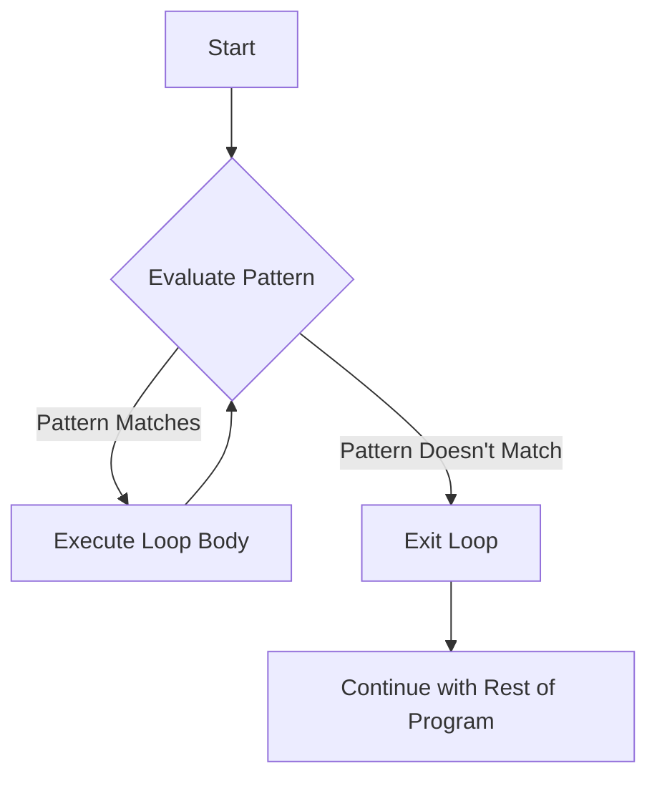

# Rust while let

## Introduction

In Rust programming, handling data in different states is a common task. You've already learned about Rust enums and how they help represent values that can be one of several variants. When working with enums, you often need to repeatedly check and extract values until a certain condition is met.

This is where `while let` comes in—it's a powerful control flow construct that combines the functionality of a `while` loop with pattern matching. In this tutorial, we'll explore how `while let` works, why it's useful, and how it can make your code more elegant and readable.

## The Basics of while let

The `while let` construct allows you to run a loop as long as a pattern continues to match. Its syntax looks like this:

```rust
while let Some(value) = optional_value {
    // Use value here
    // Loop continues as long as optional_value matches Some
}
```

This is conceptually similar to writing:

```rust
loop {
    match optional_value {
        Some(value) => {
            // Use value here
        }
        None => break,
    }
}
```

But `while let` is more concise and expressive, making your code easier to read and maintain.

## A Simple Example: Processing a Vector

Let's start with a simple example of using `while let` to process elements from a vector:

```rust
fn main() {
    let mut stack = Vec::new();
    
    // Push some values onto the stack
    stack.push(1);
    stack.push(2);
    stack.push(3);
    
    // Pop values while the stack isn't empty
    while let Some(top) = stack.pop() {
        println!("Current value: {}", top);
    }
}
```

**Output:**
```
Current value: 3
Current value: 2
Current value: 1
```

In this example:
1. We create a vector and push three numbers onto it
2. The `while let` loop calls `pop()` on each iteration, which returns `Some(value)` if there's a value to pop, or `None` if the vector is empty
3. As long as `pop()` returns `Some(value)`, the pattern matches and the loop continues
4. When `pop()` returns `None`, the pattern no longer matches and the loop exits

## Comparing while let with Other Approaches

To appreciate the elegance of `while let`, let's compare it with other ways of achieving the same result:

### Using a loop with match

```rust
fn main() {
    let mut stack = vec![1, 2, 3];
    
    loop {
        match stack.pop() {
            Some(top) => println!("Current value: {}", top),
            None => break,
        }
    }
}
```

### Using a while loop with if let

```rust
fn main() {
    let mut stack = vec![1, 2, 3];
    
    let mut option = stack.pop();
    while option.is_some() {
        let value = option.unwrap();
        println!("Current value: {}", value);
        option = stack.pop();
    }
}
```

The `while let` version is clearly more concise and directly expresses what we're trying to do: "while we can pop a value from the stack, print it."

## while let with Different Enum Types

`while let` isn't limited to `Option<T>`—it works with any enum where you want to continue processing as long as a specific pattern matches. Let's see an example with a custom enum:

```rust
enum Message {
    Text(String),
    Number(i32),
    End,
}

fn main() {
    let mut messages = vec![
        Message::Text(String::from("Hello")),
        Message::Number(42),
        Message::Text(String::from("World")),
        Message::End,
        Message::Number(100)  // This won't be processed
    ];
    
    // Process messages until we reach End
    while let Some(Message::Text(text)) | Some(Message::Number(num)) = messages.pop() {
        match messages.last() {
            Some(Message::Text(_)) => println!("Processing: {} (next: text)", 
                                           if let Message::Text(t) = messages[messages.len()-1] {
                                               t
                                           } else {
                                               "".to_string()
                                           }),
            Some(Message::Number(_)) => println!("Processing: {} (next: number)", 
                                             if let Message::Number(n) = messages[messages.len()-1] {
                                               n
                                             } else {
                                               0
                                             }),
            Some(Message::End) => println!("Processing: {} (next: end)", 
                                       if let Message::Text(t) = messages[messages.len()-1] {
                                           t
                                       } else if let Message::Number(n) = messages[messages.len()-1] {
                                           n.to_string()
                                       } else {
                                           "".to_string()
                                       }),
            None => println!("Processing: {} (no more messages)", 
                         if let Message::Text(t) = messages[messages.len()-1] {
                             t
                         } else if let Message::Number(n) = messages[messages.len()-1] {
                             n.to_string()
                         } else {
                             "".to_string()
                         }),
        }
    }
}
```

This code has a bug and won't compile. Let's fix it and make it a proper example:

```rust
enum Message {
    Text(String),
    Number(i32),
    End,
}

fn main() {
    let mut messages = vec![
        Message::Text(String::from("Hello")),
        Message::Number(42),
        Message::Text(String::from("World")),
        Message::End,
        Message::Number(100)  // This won't be processed
    ];
    
    // Process messages until we reach End
    while let Some(message) = messages.pop() {
        match message {
            Message::Text(text) => println!("Text message: {}", text),
            Message::Number(num) => println!("Number message: {}", num),
            Message::End => {
                println!("End of messages reached");
                break;
            }
        }
    }
}
```

**Output:**
```
Number message: 100
End of messages reached
Text message: World
Number message: 42
Text message: Hello
```

In this example, we process messages until we encounter the `End` variant, at which point we break out of the loop. Notice that because we're using `pop()`, we process the messages in reverse order.

## Real-World Application: Reading Lines from a File

Let's see a practical example where `while let` shines—reading lines from a file until the end:

```rust
use std::fs::File;
use std::io::{self, BufRead, BufReader};

fn main() -> io::Result<()> {
    // Open the file
    let file = File::open("example.txt")?;
    let mut reader = BufReader::new(file);
    
    // Create a lines iterator
    let mut lines = reader.lines();
    
    // Read and process each line
    while let Some(Ok(line)) = lines.next() {
        println!("Read line: {}", line);
    }
    
    Ok(())
}
```

This example:
1. Opens a file and creates a buffered reader
2. Uses the `lines()` method to create an iterator over the lines in the file
3. Uses `while let` to process each line as long as `next()` returns `Some(Ok(line))`
4. Exits the loop when we reach the end of the file and `next()` returns `None`

## Nested Pattern Matching with while let

You can use more complex patterns with `while let` for nested matching:

```rust
fn main() {
    let mut data = vec![
        Some(("name", "Alice")),
        Some(("age", "30")),
        None,
        Some(("country", "Wonderland")),
    ];
    
    while let Some(Some((key, value))) = data.pop() {
        println!("{}: {}", key, value);
    }
}
```

**Output:**
```
country: Wonderland
age: 30
name: Alice
```

Here we're using `while let` with a nested pattern to:
1. Check if `data.pop()` returns `Some(item)`
2. Furthermore check if `item` is `Some((key, value))`
3. Only execute the loop body if both conditions are met

## The Flow of while let Processing

To better understand how `while let` processes values, let's visualize the flow:



## Common Use Cases for while let

`while let` is particularly useful in the following scenarios:

1. **Consuming iterators**: Process values from an iterator until it's exhausted
2. **Handling streams**: Process data from a stream as long as values are available
3. **Working with optional values**: Process optional values until you encounter `None`
4. **Implementing state machines**: Continue in a specific state as long as a pattern matches

## while let with Guards

You can also add guards to your `while let` patterns for additional control:

```rust
fn main() {
    let mut numbers = vec![1, 2, 3, 4, 5, 6, 7, 8, 9, 10];
    
    // Process only even numbers
    while let Some(num) = numbers.pop() {
        if num % 2 == 0 {
            println!("Processing even number: {}", num);
        } else {
            println!("Skipping odd number: {}", num);
        }
    }
}
```

**Output:**
```
Skipping odd number: 10
Processing even number: 9
Skipping odd number: 8
Processing even number: 7
Skipping odd number: 6
Processing even number: 5
Skipping odd number: 4
Processing even number: 3
Skipping odd number: 2
Processing even number: 1
```

## Best Practices for Using while let

When using `while let`, keep these best practices in mind:

1. **Use it for clarity**: Choose `while let` when it makes your code more readable
2. **Be mindful of infinite loops**: Ensure the pattern will eventually stop matching
3. **Consider performance**: For large collections, make sure the pattern matching operation is efficient
4. **Handle errors appropriately**: When working with `Result` types, consider using `if let` inside your `while let` loop to handle errors

## Summary

The `while let` construct in Rust is a powerful tool that combines pattern matching with loops. It allows you to write cleaner, more expressive code when processing values that match a specific pattern until a condition is no longer true.

Key takeaways:
- `while let` continues running a loop as long as a pattern matches
- It's more concise than using `loop` with `match`
- It works with any enum, not just `Option<T>` and `Result<T, E>`
- It's particularly useful for processing collections, streams, and implementing state machines
- You can use complex and nested patterns with `while let`

## Exercises

To practice using `while let`, try these exercises:

1. Write a program that reads user input from the console until they type "quit"
2. Implement a stack data structure with push and pop methods, and use `while let` to print all elements when needed
3. Create a state machine for a simple game using enums and `while let`
4. Write a function that processes a vector of `Result<T, E>` values, handling errors appropriately

## Additional Resources

To learn more about pattern matching and control flow in Rust, check out:

- [The Rust Book: Pattern Syntax](https://doc.rust-lang.org/book/ch18-03-pattern-syntax.html)
- [The Rust Book: Control Flow](https://doc.rust-lang.org/book/ch03-05-control-flow.html)
- [Rust By Example: while let](https://doc.rust-lang.org/rust-by-example/flow_control/while_let.html)
- [The Rust Standard Library Documentation](https://doc.rust-lang.org/std/)