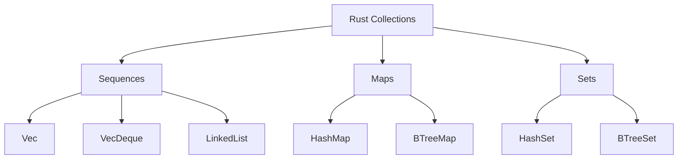

# Rust Collections Overview

## Introduction

Collections are data structures that allow you to store, access, and manipulate multiple values. Unlike Rust's basic data types (like integers or strings) which store a single value, collections can grow or shrink during program execution and store varying amounts of data.

In this guide, we'll explore Rust's standard collection types, understand when to use each one, and see practical examples of how they work in real programs. By the end of this tutorial, you'll have a solid foundation in working with Rust collections.

## The Standard Collections

Rust's standard library provides several collection types that can be broadly categorized into three groups:

1. **Sequences**: Ordered collections of elements (e.g., `Vec`, `VecDeque`, `LinkedList`)
2. **Maps**: Key-value stores (e.g., `HashMap`, `BTreeMap`)
3. **Sets**: Collections of unique values (e.g., `HashSet`, `BTreeSet`)

Let's create a visual representation of these categories:



## Vector (Vec)

The most commonly used collection in Rust is the `Vec` (vector), which is a resizable array type that stores elements of the same type in contiguous memory.

### Creating a Vector

There are several ways to create a vector:

```rust
// Creating an empty vector
let mut empty_vec: Vec<i32> = Vec::new();

// Creating a vector with initial values using the vec! macro
let numbers = vec![1, 2, 3, 4, 5];

// Creating a vector with repeated values
let zeros = vec![0; 10]; // Creates a vector with 10 zeros
```

### Adding Elements to a Vector

```rust
fn main() {
    // Create a mutable empty vector
    let mut fruits = Vec::new();
    
    // Add elements using push()
    fruits.push("Apple");
    fruits.push("Banana");
    fruits.push("Cherry");
    
    println!("Fruits: {:?}", fruits);
    
    // Output: Fruits: ["Apple", "Banana", "Cherry"]
}
```

### Accessing Elements

You can access elements in a vector using indexing or the `get` method:

```rust
fn main() {
    let numbers = vec![10, 20, 30, 40, 50];
    
    // Using indexing (panics if index is out of bounds)
    let second = numbers[1];
    println!("Second element: {}", second);
    
    // Using the get method (returns an Option)
    match numbers.get(2) {
        Some(value) => println!("Third element: {}", value),
        None => println!("Element doesn't exist"),
    }
    
    // Trying to access an out-of-bounds element safely
    match numbers.get(10) {
        Some(value) => println!("Element at index 10: {}", value),
        None => println!("No element at index 10"),
    }
    
    // Output:
    // Second element: 20
    // Third element: 30
    // No element at index 10
}
```

### Iterating Over a Vector

```rust
fn main() {
    let numbers = vec![1, 2, 3, 4, 5];
    
    // Iterate over elements
    println!("Iterating over elements:");
    for num in &numbers {
        println!("{}", num);
    }
    
    // Iterate over elements with their indices
    println!("
Iterating over elements with indices:");
    for (index, num) in numbers.iter().enumerate() {
        println!("Index: {}, Value: {}", index, num);
    }
}
```

### Modifying Elements

```rust
fn main() {
    let mut numbers = vec![1, 2, 3, 4, 5];
    
    // Modify elements by iterating with mutable references
    for num in &mut numbers {
        *num *= 2; // Double each number
    }
    
    println!("After doubling: {:?}", numbers);
    // Output: After doubling: [2, 4, 6, 8, 10]
}
```

## HashMap

`HashMap` is a collection that stores key-value pairs, allowing you to look up values based on their keys. The keys must be unique, and the order of elements is not guaranteed.

### Creating a HashMap

```rust
use std::collections::HashMap;

fn main() {
    // Create an empty HashMap
    let mut scores = HashMap::new();
    
    // Insert key-value pairs
    scores.insert("Alice", 98);
    scores.insert("Bob", 85);
    scores.insert("Charlie", 92);
    
    println!("Scores: {:?}", scores);
    // Output will vary as HashMap doesn't guarantee order, e.g.:
    // Scores: {"Alice": 98, "Bob": 85, "Charlie": 92}
}
```

### Creating a HashMap from Vectors

```rust
use std::collections::HashMap;

fn main() {
    let teams = vec!["Blue", "Red", "Green"];
    let initial_scores = vec![10, 50, 30];
    
    // Create a HashMap from two vectors using zip and collect
    let team_scores: HashMap<_, _> = 
        teams.into_iter().zip(initial_scores.into_iter()).collect();
    
    println!("Team scores: {:?}", team_scores);
    // Output: Team scores: {"Blue": 10, "Red": 50, "Green": 30}
}
```

### Accessing Values

```rust
use std::collections::HashMap;

fn main() {
    let mut capitals = HashMap::new();
    
    capitals.insert("USA", "Washington DC");
    capitals.insert("France", "Paris");
    capitals.insert("Japan", "Tokyo");
    
    // Get a value using the key
    match capitals.get("France") {
        Some(capital) => println!("The capital of France is {}", capital),
        None => println!("No data available for France"),
    }
    
    // Check if a key exists
    if capitals.contains_key("Germany") {
        println!("We have data for Germany");
    } else {
        println!("We don't have data for Germany");
    }
    
    // Output:
    // The capital of France is Paris
    // We don't have data for Germany
}
```

### Updating a HashMap

```rust
use std::collections::HashMap;

fn main() {
    let mut users = HashMap::new();
    
    // Overwriting a value
    users.insert("admin", "initial_password");
    println!("Original password: {:?}", users);
    
    users.insert("admin", "stronger_password");
    println!("Updated password: {:?}", users);
    
    // Only insert if the key doesn't exist
    users.entry("moderator").or_insert("mod_password");
    users.entry("admin").or_insert("this_wont_be_used");
    
    println!("After entry API usage: {:?}", users);
    
    // Update a value based on the old value
    let user_count = users.entry("visitors").or_insert(0);
    *user_count += 1;
    
    let user_count = users.entry("visitors").or_insert(0);
    *user_count += 1;
    
    println!("User counts: {:?}", users);
    
    // Output:
    // Original password: {"admin": "initial_password"}
    // Updated password: {"admin": "stronger_password"}
    // After entry API usage: {"admin": "stronger_password", "moderator": "mod_password"}
    // User counts: {"admin": "stronger_password", "moderator": "mod_password", "visitors": 2}
}
```

## HashSet

`HashSet` is a collection of unique values with no specific order. It's useful when you want to track which values you've seen before.

```rust
use std::collections::HashSet;

fn main() {
    // Create a new HashSet
    let mut languages = HashSet::new();
    
    // Insert elements
    languages.insert("Rust");
    languages.insert("Python");
    languages.insert("JavaScript");
    languages.insert("Rust"); // This won't be added as "Rust" is already in the set
    
    println!("Programming languages: {:?}", languages);
    
    // Check if an element exists
    if languages.contains("Rust") {
        println!("Rust is in the set!");
    }
    
    // Remove an element
    languages.remove("Python");
    
    println!("After removal: {:?}", languages);
    
    // Output:
    // Programming languages: {"Rust", "Python", "JavaScript"}
    // Rust is in the set!
    // After removal: {"Rust", "JavaScript"}
}
```

### Set Operations

`HashSet` provides methods for common set operations like union, intersection, and difference:

```rust
use std::collections::HashSet;

fn main() {
    let mut set1 = HashSet::new();
    set1.insert(1);
    set1.insert(2);
    set1.insert(3);
    
    let mut set2 = HashSet::new();
    set2.insert(3);
    set2.insert(4);
    set2.insert(5);
    
    // Union: all elements in either set
    let union: HashSet<_> = set1.union(&set2).cloned().collect();
    println!("Union: {:?}", union);
    
    // Intersection: elements that appear in both sets
    let intersection: HashSet<_> = set1.intersection(&set2).cloned().collect();
    println!("Intersection: {:?}", intersection);
    
    // Difference: elements in set1 but not in set2
    let difference: HashSet<_> = set1.difference(&set2).cloned().collect();
    println!("Difference (set1 - set2): {:?}", difference);
    
    // Symmetric difference: elements in either set but not in both
    let symmetric_difference: HashSet<_> = set1.symmetric_difference(&set2).cloned().collect();
    println!("Symmetric Difference: {:?}", symmetric_difference);
    
    // Output:
    // Union: {1, 2, 3, 4, 5}
    // Intersection: {3}
    // Difference (set1 - set2): {1, 2}
    // Symmetric Difference: {1, 2, 4, 5}
}
```

## Other Collection Types

### VecDeque

A double-ended queue implemented as a growable ring buffer:

```rust
use std::collections::VecDeque;

fn main() {
    let mut queue = VecDeque::new();
    
    // Add elements to the back (like a queue)
    queue.push_back("First");
    queue.push_back("Second");
    queue.push_back("Third");
    
    // Add elements to the front (like a stack)
    queue.push_front("New First");
    
    println!("Queue: {:?}", queue);
    
    // Remove elements from the front
    if let Some(first) = queue.pop_front() {
        println!("Processed: {}", first);
    }
    
    println!("Queue after pop_front: {:?}", queue);
    
    // Remove elements from the back
    if let Some(last) = queue.pop_back() {
        println!("Processed from back: {}", last);
    }
    
    println!("Queue after pop_back: {:?}", queue);
    
    // Output:
    // Queue: ["New First", "First", "Second", "Third"]
    // Processed: New First
    // Queue after pop_front: ["First", "Second", "Third"]
    // Processed from back: Third
    // Queue after pop_back: ["First", "Second"]
}
```

### BTreeMap and BTreeSet

`BTreeMap` and `BTreeSet` are similar to `HashMap` and `HashSet` but keep their elements sorted and use a B-tree data structure internally:

```rust
use std::collections::BTreeMap;

fn main() {
    let mut grades = BTreeMap::new();
    
    // Insert elements in any order
    grades.insert("Carol", 'A');
    grades.insert("Eve", 'B');
    grades.insert("Alice", 'A');
    grades.insert("Dave", 'C');
    grades.insert("Bob", 'B');
    
    // BTreeMap will keep keys sorted
    for (student, grade) in &grades {
        println!("{}: {}", student, grade);
    }
    
    // Output (keys are sorted alphabetically):
    // Alice: A
    // Bob: B
    // Carol: A
    // Dave: C
    // Eve: B
}
```

## Choosing the Right Collection

Selecting the right collection depends on your specific requirements:

| Collection | When to Use |
|------------|-------------|
| `Vec` | When you need a sequence of elements with quick access by index |
| `VecDeque` | When you need to efficiently add/remove elements at both ends |
| `HashMap` | When you need to look up values by an arbitrary key |
| `BTreeMap` | When you need a map with keys in sorted order |
| `HashSet` | When you need to store unique values with fast lookups |
| `BTreeSet` | When you need unique values in sorted order |

## Real-World Example: Word Counter

Let's build a simple word counter that demonstrates the use of collections:

```rust
use std::collections::HashMap;
use std::io;

fn main() {
    println!("Enter some text to count words:");
    
    let mut input = String::new();
    io::stdin().read_line(&mut input)
        .expect("Failed to read input");
    
    // Create a HashMap to store word counts
    let mut word_counts = HashMap::new();
    
    // Process each word
    for word in input.to_lowercase().split_whitespace() {
        // Clean the word of punctuation
        let word = word.trim_matches(|c: char| !c.is_alphanumeric());
        
        if !word.is_empty() {
            // Count the word (update existing count or insert 1)
            let count = word_counts.entry(word.to_string()).or_insert(0);
            *count += 1;
        }
    }
    
    // Display results in alphabetical order
    let mut words: Vec<&String> = word_counts.keys().collect();
    words.sort();
    
    println!("
Word Counts:");
    println!("{:-<30}", ""); // Print a divider
    
    for word in words {
        println!("{:<20} : {}", word, word_counts[word]);
    }
    
    // Show total number of unique words
    println!("
Total unique words: {}", word_counts.len());
}
```

Example input and output:

```
Enter some text to count words:
Rust is amazing. Rust collections are powerful and Rust makes programming fun.

Word Counts:
------------------------------
amazing             : 1
and                 : 1
are                 : 1
collections         : 1
fun                 : 1
is                  : 1
makes               : 1
powerful            : 1
programming         : 1
rust                : 3

Total unique words: 10
```

## Summary

Rust's collection types provide powerful tools for organizing and managing data in your programs:

- **Vec**: A resizable array type for storing sequences of elements
- **HashMap**: A key-value store for fast lookups
- **HashSet**: A collection of unique values
- **VecDeque**: A double-ended queue for efficient operations at both ends
- **BTreeMap/BTreeSet**: Sorted collections based on B-tree data structures

Each collection has its strengths and ideal use cases. By understanding their characteristics, you can choose the right one for your specific needs, leading to more efficient and expressive code.

## Additional Resources and Exercises

### Resources
- [Rust Standard Library Documentation](https://doc.rust-lang.org/std/collections/index.html)
- [The Rust Programming Language Book - Ch. 8: Common Collections](https://doc.rust-lang.org/book/ch08-00-common-collections.html)

### Exercises

1. **Frequency Analysis**: Extend the word counter example to find the most common words in a text file.

2. **Graph Representation**: Create a simple graph data structure using `HashMap` where keys are node IDs and values are `Vec`s of connected nodes.

3. **Custom Cache**: Implement a simple cache that stores a limited number of items, removing the least recently used item when the cache is full.

4. **Set Operations**: Write a function that takes two vectors and returns their intersection (elements present in both).

5. **Shopping List**: Create a program that manages a shopping list, allowing items to be added, removed, and marked as purchased. Use appropriate collections to store the data.