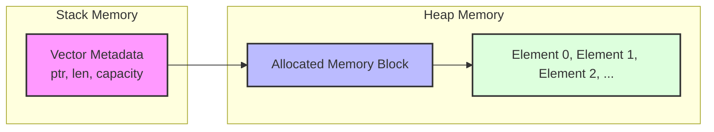
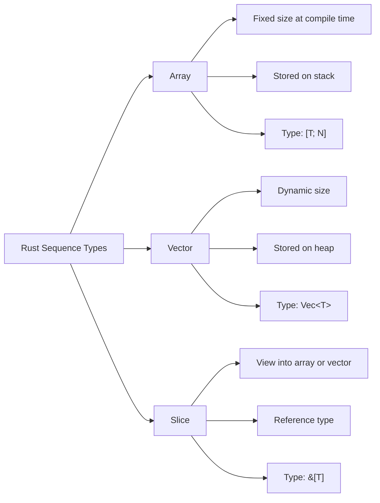

# Rust Vectors

## Introduction

In Rust, a vector is a resizable array that can grow or shrink during program execution. Vectors are part of Rust's standard library and provide a flexible way to store multiple values of the same type. Unlike arrays in Rust, which have a fixed size, vectors can dynamically adjust their capacity, making them perfect for situations where the amount of data isn't known in advance.

Vectors store their elements in contiguous memory, which makes them efficient for direct access operations. They're implemented as a generic type `Vec<T>`, where `T` is the type of elements the vector will contain.

## Creating Vectors

There are several ways to create vectors in Rust. Let's explore them one by one:

### Using `Vec::new()`

The simplest way to create an empty vector is by using the `Vec::new()` method:

```rust
fn main() {
    // Create an empty vector that will store integers
    let mut v: Vec<i32> = Vec::new();
    
    // Add elements to the vector
    v.push(1);
    v.push(2);
    v.push(3);
    
    println!("Vector: {:?}", v);
}
```

Output:
```
Vector: [1, 2, 3]
```

When creating an empty vector, we need to specify the type annotation (`Vec<i32>`) because Rust can't infer the type of elements the vector will hold from an empty vector.

### Using the `vec!` Macro

The `vec!` macro provides a more convenient way to create and initialize vectors:

```rust
fn main() {
    // Create a vector with initial values
    let v = vec![1, 2, 3, 4, 5];
    
    println!("Vector: {:?}", v);
}
```

Output:
```
Vector: [1, 2, 3, 4, 5]
```

The `vec!` macro automatically infers the type of the vector from the provided elements.

### Creating Vectors with Default Values

You can also create vectors with repeated default values:

```rust
fn main() {
    // Create a vector with 5 zeros
    let zeros = vec![0; 5];
    
    // Create a vector with 3 instances of "hello"
    let greetings = vec!["hello"; 3];
    
    println!("Zeros: {:?}", zeros);
    println!("Greetings: {:?}", greetings);
}
```

Output:
```
Zeros: [0, 0, 0, 0, 0]
Greetings: ["hello", "hello", "hello"]
```

## Accessing Vector Elements

Elements in a vector can be accessed using either indexing or methods like `get()`:

### Using Indexing

```rust
fn main() {
    let v = vec![10, 20, 30, 40, 50];
    
    // Access using indexing
    let third_element = v[2];  // Remember: indexing starts at 0
    
    println!("Third element: {}", third_element);
    
    // Be cautious with indexing - this will cause a panic if the index is out of bounds
    // let invalid_element = v[10];  // Runtime error: index out of bounds
}
```

Output:
```
Third element: 30
```

### Using the `get()` Method

The `get()` method returns an `Option<&T>`, which is safer because it handles the case where the index is out of bounds:

```rust
fn main() {
    let v = vec![10, 20, 30, 40, 50];
    
    // Safe access using get() method
    match v.get(2) {
        Some(element) => println!("Third element: {}", element),
        None => println!("Element not found"),
    }
    
    // Attempting to access an out-of-bounds element
    match v.get(10) {
        Some(element) => println!("Element at index 10: {}", element),
        None => println!("Element at index 10 doesn't exist"),
    }
}
```

Output:
```
Third element: 30
Element at index 10 doesn't exist
```

## Modifying Vectors

Since vectors are dynamic, you can add or remove elements after creation:

### Adding Elements

```rust
fn main() {
    // Remember to make the vector mutable if you need to modify it
    let mut v = Vec::new();
    
    // Adding elements
    v.push(1);
    v.push(2);
    v.push(3);
    
    println!("After pushing elements: {:?}", v);
    
    // Adding elements at the beginning (less efficient)
    v.insert(0, 0);
    
    println!("After inserting at the beginning: {:?}", v);
    
    // Extending with another vector
    let more_numbers = vec![4, 5, 6];
    v.extend(more_numbers);
    
    println!("After extending: {:?}", v);
}
```

Output:
```
After pushing elements: [1, 2, 3]
After inserting at the beginning: [0, 1, 2, 3]
After extending: [0, 1, 2, 3, 4, 5, 6]
```

### Removing Elements

```rust
fn main() {
    let mut v = vec![1, 2, 3, 4, 5];
    
    // Remove the last element and return it
    let last = v.pop();
    println!("Popped value: {:?}", last);
    println!("Vector after pop: {:?}", v);
    
    // Remove element at index 1
    let second = v.remove(1);
    println!("Removed value at index 1: {}", second);
    println!("Vector after removal: {:?}", v);
    
    // Clear all elements
    v.clear();
    println!("Vector after clear: {:?}", v);
}
```

Output:
```
Popped value: Some(5)
Vector after pop: [1, 2, 3, 4]
Removed value at index 1: 2
Vector after removal: [1, 3, 4]
Vector after clear: []
```

## Vector Capacity and Length

Vectors have both a length and a capacity:
- **Length**: The number of elements currently in the vector
- **Capacity**: The amount of space allocated for the vector

```rust
fn main() {
    let mut v = Vec::new();
    
    println!("Empty vector - Length: {}, Capacity: {}", v.len(), v.capacity());
    
    // Add 10 elements
    for i in 0..10 {
        v.push(i);
        println!("After adding {} - Length: {}, Capacity: {}", 
                 i, v.len(), v.capacity());
    }
    
    // Preallocate space for efficiency
    let mut v2 = Vec::with_capacity(10);
    println!("Preallocated vector - Length: {}, Capacity: {}", 
             v2.len(), v2.capacity());
    
    for i in 0..10 {
        v2.push(i);
    }
    
    println!("Filled preallocated vector - Length: {}, Capacity: {}", 
             v2.len(), v2.capacity());
}
```

Output might look like:
```
Empty vector - Length: 0, Capacity: 0
After adding 0 - Length: 1, Capacity: 4
After adding 1 - Length: 2, Capacity: 4
After adding 2 - Length: 3, Capacity: 4
After adding 3 - Length: 4, Capacity: 4
After adding 4 - Length: 5, Capacity: 8
After adding 5 - Length: 6, Capacity: 8
After adding 6 - Length: 7, Capacity: 8
After adding 7 - Length: 8, Capacity: 8
After adding 8 - Length: 9, Capacity: 16
After adding 9 - Length: 10, Capacity: 16
Preallocated vector - Length: 0, Capacity: 10
Filled preallocated vector - Length: 10, Capacity: 10
```

Notice how the capacity increases in powers of 2 as needed. When you know in advance how many elements you'll need, using `Vec::with_capacity()` can improve performance by avoiding multiple reallocations.

## Iterating Over Vectors

There are several ways to iterate through a vector:

```rust
fn main() {
    let v = vec![10, 20, 30, 40, 50];
    
    // 1. Simple for-in loop
    println!("Simple iteration:");
    for element in &v {
        println!("{}", element);
    }
    
    // 2. Enumerated iteration (get index and value)
    println!("
Enumerated iteration:");
    for (index, element) in v.iter().enumerate() {
        println!("Index: {}, Value: {}", index, element);
    }
    
    // 3. Mutable iteration
    let mut v2 = vec![1, 2, 3, 4, 5];
    println!("
Before modification: {:?}", v2);
    
    for element in &mut v2 {
        *element *= 2;  // Double each element
    }
    
    println!("After modification: {:?}", v2);
}
```

Output:
```
Simple iteration:
10
20
30
40
50

Enumerated iteration:
Index: 0, Value: 10
Index: 1, Value: 20
Index: 2, Value: 30
Index: 3, Value: 40
Index: 4, Value: 50

Before modification: [1, 2, 3, 4, 5]
After modification: [2, 4, 6, 8, 10]
```

## Memory Management of Vectors

Understanding how vectors manage memory is crucial for writing efficient Rust programs:



A vector consists of three parts:
1. A pointer to the data on the heap
2. The length (how many elements are currently stored)
3. The capacity (how much memory is reserved)

When a vector needs to grow beyond its capacity, it:
1. Allocates a new, larger chunk of memory (typically double the current capacity)
2. Copies all elements from the old location to the new one
3. Updates its internal pointer to the new location
4. Deallocates the old memory

This is why preallocating capacity can improve performance when you know the approximate size needed.

## Practical Examples

### Example 1: User Input Collection

```rust
use std::io;

fn main() {
    let mut input = String::new();
    let mut numbers = Vec::new();
    
    println!("Enter numbers, one per line (enter 'done' when finished):");
    
    loop {
        input.clear();
        
        io::stdin()
            .read_line(&mut input)
            .expect("Failed to read input");
        
        let input = input.trim();
        
        if input == "done" {
            break;
        }
        
        match input.parse::<i32>() {
            Ok(number) => {
                numbers.push(number);
                println!("Added: {}. Current list: {:?}", number, numbers);
            },
            Err(_) => println!("That's not a valid number, try again."),
        }
    }
    
    if !numbers.is_empty() {
        let sum: i32 = numbers.iter().sum();
        let average = sum as f64 / numbers.len() as f64;
        
        println!("
Statistics:");
        println!("Count: {}", numbers.len());
        println!("Sum: {}", sum);
        println!("Average: {:.2}", average);
    } else {
        println!("No numbers were entered.");
    }
}
```

This program collects numbers from user input, stores them in a vector, and calculates basic statistics.

### Example 2: Filtering and Transforming Data

```rust
fn main() {
    // Initial data: product prices in dollars
    let prices = vec![29.99, 19.95, 8.99, 110.0, 65.5, 42.0, 17.25, 88.0];
    
    println!("Original prices: {:?}", prices);
    
    // Task 1: Find all products under $20
    let affordable = prices.iter()
                          .filter(|&&price| price < 20.0)
                          .collect::<Vec<_>>();
    
    println!("Affordable products (under $20): {:?}", affordable);
    
    // Task 2: Apply 10% discount to all prices
    let discounted: Vec<f64> = prices.iter()
                                    .map(|&price| price * 0.9)
                                    .collect();
    
    println!("Prices after 10% discount: {:?}", discounted);
    
    // Task 3: Find expensive products and apply a larger discount
    let special_offer: Vec<f64> = prices.iter()
                                       .map(|&price| if price > 50.0 {
                                           price * 0.8 // 20% off for expensive items
                                       } else {
                                           price * 0.9 // 10% off for regular items
                                       })
                                       .collect();
    
    println!("Special offer prices: {:?}", special_offer);
}
```

This example demonstrates using vector methods with iterators for data processing, which is common in real-world applications.

### Example 3: Graph Representation

```rust
fn main() {
    // Represent a simple graph using adjacency lists
    // Each index is a node, and the vector at that index contains
    // the indices of connected nodes
    let mut graph: Vec<Vec<usize>> = vec![
        vec![1, 2],    // Node 0 is connected to nodes 1 and 2
        vec![0, 3, 4], // Node 1 is connected to nodes 0, 3, and 4
        vec![0, 5],    // Node 2 is connected to nodes 0 and 5
        vec![1],       // Node 3 is connected to node 1
        vec![1, 5],    // Node 4 is connected to nodes 1 and 5
        vec![2, 4],    // Node 5 is connected to nodes 2 and 4
    ];
    
    // Print the initial graph
    println!("Graph representation:");
    for (node, connections) in graph.iter().enumerate() {
        println!("Node {} is connected to: {:?}", node, connections);
    }
    
    // Add a new connection: connect node 3 to node 5
    graph[3].push(5);
    graph[5].push(3);
    
    println!("
After adding connection between nodes 3 and 5:");
    for (node, connections) in graph.iter().enumerate() {
        println!("Node {} is connected to: {:?}", node, connections);
    }
    
    // Calculate the degree (number of connections) of each node
    println!("
Node degrees:");
    for (node, connections) in graph.iter().enumerate() {
        println!("Node {} has degree {}", node, connections.len());
    }
}
```

This example shows how vectors can be used to represent graph data structures, which are common in many algorithms and applications.

## Common Vector Methods

Here's a quick reference of commonly used vector methods:

| Method | Description | Example |
|--------|-------------|---------|
| `push()` | Adds an element to the end | `v.push(10)` |
| `pop()` | Removes and returns the last element | `let last = v.pop()` |
| `insert()` | Inserts an element at a specific index | `v.insert(0, 42)` |
| `remove()` | Removes and returns an element at a specific index | `let item = v.remove(3)` |
| `len()` | Returns the number of elements | `let size = v.len()` |
| `capacity()` | Returns the vector's capacity | `let cap = v.capacity()` |
| `is_empty()` | Checks if the vector has no elements | `if v.is_empty() { ... }` |
| `clear()` | Removes all elements | `v.clear()` |
| `extend()` | Adds all elements from another collection | `v.extend(other_vec)` |
| `get()` | Safely retrieves an element at a specific index | `if let Some(x) = v.get(5) { ... }` |
| `contains()` | Checks if an element exists in the vector | `if v.contains(&x) { ... }` |
| `sort()` | Sorts the elements in-place | `v.sort()` |
| `reverse()` | Reverses the order of elements in-place | `v.reverse()` |

## Slicing Vectors

You can create slices (references to portions of a vector) using Rust's slice syntax:

```rust
fn main() {
    let v = vec![10, 20, 30, 40, 50, 60, 70, 80, 90, 100];
    
    // Create a slice of elements 3 through 6 (inclusive of 3, exclusive of 7)
    let slice = &v[3..7];
    
    println!("Original vector: {:?}", v);
    println!("Slice (elements 3-6): {:?}", slice);
    
    // You can use slices with most of the same methods as vectors
    let sum: i32 = slice.iter().sum();
    println!("Sum of slice elements: {}", sum);
    
    // Slices using range syntax
    println!("First three elements: {:?}", &v[..3]);
    println!("Elements from index 7 to the end: {:?}", &v[7..]);
    println!("All elements (full slice): {:?}", &v[..]);
}
```

Output:
```
Original vector: [10, 20, 30, 40, 50, 60, 70, 80, 90, 100]
Slice (elements 3-6): [40, 50, 60, 70]
Sum of slice elements: 220
First three elements: [10, 20, 30]
Elements from index 7 to the end: [80, 90, 100]
All elements (full slice): [10, 20, 30, 40, 50, 60, 70, 80, 90, 100]
```

## Vector vs. Array vs. Slice

Let's compare these similar but distinct Rust types:



| Feature         | Array                                | Vector                                   | Slice                                   |
|-----------------|--------------------------------------|------------------------------------------|-----------------------------------------|
| Declaration     | `let a: [i32; 5] = [1, 2, 3, 4, 5];` | `let v: Vec<i32> = vec![1, 2, 3, 4, 5];` | `let s: &[i32] = &v[1..4];`             |
| Size            | Fixed at compile time                | Dynamic, can grow and shrink             | Borrows a section of an array or vector |
| Memory          | Stack                                | Heap                                     | Reference (points to array or vector)   |
| Type            | `[T; N]`                             | `Vec<T>`                                 | `&[T]`                                  |
| Adding elements | Not possible                         | `push()`, `insert()`, etc.               | Not possible                            |
| Best used for   | Fixed-size data, small collections   | Collections that need to grow or shrink  | Passing around references to sequences  |

## Summary

Vectors are a fundamental data structure in Rust that allow you to store multiple values of the same type. They provide flexibility through their dynamic size, while maintaining performance with contiguous memory storage.

Key points to remember:
- Create vectors using `Vec::new()` or the `vec!` macro
- Access elements safely with the `get()` method
- Modify vectors with methods like `push()`, `pop()`, `insert()`, and `remove()`
- Iterate through vectors using various looping techniques
- Understand vector capacity to optimize performance
- Use slices to work with portions of vectors without copying data

Vectors are used extensively in Rust programs for everything from storing simple lists to implementing complex data structures and algorithms.

## Additional Resources

- [Rust Official Documentation on Vectors](https://doc.rust-lang.org/std/vec/struct.Vec.html)
- [The Rust Book: Chapter on Vectors](https://doc.rust-lang.org/book/ch08-01-vectors.html)
- [Rust By Example: Vectors](https://doc.rust-lang.org/rust-by-example/std/vec.html)

## Exercises

1. **Vector Basics**: Create a program that reads numbers from user input until they enter 'q', then calculates and displays the minimum, maximum, and average values.

2. **Word Counter**: Write a function that takes a string of text and returns a vector of tuples, each containing a word and its frequency in the text.

3. **Matrix Operations**: Implement a simple matrix as a vector of vectors. Write functions to add two matrices and multiply a matrix by a scalar.

4. **Custom Collection**: Create a simple to-do list application that uses a vector to store tasks. Implement functions to add, remove, and mark tasks as complete.

5. **Advanced**: Implement a simple graph algorithm (such as breadth-first search) using vectors to represent the graph structure as shown in Example 3.