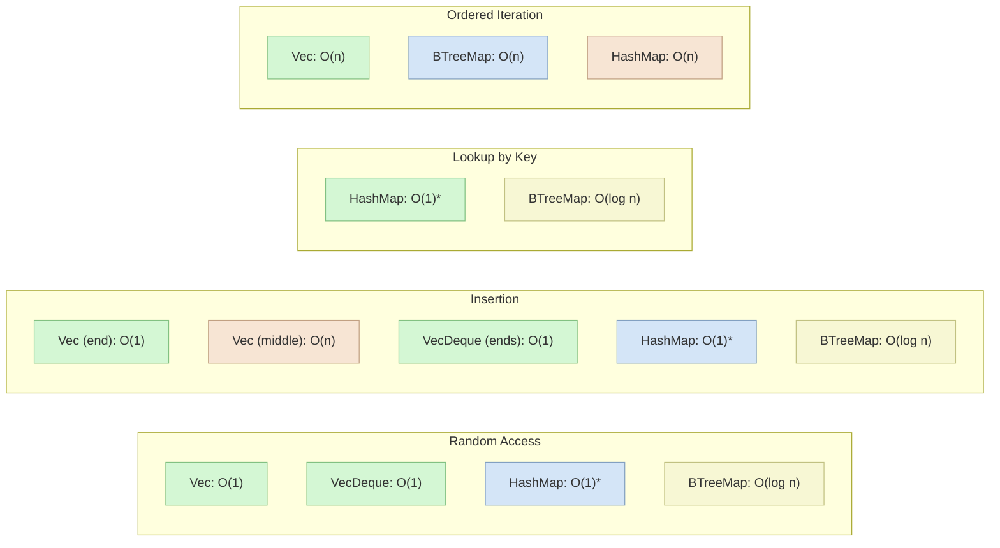

# Rust Collection Performance

## Introduction

When building applications in Rust, choosing the right collection type can significantly impact your program's performance. In this guide, we'll explore the performance characteristics of Rust's standard collections, helping you make informed decisions about which collection to use in different scenarios.

Understanding collection performance involves analyzing:
- Time complexity (how runtime changes as collection size grows)
- Memory usage 
- Access patterns (random vs sequential)
- Operation costs (insertion, deletion, lookup)

Let's dive into Rust's most common collections and understand their performance trade-offs!

## Common Collection Types and Their Performance Characteristics

### `Vec<T>`

The vector (`Vec<T>`) is Rust's dynamic array implementation. It stores elements in contiguous memory and can grow or shrink at runtime.

#### Performance Characteristics:

| Operation | Time Complexity | Notes |
|-----------|----------------|-------|
| Access by index | O(1) | Constant time random access |
| Push (at end) | Amortized O(1) | Usually constant time, but occasionally requires reallocation |
| Pop (from end) | O(1) | Constant time |
| Insert (at arbitrary position) | O(n) | Requires shifting elements |
| Remove (at arbitrary position) | O(n) | Requires shifting elements |
| Search (unsorted) | O(n) | Linear scan |
| Memory overhead | Low | Minimal per-item overhead |

#### Example Usage:

```rust
fn main() {
    // Creating a vector
    let mut numbers = Vec::new();
    
    // Adding elements (constant time)
    numbers.push(1);
    numbers.push(2);
    numbers.push(3);
    
    println!("Vector: {:?}", numbers);
    // Output: Vector: [1, 2, 3]
    
    // Accessing by index (constant time)
    let second = numbers[1];
    println!("Second element: {}", second);
    // Output: Second element: 2
    
    // Inserting in the middle (linear time)
    numbers.insert(1, 10);
    println!("After insertion: {:?}", numbers);
    // Output: After insertion: [1, 10, 2, 3]
    
    // Removing from the middle (linear time)
    numbers.remove(1);
    println!("After removal: {:?}", numbers);
    // Output: After removal: [1, 2, 3]
}
```

### `HashMap<K, V>`

`HashMap<K, V>` provides key-value storage with fast lookups. Rust's standard `HashMap` uses a hashing algorithm that's resistant to hash-table flooding attacks.

#### Performance Characteristics:

| Operation       | Time Complexity | Notes                                         |
|-----------------|-----------------|-----------------------------------------------|
| Insert          | Average O(1)    | Can degrade if there are many hash collisions |
| Get             | Average O(1)    | Can degrade if there are many hash collisions |
| Remove          | Average O(1)    | Can degrade if there are many hash collisions |
| Iterate         | O(n)            | Linear with number of entries                 |
| Memory overhead | Moderate        | Higher per-item overhead than Vec             |

#### Example Usage:

```rust
use std::collections::HashMap;

fn main() {
    // Creating a hash map
    let mut scores = HashMap::new();
    
    // Inserting entries (constant time on average)
    scores.insert("Alice", 98);
    scores.insert("Bob", 82);
    scores.insert("Charlie", 91);
    
    println!("Scores: {:?}", scores);
    // Output: Scores: {"Alice": 98, "Bob": 82, "Charlie": 91} (order may vary)
    
    // Looking up values (constant time on average)
    match scores.get("Bob") {
        Some(score) => println!("Bob's score: {}", score),
        None => println!("Bob not found")
    }
    // Output: Bob's score: 82
    
    // Updating a value
    scores.insert("Bob", 85);  // Overwrites the previous value
    
    // Entry API for conditional insertion
    scores.entry("Dave").or_insert(75);
    
    println!("Updated scores: {:?}", scores);
    // Output includes all entries with Bob's updated score and Dave added
}
```

### `HashSet<T>`

`HashSet<T>` is basically a `HashMap<T, ()>` - it stores unique values without associated data. It's optimized for fast membership testing.

#### Performance Characteristics:

| Operation | Time Complexity | Notes |
|-----------|----------------|-------|
| Insert | Average O(1) | Same as HashMap |
| Contains | Average O(1) | Fast membership testing |
| Remove | Average O(1) | Same as HashMap |
| Union/Intersection | O(n) | Where n is the size of the smaller set |
| Memory overhead | Moderate | Similar to HashMap |

#### Example Usage:

```rust
use std::collections::HashSet;

fn main() {
    // Creating a hash set
    let mut languages = HashSet::new();
    
    // Adding elements (constant time on average)
    languages.insert("Rust");
    languages.insert("Python");
    languages.insert("JavaScript");
    languages.insert("Rust");  // Duplicate, will be ignored
    
    println!("Languages: {:?}", languages);
    // Output: Languages: {"Rust", "Python", "JavaScript"} (order may vary)
    
    // Checking membership (constant time on average)
    if languages.contains("Rust") {
        println!("Rust is in the set");
    }
    // Output: Rust is in the set
    
    // Set operations
    let mut more_languages = HashSet::new();
    more_languages.insert("Go");
    more_languages.insert("Rust");
    
    // Finding the intersection
    let common = languages.intersection(&more_languages).cloned().collect::<HashSet<_>>();
    println!("Common languages: {:?}", common);
    // Output: Common languages: {"Rust"}
}
```

### `BTreeMap<K, V>`

`BTreeMap<K, V>` is a key-value map implemented as a B-Tree. Unlike HashMap, it keeps keys in sorted order.

#### Performance Characteristics:

| Operation | Time Complexity | Notes |
|-----------|----------------|-------|
| Insert | O(log n) | Slower than HashMap but maintains order |
| Get | O(log n) | Slower than HashMap |
| Remove | O(log n) | |
| Iterate | O(n) | In sorted order by key |
| Range queries | O(log n + k) | Where k is the number of elements in the range |
| Memory overhead | Moderate | More efficient than HashMap for small keys |

#### Example Usage:

```rust
use std::collections::BTreeMap;

fn main() {
    // Creating a BTreeMap
    let mut grades = BTreeMap::new();
    
    // Inserting entries (logarithmic time)
    grades.insert("Chemistry", "B+");
    grades.insert("Physics", "A-");
    grades.insert("Math", "A");
    grades.insert("English", "B");
    
    // BTreeMap keeps keys in sorted order
    println!("Grades by subject (alphabetical):");
    for (subject, grade) in &grades {
        println!("{}: {}", subject, grade);
    }
    // Output will be in alphabetical order: Chemistry, English, Math, Physics
    
    // Range queries - get subjects from "Math" through "Physics"
    println!("
Subset of grades:");
    for (subject, grade) in grades.range("Math"..="Physics") {
        println!("{}: {}", subject, grade);
    }
    // Output: Math: A, Physics: A-
}
```

### `VecDeque<T>`

`VecDeque<T>` is a double-ended queue implemented as a ring buffer. It's optimized for adding and removing from both ends.

#### Performance Characteristics:

| Operation | Time Complexity | Notes |
|-----------|----------------|-------|
| Push front/back | Amortized O(1) | Occasionally requires reallocation |
| Pop front/back | O(1) | Constant time from either end |
| Access by index | O(1) | Constant time random access |
| Insert/remove middle | O(n) | Requires shifting elements |
| Memory overhead | Low | Slightly more than Vec |

#### Example Usage:

```rust
use std::collections::VecDeque;

fn main() {
    // Creating a VecDeque
    let mut queue = VecDeque::new();
    
    // Adding elements to both ends
    queue.push_back("last");
    queue.push_front("first");
    queue.push_back("very last");
    
    println!("Queue: {:?}", queue);
    // Output: Queue: ["first", "last", "very last"]
    
    // Removing from both ends
    let first = queue.pop_front();
    let last = queue.pop_back();
    
    println!("Removed first: {:?}", first);
    println!("Removed last: {:?}", last);
    println!("Queue now: {:?}", queue);
    // Output: Removed first: Some("first")
    //         Removed last: Some("very last")
    //         Queue now: ["last"]
}
```

## Performance Comparison Visualization

The following diagram visualizes the relative performance of different operations across Rust's collection types:



\* Average case, can degrade with hash collisions

## Real-world Applications and Performance Considerations

Let's explore some common scenarios and which collections perform best:

### Scenario 1: Caching Frequently Accessed Data

When building a cache, you need fast lookups by key:

```rust
use std::collections::HashMap;

struct SimpleCache<K, V> {
    data: HashMap<K, V>,
    capacity: usize,
}

impl<K: std::hash::Hash + Eq, V> SimpleCache<K, V> {
    fn new(capacity: usize) -> Self {
        SimpleCache {
            data: HashMap::with_capacity(capacity),
            capacity,
        }
    }
    
    fn get(&self, key: &K) -> Option<&V> {
        // O(1) lookup time is perfect for caches
        self.data.get(key)
    }
    
    fn put(&mut self, key: K, value: V) {
        // Simple eviction policy: remove random items when over capacity
        if self.data.len() >= self.capacity {
            if let Some(k) = self.data.keys().next().cloned() {
                self.data.remove(&k);
            }
        }
        self.data.insert(key, value);
    }
}

fn main() {
    let mut cache = SimpleCache::new(2);
    cache.put("key1", "value1");
    cache.put("key2", "value2");
    
    println!("key1: {:?}", cache.get(&"key1"));
    // Output: key1: Some("value1")
    
    // This will evict an existing entry since capacity is 2
    cache.put("key3", "value3");
}
```

**Why HashMap?** The O(1) average time for lookups and insertions makes HashMap ideal for caching scenarios where speed is critical.

### Scenario 2: Processing a Queue of Tasks

When implementing a task queue, you need efficient operations at both ends:

```rust
use std::collections::VecDeque;

struct TaskQueue<T> {
    tasks: VecDeque<T>,
}

impl<T> TaskQueue<T> {
    fn new() -> Self {
        TaskQueue {
            tasks: VecDeque::new(),
        }
    }
    
    fn add_task(&mut self, task: T) {
        // Add to the back of the queue
        self.tasks.push_back(task);
    }
    
    fn add_priority_task(&mut self, task: T) {
        // Add to the front of the queue
        self.tasks.push_front(task);
    }
    
    fn process_next_task(&mut self) -> Option<T> {
        // Process from the front of the queue
        self.tasks.pop_front()
    }
}

fn main() {
    let mut queue = TaskQueue::new();
    
    // Add regular tasks
    queue.add_task("Send email");
    queue.add_task("Generate report");
    
    // Add high priority task
    queue.add_priority_task("Fix critical bug");
    
    // Process tasks in order
    while let Some(task) = queue.process_next_task() {
        println!("Processing task: {}", task);
    }
    // Output:
    // Processing task: Fix critical bug
    // Processing task: Send email
    // Processing task: Generate report
}
```

**Why VecDeque?** The constant-time operations at both ends make it perfect for queue processing patterns.

### Scenario 3: Maintaining a Sorted Index

When you need to maintain sorted data and perform range queries:

```rust
use std::collections::BTreeMap;

struct StudentRegistry {
    // Using GPA as key to keep students sorted by grade
    students_by_gpa: BTreeMap<f32, Vec<String>>,
}

impl StudentRegistry {
    fn new() -> Self {
        StudentRegistry {
            students_by_gpa: BTreeMap::new(),
        }
    }
    
    fn add_student(&mut self, name: String, gpa: f32) {
        self.students_by_gpa
            .entry(gpa)
            .or_insert_with(Vec::new)
            .push(name);
    }
    
    fn honor_roll_students(&self) -> Vec<String> {
        // Get students with GPA of 3.5 or higher
        let mut result = Vec::new();
        
        // Efficient range query with BTreeMap
        for (_, students) in self.students_by_gpa.range(3.5..) {
            result.extend(students.iter().cloned());
        }
        
        result
    }
}

fn main() {
    let mut registry = StudentRegistry::new();
    
    registry.add_student("Alice".to_string(), 3.9);
    registry.add_student("Bob".to_string(), 3.2);
    registry.add_student("Charlie".to_string(), 3.7);
    registry.add_student("Diana".to_string(), 4.0);
    
    let honor_students = registry.honor_roll_students();
    println!("Honor Roll Students: {:?}", honor_students);
    // Output: Honor Roll Students: ["Charlie", "Alice", "Diana"]
    // (order may vary within same GPA groups)
}
```

**Why BTreeMap?** The ordered nature and efficient range queries make BTreeMap perfect for storing and retrieving sorted data.

## Performance Pitfalls and Best Practices

### 1. Avoid Unnecessary Allocations

```rust
// Inefficient: Creates temporary Vec in each iteration
let mut all_items = Vec::new();
for i in 0..1000 {
    let mut temp = Vec::new();
    temp.push(i);
    all_items.extend(temp);
}

// Better: Preallocate with capacity
let mut all_items = Vec::with_capacity(1000);
for i in 0..1000 {
    all_items.push(i);
}
```

### 2. Use Entry API for HashMaps and BTreeMaps

```rust
use std::collections::HashMap;

// Inefficient: Two lookups (one for contains_key, one for insert)
fn count_word_inefficient(counts: &mut HashMap<String, u32>, word: String) {
    if counts.contains_key(&word) {
        let count = counts.get(&word).unwrap() + 1;
        counts.insert(word, count);
    } else {
        counts.insert(word, 1);
    }
}

// Better: Single lookup with Entry API
fn count_word_efficient(counts: &mut HashMap<String, u32>, word: String) {
    *counts.entry(word).or_insert(0) += 1;
}
```

### 3. Choose the Right Collection for Iteration Patterns

```rust
// If you need to iterate in insertion order: Vec
let items = vec!["apple", "banana", "cherry"];
for item in &items {
    println!("{}", item);
}

// If you need to iterate in sorted order: BTreeMap/BTreeSet
use std::collections::BTreeSet;
let mut sorted_items = BTreeSet::new();
sorted_items.insert("banana");
sorted_items.insert("apple");
sorted_items.insert("cherry");

for item in &sorted_items {
    println!("{}", item); // Will print in alphabetical order
}
```

### 4. Watch Out for HashDoS Attacks

Rust's standard HashMap uses a HashDoS-resistant algorithm by default, but be aware that predictable keys can still cause performance issues in extreme cases. When handling user input that becomes hash keys, consider additional validation or rate limiting to prevent abuse.

## Performance Benchmarking

Here's an example of how to benchmark collection performance using the `criterion` crate:

```rust
// Note: In a real project, you'd add criterion to Cargo.toml:
// [dev-dependencies]
// criterion = "0.3"

// Example benchmark code
use criterion::{black_box, criterion_group, criterion_main, Criterion};
use std::collections::{HashMap, BTreeMap};

fn bench_maps(c: &mut Criterion) {
    let mut group = c.benchmark_group("Map Lookups");
    
    let keys: Vec<i32> = (0..1000).collect();
    
    // HashMap benchmark
    {
        let mut hash_map = HashMap::new();
        for i in 0..1000 {
            hash_map.insert(i, i.to_string());
        }
        
        group.bench_function("HashMap lookup", |b| b.iter(|| {
            for key in &keys {
                black_box(hash_map.get(key));
            }
        }));
    }
    
    // BTreeMap benchmark
    {
        let mut btree_map = BTreeMap::new();
        for i in 0..1000 {
            btree_map.insert(i, i.to_string());
        }
        
        group.bench_function("BTreeMap lookup", |b| b.iter(|| {
            for key in &keys {
                black_box(btree_map.get(key));
            }
        }));
    }
    
    group.finish();
}

criterion_group!(benches, bench_maps);
criterion_main!(benches);
```

## Summary

Understanding the performance characteristics of Rust's collections allows you to make informed decisions when designing your applications:

- **`Vec<T>`** excels at sequential access and operations at the end.
- **`HashMap<K, V>`** and **`HashSet<T>`** provide near-constant time lookups at the cost of no ordering.
- **`BTreeMap<K, V>`** and **`BTreeSet<T>`** maintain sorting at the cost of slightly slower operations.
- **`VecDeque<T>`** is ideal for queue-like operations from both ends.

Key takeaways:
1. Choose collections based on your access patterns (random vs sequential, ordered vs unordered)
2. Consider memory usage alongside algorithmic complexity
3. Preallocate capacity when the size is known
4. Use specialized APIs like entry() for more efficient operations
5. Benchmark when in doubt about performance trade-offs

## Additional Resources

- [Rust Standard Library Documentation](https://doc.rust-lang.org/std/collections/index.html) - Official documentation on Rust collections
- [The Rust Performance Book](https://nnethercote.github.io/perf-book/) - In-depth guide on Rust performance
- [Time Complexity of Rust Operations](https://doc.rust-lang.org/std/collections/#performance) - Official reference for collection performance

## Exercises

1. **Collection Benchmark**: Create a simple benchmark comparing `Vec` vs `LinkedList` for different operations. Which performs better for random access? For insertion in the middle?

2. **Custom Cache**: Implement a Least Recently Used (LRU) cache using a combination of `HashMap` and `VecDeque`. How does the performance compare to a naive implementation?

3. **Word Frequency Counter**: Compare the performance of counting word frequencies using `HashMap` vs `BTreeMap`. Which is faster? How does the performance change when you need to print the results in alphabetical order?

4. **Collection Migration**: Identify a performance bottleneck in this simple function and improve it by changing the collection type:

   ```rust
   fn find_duplicates(items: &[i32]) -> Vec<i32> {
       let mut seen = Vec::new();
       let mut duplicates = Vec::new();
       
       for &item in items {
           if seen.contains(&item) && !duplicates.contains(&item) {
               duplicates.push(item);
           } else {
               seen.push(item);
           }
       }
       
       duplicates
   }
   ```

5. **Data Analysis Pipeline**: Design a system for processing a stream of data points where you need to:
   - Store the last 100 points for quick access
   - Maintain a sorted index of values
   - Quickly look up points by their ID
   
   Which collection(s) would you use for each requirement?