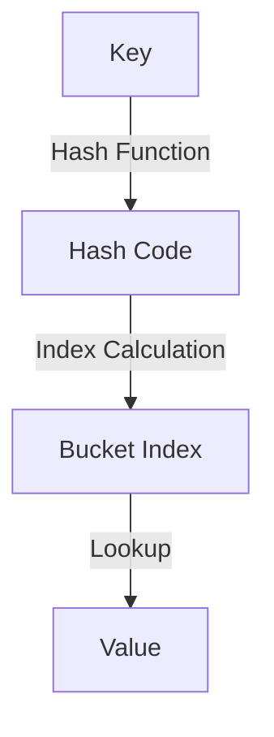

# Rust HashMaps

## Introduction

HashMaps are one of the most useful and common data structures in programming. In Rust, the `HashMap` is a collection that stores data as key-value pairs, allowing you to quickly look up values based on their associated keys. Unlike arrays or vectors where you access elements by their position (index), HashMaps let you access data using meaningful keys.

HashMaps are part of Rust's standard library and provide an efficient way to implement mappings, dictionaries, or associative arrays. They are particularly useful when you need to:

- Store and retrieve values associated with specific keys
- Check if a particular key exists
- Update or remove values for specific keys

In this guide, we'll explore how HashMaps work in Rust, their basic operations, and practical examples of using them in real-world scenarios.

## Getting Started with HashMaps

### Importing HashMap

Before using a HashMap, you need to import it from the standard library:

```rust
use std::collections::HashMap;
```

### Creating a New HashMap

You can create an empty HashMap using the `new()` method:

```rust
// Create a new, empty HashMap
let mut scores = HashMap::new();
```

Note the `mut` keyword, which makes our HashMap mutable so we can add elements to it.

### Adding Elements

Let's add some key-value pairs to our HashMap:

```rust
let mut scores = HashMap::new();

// Add some key-value pairs
scores.insert(String::from("Blue"), 10);
scores.insert(String::from("Red"), 25);

println!("{:?}", scores);
```

**Output:**
```
{"Blue": 10, "Red": 25}
```

In this example, the keys are strings (team names) and the values are integers (scores).

## Basic HashMap Operations

### Accessing Values

To retrieve a value from a HashMap, use the `get` method with the key:

```rust
let mut scores = HashMap::new();
scores.insert(String::from("Blue"), 10);
scores.insert(String::from("Red"), 25);

// Get a value using its key
let blue_score = scores.get("Blue");

println!("Blue team's score: {:?}", blue_score);
```

**Output:**
```
Blue team's score: Some(10)
```

Notice that `get` returns an `Option<&V>` - `Some(&value)` if the key exists, or `None` if it doesn't.

### Handling Non-Existent Keys

We can safely handle the case when a key might not exist:

```rust
let mut scores = HashMap::new();
scores.insert(String::from("Blue"), 10);

// Safely access a value that might not exist
match scores.get("Yellow") {
    Some(score) => println!("Yellow team's score: {}", score),
    None => println!("Yellow team hasn't played yet"),
}
```

**Output:**
```
Yellow team hasn't played yet
```

### Updating Values

There are several ways to update values in a HashMap:

1. **Overwriting a value**:

```rust
let mut scores = HashMap::new();
scores.insert(String::from("Blue"), 10);

// Overwrite the existing value
scores.insert(String::from("Blue"), 25);

println!("{:?}", scores);
```

**Output:**
```
{"Blue": 25}
```

2. **Only inserting if the key doesn't exist**:

```rust
let mut scores = HashMap::new();
scores.insert(String::from("Blue"), 10);

// Insert only if the key doesn't exist
scores.entry(String::from("Blue")).or_insert(50);
scores.entry(String::from("Yellow")).or_insert(50);

println!("{:?}", scores);
```

**Output:**
```
{"Blue": 10, "Yellow": 50}
```

3. **Updating a value based on the old value**:

```rust
let mut scores = HashMap::new();
scores.insert(String::from("Blue"), 10);

// Update a value based on the old value
let blue_score = scores.entry(String::from("Blue")).or_insert(0);
*blue_score += 5;

println!("{:?}", scores);
```

**Output:**
```
{"Blue": 15}
```

### Removing Entries

To remove a key-value pair from a HashMap, use the `remove` method:

```rust
let mut scores = HashMap::new();
scores.insert(String::from("Blue"), 10);
scores.insert(String::from("Red"), 25);

// Remove an entry
scores.remove("Blue");

println!("{:?}", scores);
```

**Output:**
```
{"Red": 25}
```

### Checking if a Key Exists

You can check if a key exists in a HashMap using the `contains_key` method:

```rust
let mut scores = HashMap::new();
scores.insert(String::from("Blue"), 10);

if scores.contains_key("Blue") {
    println!("The Blue team has a score!");
} else {
    println!("The Blue team hasn't played yet.");
}
```

**Output:**
```
The Blue team has a score!
```

### Iterating Over a HashMap

You can iterate over all key-value pairs in a HashMap:

```rust
let mut scores = HashMap::new();
scores.insert(String::from("Blue"), 10);
scores.insert(String::from("Red"), 25);
scores.insert(String::from("Green"), 17);

// Iterate over all key-value pairs
for (key, value) in &scores {
    println!("{}: {}", key, value);
}
```

**Output:**
```
Green: 17
Blue: 10
Red: 25
```

Note: The order of iteration is not guaranteed, as HashMaps are unordered.

## How HashMaps Work in Rust

Under the hood, Rust's `HashMap` uses a hashing algorithm to convert keys into unique indices. This allows for quick lookups, since the hash of a key directly points to where the value is stored.



When you insert a key-value pair:
1. The key is passed through a hash function to produce a hash code
2. The hash code is used to determine which "bucket" to store the pair in
3. If multiple keys hash to the same bucket (a "collision"), Rust handles this using a technique called "separate chaining"

By default, Rust uses a cryptographically secure hashing algorithm (SipHash) which provides protection against hash table collision attacks but might be slower than other algorithms for small keys.

## Ownership with HashMaps

Rust's ownership rules apply to HashMaps too:

1. For types that implement the `Copy` trait (like `i32`), values are copied into the HashMap
2. For owned types (like `String`), values are moved into the HashMap and the HashMap becomes the owner

```rust
let team_name = String::from("Blue");
let score = 10;

let mut scores = HashMap::new();
scores.insert(team_name, score);

// Error: team_name has been moved into the HashMap
// println!("Team name: {}", team_name);

// This works fine because i32 implements Copy
println!("Score: {}", score);
```

If you want to keep ownership of a value, you can insert a reference to the value into the HashMap. However, you must ensure that the referenced value outlives the HashMap.

## Practical Examples

### Example 1: Word Frequency Counter

Let's build a simple program that counts the frequency of words in a text:

```rust
use std::collections::HashMap;

fn main() {
    let text = "hello world hello rust programming rust is fun";
    let mut word_counts = HashMap::new();
    
    for word in text.split_whitespace() {
        let count = word_counts.entry(word).or_insert(0);
        *count += 1;
    }
    
    println!("Word frequencies:");
    for (word, count) in &word_counts {
        println!("{}: {}", word, count);
    }
}
```

**Output:**
```
Word frequencies:
programming: 1
world: 1
is: 1
rust: 2
fun: 1
hello: 2
```

### Example 2: Employee Directory

Let's create a simple employee directory using a HashMap:

```rust
use std::collections::HashMap;

fn main() {
    // Create a new HashMap to store employee information
    let mut employees = HashMap::new();
    
    // Add some employees (ID -> Name)
    employees.insert(1001, String::from("Alice Johnson"));
    employees.insert(1002, String::from("Bob Smith"));
    employees.insert(1003, String::from("Charlie Brown"));
    
    // Look up an employee by ID
    let employee_id = 1002;
    match employees.get(&employee_id) {
        Some(name) => println!("Employee #{}: {}", employee_id, name),
        None => println!("No employee found with ID #{}", employee_id),
    }
    
    // Print all employees
    println!("
Employee Directory:");
    for (id, name) in &employees {
        println!("ID: {}, Name: {}", id, name);
    }
    
    // Update an employee's name
    if let Some(name) = employees.get_mut(&1001) {
        *name = String::from("Alice Williams");
    }
    
    // Check if the update worked
    println!("
After update:");
    if let Some(name) = employees.get(&1001) {
        println!("Employee #1001: {}", name);
    }
}
```

**Output:**
```
Employee #1002: Bob Smith

Employee Directory:
ID: 1001, Name: Alice Johnson
ID: 1003, Name: Charlie Brown
ID: 1002, Name: Bob Smith

After update:
Employee #1001: Alice Williams
```

### Example 3: Cache Implementation

HashMaps are perfect for implementing caches. Here's a simple function memoization example:

```rust
use std::collections::HashMap;

// A function to calculate Fibonacci numbers
fn fibonacci(n: u64, cache: &mut HashMap<u64, u64>) -> u64 {
    // Check if result is in cache
    if let Some(&result) = cache.get(&n) {
        return result;
    }
    
    // Calculate result if not in cache
    let result = match n {
        0 => 0,
        1 => 1,
        _ => fibonacci(n-1, cache) + fibonacci(n-2, cache),
    };
    
    // Store result in cache
    cache.insert(n, result);
    result
}

fn main() {
    let mut cache = HashMap::new();
    
    // Calculate and time some Fibonacci numbers
    for n in [10, 20, 30, 40] {
        let start = std::time::Instant::now();
        let result = fibonacci(n, &mut cache);
        let duration = start.elapsed();
        
        println!("fibonacci({}) = {} (calculated in {:?})", n, result, duration);
    }
}
```

**Output:**
```
fibonacci(10) = 55 (calculated in 1.19µs)
fibonacci(20) = 6765 (calculated in 1.01µs)
fibonacci(30) = 832040 (calculated in 964ns)
fibonacci(40) = 102334155 (calculated in 965ns)
```

Notice how the calculation time remains nearly constant even as we compute larger Fibonacci numbers, thanks to our HashMap cache.

## Advanced HashMap Features

### Custom Key Types

To use a struct as a key in a HashMap, it must implement the `Hash`, `Eq`, and `PartialEq` traits. You can derive these automatically:

```rust
use std::collections::HashMap;

#[derive(Hash, Eq, PartialEq, Debug)]
struct Student {
    id: u32,
    first_name: String,
    last_name: String,
}

fn main() {
    let mut grades = HashMap::new();
    
    let student1 = Student {
        id: 1,
        first_name: String::from("Alice"),
        last_name: String::from("Johnson"),
    };
    
    let student2 = Student {
        id: 2,
        first_name: String::from("Bob"),
        last_name: String::from("Smith"),
    };
    
    // Insert grades for students
    grades.insert(student1, 95);
    grades.insert(student2, 87);
    
    // Print all students and their grades
    for (student, grade) in &grades {
        println!("{:?}: {}", student, grade);
    }
}
```

### Alternative HashMap Implementations

Rust's standard library provides other HashMap variants:

- `BTreeMap`: A map based on a B-Tree, which keeps its keys sorted
- `HashMap` with custom hashers: You can use different hashing algorithms by specifying a different hasher

```rust
use std::collections::HashMap;
use std::hash::BuildHasherDefault;
use rustc_hash::FxHasher; // You'll need to add rustc-hash to your dependencies

// Create a HashMap with a faster but non-cryptographic hasher
type FastMap<K, V> = HashMap<K, V, BuildHasherDefault<FxHasher>>;

fn main() {
    let mut fast_map: FastMap<String, i32> = FastMap::default();
    fast_map.insert(String::from("fast"), 1);
    println!("{:?}", fast_map);
}
```

## Summary

HashMaps are a powerful and flexible collection type in Rust that allow you to:

- Store and retrieve key-value pairs efficiently
- Update values based on their current state
- Check for the existence of keys
- Iterate over all key-value pairs

They are essential for many programming tasks, from simple lookups to complex data processing. Rust's HashMap implementation provides safety guarantees through the ownership system while still offering high performance.

Key points to remember:
- HashMaps are unordered collections
- Keys must implement the `Hash`, `Eq`, and `PartialEq` traits
- HashMap operations generally have O(1) average-case time complexity
- The default hashing algorithm prioritizes security over speed

## Additional Resources and Exercises

### Resources
- [Rust Documentation on HashMap](https://doc.rust-lang.org/std/collections/struct.HashMap.html)
- [The Rust Programming Language book - Chapter on Collections](https://doc.rust-lang.org/book/ch08-03-hash-maps.html)

### Exercises

1. **Phone Book**: Create a simple phone book application that allows users to add, remove, and look up phone numbers by name.

2. **Word Replacer**: Write a program that replaces specific words in a text with other words defined in a HashMap.

3. **Inventory System**: Implement a basic inventory system for a store, using HashMaps to track products, their prices, and quantities.

4. **Character Counter**: Extend the word frequency example to count individual characters in a text (including spaces and punctuation).

5. **Two Sum**: Solve the classic "Two Sum" problem: Given an array of integers and a target sum, find two numbers in the array that add up to the target.

These exercises will help you become more comfortable using HashMaps in practical scenarios and solidify your understanding of this important collection type.