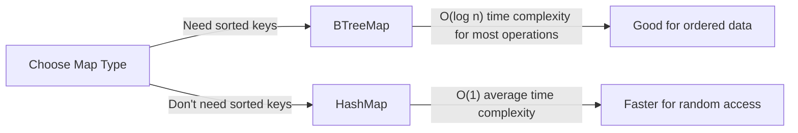
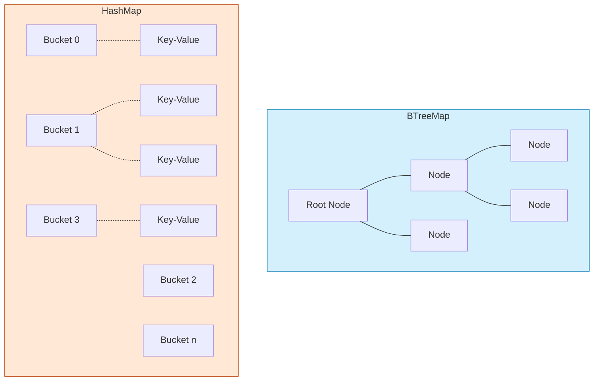

# Rust BTreeMaps

## Introduction

Welcome to our guide on `BTreeMap` in Rust! As part of the Rust Collections family, the `BTreeMap` is a versatile ordered map implementation that offers a powerful balance of performance characteristics.

A `BTreeMap` is an ordered collection that stores key-value pairs, where:
- Each key in the map is unique
- Data is stored in a balanced tree structure (specifically a B-tree)
- Keys are sorted in ascending order
- Operations maintain logarithmic time complexity

If you're coming from other programming languages, you might recognize similar data structures like:
- `TreeMap` in Java
- `std::map` in C++
- `SortedDictionary` in C#

Let's dive into the world of Rust's `BTreeMap` and learn how to harness its capabilities!

## Getting Started with BTreeMap

### Importing BTreeMap

To use `BTreeMap` in your Rust program, you first need to import it from the standard library:

```rust
use std::collections::BTreeMap;
```

### Creating a BTreeMap

Let's start by creating a new, empty `BTreeMap`:

```rust
// Create an empty BTreeMap with keys of type String and values of type i32
let mut score_map: BTreeMap<String, i32> = BTreeMap::new();

// Using type inference:
let mut score_map = BTreeMap::new();
score_map.insert(String::from("Alice"), 95);
```

You can also create a `BTreeMap` from an iterator of key-value pairs using the `collect` method:

```rust
let scores = [
    (String::from("Alice"), 95),
    (String::from("Bob"), 87),
    (String::from("Charlie"), 91),
];

let score_map: BTreeMap<_, _> = scores.into_iter().collect();
println!("{:?}", score_map);
```

Output:
```
{"Alice": 95, "Bob": 87, "Charlie": 91}
```

## Basic Operations

### Inserting Elements

To add key-value pairs to a `BTreeMap`, use the `insert` method:

```rust
let mut map = BTreeMap::new();

// Insert key-value pairs
map.insert("apple", 5);
map.insert("banana", 3);
map.insert("cherry", 8);

println!("{:?}", map);
```

Output:
```
{"apple": 5, "banana": 3, "cherry": 8}
```

Note that keys are stored in sorted order (alphabetically in this case).

### Accessing Values

There are several ways to access values in a `BTreeMap`:

```rust
let mut map = BTreeMap::new();
map.insert("apple", 5);
map.insert("banana", 3);
map.insert("cherry", 8);

// Using get method (returns Option<&V>)
if let Some(&value) = map.get("banana") {
    println!("Value for 'banana': {}", value);
} else {
    println!("'banana' not found!");
}

// Using indexing (panics if key doesn't exist)
let cherry_count = map["cherry"];
println!("Cherry count: {}", cherry_count);

// Using get_key_value to get both the key and value
if let Some((key, &value)) = map.get_key_value("apple") {
    println!("Found key: {} with value: {}", key, value);
}
```

Output:
```
Value for 'banana': 3
Cherry count: 8
Found key: apple with value: 5
```

### Updating Values

You can update values in several ways:

```rust
let mut map = BTreeMap::new();
map.insert("apples", 5);

// Simple replacement
map.insert("apples", 10); // Replaces the old value

// Update based on old value
if let Some(value) = map.get_mut("apples") {
    *value += 3;
}
println!("Updated apples: {}", map["apples"]);

// Entry API for more complex updates
map.entry("bananas").or_insert(0);
*map.entry("bananas").or_insert(0) += 5;

println!("{:?}", map);
```

Output:
```
Updated apples: 13
{"apples": 13, "bananas": 5}
```

### Removing Elements

To remove key-value pairs:

```rust
let mut map = BTreeMap::new();
map.insert("apple", 5);
map.insert("banana", 3);
map.insert("cherry", 8);

// Remove and return the value
if let Some(value) = map.remove("banana") {
    println!("Removed 'banana' with value: {}", value);
}

// Check if key exists
if !map.contains_key("banana") {
    println!("'banana' is no longer in the map!");
}

println!("Remaining map: {:?}", map);
```

Output:
```
Removed 'banana' with value: 3
'banana' is no longer in the map!
Remaining map: {"apple": 5, "cherry": 8}
```

## Iterating Over a BTreeMap

`BTreeMap` provides several ways to iterate through its contents:

```rust
let mut map = BTreeMap::new();
map.insert("apple", 5);
map.insert("banana", 3);
map.insert("cherry", 8);

// Iterate over key-value pairs (in sorted key order)
println!("All fruits:");
for (fruit, count) in &map {
    println!("- {}: {}", fruit, count);
}

// Iterate over just keys
println!("
Fruit names:");
for fruit in map.keys() {
    println!("- {}", fruit);
}

// Iterate over just values
println!("
Fruit counts:");
for count in map.values() {
    println!("- {}", count);
}
```

Output:
```
All fruits:
- apple: 5
- banana: 3
- cherry: 8

Fruit names:
- apple
- banana
- cherry

Fruit counts:
- 5
- 3
- 8
```

## Range Operations

One powerful feature of `BTreeMap` is its ability to work with ranges of keys:

```rust
use std::collections::BTreeMap;
use std::ops::Bound::{Included, Excluded, Unbounded};

let mut map = BTreeMap::new();
map.insert(1, "one");
map.insert(2, "two");
map.insert(3, "three");
map.insert(4, "four");
map.insert(5, "five");

// Get a range of entries (2...4 inclusive)
println!("Values from 2 to 4:");
for (key, value) in map.range(2..=4) {
    println!("{}: {}", key, value);
}

// More flexible range using Bound
println!("
Values from after 2 to before 5:");
for (key, value) in map.range((Excluded(2), Excluded(5))) {
    println!("{}: {}", key, value);
}

// All values up to 3
println!("
Values up to 3:");
for (key, value) in map.range(..=3) {
    println!("{}: {}", key, value);
}
```

Output:
```
Values from 2 to 4:
2: two
3: three
4: four

Values from after 2 to before 5:
3: three
4: four

Values up to 3:
1: one
2: two
3: three
```

## Performance Characteristics

Understanding `BTreeMap`'s performance helps you decide when to use it:



Here's how `BTreeMap` compares to `HashMap`:

| Operation | BTreeMap       | HashMap                 |
|-----------|----------------|-------------------------|
| Insert    | O(log n)       | O(1) average            |
| Remove    | O(log n)       | O(1) average            |
| Lookup    | O(log n)       | O(1) average            |
| Iteration | O(n) in order  | O(n) in arbitrary order |
| Memory    | More efficient | More overhead           |
| Key Order | Sorted         | Unordered               |

Use `BTreeMap` when:
- You need keys in sorted order
- You need to find the closest keys to a given value
- Memory efficiency is important
- You need range operations

## Real-World Applications

### Application 1: Word Frequency Counter

Let's build a simple word frequency counter that keeps words in alphabetical order:

```rust
use std::collections::BTreeMap;

fn word_frequency(text: &str) -> BTreeMap<String, usize> {
    let mut frequency = BTreeMap::new();
    
    for word in text.split_whitespace() {
        // Clean the word (remove punctuation and convert to lowercase)
        let clean_word = word.trim_matches(|c: char| !c.is_alphabetic())
                            .to_lowercase();
        
        if !clean_word.is_empty() {
            // Increment the count for this word
            *frequency.entry(clean_word).or_insert(0) += 1;
        }
    }
    
    frequency
}

fn main() {
    let text = "Rust is a multi-paradigm, general-purpose programming language. 
                Rust emphasizes performance, type safety, and concurrency. 
                Rust enforces memory safety without using garbage collection.";
    
    let word_counts = word_frequency(text);
    
    println!("Word frequencies (in alphabetical order):");
    for (word, count) in &word_counts {
        println!("{}: {}", word, count);
    }
}
```

Output:
```
Word frequencies (in alphabetical order):
a: 1
and: 2
collection: 1
concurrency: 1
emphasizes: 1
enforces: 1
garbage: 1
general: 1
is: 1
language: 1
memory: 1
multi: 1
paradigm: 1
performance: 1
programming: 1
purpose: 1
rust: 3
safety: 2
type: 1
using: 1
without: 1
```

### Application 2: Temperature Log by Date

Let's create a temperature logging system that automatically keeps readings sorted by date:

```rust
use std::collections::BTreeMap;
use std::cmp::Ordering;

#[derive(Debug, PartialEq, Eq)]
struct Date {
    year: u16,
    month: u8,
    day: u8,
}

impl Ord for Date {
    fn cmp(&self, other: &Self) -> Ordering {
        (self.year, self.month, self.day).cmp(&(other.year, other.month, other.day))
    }
}

impl PartialOrd for Date {
    fn partial_cmp(&self, other: &Self) -> Option<Ordering> {
        Some(self.cmp(other))
    }
}

fn main() {
    let mut temperature_log = BTreeMap::new();
    
    // Add temperature readings
    temperature_log.insert(Date { year: 2023, month: 1, day: 15 }, 2.5);
    temperature_log.insert(Date { year: 2023, month: 3, day: 10 }, 8.7);
    temperature_log.insert(Date { year: 2023, month: 2, day: 5 }, 3.2);
    temperature_log.insert(Date { year: 2022, month: 12, day: 25 }, -1.8);
    temperature_log.insert(Date { year: 2023, month: 1, day: 5 }, 1.3);
    
    // Display temperature readings in chronological order
    println!("Temperature Log (Chronological Order):");
    for (date, temp) in &temperature_log {
        println!("{}-{:02}-{:02}: {:.1}°C", date.year, date.month, date.day, temp);
    }
    
    // Get temperature readings for a specific month range
    let start_date = Date { year: 2023, month: 1, day: 1 };
    let end_date = Date { year: 2023, month: 2, day: 28 };
    
    println!("
Temperatures from Jan-Feb 2023:");
    for (date, temp) in temperature_log.range(start_date..=end_date) {
        println!("{}-{:02}-{:02}: {:.1}°C", date.year, date.month, date.day, temp);
    }
}
```

Output:
```
Temperature Log (Chronological Order):
2022-12-25: -1.8°C
2023-01-05: 1.3°C
2023-01-15: 2.5°C
2023-02-05: 3.2°C
2023-03-10: 8.7°C

Temperatures from Jan-Feb 2023:
2023-01-05: 1.3°C
2023-01-15: 2.5°C
2023-02-05: 3.2°C
```

## Advanced Features

### Entry API

The Entry API provides a powerful way to manipulate elements:

```rust
use std::collections::BTreeMap;

fn main() {
    let mut player_scores = BTreeMap::new();
    
    // Add a score only if the player doesn't exist
    player_scores.entry("Alice").or_insert(100);
    
    // Modify a value if the key exists, otherwise insert a default
    *player_scores.entry("Bob").or_insert(0) += 50;
    
    // Use and_modify with or_insert for complex logic
    player_scores.entry("Charlie")
        .and_modify(|score| *score += 25)
        .or_insert(75);
    
    // Make a more complex modification based on whether the key exists
    player_scores.entry("Alice")
        .and_modify(|score| *score += 20)
        .or_insert(0);
    
    println!("Player scores: {:?}", player_scores);
}
```

Output:
```
Player scores: {"Alice": 120, "Bob": 50, "Charlie": 75}
```

### Using BTreeMap with Custom Types

To use custom types as keys in a `BTreeMap`, they must implement `Ord`:

```rust
use std::collections::BTreeMap;
use std::cmp::Ordering;

#[derive(Debug, PartialEq, Eq)]
struct Student {
    id: u32,
    name: String,
}

impl Ord for Student {
    fn cmp(&self, other: &Self) -> Ordering {
        self.id.cmp(&other.id)
    }
}

impl PartialOrd for Student {
    fn partial_cmp(&self, other: &Self) -> Option<Ordering> {
        Some(self.cmp(other))
    }
}

fn main() {
    let mut grades = BTreeMap::new();
    
    // Add students and their grades
    grades.insert(
        Student { id: 1001, name: String::from("Alice") }, 
        95.5
    );
    
    grades.insert(
        Student { id: 1003, name: String::from("Bob") }, 
        87.2
    );
    
    grades.insert(
        Student { id: 1002, name: String::from("Charlie") }, 
        91.8
    );
    
    // Display students sorted by ID
    println!("Student Grades (Sorted by ID):");
    for (student, grade) in &grades {
        println!("ID: {}, Name: {}, Grade: {:.1}", 
                student.id, student.name, grade);
    }
}
```

Output:
```
Student Grades (Sorted by ID):
ID: 1001, Name: Alice, Grade: 95.5
ID: 1002, Name: Charlie, Grade: 91.8
ID: 1003, Name: Bob, Grade: 87.2
```

## Comparing BTreeMap and HashMap

Let's visualize the difference between `BTreeMap` and `HashMap`:



Here's a simple benchmark comparing their performance:

```rust
use std::collections::{BTreeMap, HashMap};
use std::time::{Duration, Instant};

fn benchmark<F>(name: &str, iterations: u32, f: F) -> Duration
where
    F: Fn(),
{
    let start = Instant::now();
    for _ in 0..iterations {
        f();
    }
    let duration = start.elapsed();
    println!("{}: {:?}", name, duration);
    duration
}

fn main() {
    let iterations = 100_000;
    
    // Benchmark insertions
    benchmark("BTreeMap insertion", iterations, || {
        let mut map = BTreeMap::new();
        for i in 0..100 {
            map.insert(i, i * 2);
        }
    });
    
    benchmark("HashMap insertion", iterations, || {
        let mut map = HashMap::new();
        for i in 0..100 {
            map.insert(i, i * 2);
        }
    });
    
    // Create maps for lookup benchmarks
    let mut btree_map = BTreeMap::new();
    let mut hash_map = HashMap::new();
    
    for i in 0..1000 {
        btree_map.insert(i, i * 2);
        hash_map.insert(i, i * 2);
    }
    
    // Benchmark lookups
    benchmark("BTreeMap lookup", iterations, || {
        for i in 0..100 {
            let _ = btree_map.get(&i);
        }
    });
    
    benchmark("HashMap lookup", iterations, || {
        for i in 0..100 {
            let _ = hash_map.get(&i);
        }
    });
}
```

Note: Actual timings will vary depending on your system, but generally `HashMap` will be faster for simple operations while `BTreeMap` shines when order matters.

## Summary

In this guide, we've explored Rust's `BTreeMap` collection from basic to advanced usage:

- **Basic Operations**: Creating maps, inserting, accessing, updating, and removing elements
- **Iteration**: Traversing key-value pairs, keys, or values in sorted order
- **Range Operations**: Working with subsets of the map by key ranges
- **Entry API**: Manipulating entries with a more expressive API
- **Custom Types**: Using custom types as keys by implementing the `Ord` trait
- **Performance Characteristics**: Understanding when to choose `BTreeMap` over `HashMap`
- **Real-World Applications**: Using `BTreeMap` to solve practical problems

`BTreeMap` is an excellent choice when you need:
- Keys maintained in sorted order
- Range-based operations
- Good all-around performance
- Memory efficiency

## Exercises

To strengthen your understanding of `BTreeMap`, try these exercises:

1. **Frequency Analysis**: Extend the word frequency counter to count character frequencies as well, keeping results sorted by character.

2. **Leaderboard System**: Create a program that maintains a leaderboard of players sorted by score. When players have equal scores, sort by name.

3. **Time Series Data**: Build a time series data structure using `BTreeMap` that can efficiently retrieve data points from specific time ranges.

4. **Dictionary Implementation**: Create a simple dictionary program that stores words and their definitions in a `BTreeMap`, allowing for prefix searches (e.g., find all words starting with "pro").

5. **Memory Usage Comparison**: Write a program that compares the memory usage of `BTreeMap` and `HashMap` for different data sizes.

## Additional Resources

To deepen your understanding of Rust collections and `BTreeMap`:

- [Rust Standard Library Documentation](https://doc.rust-lang.org/std/collections/struct.BTreeMap.html)
- [The Rust Programming Language Book, Chapter 8](https://doc.rust-lang.org/book/ch08-00-common-collections.html)
- [Rust By Example: Collections](https://doc.rust-lang.org/rust-by-example/std/hash.html)
- [Rust Algorithm Club: B-trees](https://rust-algo.club/collections/btreemap/)

Happy Rust programming! Remember that choosing the right collection for your specific use case is key to writing efficient and maintainable code.