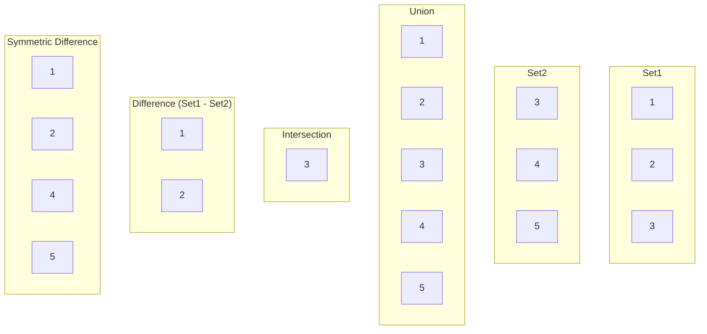

# Rust HashSets

## Introduction

A HashSet is one of Rust's standard collection types that allows you to store unique values with no particular order. If you're familiar with mathematical sets, HashSets implement the same concept in code - they're collections where each value appears only once, regardless of how many times you try to add it.

HashSets are particularly useful when you need to:
- Store unique elements
- Check if a value exists in a collection quickly
- Perform set operations like unions, intersections, and differences

In this tutorial, we'll explore how to use Rust's `HashSet` from the standard library's `std::collections` module, and see practical examples of when and how to use them effectively.

## Basic Usage

### Creating a HashSet

Let's start by importing the `HashSet` type and creating some basic sets:

```rust
use std::collections::HashSet;

fn main() {
    // Create an empty HashSet that will store integers
    let mut set1: HashSet<i32> = HashSet::new();
    
    // Insert some values
    set1.insert(1);
    set1.insert(2);
    set1.insert(3);
    
    // Trying to insert a duplicate value doesn't change the set
    let was_new = set1.insert(2);
    println!("Was 2 newly inserted? {}", was_new); // Will output: false
    
    // Print the set
    println!("Set contents: {:?}", set1);
    
    // Create a HashSet from an iterator directly
    let set2: HashSet<_> = [4, 5, 6, 6].iter().cloned().collect();
    println!("Second set: {:?}", set2); // Note that 6 only appears once
}
```

Output:
```
Was 2 newly inserted? false
Set contents: {1, 2, 3}
Second set: {4, 5, 6}
```

Notice how the second attempt to insert `2` returns `false`, indicating the value was already present. Also, when we created `set2` from an array containing a duplicate value, the duplicate was automatically ignored.

### Common Methods

Here are some of the most commonly used methods with HashSets:

```rust
use std::collections::HashSet;

fn main() {
    let mut languages = HashSet::new();
    
    // Adding elements
    languages.insert("Rust");
    languages.insert("Python");
    languages.insert("JavaScript");
    
    // Check if an element exists
    if languages.contains("Rust") {
        println!("Rust is in the set!");
    }
    
    // Remove an element
    languages.remove("Python");
    println!("After removal: {:?}", languages);
    
    // Get the number of elements
    println!("Number of languages: {}", languages.len());
    
    // Check if the set is empty
    println!("Is the set empty? {}", languages.is_empty());
    
    // Clear all elements
    languages.clear();
    println!("After clearing: {:?}", languages);
}
```

Output:
```
Rust is in the set!
After removal: {"Rust", "JavaScript"}
Number of languages: 2
Is the set empty? false
After clearing: {}
```

## Set Operations

One of the most powerful features of HashSets is the ability to perform mathematical set operations like union, intersection, difference, and symmetric difference.

```rust
use std::collections::HashSet;

fn main() {
    let mut set1 = HashSet::new();
    set1.insert(1);
    set1.insert(2);
    set1.insert(3);
    
    let mut set2 = HashSet::new();
    set2.insert(3);
    set2.insert(4);
    set2.insert(5);
    
    // Union: all elements from both sets
    let union: HashSet<_> = set1.union(&set2).cloned().collect();
    println!("Union: {:?}", union);
    
    // Intersection: only elements in both sets
    let intersection: HashSet<_> = set1.intersection(&set2).cloned().collect();
    println!("Intersection: {:?}", intersection);
    
    // Difference: elements in set1 but not in set2
    let difference: HashSet<_> = set1.difference(&set2).cloned().collect();
    println!("Difference (set1 - set2): {:?}", difference);
    
    // Symmetric Difference: elements in either set, but not in both
    let symmetric_difference: HashSet<_> = set1.symmetric_difference(&set2).cloned().collect();
    println!("Symmetric Difference: {:?}", symmetric_difference);
}
```

Output:
```
Union: {1, 2, 3, 4, 5}
Intersection: {3}
Difference (set1 - set2): {1, 2}
Symmetric Difference: {1, 2, 4, 5}
```

These operations are incredibly useful in many programming scenarios, from data processing to implementing specific algorithms.

Let's visualize these set operations using a diagram:



## HashSet Requirements for Custom Types

By default, HashSet can store any type that implements both the `Eq` and `Hash` traits. Rust's standard types like integers, floating-point numbers, strings, and boolean values already implement these traits.

For custom types, you need to implement these traits yourself or derive them:

```rust
use std::collections::HashSet;

// Derive both Hash and Eq (which requires PartialEq)
#[derive(Hash, Eq, PartialEq, Debug)]
struct User {
    id: u32,
    username: String,
}

fn main() {
    let mut users = HashSet::new();
    
    users.insert(User { id: 1, username: String::from("alice") });
    users.insert(User { id: 2, username: String::from("bob") });
    
    // This won't add a duplicate user with the same fields
    users.insert(User { id: 1, username: String::from("alice") });
    
    println!("Users: {:?}", users);
    println!("Number of unique users: {}", users.len());
}
```

Output:
```
Users: {User { id: 2, username: "bob" }, User { id: 1, username: "alice" }}
Number of unique users: 2
```

## Advanced Usage: HashSet with Custom Hash Functions

By default, Rust uses a cryptographically secure hashing algorithm for HashSet, which provides good security against hash-flooding attacks. However, in performance-critical applications, you might want to use a faster (but less secure) hasher.

Here's an example using the `fnv` crate, which provides a faster hashing algorithm:

```rust
// You would need to add this to your Cargo.toml:
// [dependencies]
// fnv = "1.0.7"

use std::collections::HashSet;
use fnv::FnvHasher;
use std::hash::BuildHasherDefault;

type FnvHashSet<T> = HashSet<T, BuildHasherDefault<FnvHasher>>;

fn main() {
    // Create a HashSet using the FNV hasher
    let mut fast_set: FnvHashSet<i32> = FnvHashSet::default();
    
    // Use it just like a regular HashSet
    fast_set.insert(1);
    fast_set.insert(2);
    fast_set.insert(3);
    
    println!("Fast HashSet: {:?}", fast_set);
}
```

Output:
```
Fast HashSet: {1, 2, 3}
```

## Practical Examples

### Example 1: Finding Unique Words in a Text

```rust
use std::collections::HashSet;

fn main() {
    let text = "to be or not to be that is the question";
    
    // Split the text into words and collect unique ones
    let unique_words: HashSet<_> = text.split_whitespace().collect();
    
    println!("Original text: {}", text);
    println!("Unique words: {:?}", unique_words);
    println!("Word count: {}", text.split_whitespace().count());
    println!("Unique word count: {}", unique_words.len());
}
```

Output:
```
Original text: to be or not to be that is the question
Unique words: {"that", "not", "is", "or", "question", "the", "to", "be"}
Word count: 10
Unique word count: 8
```

### Example 2: Finding Common Elements in Arrays

```rust
use std::collections::HashSet;

fn main() {
    let vec1 = vec![1, 2, 3, 4, 5];
    let vec2 = vec![3, 4, 5, 6, 7];
    let vec3 = vec![5, 6, 7, 8, 9];
    
    // Convert vectors to HashSets
    let set1: HashSet<_> = vec1.into_iter().collect();
    let set2: HashSet<_> = vec2.into_iter().collect();
    let set3: HashSet<_> = vec3.into_iter().collect();
    
    // Find elements common to all three vectors
    let common_elements: HashSet<_> = set1.intersection(&set2)
        .cloned()
        .collect::<HashSet<_>>()
        .intersection(&set3)
        .cloned()
        .collect();
    
    println!("Common elements in all three arrays: {:?}", common_elements);
}
```

Output:
```
Common elements in all three arrays: {5}
```

### Example 3: Deduplicating Data

```rust
use std::collections::HashSet;

fn main() {
    // Simulating data from a source that might have duplicates
    let log_entries = vec![
        "user:123 logged in",
        "user:456 logged in",
        "user:123 viewed page",
        "user:789 logged in",
        "user:123 logged in", // Duplicate entry
        "user:456 logged out",
    ];
    
    // Deduplicate entries
    let unique_entries: HashSet<_> = log_entries.into_iter().collect();
    
    println!("Unique log entries:");
    for entry in &unique_entries {
        println!("  {}", entry);
    }
    
    println!("Total unique entries: {}", unique_entries.len());
}
```

Output:
```
Unique log entries:
  user:456 logged in
  user:123 viewed page
  user:789 logged in
  user:456 logged out
  user:123 logged in
Total unique entries: 5
```

## Performance Considerations

Here are some important performance characteristics of HashSet to keep in mind:

1. **Average Time Complexity**:
   - Insert: O(1)
   - Remove: O(1)
   - Contains: O(1)
   
   These operations are constant time on average, but can degrade to O(n) in worst-case scenarios (like with poor hash functions).

2. **Memory Usage**: HashSets consume more memory than sorted arrays or tree-based sets due to the internal hash table structure.

3. **Iteration Order**: The order of elements during iteration is arbitrary and may change after insertions or removals.

```rust
use std::collections::HashSet;
use std::time::Instant;

fn main() {
    // Benchmark HashSet operations with different sizes
    let sizes = [1_000, 10_000, 100_000];
    
    for &size in &sizes {
        // Create a HashSet with 'size' elements
        let mut set: HashSet<i32> = (0..size).collect();
        
        // Benchmark lookup time
        let start = Instant::now();
        for i in 0..size {
            set.contains(&i);
        }
        let duration = start.elapsed();
        
        println!("Time to lookup {} elements: {:?}", size, duration);
    }
}
```

## Summary

HashSets in Rust provide an efficient way to store unique values and perform set operations. Key points to remember:

- HashSets store unique values with no specific order
- They provide constant-time average complexity for adding, removing, and checking if an element exists
- They're perfect for deduplication, set operations, and membership testing
- Custom types need to implement both the `Hash` and `Eq` traits to be stored in a HashSet
- HashSets are generally more memory-intensive than some other collections, but offer excellent lookup performance

## Additional Resources

- [Rust HashSet Documentation](https://doc.rust-lang.org/std/collections/struct.HashSet.html)
- [Rust Collections Overview](https://doc.rust-lang.org/std/collections/index.html)
- [The Rust Programming Language Book - Common Collections](https://doc.rust-lang.org/book/ch08-03-hash-maps.html)

## Exercises

1. **Word Frequency Counter**: Create a program that reads a text file and counts the frequency of each unique word.

2. **Set Operations Calculator**: Build a command-line tool that takes two sets of numbers as input and can perform various set operations (union, intersection, etc.) based on user commands.

3. **Custom Type Challenge**: Define a custom struct representing a product with various fields, implement the necessary traits, and use it with HashSet to maintain a catalog of unique products.

4. **Efficient Graph Representation**: Use HashSets to represent an undirected graph and implement algorithms like finding connected components or detecting cycles.

5. **Performance Comparison**: Create a benchmark comparing the performance of HashSet, BTreeSet, and Vec for various operations with different data sizes.