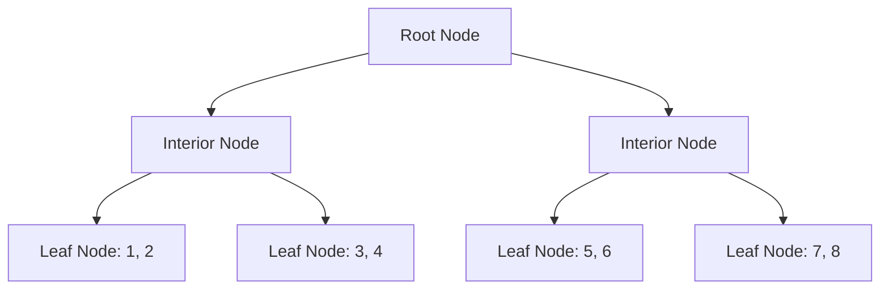

# Rust BTreeSets

## Introduction

Welcome to our guide on `BTreeSet` in Rust! In this tutorial, we'll explore one of Rust's most useful ordered collection types.

A `BTreeSet` is an ordered collection of unique values implemented as a B-Tree. If you're coming from other programming languages, you might be familiar with similar concepts:

- In Java: `TreeSet`
- In C++: `std::set` (often implemented as a red-black tree)
- In Python: While Python doesn't have a direct equivalent, `sortedcontainers.SortedSet` is similar

`BTreeSet` stands out for these key characteristics:
- **Ordered**: Elements are stored in sorted order
- **Unique values**: No duplicates allowed
- **Efficient operations**: Most operations run in O(log n) time
- **No random access**: You can't index into a `BTreeSet` like with vectors

Let's dive into how to use this powerful collection in your Rust programs!

## Getting Started with BTreeSet

### Importing BTreeSet

First, you'll need to import `BTreeSet` from the standard library:

```rust
use std::collections::BTreeSet;

fn main() {
    // Now we can use BTreeSet
}
```

### Creating a BTreeSet

There are several ways to create a new `BTreeSet`:

```rust
use std::collections::BTreeSet;

fn main() {
    // Creating an empty BTreeSet
    let mut empty_set: BTreeSet<i32> = BTreeSet::new();
    
    // Creating from an iterator
    let mut number_set: BTreeSet<i32> = [1, 4, 2, 3, 4].iter().cloned().collect();
    println!("Set from array: {:?}", number_set);
    // Output: Set from array: {1, 2, 3, 4}
    
    // Notice that the duplicate 4 appears only once and elements are ordered!
    
    // Creating with the macro (Rust 2021 edition and later)
    let quick_set = BTreeSet::from([5, 3, 8, 1]);
    println!("Quick set: {:?}", quick_set);
    // Output: Quick set: {1, 3, 5, 8}
}
```

## Basic Operations

Let's look at the fundamental operations you can perform with a `BTreeSet`:

### Adding Elements

```rust
use std::collections::BTreeSet;

fn main() {
    let mut fruit_set = BTreeSet::new();
    
    // Insert returns true if the element wasn't present
    let was_added = fruit_set.insert("apple");
    println!("Was 'apple' added? {}", was_added); // true
    
    fruit_set.insert("banana");
    fruit_set.insert("cherry");
    
    // Trying to add a duplicate
    let was_added = fruit_set.insert("apple");
    println!("Was 'apple' added again? {}", was_added); // false
    
    println!("Fruits: {:?}", fruit_set);
    // Output: Fruits: {"apple", "banana", "cherry"}
}
```

### Checking if an Element Exists

```rust
use std::collections::BTreeSet;

fn main() {
    let book_set: BTreeSet<&str> = ["1984", "Brave New World", "Fahrenheit 451"].iter().cloned().collect();
    
    // Check if an element exists
    println!("Contains '1984': {}", book_set.contains("1984")); // true
    println!("Contains 'The Hobbit': {}", book_set.contains("The Hobbit")); // false
}
```

### Removing Elements

```rust
use std::collections::BTreeSet;

fn main() {
    let mut color_set = BTreeSet::from(["red", "green", "blue", "yellow"]);
    println!("Original set: {:?}", color_set);
    
    // Remove returns true if the element was present
    let was_removed = color_set.remove("green");
    println!("Was 'green' removed? {}", was_removed); // true
    
    // Trying to remove a non-existent element
    let was_removed = color_set.remove("purple");
    println!("Was 'purple' removed? {}", was_removed); // false
    
    println!("Updated set: {:?}", color_set);
    // Output: Updated set: {"blue", "red", "yellow"}
}
```

### Iterating Over a BTreeSet

One powerful feature of `BTreeSet` is that iteration is always in sorted order:

```rust
use std::collections::BTreeSet;

fn main() {
    let language_set = BTreeSet::from(["Rust", "Python", "JavaScript", "C++"]);
    
    println!("Programming languages (in alphabetical order):");
    for language in &language_set {
        println!("- {}", language);
    }
    
    // Output:
    // Programming languages (in alphabetical order):
    // - C++
    // - JavaScript
    // - Python
    // - Rust
}
```

## Set Operations

`BTreeSet` supports standard set operations, making it perfect for solving problems involving sets:

### Union, Intersection, and Difference

```rust
use std::collections::BTreeSet;

fn main() {
    let set1: BTreeSet<i32> = [1, 2, 3, 4].iter().cloned().collect();
    let set2: BTreeSet<i32> = [3, 4, 5, 6].iter().cloned().collect();
    
    // Union: all elements from both sets
    let union: BTreeSet<_> = set1.union(&set2).cloned().collect();
    println!("Union: {:?}", union);
    // Output: Union: {1, 2, 3, 4, 5, 6}
    
    // Intersection: elements common to both sets
    let intersection: BTreeSet<_> = set1.intersection(&set2).cloned().collect();
    println!("Intersection: {:?}", intersection);
    // Output: Intersection: {3, 4}
    
    // Difference: elements in set1 but not in set2
    let difference: BTreeSet<_> = set1.difference(&set2).cloned().collect();
    println!("Difference (set1 - set2): {:?}", difference);
    // Output: Difference (set1 - set2): {1, 2}
    
    // Symmetric difference: elements in either set but not both
    let sym_difference: BTreeSet<_> = set1.symmetric_difference(&set2).cloned().collect();
    println!("Symmetric Difference: {:?}", sym_difference);
    // Output: Symmetric Difference: {1, 2, 5, 6}
}
```

### Subset and Superset Relationships

```rust
use std::collections::BTreeSet;

fn main() {
    let small_set: BTreeSet<char> = ['a', 'b'].iter().cloned().collect();
    let medium_set: BTreeSet<char> = ['a', 'b', 'c'].iter().cloned().collect();
    let large_set: BTreeSet<char> = ['a', 'b', 'c', 'd'].iter().cloned().collect();
    
    // Check if one set is a subset of another
    println!("small_set is subset of medium_set: {}", small_set.is_subset(&medium_set)); // true
    println!("medium_set is subset of small_set: {}", medium_set.is_subset(&small_set)); // false
    
    // Check if one set is a proper subset (subset but not equal)
    println!("small_set is proper subset of medium_set: {}", small_set.is_proper_subset(&medium_set)); // true
    println!("medium_set is proper subset of medium_set: {}", medium_set.is_proper_subset(&medium_set)); // false
    
    // Check superset relationships
    println!("large_set is superset of medium_set: {}", large_set.is_superset(&medium_set)); // true
    println!("large_set is proper superset of medium_set: {}", large_set.is_proper_superset(&medium_set)); // true
}
```

## Advanced Features

Now that we've covered the basics, let's explore some more advanced features of `BTreeSet`:

### Range Operations

One powerful feature of `BTreeSet` is the ability to work with ranges of values:

```rust
use std::collections::BTreeSet;
use std::ops::Bound;

fn main() {
    let number_set: BTreeSet<i32> = (1..=10).collect();
    println!("Full set: {:?}", number_set);
    
    // Get a range of values (inclusive start, exclusive end)
    let range_3_to_7: Vec<_> = number_set.range(3..8).cloned().collect();
    println!("Range 3..8: {:?}", range_3_to_7);
    // Output: Range 3..8: [3, 4, 5, 6, 7]
    
    // Using Bound for more flexibility
    // Get all elements ≥ 7
    let seven_and_above: Vec<_> = number_set
        .range((Bound::Included(7), Bound::Unbounded))
        .cloned()
        .collect();
    println!("Seven and above: {:?}", seven_and_above);
    // Output: Seven and above: [7, 8, 9, 10]
    
    // Get all elements < 5
    let below_five: Vec<_> = number_set
        .range((Bound::Unbounded, Bound::Excluded(5)))
        .cloned()
        .collect();
    println!("Below five: {:?}", below_five);
    // Output: Below five: [1, 2, 3, 4]
}
```

### Finding Minimum and Maximum

```rust
use std::collections::BTreeSet;

fn main() {
    let values = BTreeSet::from([15, 3, 42, 7, 89]);
    
    // Get the first (minimum) value
    if let Some(min) = values.first() {
        println!("Minimum value: {}", min); // 3
    }
    
    // Get the last (maximum) value
    if let Some(max) = values.last() {
        println!("Maximum value: {}", max); // 89
    }
}
```

### Splitting Sets

You can split a `BTreeSet` at a specific value:

```rust
use std::collections::BTreeSet;

fn main() {
    let mut set = BTreeSet::from([1, 2, 3, 4, 5, 6]);
    
    // Split the set at value 4
    // The split_off function takes the elements greater than or equal to the provided value
    let greater = set.split_off(&4);
    
    println!("Original set (now contains elements < 4): {:?}", set);
    // Output: Original set (now contains elements < 4): {1, 2, 3}
    
    println!("New set (contains elements >= 4): {:?}", greater);
    // Output: New set (contains elements >= 4): {4, 5, 6}
}
```

## How BTreeSet Works: Under the Hood

To understand why `BTreeSet` behaves the way it does, it helps to know a bit about its underlying implementation.



A B-tree is a self-balancing tree data structure that:
- Keeps data sorted
- Allows searches, insertions, and deletions in logarithmic time
- Is optimized for systems that read and write large blocks of data (like disks)

The key insights:
1. Elements are stored in a sorted tree structure
2. Unlike a binary tree, each node can have more than two children
3. The tree is always balanced, ensuring O(log n) operations
4. No random access (you can't get the 5th element directly)

This implementation is what gives `BTreeSet` its performance characteristics:
- `insert`, `remove`, and `contains`: O(log n)
- Iteration in order: O(n)
- Union/intersection operations: O(n+m) where n and m are the sizes of the sets

## Practical Examples

Let's explore some real-world use cases for `BTreeSet`:

### Example 1: Removing Duplicates While Maintaining Order

```rust
use std::collections::BTreeSet;

fn main() {
    // A list of scores with duplicates
    let scores = vec![85, 92, 78, 92, 85, 90, 76, 91];
    
    // Convert to BTreeSet to remove duplicates and sort
    let unique_scores: BTreeSet<_> = scores.into_iter().collect();
    
    println!("Unique scores (in ascending order): {:?}", unique_scores);
    // Output: Unique scores (in ascending order): {76, 78, 85, 90, 91, 92}
}
```

### Example 2: Finding Common Tags

```rust
use std::collections::BTreeSet;

struct Article {
    title: String,

}

fn main() {
    let article1 = Article {
        title: "Rust for Beginners".to_string(),

            .iter().map(|&s| s.to_string()).collect(),
    };
    
    let article2 = Article {
        title: "Advanced Rust Patterns".to_string(),

            .iter().map(|&s| s.to_string()).collect(),
    };
    
    // Find common tags
    let common_tags: BTreeSet<_> = article1.tags
        .intersection(&article2.tags)
        .cloned()
        .collect();
    
    println!("Common
    // Output: Common
}
```

### Example 3: Word Frequency Counter

```rust
use std::collections::{BTreeSet, HashMap};

fn main() {
    let text = "the quick brown fox jumps over the lazy dog";
    
    // Count word frequencies
    let mut word_counts = HashMap::new();
    for word in text.split_whitespace() {
        *word_counts.entry(word).or_insert(0) += 1;
    }
    
    // Get unique words in alphabetical order
    let unique_words: BTreeSet<_> = text.split_whitespace().collect();
    
    println!("Word counts: {:?}", word_counts);
    println!("Unique words (alphabetically): {:?}", unique_words);
    // Output: Unique words (alphabetically): {"brown", "dog", "fox", "jumps", "lazy", "over", "quick", "the"}
}
```

## BTreeSet vs. HashSet: When to Use Each

Rust offers another set type called `HashSet`. How do you choose between them?

| Feature | BTreeSet | HashSet |
|---------|----------|---------|
| Order   | Sorted   | Random  |
| Performance (average) | O(log n) | O(1) |
| Memory usage | Generally more efficient | More overhead |
| Minimum/maximum | Easy (first/last) | Requires iteration |
| Range queries | Supported | Not supported |
| Elements must implement | Ord + Eq | Eq + Hash |

Choose `BTreeSet` when:
- You need elements in sorted order
- You need to find ranges of elements
- You need to find the minimum or maximum quickly
- Memory efficiency is important

Choose `HashSet` when:
- Order doesn't matter
- You need the fastest possible lookup, insertion, and removal
- Your elements implement `Hash` efficiently

## Common Pitfalls and Best Practices

### 1. Elements Must Implement Ord and Eq

All elements in a `BTreeSet` must implement the `Ord` and `Eq` traits:

```rust
use std::collections::BTreeSet;

// This works because i32 implements Ord and Eq
let numbers: BTreeSet<i32> = BTreeSet::new();

// For custom types, you need to implement the traits
#[derive(Debug, PartialEq, Eq, PartialOrd, Ord)]
struct User {
    id: u32,
    name: String,
}

fn main() {
    let mut users = BTreeSet::new();
    users.insert(User { id: 1, name: "Alice".to_string() });
    users.insert(User { id: 2, name: "Bob".to_string() });
    
    println!("Users: {:?}", users);
}
```

### 2. BTreeSet is Immutable by Default

Remember to declare your `BTreeSet` as mutable if you plan to modify it:

```rust
use std::collections::BTreeSet;

fn main() {
    // This won't compile
    // let planets = BTreeSet::from(["Earth", "Mars", "Venus"]);
    // planets.insert("Jupiter"); // Error: cannot borrow as mutable
    
    // This is correct
    let mut planets = BTreeSet::from(["Earth", "Mars", "Venus"]);
    planets.insert("Jupiter"); // Works!
}
```

### 3. Pay Attention to Ownership

When using set operations like `union` and `intersection`, remember they return iterators that borrow from the original sets:

```rust
use std::collections::BTreeSet;

fn main() {
    let set1 = BTreeSet::from([1, 2, 3]);
    let set2 = BTreeSet::from([3, 4, 5]);
    
    // This creates a new set with owned values
    let union: BTreeSet<_> = set1.union(&set2).cloned().collect();
    
    // Without .cloned(), you'd get references
    let _references: BTreeSet<&i32> = set1.union(&set2).collect();
}
```

## Summary

`BTreeSet` is a powerful collection in Rust that provides an ordered set of unique values with efficient operations. Let's recap the key points:

- `BTreeSet` stores elements in sorted order and ensures uniqueness
- Most operations run in O(log n) time
- It's ideal for when you need to maintain order or perform range queries
- The implementation uses a B-tree data structure for efficiency
- Common operations include: insert, remove, contains, union, intersection, and more
- Choose `BTreeSet` over `HashSet` when order matters or when you need range operations

With the knowledge from this tutorial, you can effectively use `BTreeSet` in your Rust programs to solve a wide range of problems involving unique, ordered collections.

## Additional Resources

To deepen your understanding of `BTreeSet` in Rust, check out these resources:

1. [Official Rust Documentation for BTreeSet](https://doc.rust-lang.org/std/collections/struct.BTreeSet.html)
2. [The Rust Programming Language Book - Collections Chapter](https://doc.rust-lang.org/book/ch08-03-hash-maps.html)
3. [Rust by Example - Collections](https://doc.rust-lang.org/rust-by-example/std/collections.html)

## Exercises

Test your understanding with these exercises:

1. Create a program that reads a text file and lists all unique words in alphabetical order using a `BTreeSet`.

2. Implement a function that takes two `BTreeSet`s of integers and returns a new `BTreeSet` containing only the elements that appear in exactly one of the sets (the symmetric difference).

3. Create a custom struct representing a Product with fields for name, price, and category. Implement the necessary traits to store these Products in a `BTreeSet` sorted by price.

4. Build a simple spelling checker that stores a dictionary in a `BTreeSet` and can efficiently check if words are spelled correctly.

5. Design a function that takes a `BTreeSet` of integers and returns the largest gap between consecutive integers in the set.

Good luck, and happy coding with Rust's `BTreeSet`!