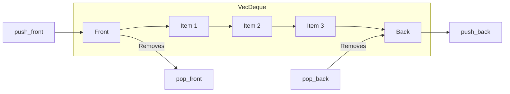

# Rust VecDeque

## Introduction

When working with collections in Rust, you'll often need a data structure that allows efficient insertions and removals at both ends. This is where `VecDeque` comes in - a double-ended queue implementation provided by Rust's standard library.

Unlike a regular `Vec` which excels at operations from one end (the back), `VecDeque` is optimized for operations at both ends. This makes it perfect for scenarios like queue implementations, breadth-first searches, or any situation where you need a "first-in, first-out" (FIFO) or "last-in, first-out" (LIFO) structure with flexibility.

In this tutorial, we'll explore:
- What a `VecDeque` is and how it works internally
- Basic operations and their time complexities
- Common use cases
- Practical examples to solidify your understanding

Let's dive in!

## What is a VecDeque?

`VecDeque` (Vector Deque) is a double-ended queue implementation using a growable ring buffer. The name comes from "deque" which is short for "double-ended queue."

### Key Characteristics

- **Double-ended operations**: Efficient insertions and removals at both the front and back
- **Ring buffer implementation**: Uses a circular buffer to optimize memory usage
- **Dynamic resizing**: Automatically grows when needed, like `Vec`
- **Random access**: Provides O(1) indexing like `Vec`

Here's a simple visualization of a VecDeque:



## Creating a VecDeque

Let's start by looking at different ways to create a `VecDeque`:

```rust
use std::collections::VecDeque;

fn main() {
    // Create an empty VecDeque
    let mut deque1: VecDeque<i32> = VecDeque::new();
    
    // Create with a specific capacity
    let mut deque2: VecDeque<i32> = VecDeque::with_capacity(10);
    
    // Create from an existing vector
    let vec = vec![1, 2, 3, 4];
    let mut deque3 = VecDeque::from(vec);
    
    // Using the macro (requires Rust 1.56+)
    let mut deque4 = VecDeque::from([1, 2, 3, 4]);
    
    println!("deque1: {:?}", deque1); // Output: deque1: []
    println!("deque3: {:?}", deque3); // Output: deque3: [1, 2, 3, 4]
}
```

## Basic Operations

### Adding Elements

You can add elements to either end of a `VecDeque`:

```rust
use std::collections::VecDeque;

fn main() {
    let mut deque = VecDeque::new();
    
    // Add to the back (like Vec::push)
    deque.push_back(1);
    deque.push_back(2);
    
    // Add to the front
    deque.push_front(0);
    
    println!("After additions: {:?}", deque);
    // Output: After additions: [0, 1, 2]
}
```

### Removing Elements

You can remove elements from either end:

```rust
use std::collections::VecDeque;

fn main() {
    let mut deque = VecDeque::from([1, 2, 3, 4, 5]);
    
    // Remove from the front
    let front = deque.pop_front();
    println!("Removed from front: {:?}", front); // Output: Removed from front: Some(1)
    
    // Remove from the back
    let back = deque.pop_back();
    println!("Removed from back: {:?}", back); // Output: Removed from back: Some(5)
    
    println!("Remaining deque: {:?}", deque); // Output: Remaining deque: [2, 3, 4]
}
```

### Accessing Elements

You can access elements from either end or by index:

```rust
use std::collections::VecDeque;

fn main() {
    let mut deque = VecDeque::from([10, 20, 30, 40, 50]);
    
    // Get references to the front and back elements
    println!("Front element: {:?}", deque.front()); // Output: Front element: Some(10)
    println!("Back element: {:?}", deque.back());   // Output: Back element: Some(50)
    
    // Get mutable references
    if let Some(front) = deque.front_mut() {
        *front += 5;
    }
    if let Some(back) = deque.back_mut() {
        *back += 5;
    }
    
    println!("After modifications: {:?}", deque); // Output: After modifications: [15, 20, 30, 40, 55]
    
    // Access by index (like Vec)
    println!("Element at index 2: {:?}", deque[2]); // Output: Element at index 2: 30
}
```

## How VecDeque Works Internally

Understanding the internal mechanics of `VecDeque` can help you know when and why to use it:

```mermaid
graph TD
    subgraph Memory Layout
        A[Allocated Memory]
    end
    
    subgraph Logical View
        C[0] --- D[1] --- E[2] --- F[3] --- G[_] --- H[_] --- I[_]
    end
    
    subgraph Physical Layout with head=4
        J[_] --- K[_] --- L[_] --- M[0] --- N[1] --- O[2] --- P[3]
    end
```

A `VecDeque` is implemented as a circular buffer:
- It maintains a contiguous block of memory
- When you add items beyond the end, it wraps around to the beginning if there's available space
- It keeps track of the head and length to identify the valid data range
- If it runs out of space, it reallocates to a larger buffer

This design allows for efficient insertions and removals at both ends without shifting all elements.

## Common Use Cases

### 1. Queue (FIFO)

Using `VecDeque` as a simple queue:

```rust
use std::collections::VecDeque;

fn main() {
    let mut queue = VecDeque::new();
    
    // Enqueue operations
    queue.push_back("first");
    queue.push_back("second");
    queue.push_back("third");
    
    println!("Queue: {:?}", queue); // Output: Queue: ["first", "second", "third"]
    
    // Dequeue operations
    while let Some(next) = queue.pop_front() {
        println!("Processing: {}", next);
    }
    
    // Output:
    // Processing: first
    // Processing: second
    // Processing: third
}
```

### 2. Stack (LIFO)

Using `VecDeque` as a stack:

```rust
use std::collections::VecDeque;

fn main() {
    let mut stack = VecDeque::new();
    
    // Push operations
    stack.push_back("bottom");
    stack.push_back("middle");
    stack.push_back("top");
    
    println!("Stack: {:?}", stack); // Output: Stack: ["bottom", "middle", "top"]
    
    // Pop operations
    while let Some(item) = stack.pop_back() {
        println!("Popped: {}", item);
    }
    
    // Output:
    // Popped: top
    // Popped: middle
    // Popped: bottom
}
```

### 3. Sliding Window

Using `VecDeque` for a sliding window algorithm:

```rust
use std::collections::VecDeque;

fn main() {
    let data = [1, 3, -1, -3, 5, 3, 6, 7];
    let window_size = 3;
    
    // Find maximum value in each sliding window
    let maximums = sliding_window_maximum(&data, window_size);
    println!("Sliding window maximums: {:?}", maximums);
    // Output: Sliding window maximums: [3, 3, 5, 5, 6, 7]
}

fn sliding_window_maximum(nums: &[i32], k: usize) -> Vec<i32> {
    if nums.is_empty() || k == 0 {
        return vec![];
    }
    
    let mut result = Vec::new();
    let mut window = VecDeque::new();
    
    for i in 0..nums.len() {
        // Remove elements outside the current window
        while !window.is_empty() && window.front().unwrap() < &(i as i32 - k as i32 + 1) {
            window.pop_front();
        }
        
        // Remove elements smaller than current element
        while !window.is_empty() && nums[*window.back().unwrap() as usize] < nums[i] {
            window.pop_back();
        }
        
        // Add current index
        window.push_back(i as i32);
        
        // Add window maximum to result
        if i >= k - 1 {
            result.push(nums[*window.front().unwrap() as usize]);
        }
    }
    
    result
}
```

## Advanced Operations

### Rotating Elements

`VecDeque` has specialized methods for rotation:

```rust
use std::collections::VecDeque;

fn main() {
    let mut deque = VecDeque::from([1, 2, 3, 4, 5]);
    
    // Rotate one step left (towards the front)
    deque.rotate_left(1);
    println!("After rotate_left(1): {:?}", deque);
    // Output: After rotate_left(1): [2, 3, 4, 5, 1]
    
    // Rotate two steps right (towards the back)
    deque.rotate_right(2);
    println!("After rotate_right(2): {:?}", deque);
    // Output: After rotate_right(2): [5, 1, 2, 3, 4]
}
```

### Extending and Draining

You can extend a `VecDeque` with other iterables or drain portions of it:

```rust
use std::collections::VecDeque;

fn main() {
    let mut deque = VecDeque::from([1, 2, 3]);
    
    // Extend from the back
    deque.extend([4, 5, 6]);
    println!("After extend: {:?}", deque);
    // Output: After extend: [1, 2, 3, 4, 5, 6]
    
    // Drain a range
    let drained: Vec<_> = deque.drain(1..4).collect();
    println!("Drained elements: {:?}", drained);
    // Output: Drained elements: [2, 3, 4]
    
    println!("After drain: {:?}", deque);
    // Output: After drain: [1, 5, 6]
}
```

## Performance Considerations

Understanding the time complexity of `VecDeque` operations helps you make informed decisions:

| Operation | Time Complexity | Notes |
|-----------|-----------------|-------|
| push_front/push_back | O(1) amortized | Occasionally requires resizing |
| pop_front/pop_back | O(1) | Constant time operation |
| [index] | O(1) | Random access is efficient |
| insert/remove at middle | O(n) | Requires shifting elements |
| Iteration | O(n) | Linear time to visit all elements |

### VecDeque vs Vec vs LinkedList

When should you choose `VecDeque` over other collections?

- Choose `VecDeque` when:
  - You need efficient operations at both ends
  - You require random access along with front operations
  - You're implementing a queue, deque, or circular buffer

- Choose `Vec` when:
  - You only need efficient operations at one end
  - You need the most memory-efficient array-like structure
  - You want slightly better cache performance

- Choose `LinkedList` when:
  - You need to frequently splice entire lists together
  - You need to maintain valid mutable references to multiple elements

## Real-World Example: Task Scheduler

Let's build a simple task scheduler using `VecDeque`:

```rust
use std::collections::VecDeque;
use std::time::{Duration, Instant};

#[derive(Debug)]
struct Task {
    id: usize,
    description: String,
    duration: Duration,
}

struct TaskScheduler {
    normal_queue: VecDeque<Task>,
    priority_queue: VecDeque<Task>,
    completed_tasks: Vec<Task>,
    next_id: usize,
}

impl TaskScheduler {
    fn new() -> Self {
        TaskScheduler {
            normal_queue: VecDeque::new(),
            priority_queue: VecDeque::new(),
            completed_tasks: Vec::new(),
            next_id: 1,
        }
    }
    
    fn add_task(&mut self, description: &str, duration_secs: u64, is_priority: bool) {
        let task = Task {
            id: self.next_id,
            description: description.to_string(),
            duration: Duration::from_secs(duration_secs),
        };
        
        self.next_id += 1;
        
        if is_priority {
            self.priority_queue.push_back(task);
        } else {
            self.normal_queue.push_back(task);
        }
    }
    
    fn execute_next_task(&mut self) -> Option<(usize, String)> {
        let task = if !self.priority_queue.is_empty() {
            self.priority_queue.pop_front()
        } else {
            self.normal_queue.pop_front()
        };
        
        if let Some(task) = task {
            let id = task.id;
            let desc = task.description.clone();
            
            // Simulate task execution
            println!("Executing task {}: {}", task.id, task.description);
            // In a real system, we might actually do work here
            
            self.completed_tasks.push(task);
            Some((id, desc))
        } else {
            None
        }
    }
    
    fn requeue_task(&mut self, id: usize) {
        // Find the task in completed tasks
        let position = self.completed_tasks.iter().position(|t| t.id == id);
        
        if let Some(pos) = position {
            // Remove from completed and add to front of priority queue
            let task = self.completed_tasks.remove(pos);
            println!("Requeuing task {}: {}", task.id, task.description);
            self.priority_queue.push_front(task);
        }
    }
    
    fn status(&self) {
        println!("Task Scheduler Status:");
        println!("Priority queue: {} tasks", self.priority_queue.len());
        println!("Normal queue: {} tasks", self.normal_queue.len());
        println!("Completed: {} tasks", self.completed_tasks.len());
    }
}

fn main() {
    let mut scheduler = TaskScheduler::new();
    
    // Add some tasks
    scheduler.add_task("Setup database", 5, false);
    scheduler.add_task("Fix critical bug", 2, true);
    scheduler.add_task("Update documentation", 3, false);
    scheduler.add_task("Security patch", 1, true);
    
    scheduler.status();
    
    // Execute tasks
    for _ in 0..3 {
        if let Some((id, _)) = scheduler.execute_next_task() {
            // Occasionally requeue a task
            if id == 2 {
                scheduler.requeue_task(id);
            }
        }
    }
    
    scheduler.status();
    
    // Execute remaining tasks
    while scheduler.execute_next_task().is_some() {}
    
    scheduler.status();
}
```

Output:
```
Task Scheduler Status:
Priority queue: 2 tasks
Normal queue: 2 tasks
Completed: 0 tasks
Executing task 2: Fix critical bug
Executing task 4: Security patch
Requeuing task 2: Fix critical bug
Executing task 2: Fix critical bug
Task Scheduler Status:
Priority queue: 0 tasks
Normal queue: 2 tasks
Completed: 3 tasks
Executing task 1: Setup database
Executing task 3: Update documentation
Task Scheduler Status:
Priority queue: 0 tasks
Normal queue: 0 tasks
Completed: 5 tasks
```

This example demonstrates how `VecDeque` can be used to implement a priority-based task scheduling system, handling tasks in order while allowing for priority operations.

## Summary

`VecDeque` is a powerful and flexible collection in Rust that provides efficient operations at both ends. Key points to remember:

- It's implemented as a ring buffer, offering O(1) operations at both ends
- It's ideal for queue, deque, and buffer implementations
- It provides random access like `Vec`
- It automatically handles growth and resizing

By understanding when and how to use `VecDeque`, you can choose the right data structure for your specific needs, leading to more efficient and maintainable code.

## Exercises

To reinforce your understanding of `VecDeque`, try these exercises:

1. **Simple Buffer**: Implement a circular buffer that can store the last N items seen in a stream of data.

2. **Breadth-First Search**: Use a `VecDeque` to implement a breadth-first search algorithm on a graph.

3. **Sliding Window Maximum**: Enhance the sliding window maximum algorithm we showed earlier to handle different window sizes efficiently.

4. **Undo/Redo Functionality**: Create a simple text editor that uses `VecDeque` to implement undo and redo functionality.

5. **Print Queue**: Implement a print job queue that prioritizes certain types of documents.

## Additional Resources

- [Rust Standard Library Documentation for VecDeque](https://doc.rust-lang.org/std/collections/struct.VecDeque.html)
- [The Rust Programming Language Book](https://doc.rust-lang.org/book/) - For general Rust concepts
- [Rust by Example](https://doc.rust-lang.org/rust-by-example/) - For practical examples
- [The Algorithm Design Manual](http://www.algorist.com/) - For deeper understanding of queues and data structures