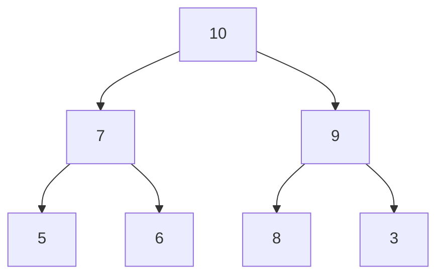

# Rust BinaryHeap

## Introduction

The `BinaryHeap` is a collection in Rust's standard library that implements a priority queue using a max-heap data structure. A max-heap is a tree-based structure where the parent nodes always have values greater than or equal to their children. This property makes `BinaryHeap` perfect for scenarios where you need to efficiently retrieve the maximum element from a collection.

In this tutorial, we'll explore how to use Rust's `BinaryHeap`, understand its operations, and see practical examples of when and how to use it in your applications.

## What is a BinaryHeap?

A `BinaryHeap` in Rust is a collection that:

- Automatically maintains elements in a max-heap order
- Provides O(log n) time complexity for insertion and removal of the maximum element
- Offers O(1) time complexity for peeking at the maximum element
- Is implemented using a binary heap algorithm on top of a vector

Let's visualize how a binary heap is structured:



In this diagram, each parent node has a value greater than or equal to its children, making it a max-heap. The maximum value (10) is at the root for quick access.

## Basic Operations

Let's start by looking at the fundamental operations of `BinaryHeap`.

### Creating a BinaryHeap

```rust
use std::collections::BinaryHeap;

// Create an empty BinaryHeap
let mut heap = BinaryHeap::new();

// Create a BinaryHeap from an existing vector
let mut heap_from_vec = BinaryHeap::from(vec![1, 4, 3, 2]);

// You can also use the collect method
let mut heap_collected: BinaryHeap<i32> = vec![1, 4, 3, 2].into_iter().collect();
```

### Adding Elements

```rust
use std::collections::BinaryHeap;

let mut heap = BinaryHeap::new();

// Add elements one by one
heap.push(3);
heap.push(1);
heap.push(5);
heap.push(2);

println!("Heap after pushing elements: {:?}", heap);
```

Output:
```
Heap after pushing elements: BinaryHeap [5, 3, 1, 2]
```

Note that the order in the debug output doesn't necessarily reflect the internal structure, but the max-heap property is maintained.

### Retrieving Elements

```rust
use std::collections::BinaryHeap;

let mut heap = BinaryHeap::from(vec![1, 5, 2, 3]);

// Peek at the largest element without removing it
if let Some(&max) = heap.peek() {
    println!("Maximum element: {}", max);
}

// Remove and return the largest element
if let Some(max) = heap.pop() {
    println!("Removed maximum element: {}", max);
}

println!("Heap after popping: {:?}", heap);
```

Output:
```
Maximum element: 5
Removed maximum element: 5
Heap after popping: BinaryHeap [3, 1, 2]
```

### Other Useful Methods

```rust
use std::collections::BinaryHeap;

let mut heap = BinaryHeap::from(vec![1, 5, 2, 3]);

// Check if the heap is empty
println!("Is heap empty? {}", heap.is_empty());

// Get the number of elements
println!("Heap size: {}", heap.len());

// Clear all elements
heap.clear();
println!("Heap after clearing: {:?}", heap);
```

Output:
```
Is heap empty? false
Heap size: 4
Heap after clearing: BinaryHeap []
```

## Working with Custom Types

To use custom types with `BinaryHeap`, they must implement the `Ord` and `PartialOrd` traits. By default, Rust will order elements in descending order (max-heap).

Here's an example using a custom type:

```rust
use std::collections::BinaryHeap;
use std::cmp::Ordering;

#[derive(Debug, Eq)]
struct Task {
    priority: u32,
    description: String,
}

// We need to implement PartialEq, Eq, PartialOrd, and Ord
impl PartialEq for Task {
    fn eq(&self, other: &Self) -> bool {
        self.priority == other.priority
    }
}

impl Ord for Task {
    fn cmp(&self, other: &Self) -> Ordering {
        // Note: we use reverse order for priority because BinaryHeap is a max-heap
        self.priority.cmp(&other.priority)
    }
}

impl PartialOrd for Task {
    fn partial_cmp(&self, other: &Self) -> Option<Ordering> {
        Some(self.cmp(other))
    }
}

fn main() {
    let mut task_queue = BinaryHeap::new();
    
    task_queue.push(Task { priority: 2, description: String::from("Study Rust") });
    task_queue.push(Task { priority: 5, description: String::from("Fix critical bug") });
    task_queue.push(Task { priority: 1, description: String::from("Write documentation") });
    task_queue.push(Task { priority: 3, description: String::from("Implement new feature") });
    
    // Process tasks in order of priority (highest first)
    while let Some(task) = task_queue.pop() {
        println!("Processing task with priority {}: {}", task.priority, task.description);
    }
}
```

Output:
```
Processing task with priority 5: Fix critical bug
Processing task with priority 3: Implement new feature
Processing task with priority 2: Study Rust
Processing task with priority 1: Write documentation
```

## Creating a Min-Heap

By default, `BinaryHeap` is a max-heap, but sometimes you need a min-heap. You can easily achieve this by implementing `Ord` to reverse the comparison or by using a wrapper type:

```rust
use std::collections::BinaryHeap;
use std::cmp::Ordering;

// Wrapper to reverse the ordering
#[derive(Debug, Eq, PartialEq)]
struct MinHeapWrapper<T>(T);

impl<T: Ord> Ord for MinHeapWrapper<T> {
    fn cmp(&self, other: &Self) -> Ordering {
        // Reverse the order for a min-heap
        other.0.cmp(&self.0)
    }
}

impl<T: PartialOrd> PartialOrd for MinHeapWrapper<T> {
    fn partial_cmp(&self, other: &Self) -> Option<Ordering> {
        Some(self.cmp(other))
    }
}

fn main() {
    // Create a min-heap of integers
    let mut min_heap = BinaryHeap::new();
    
    // Wrap values to reverse ordering
    min_heap.push(MinHeapWrapper(5));
    min_heap.push(MinHeapWrapper(1));
    min_heap.push(MinHeapWrapper(3));
    min_heap.push(MinHeapWrapper(2));
    
    // Extract values in ascending order
    while let Some(MinHeapWrapper(value)) = min_heap.pop() {
        println!("Popped: {}", value);
    }
}
```

Output:
```
Popped: 1
Popped: 2
Popped: 3
Popped: 5
```

## Practical Examples

### Example 1: Task Scheduler

Let's implement a simple task scheduler that processes tasks based on their priority:

```rust
use std::collections::BinaryHeap;
use std::cmp::Ordering;

#[derive(Debug, Eq)]
struct Task {
    priority: u32,
    id: u32,
    description: String,
}

impl PartialEq for Task {
    fn eq(&self, other: &Self) -> bool {
        self.priority == other.priority && self.id == other.id
    }
}

impl Ord for Task {
    fn cmp(&self, other: &Self) -> Ordering {
        // First compare by priority (higher is better)
        let pri_cmp = self.priority.cmp(&other.priority);
        if pri_cmp != Ordering::Equal {
            return pri_cmp;
        }
        // If priorities are equal, use FIFO order (lower ID is better)
        other.id.cmp(&self.id)
    }
}

impl PartialOrd for Task {
    fn partial_cmp(&self, other: &Self) -> Option<Ordering> {
        Some(self.cmp(other))
    }
}

fn main() {
    let mut scheduler = BinaryHeap::new();
    
    // Add tasks with different priorities
    scheduler.push(Task { 
        priority: 2, 
        id: 1, 
        description: String::from("Perform daily backup") 
    });
    
    scheduler.push(Task { 
        priority: 5, 
        id: 2, 
        description: String::from("Restart server") 
    });
    
    scheduler.push(Task { 
        priority: 5, 
        id: 3, 
        description: String::from("Deploy new version") 
    });
    
    scheduler.push(Task { 
        priority: 1, 
        id: 4, 
        description: String::from("Send status email") 
    });
    
    // Process tasks in order of priority
    println!("Processing tasks:");
    while let Some(task) = scheduler.pop() {
        println!("[Priority: {}, ID: {}] {}", task.priority, task.id, task.description);
    }
}
```

Output:
```
Processing tasks:
[Priority: 5, ID: 2] Restart server
[Priority: 5, ID: 3] Deploy new version
[Priority: 2, ID: 1] Perform daily backup
[Priority: 1, ID: 4] Send status email
```

### Example 2: Dijkstra's Algorithm for Shortest Paths

Here's a simplified implementation of Dijkstra's algorithm to find the shortest path in a graph:

```rust
use std::collections::{BinaryHeap, HashMap};
use std::cmp::Ordering;

#[derive(Debug, Copy, Clone, Eq, PartialEq)]
struct State {
    cost: u32,
    node: usize,
}

// Custom ordering for the priority queue (min-heap)
impl Ord for State {
    fn cmp(&self, other: &Self) -> Ordering {
        // Note: we use reverse order here to create a min-heap
        other.cost.cmp(&self.cost).then_with(|| self.node.cmp(&other.node))
    }
}

impl PartialOrd for State {
    fn partial_cmp(&self, other: &Self) -> Option<Ordering> {
        Some(self.cmp(other))
    }
}

type Edge = (usize, u32); // (destination, weight)

fn shortest_path(graph: &Vec<Vec<Edge>>, start: usize, end: usize) -> Option<u32> {
    // Distance from start to all nodes
    let mut distances = vec![u32::MAX; graph.len()];
    distances[start] = 0;
    
    let mut visited = vec![false; graph.len()];
    let mut heap = BinaryHeap::new();
    
    // Start from the start node
    heap.push(State { cost: 0, node: start });
    
    while let Some(State { cost, node }) = heap.pop() {
        // If we reached the target node, return the cost
        if node == end {
            return Some(cost);
        }
        
        // If this state has already been processed with a better cost, skip it
        if visited[node] {
            continue;
        }
        
        visited[node] = true;
        
        // For each neighbor of the current node
        for &(next_node, edge_cost) in &graph[node] {
            // If the neighbor has already been visited, skip it
            if visited[next_node] {
                continue;
            }
            
            // Calculate the new cost to reach the neighbor
            let next_cost = cost + edge_cost;
            
            // If we found a better path to the neighbor, update its distance
            if next_cost < distances[next_node] {
                distances[next_node] = next_cost;
                heap.push(State { cost: next_cost, node: next_node });
            }
        }
    }
    
    // If we couldn't reach the end node
    None
}

fn main() {
    // Define a simple graph (adjacency list)
    let mut graph = vec![Vec::new(); 6];
    
    // Add edges (undirected graph)
    // (node, (destination, weight))
    graph[0].push((1, 7));  // A -> B, cost 7
    graph[0].push((2, 9));  // A -> C, cost 9
    graph[0].push((5, 14)); // A -> F, cost 14
    
    graph[1].push((0, 7));  // B -> A, cost 7
    graph[1].push((2, 10)); // B -> C, cost 10
    graph[1].push((3, 15)); // B -> D, cost 15
    
    graph[2].push((0, 9));  // C -> A, cost 9
    graph[2].push((1, 10)); // C -> B, cost 10
    graph[2].push((3, 11)); // C -> D, cost 11
    graph[2].push((5, 2));  // C -> F, cost 2
    
    graph[3].push((1, 15)); // D -> B, cost 15
    graph[3].push((2, 11)); // D -> C, cost 11
    graph[3].push((4, 6));  // D -> E, cost 6
    
    graph[4].push((3, 6));  // E -> D, cost 6
    graph[4].push((5, 9));  // E -> F, cost 9
    
    graph[5].push((0, 14)); // F -> A, cost 14
    graph[5].push((2, 2));  // F -> C, cost 2
    graph[5].push((4, 9));  // F -> E, cost 9
    
    // Find shortest path from node 0 (A) to node 4 (E)
    if let Some(shortest) = shortest_path(&graph, 0, 4) {
        println!("Shortest path from A to E: {}", shortest);
    } else {
        println!("No path exists from A to E");
    }
}
```

Output:
```
Shortest path from A to E: 20
```

## Performance Characteristics

Understanding the performance of `BinaryHeap` operations helps you make informed decisions:

| Operation | Time Complexity |
| --- | --- |
| Push element | O(log n) |
| Pop (remove max) | O(log n) |
| Peek (get max) | O(1) |
| Create from vector | O(n) |

## Common Pitfalls and Tips

### 1. Remember It's a Max-Heap

The `BinaryHeap` in Rust is a max-heap by default. If you need a min-heap, you'll need to reverse the ordering as shown in the min-heap example.

### 2. Heap Order vs. Iteration Order

When you iterate over a `BinaryHeap`, the elements are not necessarily yielded in order of priority. If you need elements in order, use the `pop` method in a loop.

### 3. Updating Elements

The `BinaryHeap` doesn't provide a direct way to update the priority of an element. If you need to change an element's priority, you typically need to remove it and reinsert it with the new priority.

### 4. Efficiency

`BinaryHeap` is very efficient for its primary operations (inserting elements and retrieving the maximum), but if you need to search for elements that aren't at the top, consider using a different data structure.

## Summary

Rust's `BinaryHeap` is a powerful collection for efficiently managing priorities. Its key features include:

- Automatic ordering using a max-heap implementation
- Fast insertion and extraction of the maximum element
- Support for custom types through the `Ord` and `PartialOrd` traits
- The ability to be adapted into a min-heap when needed

As you've seen, `BinaryHeap` is particularly useful for:
- Task scheduling and priority queues
- Algorithm implementations like Dijkstra's shortest path
- Any application where you need to process items in order of importance

## Additional Resources and Exercises

### Resources
- [Rust Standard Library Documentation](https://doc.rust-lang.org/std/collections/struct.BinaryHeap.html)
- [The Rust Programming Language Book](https://doc.rust-lang.org/book/)
- [Rust by Example](https://doc.rust-lang.org/rust-by-example/)

### Exercises

1. **Basic BinaryHeap**: Implement a program that reads a list of numbers from the user and prints them in descending order using a `BinaryHeap`.

2. **Median Finder**: Create a data structure that efficiently finds the median of a stream of numbers using two `BinaryHeap` instances.

3. **Merge K Sorted Lists**: Write a function that merges k sorted lists into one sorted list using a `BinaryHeap`.

4. **Event Simulator**: Implement a simple event-driven simulation where events are scheduled at specific times and processed in chronological order using a min-heap.

5. **Huffman Coding**: Implement Huffman coding compression algorithm using a `BinaryHeap` to build the Huffman tree.

By practicing these exercises, you'll gain a deeper understanding of how and when to use `BinaryHeap` in your Rust programs.