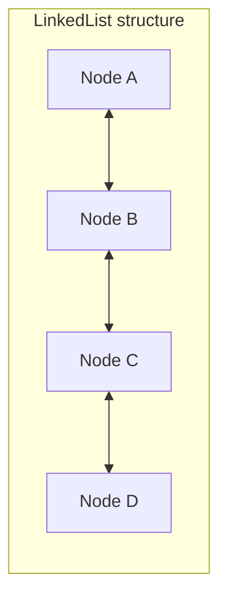
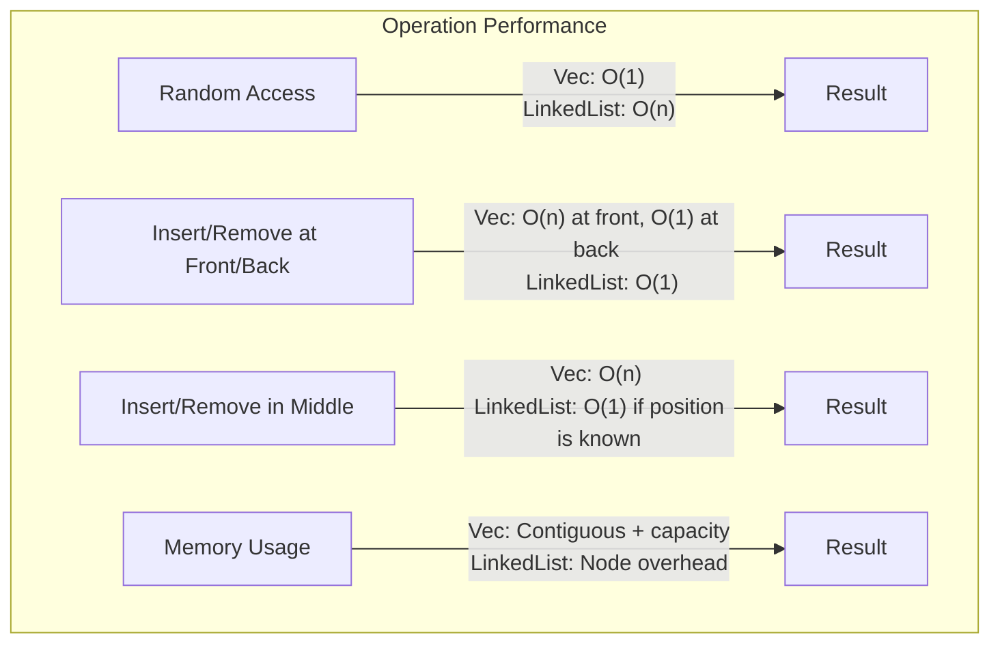

# Rust LinkedList

## Introduction

In this tutorial, we'll explore the `LinkedList` collection in Rust's standard library. Unlike more commonly used collections like `Vec` and `HashMap`, the `LinkedList` implements a doubly-linked list data structure, which has unique characteristics and use cases.

A doubly-linked list consists of a sequence of elements where each element points to both the next and previous elements in the sequence. This bidirectional linking enables efficient insertions and removals at any position, but comes with certain trade-offs compared to other collections.

By the end of this tutorial, you'll understand:
- What a LinkedList is and how it works in Rust
- When to use (and when not to use) LinkedList
- How to perform common operations
- Practical examples of LinkedList applications

## What is a LinkedList?

### Basic Concept

A linked list is a linear data structure where elements are not stored contiguously in memory. Instead, each element (or "node") contains:
1. The actual data
2. A reference (or "pointer") to the next node
3. In a doubly-linked list, a reference to the previous node as well



### LinkedList in Rust

Rust's `LinkedList<T>` is a doubly-linked list implementation in the standard library. It's defined in the `std::collections` module.

Key characteristics:
- Elements can be efficiently inserted or removed at any position
- No constant-time random access to elements (must traverse from beginning or end)
- More memory overhead than contiguous collections like `Vec`
- Not cache-friendly due to non-contiguous memory allocation

## Getting Started with LinkedList

### Importing LinkedList

First, you need to import the `LinkedList` type from the standard library:

```rust
use std::collections::LinkedList;
```

### Creating a LinkedList

You can create an empty `LinkedList` or initialize it with values:

```rust
// Create an empty LinkedList of integers
let mut empty_list: LinkedList<i32> = LinkedList::new();

// Create a LinkedList from an iterator
let mut list_from_iter = LinkedList::from_iter([1, 2, 3, 4, 5]);

// Create a LinkedList using the collect method
let mut collected_list: LinkedList<char> = "Hello".chars().collect();
```

Output for the last example:
```
LinkedList(['H', 'e', 'l', 'l', 'o'])
```

## Basic Operations

### Adding Elements

You can add elements to either end of the list:

```rust
use std::collections::LinkedList;

fn main() {
    let mut list = LinkedList::new();
    
    // Add to the back (tail) of the list
    list.push_back(1);
    list.push_back(2);
    list.push_back(3);
    
    // Add to the front (head) of the list
    list.push_front(0);
    list.push_front(-1);
    
    println!("List after pushes: {:?}", list);
}
```

Output:
```
List after pushes: LinkedList([-1, 0, 1, 2, 3])
```

### Removing Elements

Similarly, you can remove elements from either end:

```rust
use std::collections::LinkedList;

fn main() {
    let mut list = LinkedList::from_iter([1, 2, 3, 4, 5]);
    
    // Remove from the front
    let front = list.pop_front();
    println!("Removed from front: {:?}, List: {:?}", front, list);
    
    // Remove from the back
    let back = list.pop_back();
    println!("Removed from back: {:?}, List: {:?}", back, list);
}
```

Output:
```
Removed from front: Some(1), List: LinkedList([2, 3, 4, 5])
Removed from back: Some(5), List: LinkedList([2, 3, 4])
```

### Checking List Status

You can check if a list is empty and get its length:

```rust
use std::collections::LinkedList;

fn main() {
    let mut list = LinkedList::from_iter([10, 20, 30]);
    
    println!("Is the list empty? {}", list.is_empty());
    println!("List length: {}", list.len());
    
    // Clear the list
    list.clear();
    println!("After clearing - Is empty? {}, Length: {}", 
             list.is_empty(), list.len());
}
```

Output:
```
Is the list empty? false
List length: 3
After clearing - Is empty? true, Length: 0
```

## Iterating Through a LinkedList

### Basic Iteration

You can iterate through a `LinkedList` using standard Rust iterators:

```rust
use std::collections::LinkedList;

fn main() {
    let list = LinkedList::from_iter(["apple", "banana", "cherry", "date"]);
    
    // Iterate and print each element
    println!("Fruits in the list:");
    for fruit in &list {
        println!("- {}", fruit);
    }
    
    // Using iterator methods
    let uppercase: Vec<String> = list.iter()
                                     .map(|fruit| fruit.to_uppercase())
                                     .collect();
    println!("Uppercase fruits: {:?}", uppercase);
}
```

Output:
```
Fruits in the list:
- apple
- banana
- cherry
- date
Uppercase fruits: ["APPLE", "BANANA", "CHERRY", "DATE"]
```

### Bidirectional Iteration

Since `LinkedList` is doubly-linked, you can iterate in both directions:

```rust
use std::collections::LinkedList;

fn main() {
    let list = LinkedList::from_iter([1, 2, 3, 4, 5]);
    
    // Forward iteration
    print!("Forward: ");
    for num in &list {
        print!("{} ", num);
    }
    println!();
    
    // Reverse iteration
    print!("Reverse: ");
    for num in list.iter().rev() {
        print!("{} ", num);
    }
    println!();
}
```

Output:
```
Forward: 1 2 3 4 5 
Reverse: 5 4 3 2 1 
```

## Advanced Operations

### Appending Lists

You can append one list to another, which transfers all elements:

```rust
use std::collections::LinkedList;

fn main() {
    let mut list1 = LinkedList::from_iter([1, 2, 3]);
    let mut list2 = LinkedList::from_iter([4, 5, 6]);
    
    println!("Before append:");
    println!("List1: {:?}", list1);
    println!("List2: {:?}", list2);
    
    // Append list2 to list1 (list2 becomes empty)
    list1.append(&mut list2);
    
    println!("After append:");
    println!("List1: {:?}", list1);
    println!("List2: {:?}", list2);
}
```

Output:
```
Before append:
List1: LinkedList([1, 2, 3])
List2: LinkedList([4, 5, 6])
After append:
List1: LinkedList([1, 2, 3, 4, 5, 6])
List2: LinkedList([])
```

### Splitting Lists

You can split a list into two parts using a cursor:

```rust
use std::collections::LinkedList;

fn main() {
    let mut list = LinkedList::from_iter([1, 2, 3, 4, 5, 6]);
    
    println!("Original list: {:?}", list);
    
    // Create a new empty list
    let mut second_half = LinkedList::new();
    
    // Get a cursor pointing to the middle of the list
    let mut cursor = list.cursor_front_mut();
    for _ in 0..3 {
        cursor.move_next();
    }
    
    // Split the list at the cursor position
    while let Some(value) = cursor.remove_current() {
        second_half.push_back(value);
    }
    
    println!("First half: {:?}", list);
    println!("Second half: {:?}", second_half);
}
```

Output:
```
Original list: LinkedList([1, 2, 3, 4, 5, 6])
First half: LinkedList([1, 2, 3])
Second half: LinkedList([4, 5, 6])
```

## Practical Examples

### Example 1: Work Queue

LinkedLists can be useful for implementing work queues where items are processed in order and new items can be added to either end:

```rust
use std::collections::LinkedList;

struct Task {
    id: u32,
    priority: u8,
    description: String,
}

fn main() {
    let mut task_queue = LinkedList::new();
    
    // Add regular tasks to the back
    task_queue.push_back(Task {
        id: 1,
        priority: 1,
        description: String::from("Send weekly report"),
    });
    
    task_queue.push_back(Task {
        id: 2,
        priority: 1,
        description: String::from("Update documentation"),
    });
    
    // Add high-priority task to the front
    task_queue.push_front(Task {
        id: 3,
        priority: 3,
        description: String::from("Fix critical bug"),
    });
    
    // Process tasks
    println!("Processing tasks in queue:");
    while let Some(task) = task_queue.pop_front() {
        println!("Processing task #{} (priority: {}): {}", 
                task.id, task.priority, task.description);
        
        // Simulate completing the task...
    }
}
```

Output:
```
Processing tasks in queue:
Processing task #3 (priority: 3): Fix critical bug
Processing task #1 (priority: 1): Send weekly report
Processing task #2 (priority: 1): Update documentation
```

### Example 2: Browser History

A LinkedList is great for implementing a browser history feature where you need to navigate back and forth:

```rust
use std::collections::LinkedList;
use std::io;

struct BrowserHistory {
    history: LinkedList<String>,
    current_position: usize,
}

impl BrowserHistory {
    fn new() -> Self {
        BrowserHistory {
            history: LinkedList::new(),
            current_position: 0,
        }
    }
    
    fn visit(&mut self, url: String) {
        // If we're not at the end, truncate history
        while self.history.len() > self.current_position {
            self.history.pop_back();
        }
        
        // Add new URL and update position
        self.history.push_back(url);
        self.current_position = self.history.len();
    }
    
    fn back(&mut self) -> Option<&String> {
        if self.current_position > 1 {
            self.current_position -= 1;
            let mut iter = self.history.iter();
            for _ in 0..self.current_position - 1 {
                iter.next();
            }
            iter.next()
        } else {
            None
        }
    }
    
    fn forward(&mut self) -> Option<&String> {
        if self.current_position < self.history.len() {
            self.current_position += 1;
            let mut iter = self.history.iter();
            for _ in 0..self.current_position - 1 {
                iter.next();
            }
            iter.next()
        } else {
            None
        }
    }
    
    fn display_history(&self) {
        println!("Browser History:");
        for (i, url) in self.history.iter().enumerate() {
            if i + 1 == self.current_position {
                println!(" > {}", url);
            } else {
                println!("   {}", url);
            }
        }
    }
}

fn main() {
    let mut history = BrowserHistory::new();
    
    // Simulate browsing
    history.visit(String::from("https://www.rust-lang.org"));
    history.visit(String::from("https://doc.rust-lang.org"));
    history.visit(String::from("https://play.rust-lang.org"));
    
    history.display_history();
    
    // Go back
    if let Some(url) = history.back() {
        println!("
Going back to: {}", url);
    }
    
    history.display_history();
    
    // Visit a new page (should truncate forward history)
    history.visit(String::from("https://crates.io"));
    
    println!("
After visiting a new page:");
    history.display_history();
}
```

Output:
```
Browser History:
   https://www.rust-lang.org
   https://doc.rust-lang.org
 > https://play.rust-lang.org

Going back to: https://doc.rust-lang.org
Browser History:
   https://www.rust-lang.org
 > https://doc.rust-lang.org
   https://play.rust-lang.org

After visiting a new page:
Browser History:
   https://www.rust-lang.org
   https://doc.rust-lang.org
 > https://crates.io
```

## Performance Considerations and When to Use LinkedList

The `LinkedList` in Rust has specific performance characteristics that make it suitable for certain scenarios and less ideal for others.

### Good Use Cases

- When you need frequent insertions or removals from the middle of the collection
- When you need to split or merge collections efficiently
- When you need a queue or deque (double-ended queue) with efficient operations at both ends
- When you don't need random access to elements

### Poor Use Cases

- When you need random access to elements by index
- When cache locality is important for performance
- When memory overhead is a concern
- For most general-purpose collection needs (Vec is usually better)

### Performance Comparison



## Summary

In this tutorial, we've explored Rust's `LinkedList` collection:

- LinkedList is a doubly-linked list implementation in Rust's standard library
- It allows efficient insertion and removal at any position if you have a reference to that position
- It provides efficient operations at both ends (push/pop front/back)
- Unlike Vec, it doesn't support random access or indexing
- It has higher memory overhead due to storing node pointers
- It works well for specific use cases like work queues and history tracking

Remember that for most use cases in Rust, `Vec` is the recommended default collection due to its cache-friendly memory layout and overall performance. Use `LinkedList` when its specific characteristics align with your requirements.

## Exercises

1. **Basic LinkedList Operations**: Create a LinkedList of integers and implement functions to:
   - Add all even numbers to the front and odd numbers to the back
   - Remove all numbers less than a given value
   - Print the list in reverse order

2. **Merge Sort**: Implement a merge sort algorithm using LinkedList. Hint: LinkedList's ability to split and merge efficiently makes this a good fit.

3. **Custom Playlist**: Design a music playlist system that allows adding songs to the beginning or end of the playlist, removing songs, and moving the current song forward or backward.

4. **Polynomial Representation**: Use a LinkedList to represent a polynomial where each node contains a coefficient and power, and implement functions for polynomial addition and multiplication.

## Additional Resources

- [Rust Standard Library Documentation for LinkedList](https://doc.rust-lang.org/std/collections/struct.LinkedList.html)
- [Learn Rust With Entirely Too Many Linked Lists](https://rust-unofficial.github.io/too-many-lists/) - An in-depth guide on implementing linked lists in Rust
- [The Rust Programming Language Book](https://doc.rust-lang.org/book/) - For more general Rust knowledge
- [Rust by Example](https://doc.rust-lang.org/rust-by-example/) - For practical Rust examples