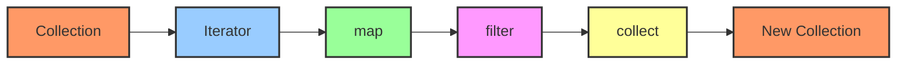

# Rust Collection Iteration

In Rust programming, collections like vectors, arrays, and hashmaps store multiple values. Being able to efficiently iterate over these collections is a fundamental skill. This guide will walk you through different ways to iterate over Rust collections, from basic loops to advanced iterator methods.

## Introduction to Collection Iteration

Iteration refers to the process of accessing each element in a collection one at a time. Rust provides several powerful ways to iterate over collections, making your code more expressive and often more efficient.

Whether you need to simply view elements, transform them, or filter them based on certain conditions, Rust's iteration tools have you covered.

## Basic Iteration with Loops

### For Loops

The simplest way to iterate over a collection is using a `for` loop.

```rust
fn main() {
    // Creating a vector
    let numbers = vec![1, 2, 3, 4, 5];
    
    // Iterating over the vector
    for number in &numbers {
        println!("{}", number);
    }
}
```

**Output:**
```
1
2
3
4
5
```

When we use `for number in &numbers`, we're borrowing each element of the vector. This allows us to read the values without taking ownership of them.

### Iterating with Indices

If you need the index of each element along with its value, you can use the `enumerate()` method:

```rust
fn main() {
    let fruits = vec!["Apple", "Banana", "Cherry"];
    
    for (index, fruit) in fruits.iter().enumerate() {
        println!("Fruit at index {}: {}", index, fruit);
    }
}
```

**Output:**
```
Fruit at index 0: Apple
Fruit at index 1: Banana
Fruit at index 2: Cherry
```

## The Iterator Trait

At the heart of Rust's iteration capabilities is the `Iterator` trait. This trait defines a set of methods that allow you to process collections in various ways.

The most fundamental method of the `Iterator` trait is `next()`, which returns the next element in the sequence:

```rust
fn main() {
    let numbers = vec![10, 20, 30];
    
    // Creating an iterator
    let mut iter = numbers.iter();
    
    // Manually calling next()
    println!("{:?}", iter.next()); // Some(&10)
    println!("{:?}", iter.next()); // Some(&20)
    println!("{:?}", iter.next()); // Some(&30)
    println!("{:?}", iter.next()); // None
}
```

**Output:**
```
Some(10)
Some(20)
Some(30)
None
```

Notice that `next()` returns an `Option<&T>`, which is `Some(&T)` when there's an element or `None` when the iterator is exhausted.

## Obtaining Iterators from Collections

Every collection in Rust provides methods to create iterators. Here are the three most common iterator methods:

1. **`iter()`**: Borrows each element, giving you `&T`
2. **`iter_mut()`**: Borrows each element mutably, giving you `&mut T`
3. **`into_iter()`**: Takes ownership of the collection, giving you `T`

Let's see examples of each:

### `iter()` - Borrowing Elements

```rust
fn main() {
    let numbers = vec![1, 2, 3];
    
    for number in numbers.iter() {
        println!("Borrowed: {}", number);
    }
    
    // We can still use numbers here because we only borrowed its elements
    println!("Original vector: {:?}", numbers);
}
```

**Output:**
```
Borrowed: 1
Borrowed: 2
Borrowed: 3
Original vector: [1, 2, 3]
```

### `iter_mut()` - Mutable Borrowing

```rust
fn main() {
    let mut numbers = vec![1, 2, 3];
    
    // Iterate with mutable references
    for number in numbers.iter_mut() {
        *number *= 2; // Double each number
    }
    
    println!("Modified vector: {:?}", numbers);
}
```

**Output:**
```
Modified vector: [2, 4, 6]
```

### `into_iter()` - Taking Ownership

```rust
fn main() {
    let numbers = vec![1, 2, 3];
    
    // This takes ownership of the vector
    for number in numbers.into_iter() {
        println!("Owned: {}", number);
    }
    
    // Uncommenting the line below would cause a compile error
    // println!("Original vector: {:?}", numbers);
}
```

**Output:**
```
Owned: 1
Owned: 2
Owned: 3
```

## Iterator Methods

Rust's iterators come with many useful methods that allow you to transform, filter, and process collections in various ways.

### Transforming Elements with `map()`

The `map()` method transforms each element using a closure:

```rust
fn main() {
    let numbers = vec![1, 2, 3, 4, 5];
    
    let squares: Vec<i32> = numbers.iter()
                                   .map(|n| n * n)
                                   .collect();
    
    println!("Squares: {:?}", squares);
}
```

**Output:**
```
Squares: [1, 4, 9, 16, 25]
```

### Filtering Elements with `filter()`

The `filter()` method keeps only elements that satisfy a predicate:

```rust
fn main() {
    let numbers = vec![1, 2, 3, 4, 5, 6];
    
    let even_numbers: Vec<&i32> = numbers.iter()
                                         .filter(|&&n| n % 2 == 0)
                                         .collect();
    
    println!("Even numbers: {:?}", even_numbers);
}
```

**Output:**
```
Even numbers: [2, 4, 6]
```

### Combining Transformations

You can chain multiple iterator methods together:

```rust
fn main() {
    let numbers = vec![1, 2, 3, 4, 5, 6, 7, 8, 9, 10];
    
    let sum_of_odd_squares: i32 = numbers.iter()
                                         .filter(|&&n| n % 2 != 0) // Keep odd numbers
                                         .map(|&n| n * n)         // Square them
                                         .sum();                  // Sum the results
    
    println!("Sum of squares of odd numbers: {}", sum_of_odd_squares);
}
```

**Output:**
```
Sum of squares of odd numbers: 165
```

## Iterating Over Different Collection Types

### Iterating Over Arrays

Arrays work similarly to vectors:

```rust
fn main() {
    let colors = ["red", "green", "blue"];
    
    for color in &colors {
        println!("Color: {}", color);
    }
}
```

**Output:**
```
Color: red
Color: green
Color: blue
```

### Iterating Over Hashmaps

Hashmaps provide key-value pairs during iteration:

```rust
use std::collections::HashMap;

fn main() {
    let mut scores = HashMap::new();
    scores.insert("Alice", 98);
    scores.insert("Bob", 95);
    scores.insert("Charlie", 85);
    
    // Iterate over key-value pairs
    for (name, score) in &scores {
        println!("{} scored {}", name, score);
    }
}
```

**Output:**
```
Charlie scored 85
Alice scored 98
Bob scored 95
```

Note: The order of elements in a HashMap is not guaranteed, so your output might be in a different order.

### Iterating Over Strings

Iterating over a String gives you characters:

```rust
fn main() {
    let message = "Hello!";
    
    for c in message.chars() {
        println!("Character: {}", c);
    }
}
```

**Output:**
```
Character: H
Character: e
Character: l
Character: l
Character: o
Character: !
```

## Consuming Iterators

### Collecting Results

The `collect()` method gathers the elements of an iterator into a collection:

```rust
fn main() {
    let numbers = vec![1, 2, 3, 4, 5];
    
    let doubled: Vec<i32> = numbers.iter()
                                   .map(|&n| n * 2)
                                   .collect();
    
    println!("Doubled numbers: {:?}", doubled);
}
```

**Output:**
```
Doubled numbers: [2, 4, 6, 8, 10]
```

### Finding Elements

The `find()` method returns the first element that matches a predicate:

```rust
fn main() {
    let numbers = vec![1, 2, 3, 4, 5];
    
    let first_even = numbers.iter().find(|&&n| n % 2 == 0);
    
    match first_even {
        Some(n) => println!("First even number: {}", n),
        None => println!("No even numbers found"),
    }
}
```

**Output:**
```
First even number: 2
```

### Folding/Reducing

The `fold()` method combines elements using an accumulator:

```rust
fn main() {
    let numbers = vec![1, 2, 3, 4, 5];
    
    // Sum using fold
    let sum = numbers.iter().fold(0, |acc, &x| acc + x);
    
    println!("Sum: {}", sum);
}
```

**Output:**
```
Sum: 15
```

## Iterator Visualization

Let's visualize how iterators process elements:



## Common Iterator Patterns

### The `for_each` Method

When you just need to perform an action for each element:

```rust
fn main() {
    let numbers = vec![1, 2, 3, 4, 5];
    
    numbers.iter().for_each(|n| {
        println!("Processing number: {}", n);
    });
}
```

**Output:**
```
Processing number: 1
Processing number: 2
Processing number: 3
Processing number: 4
Processing number: 5
```

### Zipping Iterators

The `zip()` method combines two iterators:

```rust
fn main() {
    let names = vec!["Alice", "Bob", "Charlie"];
    let ages = vec![25, 30, 35];
    
    for (name, age) in names.iter().zip(ages.iter()) {
        println!("{} is {} years old", name, age);
    }
}
```

**Output:**
```
Alice is 25 years old
Bob is 30 years old
Charlie is 35 years old
```

## Real-World Examples

### Data Processing Pipeline

Here's a more comprehensive example that processes a collection of user data:

```rust
struct User {
    name: String,
    age: u32,
    active: bool,
}

fn main() {
    let users = vec![
        User { name: String::from("Alice"), age: 28, active: true },
        User { name: String::from("Bob"), age: 35, active: false },
        User { name: String::from("Charlie"), age: 22, active: true },
        User { name: String::from("Dave"), age: 42, active: true },
        User { name: String::from("Eve"), age: 31, active: false },
    ];
    
    // Process the data: Find active users over 30 and get their names
    let experienced_active_users: Vec<String> = users.iter()
        .filter(|user| user.active && user.age > 30)
        .map(|user| format!("{} ({})", user.name, user.age))
        .collect();
    
    println!("Experienced active users:");
    for user in &experienced_active_users {
        println!("- {}", user);
    }
    
    // Calculate average age of active users
    let active_users: Vec<&User> = users.iter().filter(|user| user.active).collect();
    let active_count = active_users.len();
    
    if active_count > 0 {
        let total_age: u32 = active_users.iter().map(|user| user.age).sum();
        let average_age = total_age as f64 / active_count as f64;
        println!("Average age of active users: {:.1}", average_age);
    } else {
        println!("No active users found");
    }
}
```

**Output:**
```
Experienced active users:
- Dave (42)
Average age of active users: 30.7
```

### Building a Configuration Parser

Here's an example of parsing a configuration file:

```rust
fn main() {
    // Simulating lines from a config file
    let config_lines = vec![
        "# This is a comment",
        "",
        "server_host=127.0.0.1",
        "server_port=8080",
        "max_connections=100",
        "# Another comment",
        "log_level=info",
    ];
    
    // Parse the configuration into a vector of key-value pairs
    let config: Vec<(String, String)> = config_lines.iter()
        .filter(|line| !line.is_empty() && !line.starts_with("#"))
        .filter_map(|line| {
            let parts: Vec<&str> = line.split('=').collect();
            if parts.len() == 2 {
                Some((parts[0].to_string(), parts[1].to_string()))
            } else {
                None
            }
        })
        .collect();
    
    // Display the parsed configuration
    println!("Parsed configuration:");
    for (key, value) in &config {
        println!("{}: {}", key, value);
    }
}
```

**Output:**
```
Parsed configuration:
server_host: 127.0.0.1
server_port: 8080
max_connections: 100
log_level: info
```

## Summary

In this guide, we've explored how to iterate over collections in Rust. We've covered:

- Basic iteration using for loops
- The Iterator trait and how to create iterators
- Different types of iterators: `iter()`, `iter_mut()`, and `into_iter()`
- Transforming collections using methods like `map()` and `filter()`
- Consuming iterators with methods like `collect()`, `find()`, and `fold()`
- Iterating over different collection types like vectors, hashmaps, and strings
- Real-world applications of iterators in data processing and parsing

Iterators are one of Rust's most powerful features. They provide a safe, expressive, and often more efficient way to process collections compared to traditional loops. By leveraging the methods provided by the Iterator trait, you can write more concise and readable code while maintaining Rust's safety guarantees.

## Exercises

1. **Basic Iterator**: Create a function that takes a vector of integers and returns a new vector containing only the even numbers.

2. **Iterator Transformation**: Write a program that takes a vector of strings and returns a new vector containing the length of each string.

3. **Iterator Combinations**: Create a function that takes two vectors and returns a vector of pairs (tuples) containing elements from both vectors.

4. **Custom Collection**: Create a simple struct representing a deck of cards and implement an iterator for it that yields each card.

5. **Advanced Processing**: Write a program that reads a text file, counts the occurrences of each word, and outputs the top 5 most frequent words.

## Additional Resources

- [Rust Documentation on Iterators](https://doc.rust-lang.org/std/iter/trait.Iterator.html)
- [The Rust Programming Language Book - Chapter on Iterators](https://doc.rust-lang.org/book/ch13-02-iterators.html)
- [Rust By Example - Iterators](https://doc.rust-lang.org/rust-by-example/trait/iter.html)
- [The Iterator Trait pattern in the Rust API Guidelines](https://rust-lang.github.io/api-guidelines/predictability.html#c-iter)

Happy coding with Rust collections!