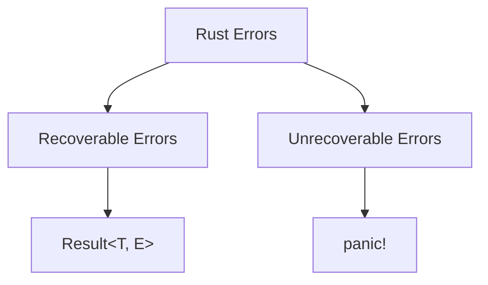

# Rust Error Types

## Introduction

Error handling is a critical aspect of writing robust software, and Rust's approach to error management is both powerful and expressive. Unlike many languages that rely on exceptions, Rust uses a type-based error handling system that forces developers to consciously handle potential failures.

In this tutorial, we'll explore the different error types in Rust, understand how they work, and learn how to use them effectively in your own programs. By the end, you'll have a solid understanding of Rust's error handling philosophy and practical techniques to implement it in your code.

## Understanding Rust's Error Philosophy

Before diving into specific error types, it's important to understand Rust's philosophy toward errors:

1. **Explicit error handling**: Rust requires explicit handling of errors, making failure cases visible in function signatures
2. **No exceptions**: Rust doesn't use exception-based error handling, preventing unexpected program flow
3. **Errors as values**: Errors are just values that can be examined, transformed, and passed around
4. **Compile-time error checking**: The compiler ensures you handle potential errors

This approach leads to more reliable code by making error paths explicit and preventing many common bugs.

## The Two Main Categories of Errors in Rust

Rust divides errors into two main categories:



Let's explore each of these categories in detail.

## Unrecoverable Errors with `panic!`

When a fatal error occurs that the program cannot reasonably recover from, Rust provides the `panic!` mechanism.

### Basic Usage of `panic!`

```rust
fn main() {
    panic!("Critical error: system failure");
}
```

Output:
```
thread 'main' panicked at 'Critical error: system failure', src/main.rs:2:5
note: run with `RUST_BACKTRACE=1` environment variable to display a backtrace
```

When a panic occurs:
1. The program prints an error message
2. The stack unwinds (cleaning up resources)
3. The program terminates

### When to Use `panic!`

Use panic when:
- A bug has been detected and it's not clear how to handle it
- You're in a situation where continuing execution could lead to security issues or data corruption
- You're writing examples or prototype code where error handling would distract from the main point

```rust
fn main() {
    let config_file = "config.json";
    let config = std::fs::read_to_string(config_file)
        .expect("Critical configuration file missing!");
    
    // Program continues only if config file was successfully read
    println!("Configuration loaded successfully");
}
```

## Recoverable Errors with `Result<T, E>`

For errors that a program should handle, Rust uses the `Result<T, E>` enum:

```rust
enum Result<T, E> {
    Ok(T),  // Successful value of type T
    Err(E), // Error value of type E
}
```

### Basic Usage of `Result`

Here's a simple example of using `Result`:

```rust
fn main() {
    let file_result = std::fs::read_to_string("data.txt");
    
    match file_result {
        Ok(content) => println!("File content: {}", content),
        Err(error) => println!("Failed to read file: {}", error),
    }
    
    // Program continues regardless of whether the file was found
    println!("Program continues executing...");
}
```

Output (if file doesn't exist):
```
Failed to read file: No such file or directory (os error 2)
Program continues executing...
```

### Using the `?` Operator

The `?` operator provides a concise way to handle errors. It automatically returns the error from a function if one occurs:

```rust
use std::fs::File;
use std::io::{self, Read};

fn read_username_from_file() -> Result<String, io::Error> {
    let mut file = File::open("username.txt")?;
    let mut username = String::new();
    file.read_to_string(&mut username)?;
    Ok(username)
}

fn main() {
    match read_username_from_file() {
        Ok(name) => println!("Username: {}", name),
        Err(e) => println!("Error reading username: {}", e),
    }
}
```

The `?` operator:
1. If the `Result` is an `Ok`, it extracts the value inside
2. If the `Result` is an `Err`, it returns early from the function with that error

## Common Error Types in Rust's Standard Library

### `std::io::Error`

This is the error type used for I/O operations:

```rust
use std::fs::File;
use std::io;

fn main() {
    let file_result = File::open("nonexistent.txt");
    
    match file_result {
        Ok(_) => println!("File opened successfully"),
        Err(error) => match error.kind() {
            io::ErrorKind::NotFound => println!("File not found"),
            io::ErrorKind::PermissionDenied => println!("Permission denied"),
            _ => println!("Other error: {}", error),
        },
    }
}
```

### `std::num::ParseIntError`

This error occurs when parsing strings to integers fails:

```rust
fn main() {
    let number_str = "42";
    let number = number_str.parse::<i32>();
    
    match number {
        Ok(n) => println!("Parsed number: {}", n),
        Err(e) => println!("Failed to parse: {}", e),
    }
    
    // Now with an invalid input
    let invalid_number = "42x".parse::<i32>();
    
    match invalid_number {
        Ok(n) => println!("Parsed number: {}", n),
        Err(e) => println!("Failed to parse: {}", e),
    }
}
```

Output:
```
Parsed number: 42
Failed to parse: invalid digit found in string
```

## Creating Custom Error Types

As your programs grow, you'll often want to define your own error types.

### Using Simple Enums

```rust
enum MathError {
    DivisionByZero,
    NegativeSquareRoot,
    Overflow,
}

fn divide(a: f64, b: f64) -> Result<f64, MathError> {
    if b == 0.0 {
        return Err(MathError::DivisionByZero);
    }
    Ok(a / b)
}

fn sqrt(x: f64) -> Result<f64, MathError> {
    if x < 0.0 {
        return Err(MathError::NegativeSquareRoot);
    }
    Ok(x.sqrt())
}

fn main() {
    // Test division
    match divide(10.0, 2.0) {
        Ok(result) => println!("10 / 2 = {}", result),
        Err(MathError::DivisionByZero) => println!("Cannot divide by zero!"),
        Err(_) => println!("Other math error"),
    }
    
    // Test division by zero
    match divide(10.0, 0.0) {
        Ok(result) => println!("10 / 0 = {}", result),
        Err(MathError::DivisionByZero) => println!("Cannot divide by zero!"),
        Err(_) => println!("Other math error"),
    }
    
    // Test square root
    match sqrt(-4.0) {
        Ok(result) => println!("sqrt(-4) = {}", result),
        Err(MathError::NegativeSquareRoot) => println!("Cannot take square root of negative number!"),
        Err(_) => println!("Other math error"),
    }
}
```

Output:
```
10 / 2 = 5
Cannot divide by zero!
Cannot take square root of negative number!
```

### Implementing `std::error::Error` Trait

For more advanced error types, implement the `Error` trait:

```rust
use std::fmt;
use std::error::Error;

#[derive(Debug)]
enum AppError {
    ConfigError(String),
    NetworkError(String),
    DatabaseError(String),
}

impl fmt::Display for AppError {
    fn fmt(&self, f: &mut fmt::Formatter) -> fmt::Result {
        match self {
            AppError::ConfigError(msg) => write!(f, "Configuration error: {}", msg),
            AppError::NetworkError(msg) => write!(f, "Network error: {}", msg),
            AppError::DatabaseError(msg) => write!(f, "Database error: {}", msg),
        }
    }
}

impl Error for AppError {}

fn load_config() -> Result<String, AppError> {
    // Simulate a config error
    Err(AppError::ConfigError("Missing API key".to_string()))
}

fn main() {
    match load_config() {
        Ok(config) => println!("Config loaded: {}", config),
        Err(e) => println!("Error: {}", e),
    }
}
```

Output:
```
Error: Configuration error: Missing API key
```

## Error Propagation and Conversion

### The `From` Trait for Error Conversion

The `From` trait allows automatic conversion between error types when using the `?` operator:

```rust
use std::fs::File;
use std::io::{self, Read};
use std::num::ParseIntError;
use std::fmt;
use std::error::Error;

#[derive(Debug)]
enum ConfigError {
    IoError(io::Error),
    ParseError(ParseIntError),
    MissingValue(String),
}

impl fmt::Display for ConfigError {
    fn fmt(&self, f: &mut fmt::Formatter) -> fmt::Result {
        match self {
            ConfigError::IoError(e) => write!(f, "IO error: {}", e),
            ConfigError::ParseError(e) => write!(f, "Parse error: {}", e),
            ConfigError::MissingValue(key) => write!(f, "Missing config value: {}", key),
        }
    }
}

impl Error for ConfigError {}

impl From<io::Error> for ConfigError {
    fn from(error: io::Error) -> Self {
        ConfigError::IoError(error)
    }
}

impl From<ParseIntError> for ConfigError {
    fn from(error: ParseIntError) -> Self {
        ConfigError::ParseError(error)
    }
}

fn read_config_file() -> Result<i32, ConfigError> {
    // Open the file - this could return io::Error
    let mut file = File::open("config.txt")?; // io::Error converted to ConfigError
    
    let mut content = String::new();
    file.read_to_string(&mut content)?; // io::Error converted to ConfigError
    
    // Parse the string to an integer - this could return ParseIntError
    let value = content.trim().parse::<i32>()?; // ParseIntError converted to ConfigError
    
    if value <= 0 {
        return Err(ConfigError::MissingValue("Positive number required".to_string()));
    }
    
    Ok(value)
}

fn main() {
    match read_config_file() {
        Ok(config_value) => println!("Config value: {}", config_value),
        Err(e) => println!("Configuration error: {}", e),
    }
}
```

In this example, the `?` operator automatically converts both `io::Error` and `ParseIntError` to our custom `ConfigError` type.

## Using `thiserror` and `anyhow` Crates

For real-world applications, the `thiserror` and `anyhow` crates can simplify error handling:

### `thiserror` for Library Code

```rust
use thiserror::Error;

#[derive(Error, Debug)]
enum ServiceError {
    #[error("IO error: {0}")]
    Io(#[from] std::io::Error),
    
    #[error("Data parsing error: {0}")]
    Parse(#[from] std::num::ParseIntError),
    
    #[error("Database error: {source}")]
    Database {
        #[from]
        source: DatabaseError,
        backtrace: std::backtrace::Backtrace,
    },
    
    #[error("Invalid input: {0}")]
    InvalidInput(String),
}

#[derive(Error, Debug)]
#[error("Database error: {message}")]
struct DatabaseError {
    message: String,
}
```

### `anyhow` for Application Code

```rust
use anyhow::{Result, Context, anyhow};
use std::fs::File;
use std::io::Read;

fn read_config() -> Result<String> {
    let mut file = File::open("config.txt")
        .context("Failed to open config file")?;
    
    let mut contents = String::new();
    file.read_to_string(&mut contents)
        .context("Failed to read config file")?;
    
    if contents.is_empty() {
        return Err(anyhow!("Config file is empty"));
    }
    
    Ok(contents)
}

fn main() -> Result<()> {
    let config = read_config()?;
    println!("Config: {}", config);
    Ok(())
}
```

## Real-world Example: Building a Config Parser

Let's put everything together with a more comprehensive example:

```rust
use std::fs::File;
use std::io::{self, Read};
use std::collections::HashMap;
use std::str::FromStr;
use std::num::ParseIntError;
use std::fmt;
use std::error::Error;

// Define our custom error type
#[derive(Debug)]
enum ConfigError {
    IoError(io::Error),
    ParseError { line: usize, error: String },
    MissingField(String),
}

impl fmt::Display for ConfigError {
    fn fmt(&self, f: &mut fmt::Formatter) -> fmt::Result {
        match self {
            ConfigError::IoError(e) => write!(f, "IO error: {}", e),
            ConfigError::ParseError { line, error } => {
                write!(f, "Parse error at line {}: {}", line, error)
            }
            ConfigError::MissingField(field) => {
                write!(f, "Missing required field: {}", field)
            }
        }
    }
}

impl Error for ConfigError {}

impl From<io::Error> for ConfigError {
    fn from(error: io::Error) -> Self {
        ConfigError::IoError(error)
    }
}

// Configuration structure
struct ServerConfig {
    port: u16,
    host: String,
    max_connections: u32,
    timeout_seconds: u64,
}

impl ServerConfig {
    fn from_map(map: HashMap<String, String>) -> Result<Self, ConfigError> {
        // Helper function to get a field or return an error
        fn get_field<T: FromStr>(
            map: &HashMap<String, String>,
            key: &str,
        ) -> Result<T, ConfigError> {
            let value = map
                .get(key)
                .ok_or_else(|| ConfigError::MissingField(key.to_string()))?;
            
            value.parse::<T>().map_err(|_| {
                ConfigError::ParseError {
                    line: 0, // In a real implementation, we'd track line numbers
                    error: format!("Invalid format for {}", key),
                }
            })
        }
        
        Ok(ServerConfig {
            port: get_field(&map, "port")?,
            host: get_field(&map, "host")?,
            max_connections: get_field(&map, "max_connections")?,
            timeout_seconds: get_field(&map, "timeout_seconds")?,
        })
    }
}

fn parse_config_file(path: &str) -> Result<ServerConfig, ConfigError> {
    // Read the file
    let mut file = File::open(path)?;
    let mut contents = String::new();
    file.read_to_string(&mut contents)?;
    
    // Parse config lines into a HashMap
    let mut config_map = HashMap::new();
    for (i, line) in contents.lines().enumerate() {
        let line = line.trim();
        
        // Skip empty lines and comments
        if line.is_empty() || line.starts_with('#') {
            continue;
        }
        
        // Parse "key=value" pairs
        let parts: Vec<&str> = line.splitn(2, '=').collect();
        if parts.len() != 2 {
            return Err(ConfigError::ParseError {
                line: i + 1,
                error: "Invalid format, expected 'key=value'".to_string(),
            });
        }
        
        let key = parts[0].trim().to_string();
        let value = parts[1].trim().to_string();
        config_map.insert(key, value);
    }
    
    // Convert the HashMap into a ServerConfig
    ServerConfig::from_map(config_map)
}

fn main() {
    match parse_config_file("server.conf") {
        Ok(config) => {
            println!("Server will start on {}:{}", config.host, config.port);
            println!("Max connections: {}", config.max_connections);
            println!("Timeout: {} seconds", config.timeout_seconds);
        }
        Err(e) => {
            eprintln!("Failed to load configuration: {}", e);
            std::process::exit(1);
        }
    }
}
```

In this example:
1. We define a custom `ConfigError` type that handles different failure cases
2. We implement proper error conversion with `From`
3. We structure the error messages to be helpful for debugging
4. We propagate errors using the `?` operator
5. We provide context with specific error messages

## Summary

Rust's error handling system provides several key advantages:

1. **Type safety**: The compiler ensures you handle potential errors
2. **Explicitness**: Error paths are clearly visible in the code
3. **Composability**: Errors can be easily transformed, combined, and propagated
4. **Expressiveness**: Custom error types can precisely describe what went wrong

By understanding and effectively using Rust's error types, you can write robust, maintainable code that gracefully handles failure cases.

Remember these key principles:
- Use `panic!` for unrecoverable errors
- Use `Result<T, E>` for recoverable errors
- Create custom error types for domain-specific errors
- Implement the `From` trait for easy error conversion
- Consider the `thiserror` and `anyhow` crates for real-world applications

## Additional Resources

- [The Rust Programming Language Book - Error Handling Chapter](https://doc.rust-lang.org/book/ch09-00-error-handling.html)
- [Rust by Example - Error Handling](https://doc.rust-lang.org/rust-by-example/error.html)
- [thiserror crate documentation](https://docs.rs/thiserror)
- [anyhow crate documentation](https://docs.rs/anyhow)

## Exercises

1. **Basic Error Handling**: Write a function that reads a file, parses it as JSON, and returns a specific field. Use proper error handling with `Result`.

2. **Custom Error Types**: Create a custom error type for a calculator that handles division by zero, overflow, and parsing errors.

3. **Error Context**: Modify the config parser example to include file path information in error messages.

4. **Library vs. Application**: Write a small library with custom error types (using `thiserror`) and then an application that uses it (with `anyhow`).

5. **Advanced**: Implement a simple HTTP client that handles connection errors, timeout errors, and parsing errors with a clean, unified error API.