# Rust Option Enum

## Introduction

One of Rust's most valuable features is its approach to handling the potential absence of values. Unlike many other programming languages that use `null` or `nil` references (which can lead to runtime errors), Rust provides a more robust solution: the `Option` enum.

The `Option` enum is a core part of Rust's type system and represents a value that might be present (`Some(value)`) or absent (`None`). By forcing developers to explicitly handle both cases, Rust eliminates an entire category of errors at compile time.

In this tutorial, we'll explore:
- What the `Option` enum is and why it exists
- How to use `Option` in your code
- Common methods for working with `Option` values
- Practical patterns and real-world examples

## What is the Option Enum?

The `Option` enum is defined in Rust's standard library as:

```rust
enum Option<T> {
    None,    // Represents the absence of a value
    Some(T), // Represents a value of type T
}
```

Here, `T` is a generic type parameter, meaning `Option` can wrap any type. This enum is so fundamental to Rust that it's included in the prelude, so you don't need to explicitly import it.

## Why Use Option Instead of Null?

Null references have been called "the billion-dollar mistake" by their inventor, Tony Hoare. They lead to crashes, bugs, and undefined behavior in many programming languages. Rust eliminates these issues by:

1. Making the possibility of absence explicit in the type system
2. Forcing developers to handle both the presence and absence cases
3. Providing safe, convenient methods for working with optional values

## Basic Usage of Option

### Creating Option Values

```rust
// Creating Some values
let some_number = Some(42);
let some_string = Some("hello");

// Creating a None value (type annotation required)
let absent_number: Option<i32> = None;

println!("{:?}", some_number); // Output: Some(42)
println!("{:?}", some_string); // Output: Some("hello")
println!("{:?}", absent_number); // Output: None
```

### Checking if an Option Contains a Value

```rust
let maybe_value = Some(42);

if maybe_value.is_some() {
    println!("We have a value!");
} else {
    println!("No value here!");
}

// Output: We have a value!

let no_value: Option<i32> = None;

if no_value.is_none() {
    println!("Definitely no value here!");
}

// Output: Definitely no value here!
```

## Extracting Values from Option

There are several ways to extract the value from an `Option`. Here are the most common approaches:

### The match Expression

The `match` expression is the most fundamental way to handle `Option` values:

```rust
fn describe_option(opt: Option<i32>) {
    match opt {
        Some(value) => println!("Found a value: {}", value),
        None => println!("No value found"),
    }
}

describe_option(Some(42)); // Output: Found a value: 42
describe_option(None);     // Output: No value found
```

### The if let Syntax

When you only care about the `Some` case, you can use `if let` for more concise code:

```rust
let some_value = Some(42);

if let Some(value) = some_value {
    println!("Found a value: {}", value);
}
// Output: Found a value: 42
```

### Unwrapping Methods

Rust provides several methods for extracting values from `Option`, each with different behavior when the `Option` is `None`:

```rust
let value = Some(42);
let empty: Option<i32> = None;

// unwrap() returns the value or panics if None
println!("{}", value.unwrap()); // Output: 42
// println!("{}", empty.unwrap()); // This would panic!

// expect() is like unwrap() but with a custom error message
println!("{}", value.expect("This shouldn't be None!")); // Output: 42
// println!("{}", empty.expect("Value required!")); // Panic with message: Value required!

// unwrap_or() returns the value or a default if None
println!("{}", value.unwrap_or(0)); // Output: 42
println!("{}", empty.unwrap_or(0)); // Output: 0

// unwrap_or_else() returns the value or computes a default if None
println!("{}", empty.unwrap_or_else(|| {
    println!("Computing default...");
    -1
})); 
// Output:
// Computing default...
// -1
```

## Common Option Methods

The `Option` enum comes with many useful methods to transform and work with optional values safely:

### map() and map_or()

The `map` method applies a function to the contained value (if any):

```rust
let maybe_string = Some("Rust");
let maybe_len = maybe_string.map(|s| s.len());
println!("{:?}", maybe_len); // Output: Some(4)

let none_string: Option<&str> = None;
let none_len = none_string.map(|s| s.len());
println!("{:?}", none_len); // Output: None

// map_or combines map with unwrap_or
let maybe_string = Some("Rust");
let len = maybe_string.map_or(0, |s| s.len());
println!("{}", len); // Output: 4

let none_string: Option<&str> = None;
let len = none_string.map_or(0, |s| s.len());
println!("{}", len); // Output: 0
```

### and_then() (Flatmap)

The `and_then` method allows chaining operations that also return `Option`:

```rust
fn square(x: i32) -> Option<i32> {
    Some(x * x)
}

fn positive_sqrt(x: i32) -> Option<f64> {
    if x >= 0 {
        Some((x as f64).sqrt())
    } else {
        None
    }
}

// Chain operations that return Option
let result = Some(16).and_then(positive_sqrt).and_then(|x| Some(x * 2.0));
println!("{:?}", result); // Output: Some(8.0)

// If any step in the chain returns None, the final result is None
let negative = Some(-4).and_then(positive_sqrt).and_then(|x| Some(x * 2.0));
println!("{:?}", negative); // Output: None
```

### or() and or_else()

These methods provide alternatives when the `Option` is `None`:

```rust
let a: Option<i32> = Some(42);
let b: Option<i32> = None;
let c: Option<i32> = Some(100);

println!("{:?}", a.or(b));     // Output: Some(42) (a is Some, so b is ignored)
println!("{:?}", b.or(c));     // Output: Some(100) (b is None, so c is used)

// or_else takes a function that returns an Option
println!("{:?}", b.or_else(|| Some(99))); // Output: Some(99)
```

## Visual Representation of Option

Let's visualize how the `Option` enum fits into Rust's type system:

```mermaid
graph TD
    A[Value] --> B{Might be absent?}
    B -->|Yes| C[Option&lt;T&gt;]
    B -->|No| D[T]
    C --> E[Some&#40;T&#41;]
    C --> F[None]
    
    style C fill:#f9f,stroke:#333,stroke-width:2px
    style E fill:#bbf,stroke:#333,stroke-width:1px
    style F fill:#fcc,stroke:#333,stroke-width:1px
```



## Practical Examples

### Finding an Element in a Collection

```rust
fn find_user(users: &[&str], username: &str) -> Option<usize> {
    for (index, user) in users.iter().enumerate() {
        if *user == username {
            return Some(index);
        }
    }
    None
}

fn main() {
    let users = ["alice", "bob", "charlie"];
    
    match find_user(&users, "bob") {
        Some(index) => println!("Found bob at position {}", index),
        None => println!("User not found"),
    }
    
    // Output: Found bob at position 1
    
    // Using if let for more concise code
    if let Some(index) = find_user(&users, "dave") {
        println!("Found dave at position {}", index);
    } else {
        println!("Dave not found");
    }
    
    // Output: Dave not found
}
```

### Parsing Input

```rust
fn main() {
    let input = "42";
    let number: Option<i32> = input.parse().ok();
    
    // Using map to transform the value if it exists
    let doubled = number.map(|n| n * 2);
    println!("Doubled: {:?}", doubled); // Output: Doubled: Some(84)
    
    let invalid_input = "not a number";
    let number: Option<i32> = invalid_input.parse().ok();
    let doubled = number.map(|n| n * 2);
    println!("Doubled: {:?}", doubled); // Output: Doubled: None
}
```

### Optional Configuration

```rust
struct Configuration {
    port: u16,
    hostname: String,
    max_connections: Option<u32>,
    timeout: Option<u64>,
}

fn create_server(config: Configuration) {
    println!("Starting server on {}:{}", config.hostname, config.port);
    
    // Use unwrap_or for optional settings
    let max_conn = config.max_connections.unwrap_or(100);
    println!("Maximum connections: {}", max_conn);
    
    // Use map_or for optional settings with transformation
    let timeout_secs = config.timeout.map_or("default (30s)".to_string(), |t| format!("{}ms", t));
    println!("Timeout: {}", timeout_secs);
}

fn main() {
    let config = Configuration {
        port: 8080,
        hostname: "localhost".to_string(),
        max_connections: Some(1000),
        timeout: None,
    };
    
    create_server(config);
    
    // Output:
    // Starting server on localhost:8080
    // Maximum connections: 1000
    // Timeout: default (30s)
}
```

### Chaining Multiple Operations

```rust
struct User {
    id: u32,
    name: String,
    department: Option<String>,
}

struct Department {
    name: String,
    manager_id: Option<u32>,
}

fn find_user(id: u32) -> Option<User> {
    // Imagine this connects to a database
    if id == 1 {
        Some(User {
            id: 1,
            name: "Alice".to_string(),
            department: Some("Engineering".to_string()),
        })
    } else {
        None
    }
}

fn find_department(name: &str) -> Option<Department> {
    // Imagine this connects to a database
    if name == "Engineering" {
        Some(Department {
            name: name.to_string(),
            manager_id: Some(2),
        })
    } else {
        None
    }
}

fn find_user_department_manager(user_id: u32) -> Option<User> {
    // Chain multiple operations that return Option
    find_user(user_id)
        .and_then(|user| {
            // Get the department of the user
            user.department.as_ref()
                .and_then(|dept_name| find_department(dept_name))
                .and_then(|dept| {
                    // Get the manager's ID
                    dept.manager_id.and_then(|manager_id| {
                        // Get the manager user
                        find_user(manager_id)
                    })
                })
        })
}

fn main() {
    match find_user_department_manager(1) {
        Some(manager) => println!("Department manager: {}", manager.name),
        None => println!("Could not find the department manager"),
    }
    
    // If the user exists, and has a department, and the department exists,
    // and the department has a manager, and the manager exists in the database:
    // Output: Department manager: Alice (assuming all these conditions are true)
}
```

## Option vs. Result

While `Option` handles the presence/absence of a value, Rust also has a `Result` type for handling operations that can succeed or fail with an error. Here's when to use each:

```rust
// Use Option when a value might be absent
fn find_element(list: &[i32], element: i32) -> Option<usize> {
    list.iter().position(|&x| x == element)
}

// Use Result when an operation might fail with an error
fn divide(a: f64, b: f64) -> Result<f64, String> {
    if b == 0.0 {
        Err("Cannot divide by zero".to_string())
    } else {
        Ok(a / b)
    }
}
```

## Best Practices for Using Option

1. **Avoid unwrap() in production code**: Unless you're absolutely certain the `Option` contains a value, avoid using `unwrap()` as it will panic at runtime if the value is `None`.

2. **Use pattern matching for clarity**: Pattern matching with `match` or `if let` makes your intentions explicit and is often more readable.

3. **Use combinators for chaining**: Methods like `map`, `and_then`, and `or_else` allow for clean functional-style code.

4. **Return early for complex conditions**: If you have complex logic to determine an optional value, consider returning early with `None` to avoid deeply nested code.

5. **Use ? for short-circuiting**: In functions that return `Option`, the `?` operator provides a concise way to propagate `None` values.

```rust
fn first_even_squared(numbers: &[i32]) -> Option<i32> {
    // Find the first even number and square it
    let first_even = numbers.iter().find(|&&x| x % 2 == 0)?;
    Some(first_even * first_even)
}
```

## Summary

The `Option` enum is a fundamental part of Rust's type system that elegantly solves the "null problem" by:

1. Making absence explicit in the type system
2. Forcing developers to handle both presence and absence cases
3. Providing a rich set of methods for safely manipulating optional values

By understanding and properly using `Option`, you can write more robust, safe, and expressive Rust code that's free from null-reference errors.

## Additional Resources

- [The Rust Book: The Option Enum](https://doc.rust-lang.org/book/ch06-01-defining-an-enum.html#the-option-enum-and-its-advantages-over-null-values)
- [Rust Standard Library: Option Documentation](https://doc.rust-lang.org/std/option/enum.Option.html)
- [Rust By Example: Option](https://doc.rust-lang.org/rust-by-example/std/option.html)

## Exercises

1. **Basic Option Handling**: Write a function that finds the first word in a list that starts with a given letter, returning an `Option<&str>`.

2. **Option Chaining**: Create a function that takes a string, parses it to an integer, doubles it, and then converts it back to a string. Use the `Option` type to handle parsing errors.

3. **Custom Data Structure**: Design a simple cache that stores values with an expiration time. When retrieving values, return an `Option<T>` that's `None` if the value has expired.

4. **Option Combinators**: Refactor the following code to use `Option` combinators instead of match expressions:
   ```rust
   fn process_data(data: Option<i32>) -> Option<String> {
       match data {
           Some(value) => {
               let doubled = value * 2;
               if doubled > 10 {
                   Some(format!("Large value: {}", doubled))
               } else {
                   None
               }
           }
           None => None,
       }
   }
   ```