# Rust Result Enum

## Introduction

Error handling is a critical aspect of writing robust and reliable software. In Rust, the `Result` enum is one of the primary tools for handling operations that might fail. Unlike many other programming languages that use exceptions for error handling, Rust takes a different approach with its `Result` type, providing a more explicit and type-safe way to deal with errors.

In this tutorial, we'll explore the `Result` enum in depth, understand how it works, and learn how to use it effectively in your Rust programs. By the end, you'll have a solid understanding of this fundamental Rust concept and be equipped to write more robust code.

## What is the Result Enum?

The `Result<T, E>` enum is a type that represents either success (`Ok`) or failure (`Err`). It's defined in the standard library as:

```rust
enum Result<T, E> {
    Ok(T),
    Err(E),
}
```

Where:
- `T` is the type of the value returned in the success case
- `E` is the type of the error returned in the failure case

This simple but powerful construct allows functions to return either a successful value or an error, making error handling explicit in the function signature.

Let's visualize the Result enum structure:

```mermaid
graph TD
    A[Result&lt;T, E&gt;] --> B[Ok&#40;T&#41;]
    A --> C[Err&#40;E&#41;]
    B --> D[Contains the success value]
    C --> E[Contains the error value]
```



## Basic Usage of Result

Let's start with a simple example of how to use `Result`:

```rust
fn divide(a: f64, b: f64) -> Result<f64, String> {
    if b == 0.0 {
        Err("Cannot divide by zero".to_string())
    } else {
        Ok(a / b)
    }
}

fn main() {
    // Successful case
    let result1 = divide(10.0, 2.0);
    // Error case
    let result2 = divide(10.0, 0.0);
    
    println!("Result1: {:?}", result1); // Output: Result1: Ok(5.0)
    println!("Result2: {:?}", result2); // Output: Result2: Err("Cannot divide by zero")
}
```

In this example:
1. We define a `divide` function that returns a `Result<f64, String>`
2. If the divisor is zero, we return an `Err` containing an error message
3. Otherwise, we return an `Ok` containing the division result
4. In `main()`, we call the function with valid and invalid inputs to see both outcomes

## Handling Result Values

Now that we know how to create and return `Result` values, let's explore how to handle them.

### Using match

The most basic way to handle a `Result` is with a `match` expression:

```rust
fn main() {
    let result = divide(10.0, 2.0);
    
    match result {
        Ok(value) => println!("The result is: {}", value),
        Err(error) => println!("Error: {}", error),
    }
}
```

This pattern allows you to handle both success and error cases explicitly.

### Using if let

For simpler cases where you only need to handle one variant, you can use `if let`:

```rust
fn main() {
    let result = divide(10.0, 2.0);
    
    if let Ok(value) = result {
        println!("The result is: {}", value);
    }
    
    // Or handle just the error case
    let result = divide(10.0, 0.0);
    
    if let Err(error) = result {
        println!("Error occurred: {}", error);
    }
}
```

### Propagating Errors with ?

Rust provides the `?` operator to simplify error propagation. When you use `?` after a `Result`, it will:
- Return the value inside `Ok` if successful
- Return early from the function with the error if it's an `Err`

Here's an example:

```rust
fn operation() -> Result<f64, String> {
    // The ? will extract the value if Ok, or return the Err
    let result = divide(10.0, 2.0)?;
    
    // This line only runs if divide was successful
    let final_result = result * 2.0;
    
    Ok(final_result)
}

fn main() {
    match operation() {
        Ok(value) => println!("Operation succeeded: {}", value),
        Err(error) => println!("Operation failed: {}", error),
    }
}
```

The `?` operator makes error handling code much cleaner when you want to chain multiple operations that might fail.

## Common Result Methods

The `Result` enum comes with several useful methods that make working with it more convenient:

### unwrap() and expect()

```rust
fn main() {
    // unwrap() returns the value or panics if it's an error
    let value = divide(10.0, 2.0).unwrap(); // Returns 5.0
    println!("Value: {}", value);
    
    // expect() is like unwrap but with a custom error message
    let value = divide(10.0, 2.0)
        .expect("Division operation failed"); // Returns 5.0
    println!("Value: {}", value);
    
    // These will panic:
    // divide(10.0, 0.0).unwrap();
    // divide(10.0, 0.0).expect("Division operation failed");
}
```

⚠️ **Warning**: `unwrap()` and `expect()` should be used carefully as they will cause your program to panic if the `Result` is an `Err`.

### unwrap_or() and unwrap_or_else()

```rust
fn main() {
    // unwrap_or provides a default value if Result is an Err
    let value = divide(10.0, 0.0).unwrap_or(0.0);
    println!("Value with default: {}", value); // Output: Value with default: 0.0
    
    // unwrap_or_else lets you provide a function to compute a default
    let value = divide(10.0, 0.0).unwrap_or_else(|_error| {
        println!("Using computed default because of an error");
        0.0
    });
    println!("Computed value: {}", value); // Output: Computed value: 0.0
}
```

### map() and map_err()

These methods allow you to transform the values inside `Ok` or `Err` variants:

```rust
fn main() {
    // map transforms the value inside Ok
    let result = divide(10.0, 2.0)
        .map(|value| value * 2.0);
    println!("Mapped result: {:?}", result); // Output: Mapped result: Ok(10.0)
    
    // map_err transforms the error inside Err
    let result = divide(10.0, 0.0)
        .map_err(|error| format!("Math error: {}", error));
    println!("Mapped error: {:?}", result); 
    // Output: Mapped error: Err("Math error: Cannot divide by zero")
}
```

### and_then() and or_else()

These methods are useful for chaining operations:

```rust
fn double(x: f64) -> Result<f64, String> {
    Ok(x * 2.0)
}

fn main() {
    // and_then is like flatMap in other languages
    let result = divide(10.0, 2.0)
        .and_then(double);
    println!("and_then result: {:?}", result); // Output: and_then result: Ok(10.0)
    
    // or_else lets you recover from errors
    let result = divide(10.0, 0.0)
        .or_else(|_error| {
            println!("Recovering from division error");
            Ok(0.0)
        });
    println!("or_else result: {:?}", result); // Output: or_else result: Ok(0.0)
}
```

## Real-World Example: File Processing

Let's see a more practical example of using `Result` for error handling when working with files:

```rust
use std::fs::File;
use std::io::{self, Read};

fn read_file_contents(path: &str) -> Result<String, io::Error> {
    let mut file = File::open(path)?;
    let mut contents = String::new();
    file.read_to_string(&mut contents)?;
    Ok(contents)
}

fn process_file(path: &str) -> Result<(), io::Error> {
    let contents = read_file_contents(path)?;
    
    println!("File contents:");
    println!("{}", contents);
    
    Ok(())
}

fn main() {
    match process_file("example.txt") {
        Ok(()) => println!("File processing completed successfully"),
        Err(error) => println!("Error processing file: {}", error),
    }
}
```

In this example:
1. `read_file_contents` returns a `Result` with the file contents or an IO error
2. `process_file` uses the `?` operator to propagate errors from `read_file_contents`
3. In `main()`, we match on the result of `process_file` to handle success or failure

If the file doesn't exist or can't be read, you'll see an error message. If it exists and can be read, you'll see its contents.

## Combining Result with Option

Sometimes you need to work with both `Result` and `Option` types. Rust provides methods to convert between them:

```rust
fn divide_optional(a: f64, b: Option<f64>) -> Result<f64, String> {
    match b {
        Some(divisor) if divisor != 0.0 => Ok(a / divisor),
        Some(_) => Err("Cannot divide by zero".to_string()),
        None => Err("No divisor provided".to_string()),
    }
}

fn main() {
    let result1 = divide_optional(10.0, Some(2.0));
    let result2 = divide_optional(10.0, Some(0.0));
    let result3 = divide_optional(10.0, None);
    
    println!("Result1: {:?}", result1); // Output: Result1: Ok(5.0)
    println!("Result2: {:?}", result2); // Output: Result2: Err("Cannot divide by zero")
    println!("Result3: {:?}", result3); // Output: Result3: Err("No divisor provided")
    
    // Converting Option to Result
    let optional: Option<i32> = Some(42);
    let result: Result<i32, &str> = optional.ok_or("No value");
    println!("From Option to Result: {:?}", result); // Output: From Option to Result: Ok(42)
    
    // Converting Result to Option
    let result: Result<i32, &str> = Ok(42);
    let optional: Option<i32> = result.ok();
    println!("From Result to Option: {:?}", optional); // Output: From Result to Option: Some(42)
}
```

## Best Practices for Using Result

When working with `Result` in Rust, consider these best practices:

1. **Be explicit about error types**: Use specific error types rather than generic `String` errors when possible.

2. **Use the `?` operator for clean error propagation**: It makes your code more readable and maintainable.

3. **Avoid panicking with `unwrap()` in production code**: Use proper error handling instead.

4. **Create custom error types for your libraries**: This gives users more control over error handling.

5. **Use `Result` combinators (like `map`, `and_then`) for functional-style error handling**: This can make your code more concise.

Here's an example of defining a custom error type:

```rust
#[derive(Debug)]
enum MathError {
    DivisionByZero,
    NegativeValue,
    Overflow,
}

fn safe_divide(a: i32, b: i32) -> Result<i32, MathError> {
    if b == 0 {
        Err(MathError::DivisionByZero)
    } else if a == i32::MAX && b == -1 {
        Err(MathError::Overflow)
    } else {
        Ok(a / b)
    }
}

fn main() {
    let results = [
        safe_divide(10, 2),
        safe_divide(10, 0),
        safe_divide(i32::MAX, -1),
    ];
    
    for result in results {
        match result {
            Ok(value) => println!("Result: {}", value),
            Err(MathError::DivisionByZero) => println!("Error: Cannot divide by zero"),
            Err(MathError::Overflow) => println!("Error: Operation would overflow"),
            Err(MathError::NegativeValue) => println!("Error: Negative value not allowed"),
        }
    }
}
```

## Summary

The `Result` enum is a cornerstone of Rust's approach to error handling. It provides a type-safe way to handle operations that might fail without resorting to exceptions or null values. Let's recap what we've learned:

- `Result<T, E>` represents either success (`Ok(T)`) or failure (`Err(E)`)
- You can handle `Result` values using `match`, `if let`, or the `?` operator
- The standard library provides many useful methods like `unwrap()`, `expect()`, `map()`, and `and_then()`
- `Result` can be combined with `Option` for more flexible error handling
- Following best practices leads to more robust and maintainable code

By using `Result` consistently in your Rust code, you make error handling explicit and help prevent bugs related to unhandled error conditions.

## Exercises

1. Modify the `divide` function to return a custom error enum instead of a `String`.
2. Write a function that reads a file, parses it as JSON, and returns a `Result`.
3. Implement a chain of operations (at least 3) that all return `Result` and use the `?` operator to propagate errors.
4. Create a function that converts between `Result` and `Option` in both directions.
5. Write a program that demonstrates at least 5 different methods available on the `Result` type.

## Additional Resources

- [Rust Book: Error Handling Chapter](https://doc.rust-lang.org/book/ch09-00-error-handling.html)
- [Rust By Example: Error Handling](https://doc.rust-lang.org/rust-by-example/error.html)
- [Standard Library Documentation for Result](https://doc.rust-lang.org/std/result/enum.Result.html)
- [Blog: Elegant error handling in Rust](https://stevedonovan.github.io/rust-gentle-intro/6-error-handling.html)
- [The `thiserror` crate](https://crates.io/crates/thiserror) for deriving custom errors
- [The `anyhow` crate](https://crates.io/crates/anyhow) for simplified error handling

Happy coding with Rust's `Result` enum!