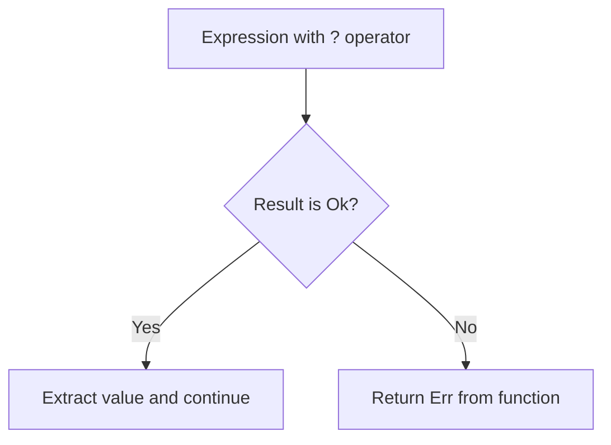

# Rust Propagating Errors

## Introduction

When writing Rust code, you'll inevitably encounter situations where functions can fail. Instead of handling every error at the point it occurs, Rust provides elegant mechanisms to *propagate* errors up the call stack. This allows the calling function to decide how to handle the error.

Error propagation is a core part of Rust's error handling philosophy. Rather than using exceptions like many other languages, Rust uses the `Result` type and the `?` operator to explicitly pass errors up the call stack. This approach makes error paths clear and ensures errors aren't accidentally ignored.

In this guide, we'll explore how to effectively propagate errors in Rust, starting with the basics and moving to more advanced patterns.

## Understanding the Basics

### The Result Type Recap

Before diving into error propagation, let's briefly review Rust's `Result` type:

```rust
enum Result<T, E> {
    Ok(T),   // Success case containing a value of type T
    Err(E),  // Error case containing an error of type E
}
```

Functions that might fail typically return a `Result`:

```rust
fn read_username_from_file() -> Result<String, std::io::Error> {
    // Implementation that might succeed or fail
}
```

## Manual Error Propagation

The most basic way to propagate errors is to use pattern matching with `match`:

```rust
fn read_username_from_file() -> Result<String, std::io::Error> {
    let file_result = std::fs::File::open("username.txt");
    
    let mut file = match file_result {
        Ok(file) => file,
        Err(error) => return Err(error), // Propagate the error
    };
    
    let mut username = String::new();
    
    match file.read_to_string(&mut username) {
        Ok(_) => Ok(username),
        Err(error) => Err(error), // Propagate the error
    }
}
```

**Input:**
- A file named "username.txt" that may or may not exist

**Output:**
- If successful: `Ok(String)` containing the file's contents
- If file doesn't exist: `Err(std::io::Error)` with a "No such file or directory" error
- If file can't be read: `Err(std::io::Error)` with a different error message

While this works, it's verbose. Let's look at a better way.

## The ? Operator

Rust provides the `?` operator as a shorthand for the pattern above. When placed after a `Result`, it:
1. Returns the value inside `Ok` if successful
2. Returns early from the function with the error if it's an `Err`

Here's the same function using the `?` operator:

```rust
fn read_username_from_file() -> Result<String, std::io::Error> {
    let mut file = std::fs::File::open("username.txt")?;
    let mut username = String::new();
    file.read_to_string(&mut username)?;
    Ok(username)
}
```

The `?` operator makes the code much cleaner while maintaining the same error propagation behavior.

### How the ? Operator Works

Let's visualize how the `?` operator works:



When you use `?` on a `Result`, it implicitly performs type conversion through the `From` trait if the error types don't match exactly.

## Chaining Methods with ?

We can make our code even more concise by chaining method calls with the `?` operator:

```rust
fn read_username_from_file() -> Result<String, std::io::Error> {
    let mut username = String::new();
    std::fs::File::open("username.txt")?.read_to_string(&mut username)?;
    Ok(username)
}
```

This approach reads as: "Open the file, and if that succeeds, read its contents into the string."

## Even Shorter: File Utilities

For common operations, Rust's standard library provides convenient functions:

```rust
fn read_username_from_file() -> Result<String, std::io::Error> {
    std::fs::read_to_string("username.txt")
}
```

This one-liner has the same behavior as our previous examples!

## Using ? in Different Return Types

### Using ? with Option

The `?` operator also works with `Option` types:

```rust
fn first_line(text: &str) -> Option<&str> {
    text.lines().next()
}

fn main() -> Option<()> {
    let text = "Hello
World";
    let first = first_line(text)?;
    println!("First line: {}", first);
    Some(())
}
```

### Mixing Result and Option

You can't directly use the `?` operator to mix `Result` and `Option`. However, you can convert between them using methods like `ok_or` and `ok_or_else`:

```rust
fn process_file() -> Result<(), std::io::Error> {
    // Convert Option to Result with ok_or
    let content = std::fs::read_to_string("config.txt")?
        .lines()
        .next()
        .ok_or(std::io::Error::new(
            std::io::ErrorKind::InvalidData,
            "File is empty"
        ))?;
    
    println!("First line: {}", content);
    Ok(())
}
```

## Real-World Error Propagation Examples

### Web Server Example

Here's a function from a web server that reads a configuration file and validates it:

```rust
use std::fs;
use std::io;
use std::path::Path;

// A custom error enum
#[derive(Debug)]
enum ConfigError {
    IoError(io::Error),
    InvalidFormat(String),
    MissingField(String),
}

// Implement From trait for automatic conversion
impl From<io::Error> for ConfigError {
    fn from(err: io::Error) -> Self {
        ConfigError::IoError(err)
    }
}

struct ServerConfig {
    port: u16,
    host: String,
}

fn load_config(path: &Path) -> Result<ServerConfig, ConfigError> {
    // Read file contents (? will convert io::Error to ConfigError)
    let content = fs::read_to_string(path)?;
    
    // Parse port
    let port_line = content.lines().find(|line| line.starts_with("PORT="))
        .ok_or(ConfigError::MissingField("PORT".to_string()))?;
    
    let port: u16 = port_line[5..].parse()
        .map_err(|_| ConfigError::InvalidFormat("PORT must be a number".to_string()))?;
    
    // Parse host
    let host_line = content.lines().find(|line| line.starts_with("HOST="))
        .ok_or(ConfigError::MissingField("HOST".to_string()))?;
    
    let host = host_line[5..].to_string();
    if host.is_empty() {
        return Err(ConfigError::InvalidFormat("HOST cannot be empty".to_string()));
    }
    
    Ok(ServerConfig { port, host })
}
```

**Input:**
A configuration file with content like:
```
PORT=8080
HOST=localhost
```

**Output:**
- If successful: `Ok(ServerConfig)` with the parsed values
- If file doesn't exist: `Err(ConfigError::IoError(...))`
- If PORT is missing: `Err(ConfigError::MissingField("PORT"))`
- If HOST is missing: `Err(ConfigError::MissingField("HOST"))`
- If PORT isn't a valid number: `Err(ConfigError::InvalidFormat(...))`

### Database Connection Example

Here's an example of a function that connects to a database and executes a query:

```rust
use std::error::Error;
use std::fmt;

// Custom error types
#[derive(Debug)]
enum DatabaseError {
    ConnectionFailed(String),
    QueryFailed(String),
    NoResults,
}

impl fmt::Display for DatabaseError {
    fn fmt(&self, f: &mut fmt::Formatter) -> fmt::Result {
        match self {
            DatabaseError::ConnectionFailed(msg) => write!(f, "Connection failed: {}", msg),
            DatabaseError::QueryFailed(msg) => write!(f, "Query failed: {}", msg),
            DatabaseError::NoResults => write!(f, "Query returned no results"),
        }
    }
}

impl Error for DatabaseError {}

// Mock database functions
fn connect_to_db(url: &str) -> Result<DatabaseConnection, DatabaseError> {
    // In a real application, this would actually connect to a database
    if url.starts_with("postgres://") {
        Ok(DatabaseConnection {})
    } else {
        Err(DatabaseError::ConnectionFailed(
            "Invalid connection string".to_string(),
        ))
    }
}

struct DatabaseConnection {}

impl DatabaseConnection {
    fn execute_query(&self, query: &str) -> Result<Vec<String>, DatabaseError> {
        // In a real application, this would execute a database query
        if query.to_lowercase().starts_with("select") {
            Ok(vec!["result1".to_string(), "result2".to_string()])
        } else {
            Err(DatabaseError::QueryFailed(
                "Only SELECT queries are supported".to_string(),
            ))
        }
    }
}

// Function that uses ? to propagate errors
fn get_user_names(db_url: &str) -> Result<Vec<String>, DatabaseError> {
    let conn = connect_to_db(db_url)?;
    let results = conn.execute_query("SELECT name FROM users")?;
    
    if results.is_empty() {
        return Err(DatabaseError::NoResults);
    }
    
    Ok(results)
}
```

Using this function:

```rust
fn main() {
    match get_user_names("postgres://localhost/mydb") {
        Ok(names) => {
            println!("Found users:");
            for name in names {
                println!("- {}", name);
            }
        }
        Err(e) => eprintln!("Error: {}", e),
    }
}
```

## Advanced Error Propagation Patterns

### The `anyhow` Crate for Quick Error Handling

For applications that want simple error handling, the `anyhow` crate provides an easy way to propagate errors:

```rust
use anyhow::{Context, Result};
use std::fs;
use std::path::Path;

fn read_config(path: &Path) -> Result<String> {
    fs::read_to_string(path)
        .with_context(|| format!("Failed to read config file: {}", path.display()))
}

fn parse_config(content: &str) -> Result<u32> {
    let value = content.trim().parse::<u32>()
        .context("Failed to parse config value as a number")?;
    Ok(value)
}

fn load_threshold(path: &Path) -> Result<u32> {
    let content = read_config(path)?;
    let threshold = parse_config(&content)?;
    Ok(threshold)
}
```

### The `thiserror` Crate for Custom Error Types

For libraries that need custom error types, the `thiserror` crate makes it easy to define them:

```rust
use std::fs;
use std::io;
use std::num::ParseIntError;
use std::path::Path;
use thiserror::Error;

#[derive(Error, Debug)]
enum ConfigError {
    #[error("IO error: {0}")]
    Io(#[from] io::Error),
    
    #[error("Parse error: {0}")]
    Parse(#[from] ParseIntError),
    
    #[error("Invalid configuration: {0}")]
    Invalid(String),
}

fn load_config(path: &Path) -> Result<u32, ConfigError> {
    let content = fs::read_to_string(path)?;
    let value = content.trim().parse::<u32>()?;
    
    if value == 0 {
        return Err(ConfigError::Invalid("Value cannot be zero".to_string()));
    }
    
    Ok(value)
}
```

## Best Practices for Error Propagation

1. **Be Specific at Boundaries**: When defining public functions, use specific error types that tell users exactly what went wrong.

2. **Provide Context**: Add context to errors to make debugging easier. The `anyhow` crate's `with_context` method is excellent for this.

3. **Design for Composition**: Define error types that work well with Rust's `?` operator.

4. **Choose the Right Level of Detail**: Libraries should use specific error types, while applications can often use catch-all types like `anyhow::Error`.

5. **Document Error Conditions**: In documentation, clearly state what errors can be returned and under what conditions.

```rust
/// Reads a user configuration file.
///
/// # Errors
///
/// Returns an error if:
/// - The file does not exist or cannot be read
/// - The file contains invalid UTF-8 data
/// - The configuration format is invalid
fn read_user_config() -> Result<Config, ConfigError> {
    // Implementation
}
```

## Summary

Rust's error propagation system provides a clean, explicit way to handle errors:

1. The `Result` type makes error paths explicit
2. The `?` operator simplifies error propagation
3. Type conversions via the `From` trait allow errors to be transformed automatically
4. Chaining method calls with `?` allows for concise, readable code
5. Crates like `anyhow` and `thiserror` build on Rust's foundations to provide even better error handling

Error propagation in Rust strikes a balance between safety and ergonomics. By making errors explicit and using the `?` operator, your code can handle failure cases gracefully without becoming overly verbose.

## Additional Resources

- [Rust Book: Error Handling Chapter](https://doc.rust-lang.org/book/ch09-00-error-handling.html)
- [Rust By Example: Error Handling](https://doc.rust-lang.org/rust-by-example/error.html)
- [The `anyhow` Crate Documentation](https://docs.rs/anyhow)
- [The `thiserror` Crate Documentation](https://docs.rs/thiserror)

## Exercises

1. Modify the `read_username_from_file` function to handle multiple possible username files (try "username.txt" first, then "backup_username.txt" if the first fails).

2. Create a function that reads and parses a configuration file with multiple settings, propagating appropriate errors for missing fields or invalid values.

3. Implement a custom error type that can represent at least three different error conditions, and write a function that returns this error type.

4. Extend the database example to include a function that executes multiple queries in sequence, propagating errors appropriately.

5. Explore the `anyhow` crate further by rewriting one of the examples to use its error handling features.