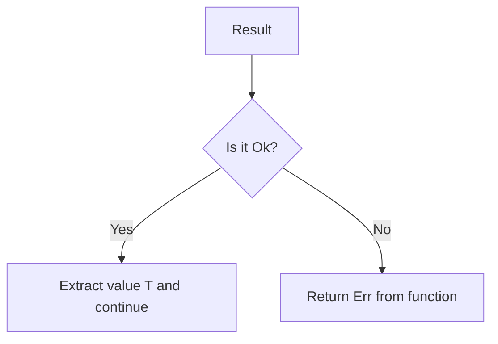

# Rust Question Mark Operator

## Introduction

Error handling is a critical aspect of writing robust and reliable software. In Rust, the question mark operator (`?`) is an elegant feature that simplifies error propagation and makes your code more concise and readable. This operator, introduced in Rust 1.13, has become an essential tool for Rust programmers when dealing with operations that might fail.

In this article, we'll explore what the question mark operator is, how it works, and how to use it effectively in your Rust programs. By the end, you'll understand how this simple character can dramatically improve your error handling patterns.

## Understanding the Problem

Before diving into the question mark operator, let's understand why it exists. Consider a function that opens a file, reads its contents, and then parses those contents as an integer:

```rust
use std::fs::File;
use std::io::{self, Read};

fn read_number_from_file() -> Result<i32, String> {
    let file = File::open("number.txt");
    
    let mut file = match file {
        Ok(file) => file,
        Err(error) => return Err(error.to_string()),
    };
    
    let mut contents = String::new();
    match file.read_to_string(&mut contents) {
        Ok(_) => {},
        Err(error) => return Err(error.to_string()),
    }
    
    match contents.trim().parse::<i32>() {
        Ok(number) => Ok(number),
        Err(error) => Err(error.to_string()),
    }
}
```

This code is verbose and repetitive. Each operation that might fail requires a match statement to handle the potential error. As your functions grow more complex, this pattern makes code difficult to read and maintain.

## Enter the Question Mark Operator

The question mark operator (`?`) simplifies error propagation by automatically unwrapping a successful result or returning the error from the current function. Here's the same example rewritten using the `?` operator:

```rust
use std::fs::File;
use std::io::{self, Read};

fn read_number_from_file() -> Result<i32, String> {
    let mut file = File::open("number.txt").map_err(|e| e.to_string())?;
    let mut contents = String::new();
    file.read_to_string(&mut contents).map_err(|e| e.to_string())?;
    
    let number = contents.trim().parse::<i32>().map_err(|e| e.to_string())?;
    Ok(number)
}
```

Much cleaner! The `?` operator does the pattern matching for us.

## How the Question Mark Operator Works

When you apply the `?` operator to a `Result<T, E>` value:

1. If the result is `Ok(T)`, the value `T` is unwrapped and the execution continues
2. If the result is `Err(E)`, the error is returned from the current function



This behavior is equivalent to the expanded `match` statement we saw earlier, but much more concise.

## Error Type Conversion

One powerful aspect of the `?` operator is automatic error type conversion through the `From` trait. If the error type in the function's return type implements `From<OriginalErrorType>`, the error will be automatically converted.

Here's an example using a custom error type:

```rust
use std::fs::File;
use std::io;

#[derive(Debug)]
enum AppError {
    IoError(io::Error),
    ParseError(std::num::ParseIntError),
}

impl From<io::Error> for AppError {
    fn from(error: io::Error) -> Self {
        AppError::IoError(error)
    }
}

impl From<std::num::ParseIntError> for AppError {
    fn from(error: std::num::ParseIntError) -> Self {
        AppError::ParseError(error)
    }
}

fn read_number_from_file() -> Result<i32, AppError> {
    let mut file = File::open("number.txt")?;  // IoError automatically converted
    let mut contents = String::new();
    file.read_to_string(&mut contents)?;       // IoError automatically converted
    
    let number = contents.trim().parse::<i32>()?;  // ParseIntError automatically converted
    Ok(number)
}
```

This means you don't need to manually convert error types when using the `?` operator, making your code even cleaner.

## Using ? with Option

Starting from Rust 1.22, the `?` operator also works with `Option<T>` types:

```rust
fn first_even_number(numbers: &[i32]) -> Option<i32> {
    let first = numbers.get(0)?;  // Returns None if list is empty
    if first % 2 == 0 {
        Some(*first)
    } else {
        None
    }
}
```

When applied to an `Option<T>`:
1. If the option is `Some(T)`, the value `T` is unwrapped and execution continues
2. If the option is `None`, the function returns `None` immediately

## Practical Examples

### Example 1: Reading Configuration

Let's look at a practical example of reading configuration from a file:

```rust
use std::fs::File;
use std::io::{self, Read};
use std::path::Path;

#[derive(Debug)]
struct Config {
    server: String,
    port: u16,
    timeout: u64,
}

fn read_config(path: &Path) -> Result<Config, io::Error> {
    let mut file = File::open(path)?;
    let mut contents = String::new();
    file.read_to_string(&mut contents)?;
    
    // In a real app, you would parse the config file here
    // For simplicity, we're creating a hardcoded config
    Ok(Config {
        server: "localhost".to_string(),
        port: 8080,
        timeout: 30,
    })
}

fn main() {
    match read_config(Path::new("config.txt")) {
        Ok(config) => println!("Configuration loaded: {:?}", config),
        Err(error) => eprintln!("Failed to load configuration: {}", error),
    }
}
```

### Example 2: Chaining Operations

The `?` operator shines when you need to chain multiple operations that might fail:

```rust
use std::fs::{self, File};
use std::io::{self, Read, Write};

fn copy_and_double_number(src: &str, dst: &str) -> Result<i32, Box<dyn std::error::Error>> {
    // Read number from source file
    let mut content = String::new();
    File::open(src)?.read_to_string(&mut content)?;
    
    // Parse, double, and convert back to string
    let number: i32 = content.trim().parse()?;
    let doubled = number * 2;
    let doubled_str = doubled.to_string();
    
    // Write to destination file
    File::create(dst)?.write_all(doubled_str.as_bytes())?;
    
    Ok(doubled)
}

fn main() {
    match copy_and_double_number("input.txt", "output.txt") {
        Ok(number) => println!("Successfully doubled the number: {}", number),
        Err(error) => eprintln!("An error occurred: {}", error),
    }
}
```

In this example, we're:
1. Opening a file
2. Reading its contents
3. Parsing the contents as an integer
4. Doubling the number
5. Creating a new file
6. Writing the doubled number to the new file

Each step could fail, but the `?` operator makes the code clean and easy to follow.

## Limitations and Requirements

There are a few important things to remember when using the `?` operator:

1. It can only be used in functions that return `Result<T, E>` or `Option<T>` (or types that implement `Try`, a more general trait)
2. The error type in the function's return type must be compatible with the error type of the expression where `?` is used
3. It cannot be used in the `main()` function (unless you change main's return type)

For example, this will not compile:

```rust
fn might_fail() -> Result<(), &'static str> {
    Err("This function always fails")
}

fn does_not_return_result() {
    // This will not compile:
    might_fail()?;
}
```

However, since Rust 2018, you can use `?` in `main()` if it returns a `Result`:

```rust
fn main() -> Result<(), Box<dyn std::error::Error>> {
    let file = File::open("file.txt")?;
    // rest of the code
    Ok(())
}
```

## The ? Operator in Closures

The `?` operator can also be used in closures, but the closure must return a `Result` or `Option` type:

```rust
let read_file = |path: &str| -> Result<String, io::Error> {
    let mut file = File::open(path)?;
    let mut content = String::new();
    file.read_to_string(&mut content)?;
    Ok(content)
};
```

## Summary

The question mark operator (`?`) is a powerful tool in Rust's error handling system that:

- Simplifies error propagation by reducing boilerplate code
- Makes error handling more readable and maintainable
- Automatically converts between error types
- Works with both `Result<T, E>` and `Option<T>` types

By using the `?` operator, you can write more concise and expressive code while still maintaining Rust's strong emphasis on proper error handling.

## Additional Resources

To deepen your understanding of Rust's error handling:

1. [The Rust Book: Error Handling Chapter](https://doc.rust-lang.org/book/ch09-00-error-handling.html)
2. [Rust by Example: Error Handling](https://doc.rust-lang.org/rust-by-example/error.html)
3. [std::result Documentation](https://doc.rust-lang.org/std/result/)
4. [std::option Documentation](https://doc.rust-lang.org/std/option/)

## Exercises

To practice using the question mark operator:

1. Write a function that reads two numbers from separate files and returns their sum
2. Create a function that tries to find a specific configuration value in multiple possible locations (environment variable, config file, default)
3. Implement a function that reads a CSV file, parses it, and performs calculations on the data, handling all potential errors
4. Write a program that processes a series of files and stops at the first error, using the `?` operator