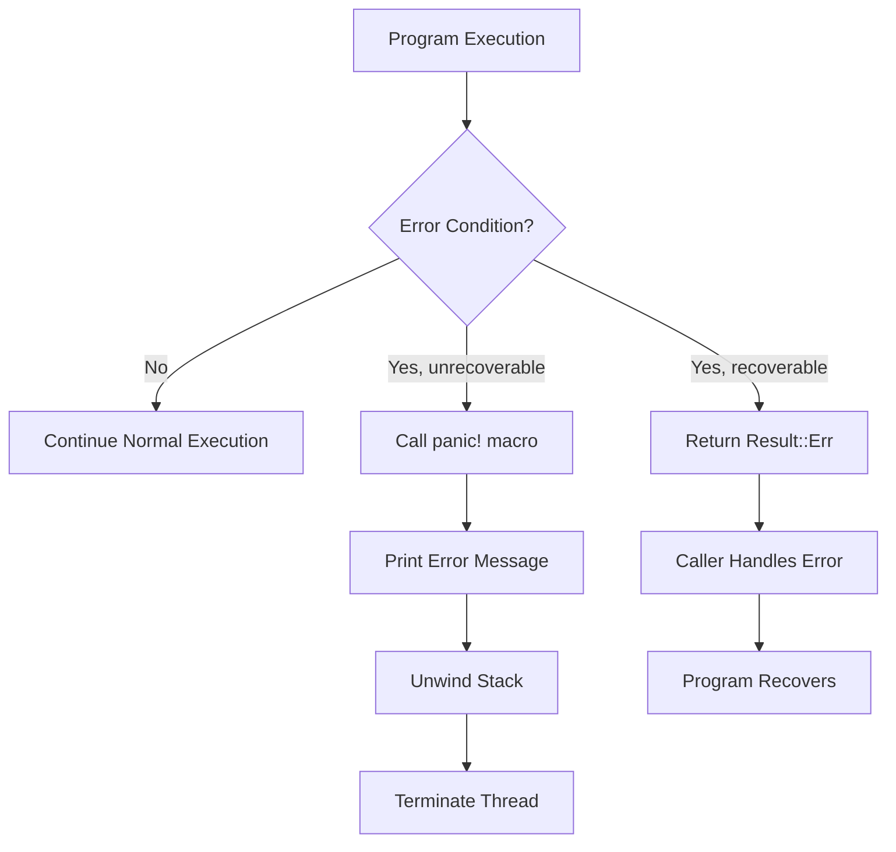

# Rust Panic Macro

## Introduction

When things go catastrophically wrong in your Rust program, sometimes the best option is to stop execution immediately. Rust provides a mechanism for this called **panicking**, and the primary way to trigger a panic is through the `panic!` macro.

Unlike typical error handling with `Result` and `Option` types, which allow for graceful recovery, a panic is Rust's way of saying, "Something is so wrong that we can't continue execution of this thread." Understanding when and how to use the `panic!` macro is an important part of writing robust Rust code.

## What is a Panic?

A panic in Rust is an immediate, unrecoverable error that:

1. Prints an error message
2. Unwinds the stack (cleaning up resources)
3. Exits the current thread

By default, when a panic occurs, Rust will:
- Display the panic message
- Show a backtrace (if enabled)
- Clean up resources by unwinding the stack
- Terminate the thread where the panic occurred

If the panic happens on the main thread, the entire program will exit.

## The `panic!` Macro Syntax

The `panic!` macro is straightforward to use:

```rust
// Basic usage
panic!("This is a panic message");

// With formatted string
let value = 42;
panic!("Unexpected value: {}", value);
```

When executed, this produces output similar to:

```
thread 'main' panicked at 'This is a panic message', src/main.rs:4:5
note: run with `RUST_BACKTRACE=1` environment variable to display a backtrace
```

## When to Use `panic!`

The `panic!` macro should be used in specific scenarios, not as a general error handling mechanism:

1. **Unrecoverable errors**: When your program reaches an impossible state from which it cannot reasonably recover
2. **Prototype code**: During early development when you haven't yet implemented proper error handling
3. **Examples and tests**: To keep sample code simple and focused
4. **Cases where continuing would be unsafe**: When program correctness cannot be guaranteed

### When NOT to Use `panic!`

Avoid using `panic!` for:
- Expected failure scenarios (use `Result` instead)
- Handling user input validation (return errors that can be handled)
- Any situation where recovery is possible

## Common Panic-Causing Operations

Several operations in Rust can cause panics without explicitly using the `panic!` macro:

```rust
// Array indexing panics when out of bounds
let array = [1, 2, 3];
let value = array[10]; // PANIC!

// Unwrapping None values
let optional: Option<i32> = None;
let value = optional.unwrap(); // PANIC!

// Unwrapping Err values
let result: Result<i32, &str> = Err("something went wrong");
let value = result.unwrap(); // PANIC!

// Integer division by zero
let x = 42 / 0; // PANIC!
```

## Useful Panic-Related Macros and Functions

Rust provides several related macros and methods that use panicking as part of their error handling strategy:

### `assert!` Macro

The `assert!` macro panics if a condition is false:

```rust
fn divide(a: i32, b: i32) -> i32 {
    assert!(b != 0, "Division by zero is not allowed");
    a / b
}

// Usage
let result = divide(10, 2); // Works fine
let result = divide(10, 0); // Panics with custom message
```

### `unwrap()` and `expect()` Methods

These methods extract the value from `Option` and `Result` types, but panic if the value is `None` or `Err`:

```rust
// Option examples
let some_value = Some(42);
let value1 = some_value.unwrap(); // Returns 42
let value2 = some_value.expect("Custom panic message"); // Returns 42

let none_value: Option<i32> = None;
let value3 = none_value.unwrap(); // PANIC with default message!
let value4 = none_value.expect("Value was None!"); // PANIC with custom message!

// Result examples
let ok_result: Result<i32, &str> = Ok(42);
let value5 = ok_result.unwrap(); // Returns 42

let err_result: Result<i32, &str> = Err("something went wrong");
let value6 = err_result.unwrap(); // PANIC!
let value7 = err_result.expect("Failed to get value"); // PANIC with custom message!
```

## Controlling Panic Behavior

You can configure how your program responds to panics through your `Cargo.toml` file:

```toml
[profile.release]
panic = 'abort' # Immediately abort without unwinding
```

The two options are:
- `'unwind'`: The default. Cleans up resources during panic.
- `'abort'`: Terminates immediately without cleanup. Results in smaller binary size.

## Catching Panics

While not recommended for normal error handling, you can catch panics using the `std::panic::catch_unwind` function:

```rust
use std::panic;

fn main() {
    let result = panic::catch_unwind(|| {
        println!("Inside the closure, before panic");
        panic!("Oh no!");
        // Code here will not be executed
    });

    match result {
        Ok(_) => println!("No panic occurred"),
        Err(_) => println!("A panic was caught!")
    }

    println!("Program continues after the panic");
}
```

Output:
```
Inside the closure, before panic
A panic was caught!
Program continues after the panic
```

## Real-World Example: Array Bounds Checking

Here's a practical example showing how to implement a safe array access function that handles out-of-bounds errors gracefully instead of panicking:

```rust
fn safe_access<T>(array: &[T], index: usize) -> Result<&T, String> {
    if index < array.len() {
        Ok(&array[index])  // Safe access, won't panic
    } else {
        Err(format!("Index {} out of bounds for array of length {}", 
                   index, array.len()))
    }
}

fn main() {
    let numbers = vec![10, 20, 30, 40, 50];
    
    // Safe approach
    match safe_access(&numbers, 1) {
        Ok(value) => println!("Found value: {}", value),
        Err(e) => println!("Error: {}", e)
    }
    
    match safe_access(&numbers, 10) {
        Ok(value) => println!("Found value: {}", value),
        Err(e) => println!("Error: {}", e)
    }
    
    // Panic approach (not recommended for production)
    let direct_value = numbers[1];  // Safe
    println!("Direct access: {}", direct_value);
    
    // This would panic:
    // let crash_value = numbers[10];  // PANIC!
}
```

Output:
```
Found value: 20
Error: Index 10 out of bounds for array of length 5
Direct access: 20
```

## Visualizing the Control Flow with Panic



## Summary

The `panic!` macro in Rust provides a mechanism for handling unrecoverable errors by immediately stopping program execution. While powerful, it should be used judiciously:

- Use `panic!` for truly unrecoverable situations or when continuing would be unsafe
- For expected errors, prefer returning `Result` or `Option` types
- Be aware of operations that can panic implicitly (array indexing, unwrapping, etc.)
- Use helper macros like `assert!` to check conditions that should never fail
- Consider configuring panic behavior in your release builds for better performance

Understanding when to use `panic!` versus other error handling approaches is key to writing robust Rust programs that can handle both expected and unexpected errors appropriately.

## Additional Resources and Exercises

### Resources
- [The Rust Book: Error Handling Chapter](https://doc.rust-lang.org/book/ch09-00-error-handling.html)
- [Rust API Documentation for panic!](https://doc.rust-lang.org/std/macro.panic.html)
- [Rust By Example: Panics](https://doc.rust-lang.org/rust-by-example/error/panic.html)

### Exercises

1. **Basic Panic Handling**: Write a function that performs division and uses `panic!` if the divisor is zero.

2. **Refactoring to Results**: Take code that uses `panic!` for error handling and refactor it to use the `Result` type instead.

3. **Custom Assert**: Implement your own version of an assert macro that panics with a custom message if a condition is false.

4. **Panic Catching**: Create a program that uses `std::panic::catch_unwind` to catch a panic and continue execution.

5. **Unwrap Alternatives**: Refactor a piece of code that uses multiple `unwrap()` calls to use pattern matching or the `?` operator instead.