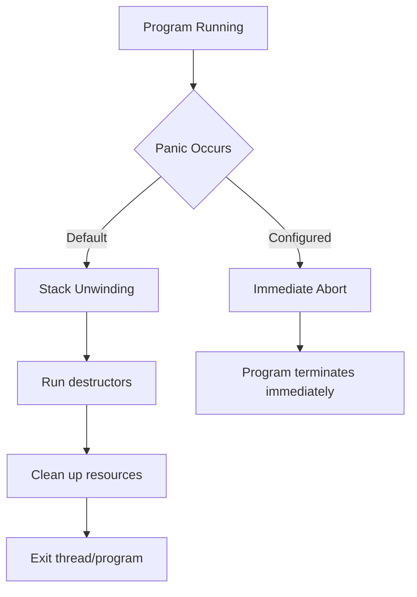

# Rust Unrecoverable Errors

In Rust programming, not all errors can or should be recovered from. When your program encounters a condition that indicates something has gone fundamentally wrong, Rust provides mechanisms to immediately stop execution rather than attempting to proceed with invalid or dangerous operations. These are known as **unrecoverable errors**.

## What are Unrecoverable Errors?

Unrecoverable errors occur when:
- Your code has reached a state that is impossible to handle safely
- A critical assumption has been violated
- Continuing execution would lead to undefined behavior or security risks

Unlike recoverable errors (handled with `Result<T, E>`), unrecoverable errors immediately halt program execution.

## The panic! Macro

The primary tool Rust provides for handling unrecoverable errors is the `panic!` macro. When executed, `panic!`:

1. Prints an error message
2. Unwinds the stack (by default)
3. Cleans up resources
4. Exits the program

Let's look at a basic example:

```rust
fn main() {
    panic!("Critical error: system resources unavailable");
}
```

**Output**:
```
thread 'main' panicked at 'Critical error: system resources unavailable', src/main.rs:2:5
note: run with `RUST_BACKTRACE=1` environment variable to display a backtrace
```

### When Panic Occurs Automatically

Rust will automatically panic in several situations:

1. **Array Access Out of Bounds**:

```rust
fn main() {
    let numbers = [1, 2, 3, 4, 5];
    let number = numbers[10]; // This will cause a panic
    println!("This will never be reached");
}
```

**Output**:
```
thread 'main' panicked at 'index out of bounds: the len is 5 but the index is 10', src/main.rs:3:19
```

2. **Integer Division by Zero**:

```rust
fn main() {
    let result = 10 / 0; // This will cause a panic
    println!("Result: {}", result);
}
```

**Output**:
```
thread 'main' panicked at 'attempt to divide by zero', src/main.rs:2:18
```

3. **Assertion Failures**:

```rust
fn main() {
    let age = -5;
    assert!(age >= 0, "Age cannot be negative"); // This will panic
}
```

**Output**:
```
thread 'main' panicked at 'Age cannot be negative', src/main.rs:3:5
```

## Stack Unwinding vs Aborting

When a panic occurs, Rust needs to clean up resources associated with the thread that panicked. By default, Rust performs **stack unwinding**, which:

- Walks back up the stack
- Runs destructors for all variables
- Frees memory
- Preserves other threads' execution

Alternatively, you can configure Rust to immediately **abort** on panic, which:
- Immediately terminates the program
- Doesn't clean up resources
- Is faster and produces smaller binaries

To configure your program to abort on panic, add this to your `Cargo.toml`:

```toml
[profile.release]
panic = "abort"
```

### Visualizing the Difference



## Creating a Deliberate Panic

There are several ways to deliberately trigger a panic:

### 1. Direct use of panic!

```rust
fn divide(a: i32, b: i32) -> i32 {
    if b == 0 {
        panic!("Cannot divide by zero");
    }
    a / b
}

fn main() {
    let result = divide(10, 0);
    println!("Result: {}", result); // Never reached
}
```

### 2. Using assert! macros

```rust
fn process_age(age: i32) {
    assert!(age >= 0, "Age must be non-negative");
    println!("Processing age: {}", age);
}

fn main() {
    process_age(-5); // Will panic
}
```

### 3. Using unwrap() on Option or Result

```rust
fn main() {
    let username: Option<String> = None;
    
    // This will panic with "called `Option::unwrap()` on a `None` value"
    let name = username.unwrap();
    
    println!("Username: {}", name);
}
```

## Customize Panic Messages with expect()

The `expect()` method is similar to `unwrap()` but allows you to specify a custom error message:

```rust
fn main() {
    let config_file = std::fs::File::open("config.txt")
        .expect("Failed to open configuration file");
        
    // Processing continues if file was opened successfully
    // Otherwise, program panics with the specified message
}
```

## Best Practices for Using Panic

### When to Panic

1. **Unrecoverable situations**: When your program reaches a state from which it cannot recover.

2. **Violation of logic that should be impossible**: When invariants or contracts are violated.

```rust
fn calculate_average(numbers: &[i32]) -> f64 {
    assert!(!numbers.is_empty(), "Cannot calculate average of empty slice");
    
    let sum: i32 = numbers.iter().sum();
    sum as f64 / numbers.len() as f64
}
```

3. **During prototyping**: Using `unwrap()` or `expect()` can be helpful while prototyping.

4. **In tests**: Panic is often used in test code to mark test failures.

```rust
#[test]
fn test_positive_number() {
    let result = is_positive(5);
    assert!(result, "Expected positive result for 5");
}
```

### When Not to Panic

1. **Expected failure conditions**: Use `Result<T, E>` for expected failures like network issues.

2. **User input validation**: Return errors for invalid user input rather than panicking.

3. **In library code**: Libraries should prefer returning errors over panicking.

## Real-World Example: Configuration Loader

Let's build a configuration loader that uses panic appropriately:

```rust
use std::fs::File;
use std::io::Read;
use std::path::Path;

struct AppConfig {
    server_port: u16,
    max_connections: usize,
    admin_email: String,
}

impl AppConfig {
    // This function panics if the config cannot be loaded,
    // since the application cannot run without proper configuration
    fn load(config_path: &str) -> Self {
        // Check if path exists
        if !Path::new(config_path).exists() {
            panic!("Configuration file not found: {}", config_path);
        }
        
        // Open file or panic with detailed message
        let mut file = File::open(config_path)
            .expect(&format!("Failed to open config file: {}", config_path));
            
        let mut contents = String::new();
        file.read_to_string(&mut contents)
            .expect("Failed to read config file");
            
        // Parse the contents (simplified)
        let port_line = contents.lines()
            .find(|line| line.starts_with("port="))
            .expect("Configuration missing server port");
            
        let port: u16 = port_line.replace("port=", "").trim()
            .parse()
            .expect("Invalid server port in configuration");
            
        // Similar parsing for other fields
        // In real code, you might use a parsing library
        
        AppConfig {
            server_port: port,
            max_connections: 100, // Default value
            admin_email: "admin@example.com".to_string(), // Default value
        }
    }
}

fn main() {
    // If this fails, the program cannot continue
    let config = AppConfig::load("settings.conf");
    
    println!("Server starting on port {}", config.server_port);
    // Application continues...
}
```

## Catching Panics

In some special cases, you might want to catch a panic to prevent it from crashing your entire program. Rust provides the `std::panic::catch_unwind` function for this purpose:

```rust
use std::panic::{self, catch_unwind};

fn main() {
    // This will catch a panic in the closure
    let result = catch_unwind(|| {
        println!("About to panic...");
        panic!("Something went wrong!");
    });
    
    match result {
        Ok(_) => println!("No panic occurred"),
        Err(_) => println!("Caught a panic, program continues"),
    }
    
    println!("This line will still be executed");
}
```

**Important**: `catch_unwind` is primarily intended for:
- Foreign function interfaces (FFI)
- Thread isolation
- Not as a general error handling mechanism

## Summary

Unrecoverable errors in Rust are handled through the `panic!` mechanism, which immediately stops execution when your program encounters a critical error. Key points to remember:

- Use `panic!` for truly unrecoverable situations
- By default, Rust unwinds the stack during a panic
- Automatic panics occur for array bounds violations, division by zero, etc.
- Use `expect()` for better panic messages than `unwrap()`
- In most cases, prefer `Result<T, E>` for recoverable errors

Rust's approach to unrecoverable errors helps ensure your program fails fast and visibly when something goes fundamentally wrong, rather than continuing with potentially corrupted state.

## Exercises

1. Write a function that uses `panic!` with a custom message when given invalid input.

2. Create a program that demonstrates the difference between using `unwrap()` and `expect()`.

3. Implement a function that safely divides two numbers, panicking only if necessary.

4. Use `catch_unwind` to handle a panic in a controlled way.

## Additional Resources

- [The Rust Programming Language Book: Error Handling](https://doc.rust-lang.org/book/ch09-00-error-handling.html)
- [Rust API Documentation for panic!](https://doc.rust-lang.org/std/macro.panic.html)
- [Rust By Example: Panic](https://doc.rust-lang.org/rust-by-example/error/panic.html)
- [The std::panic module documentation](https://doc.rust-lang.org/std/panic/index.html)