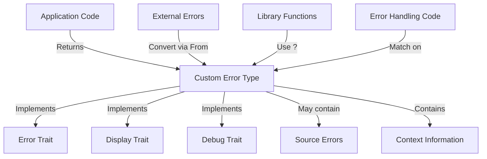

# Rust Custom Error Types

## Introduction

Error handling is a critical aspect of writing robust software, and Rust provides a powerful system for dealing with errors that can help make your code more reliable and maintainable. While Rust's standard library offers several error types for common situations, you'll often need to create your own custom error types to represent application-specific failures.

In this tutorial, we'll explore how to create and use custom error types in Rust. By the end, you'll understand how to:

- Define your own error types using enums
- Implement the `Error` trait
- Create error conversion logic
- Use your custom errors with Rust's `Result` type
- Apply best practices for error handling in real-world applications

## Why Create Custom Error Types?

Before diving into implementation details, let's understand why custom error types are valuable:

1. **Specificity**: Custom errors can precisely describe what went wrong in your application's domain.
2. **Context**: They can include additional information about the error's context.
3. **Error Handling Logic**: They allow callers to handle different error cases differently.
4. **Maintainability**: They create a clear contract between your code and its users.

## Basic Custom Error Type

Let's start by creating a simple custom error type using an enum:

```rust
// Define a custom error enum
#[derive(Debug)]
enum FileError {
    NotFound,
    PermissionDenied,
    InvalidFormat,
}

// Function that returns our custom error
fn read_config_file(path: &str) -> Result<String, FileError> {
    // For this example, we'll just simulate different error conditions
    if path.ends_with(".unknown") {
        return Err(FileError::InvalidFormat);
    }
    
    if path == "/root/secret.conf" {
        return Err(FileError::PermissionDenied);
    }
    
    if path == "nonexistent.conf" {
        return Err(FileError::NotFound);
    }
    
    // Simulate successful file reading
    Ok(String::from("configuration=valid"))
}

// Using the function
fn main() {
    let result = read_config_file("nonexistent.conf");
    
    match result {
        Ok(content) => println!("File content: {}", content),
        Err(FileError::NotFound) => println!("Error: The file was not found"),
        Err(FileError::PermissionDenied) => println!("Error: You don't have permission to read this file"),
        Err(FileError::InvalidFormat) => println!("Error: The file has an invalid format"),
    }
}
```

**Output:**
```
Error: The file was not found
```

In this example, we've created a basic `FileError` enum with three variants representing different error conditions. Our `read_config_file` function returns a `Result` that can contain either the file content as a `String` or one of our custom errors.

## Implementing the Error Trait

While the above example works, it doesn't integrate well with Rust's standard error handling ecosystem. To make our custom error more useful, we should implement the `std::error::Error` trait:

```rust
use std::fmt;
use std::error::Error;

#[derive(Debug)]
enum FileError {
    NotFound,
    PermissionDenied,
    InvalidFormat,
}

// Implement Display for FileError
impl fmt::Display for FileError {
    fn fmt(&self, f: &mut fmt::Formatter) -> fmt::Result {
        match self {
            FileError::NotFound => write!(f, "File not found"),
            FileError::PermissionDenied => write!(f, "Permission denied"),
            FileError::InvalidFormat => write!(f, "Invalid file format"),
        }
    }
}

// Implement the Error trait
impl Error for FileError {}

fn main() {
    let result = read_config_file("nonexistent.conf");
    
    match result {
        Ok(content) => println!("File content: {}", content),
        Err(e) => println!("Error: {}", e),
    }
}

// read_config_file function remains the same
```

**Output:**
```
Error: File not found
```

By implementing `Display` and the `Error` trait, our custom error type now:
- Can be converted to a human-readable string with `to_string()` or `{}`
- Works with the standard library's error handling utilities
- Can be used with `?` operator for error propagation

## Adding Error Context with Fields

Let's enhance our error type by adding fields to provide more context:

```rust
use std::fmt;
use std::error::Error;

#[derive(Debug)]
enum FileError {
    NotFound { path: String },
    PermissionDenied { path: String },
    InvalidFormat { path: String, expected_format: String },
}

impl fmt::Display for FileError {
    fn fmt(&self, f: &mut fmt::Formatter) -> fmt::Result {
        match self {
            FileError::NotFound { path } => 
                write!(f, "File not found: {}", path),
            FileError::PermissionDenied { path } => 
                write!(f, "Permission denied for file: {}", path),
            FileError::InvalidFormat { path, expected_format } => 
                write!(f, "Invalid format for file {}, expected {}", path, expected_format),
        }
    }
}

impl Error for FileError {}

fn read_config_file(path: &str) -> Result<String, FileError> {
    if path.ends_with(".unknown") {
        return Err(FileError::InvalidFormat { 
            path: path.to_string(), 
            expected_format: ".conf".to_string() 
        });
    }
    
    if path == "/root/secret.conf" {
        return Err(FileError::PermissionDenied { 
            path: path.to_string() 
        });
    }
    
    if path == "nonexistent.conf" {
        return Err(FileError::NotFound { 
            path: path.to_string() 
        });
    }
    
    Ok(String::from("configuration=valid"))
}

fn main() {
    let result = read_config_file("nonexistent.conf");
    
    match result {
        Ok(content) => println!("File content: {}", content),
        Err(e) => println!("Error: {}", e),
    }
}
```

**Output:**
```
Error: File not found: nonexistent.conf
```

Now our errors contain valuable context that can help diagnose problems more effectively.

## Creating a Custom Error Type with Source Errors

In real applications, you'll often need to wrap errors from other libraries. Let's create a more complex error type that can include source errors:

```rust
use std::fmt;
use std::error::Error;
use std::io;
use std::num::ParseIntError;

#[derive(Debug)]
enum ConfigError {
    Io(io::Error),
    Parse(ParseIntError),
    Missing(String), // missing field name
    Invalid(String), // description of why the config is invalid
}

impl fmt::Display for ConfigError {
    fn fmt(&self, f: &mut fmt::Formatter) -> fmt::Result {
        match self {
            ConfigError::Io(err) => write!(f, "IO error: {}", err),
            ConfigError::Parse(err) => write!(f, "Parse error: {}", err),
            ConfigError::Missing(field) => write!(f, "Missing field: {}", field),
            ConfigError::Invalid(desc) => write!(f, "Invalid configuration: {}", desc),
        }
    }
}

impl Error for ConfigError {
    fn source(&self) -> Option<&(dyn Error + 'static)> {
        match self {
            ConfigError::Io(err) => Some(err),
            ConfigError::Parse(err) => Some(err),
            _ => None,
        }
    }
}

// Conversion from io::Error to ConfigError
impl From<io::Error> for ConfigError {
    fn from(err: io::Error) -> ConfigError {
        ConfigError::Io(err)
    }
}

// Conversion from ParseIntError to ConfigError
impl From<ParseIntError> for ConfigError {
    fn from(err: ParseIntError) -> ConfigError {
        ConfigError::Parse(err)
    }
}

fn read_config() -> Result<Config, ConfigError> {
    // Example of using the ? operator with our custom error
    let file_content = read_file("config.txt")?;
    
    // Parse the config file
    parse_config(&file_content)
}

fn read_file(path: &str) -> Result<String, io::Error> {
    // In a real app, this would actually read from a file
    if path == "config.txt" {
        Ok(String::from("port=8080
name=MyApp"))
    } else {
        Err(io::Error::new(io::ErrorKind::NotFound, "File not found"))
    }
}

struct Config {
    port: u16,
    name: String,
}

fn parse_config(content: &str) -> Result<Config, ConfigError> {
    let mut port = None;
    let mut name = None;
    
    for line in content.lines() {
        if let Some((key, value)) = line.split_once('=') {
            match key {
                "port" => {
                    // Use ? to convert ParseIntError to ConfigError
                    port = Some(value.parse::<u16>()?);
                },
                "name" => {
                    name = Some(value.to_string());
                },
                _ => {
                    // Unknown key
                }
            }
        }
    }
    
    let port = port.ok_or(ConfigError::Missing("port".to_string()))?;
    let name = name.ok_or(ConfigError::Missing("name".to_string()))?;
    
    // Validate configuration
    if name.is_empty() {
        return Err(ConfigError::Invalid("name cannot be empty".to_string()));
    }
    
    Ok(Config { port, name })
}

fn main() {
    match read_config() {
        Ok(config) => println!("Loaded configuration: port={}, name={}", config.port, config.name),
        Err(e) => {
            println!("Error: {}", e);
            
            // We can also check for the source error
            if let Some(source) = e.source() {
                println!("Caused by: {}", source);
            }
        }
    }
}
```

**Output:**
```
Loaded configuration: port=8080, name=MyApp
```

This example demonstrates several important concepts:

1. **Error Wrapping**: Our `ConfigError` can wrap other error types.
2. **From Implementations**: We implement `From` for various error types to enable the `?` operator.
3. **Error Source Chain**: We implement the `source()` method to enable error chaining.
4. **Domain-Specific Errors**: We include error variants specific to our application domain.

## Using thiserror for Simpler Error Types

Writing custom error types can involve a lot of boilerplate code. The `thiserror` crate simplifies this process considerably:

```rust
use std::io;
use std::num::ParseIntError;
use thiserror::Error;

#[derive(Error, Debug)]
enum ConfigError {
    #[error("IO error: {0}")]
    Io(#[from] io::Error),
    
    #[error("Parse error: {0}")]
    Parse(#[from] ParseIntError),
    
    #[error("Missing field: {0}")]
    Missing(String),
    
    #[error("Invalid configuration: {0}")]
    Invalid(String),
}

// The rest of the code would be the same as the previous example,
// but without the manual impl of Display, Error, and From traits
```

The `thiserror` crate automatically generates the `Display`, `Error`, and `From` implementations for us, making our code more concise and maintainable.

## Real-World Example: A Web API Client

Let's look at a practical example of custom error handling in a web API client:

```rust
use std::fmt;
use std::error::Error;
use thiserror::Error;

#[derive(Error, Debug)]
enum ApiError {
    #[error("Network error: {0}")]
    Network(#[from] std::io::Error),
    
    #[error("Request failed: {status_code} - {message}")]
    RequestFailed {
        status_code: u16,
        message: String,
    },
    
    #[error("JSON parsing error: {0}")]
    JsonParsing(#[from] serde_json::Error),
    
    #[error("Rate limited: retry after {retry_after} seconds")]
    RateLimited {
        retry_after: u64,
    },
    
    #[error("Authentication failed: {0}")]
    AuthenticationFailed(String),
    
    #[error("Validation error: {0}")]
    ValidationFailed(String),
}

struct ApiClient {
    base_url: String,
    api_key: Option<String>,
}

impl ApiClient {
    fn new(base_url: &str) -> Self {
        ApiClient {
            base_url: base_url.to_string(),
            api_key: None,
        }
    }
    
    fn with_api_key(mut self, api_key: &str) -> Self {
        self.api_key = Some(api_key.to_string());
        self
    }
    
    fn get_user(&self, user_id: u64) -> Result<User, ApiError> {
        // In a real implementation, this would make an HTTP request
        // For this example, we'll simulate different error conditions
        
        if self.api_key.is_none() {
            return Err(ApiError::AuthenticationFailed(
                "API key is required".to_string()
            ));
        }
        
        if user_id == 0 {
            return Err(ApiError::ValidationFailed(
                "User ID cannot be zero".to_string()
            ));
        }
        
        if user_id == 999 {
            return Err(ApiError::RequestFailed {
                status_code: 404,
                message: "User not found".to_string(),
            });
        }
        
        if user_id == 888 {
            return Err(ApiError::RateLimited {
                retry_after: 30,
            });
        }
        
        // Simulate successful response
        Ok(User {
            id: user_id,
            name: format!("User {}", user_id),
            email: format!("user{}@example.com", user_id),
        })
    }
}

struct User {
    id: u64,
    name: String,
    email: String,
}

fn main() {
    let client = ApiClient::new("https://api.example.com/v1")
        .with_api_key("my-api-key");
    
    // Try different user IDs to see different errors
    let user_id = 42; // Try 0, 888, 999 for different errors
    
    match client.get_user(user_id) {
        Ok(user) => {
            println!("Found user: {} <{}>", user.name, user.email);
        },
        Err(ApiError::RateLimited { retry_after }) => {
            println!("Rate limited! Please try again after {} seconds", retry_after);
        },
        Err(ApiError::RequestFailed { status_code, message }) => {
            println!("Request failed with status {}: {}", status_code, message);
        },
        Err(e) => {
            println!("Error: {}", e);
        }
    }
}
```

This example demonstrates:

1. **Domain-Specific Errors**: Our errors precisely describe failure modes for an API client.
2. **Rich Error Information**: Each error variant includes relevant details.
3. **Pattern Matching**: The calling code can handle specific error cases differently.
4. **Using thiserror**: We leverage the `thiserror` crate to reduce boilerplate.

## Best Practices for Custom Error Types

When creating custom error types in Rust, follow these guidelines:

1. **Be Specific**: Create error variants that correspond to distinct failure modes.

2. **Include Context**: Add relevant information to each error variant.

3. **Implement Traits**: Always implement `Debug`, `Display`, and `Error`.

4. **Error Conversion**: Implement `From` traits to convert from other error types.

5. **Use Descriptive Messages**: Error messages should help users understand and fix the problem.

6. **Consider Error Chaining**: Implement `source()` when wrapping other errors.

7. **Use Helper Crates**: Consider using `thiserror` for application errors or `anyhow` for quick prototyping.

Let's illustrate these guidelines with a visual diagram:



## Error Handling with Result Combinators

While pattern matching is powerful, Rust also provides combinators for working with `Result` types. Here's how to use them with custom errors:

```rust
use thiserror::Error;

#[derive(Error, Debug)]
enum DataProcessingError {
    #[error("Failed to read input: {0}")]
    InputError(String),
    
    #[error("Failed to process data: {0}")]
    ProcessingError(String),
    
    #[error("Failed to write output: {0}")]
    OutputError(String),
}

fn process_data(input: &str) -> Result<String, DataProcessingError> {
    // Read the input
    let data = read_input(input)
        .map_err(|e| DataProcessingError::InputError(e))?;
    
    // Process the data
    let processed = process(data)
        .ok_or_else(|| DataProcessingError::ProcessingError("Processing failed".to_string()))?;
    
    // Write the output
    write_output(&processed)
        .map_err(|e| DataProcessingError::OutputError(e))
}

fn read_input(input: &str) -> Result<Vec<i32>, String> {
    // Simulate reading and parsing input
    if input.is_empty() {
        return Err("Input is empty".to_string());
    }
    
    input
        .split(',')
        .map(|s| s.trim().parse::<i32>().map_err(|_| "Invalid number".to_string()))
        .collect()
}

fn process(data: Vec<i32>) -> Option<Vec<i32>> {
    // Simulate processing data
    if data.is_empty() {
        return None;
    }
    
    Some(data.iter().map(|&x| x * 2).collect())
}

fn write_output(data: &[i32]) -> Result<String, String> {
    // Simulate writing output
    if data.len() > 100 {
        return Err("Too many items to write".to_string());
    }
    
    Ok(data.iter()
        .map(|x| x.to_string())
        .collect::<Vec<_>>()
        .join(","))
}

fn main() {
    let inputs = ["1,2,3", "", "a,b,c"];
    
    for input in inputs {
        match process_data(input) {
            Ok(output) => println!("Successfully processed: {}", output),
            Err(e) => println!("Error: {}", e),
        }
    }
}
```

This example demonstrates using combinators like `map_err` and `ok_or_else` to convert between error types in a fluent, functional style.

## Summary

Custom error types are a powerful tool in Rust for creating robust, maintainable applications. By defining error types that are specific to your domain, you can provide meaningful error information and enable flexible error handling strategies.

Key points to remember:

1. Use enums to represent different error variants
2. Implement the `Error`, `Debug`, and `Display` traits
3. Include relevant context in your error types
4. Implement `From` traits for error conversion
5. Consider using the `thiserror` crate to reduce boilerplate
6. Use pattern matching or combinators to handle errors appropriately

By following these practices, you'll create code that's easier to debug, maintain, and use.

## Additional Resources

- [Rust's Error Handling Documentation](https://doc.rust-lang.org/book/ch09-00-error-handling.html)
- [The `thiserror` crate](https://crates.io/crates/thiserror)
- [The `anyhow` crate](https://crates.io/crates/anyhow) (for quick prototyping)
- [Error Handling in Rust - A Deep Dive](https://blog.burntsushi.net/rust-error-handling/)

## Exercises

1. Create a custom error type for a file processing application that can handle IO errors, parsing errors, and application-specific errors.

2. Modify the API client example to include more error types and implement error recovery strategies.

3. Implement a function that uses your custom error type with the `?` operator to propagate errors through multiple function calls.

4. Try rewriting one of the examples using the `anyhow` crate instead of creating custom error types, and compare the approaches.

5. Create a library crate with a public API and design appropriate error types that balance information hiding with useful error details.