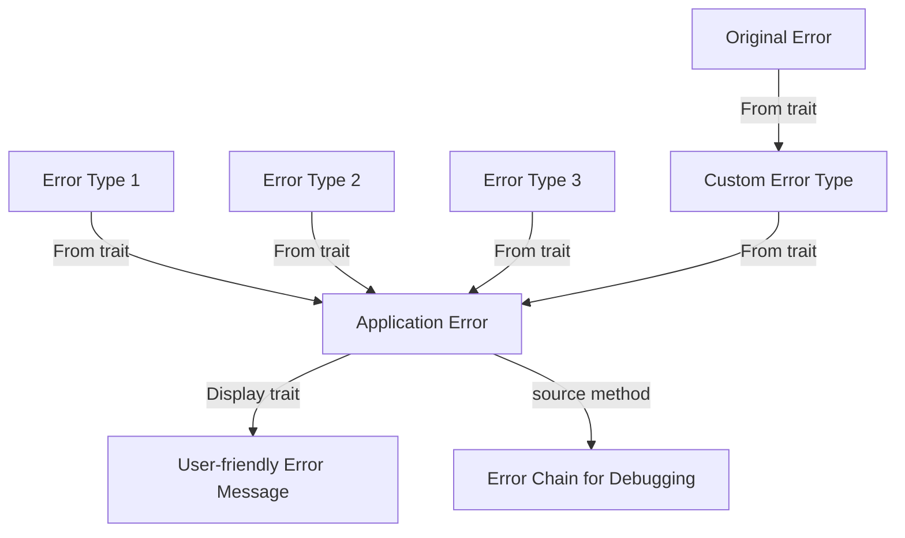

# Rust Error Conversion

## Introduction

When writing Rust applications, you'll often interact with multiple libraries and components, each with their own error types. Error conversion is the process of transforming errors from one type to another, allowing you to maintain a consistent error handling approach throughout your codebase.

In this tutorial, we'll explore how Rust's type system makes error conversion both powerful and ergonomic. You'll learn how to:

- Convert between standard error types
- Implement error conversion for custom types
- Use the `?` operator with error conversion
- Build robust error handling patterns for real-world applications

By the end, you'll have the knowledge to create clean, maintainable error handling code in your Rust projects.

## Understanding Error Conversion in Rust

### The Problem: Multiple Error Types

Let's consider a simple scenario: you're writing a function that reads a configuration file and parses it as JSON. This operation involves two different error types:

1. `std::io::Error` from file operations
2. `serde_json::Error` from JSON parsing

```rust
use std::fs::File;
use std::io::Read;
use serde_json::{self, Value};

fn read_config(path: &str) -> ? {  // What should the return type be?
    let mut file = File::open(path)?;  // This can return std::io::Error
    let mut contents = String::new();
    file.read_to_string(&mut contents)?;  // This can also return std::io::Error
    
    let config: Value = serde_json::from_str(&contents)?;  // This returns serde_json::Error
    Ok(config)
}
```

Without error conversion, we'd need to handle each error type separately or use complex return types, leading to verbose and cumbersome code.

### The Solution: Rust's Conversion Traits

Rust provides a solution through its conversion traits, primarily:

- `From<T>`: Convert from type T
- `Into<T>`: Convert into type T
- `TryFrom<T>`: Try to convert from type T, with a possibility of failure
- `TryInto<T>`: Try to convert into type T, with a possibility of failure

These traits, combined with the `?` operator, make error handling in Rust both expressive and concise.

## Basic Error Conversion with From and Into

### The From and Into Traits

The `From` and `Into` traits are complementary:

```rust
// If T: From<U> is implemented, then U: Into<T> is automatically available
pub trait From<T> {
    fn from(T) -> Self;
}

pub trait Into<T> {
    fn into(self) -> T;
}
```

When you implement `From`, you get `Into` for free, which is why it's generally preferred to implement `From`.

### Example: Converting between Error Types

Let's create a custom error type and implement conversion from standard errors:

```rust
use std::fmt;
use std::io;
use std::error::Error;
use serde_json;

#[derive(Debug)]
enum ConfigError {
    IoError(io::Error),
    ParseError(serde_json::Error),
    MissingField(String),
}

// Implement Display for better error messages
impl fmt::Display for ConfigError {
    fn fmt(&self, f: &mut fmt::Formatter) -> fmt::Result {
        match self {
            ConfigError::IoError(err) => write!(f, "IO error: {}", err),
            ConfigError::ParseError(err) => write!(f, "Parse error: {}", err),
            ConfigError::MissingField(field) => write!(f, "Missing field: {}", field),
        }
    }
}

// Implement Error trait
impl Error for ConfigError {
    fn source(&self) -> Option<&(dyn Error + 'static)> {
        match self {
            ConfigError::IoError(err) => Some(err),
            ConfigError::ParseError(err) => Some(err),
            ConfigError::MissingField(_) => None,
        }
    }
}

// Implement From<io::Error> for ConfigError
impl From<io::Error> for ConfigError {
    fn from(err: io::Error) -> Self {
        ConfigError::IoError(err)
    }
}

// Implement From<serde_json::Error> for ConfigError
impl From<serde_json::Error> for ConfigError {
    fn from(err: serde_json::Error) -> Self {
        ConfigError::ParseError(err)
    }
}
```

Now we can simplify our `read_config` function:

```rust
use std::fs::File;
use std::io::Read;
use serde_json::{self, Value};

fn read_config(path: &str) -> Result<Value, ConfigError> {
    let mut file = File::open(path)?;  // io::Error automatically converts to ConfigError
    let mut contents = String::new();
    file.read_to_string(&mut contents)?;
    
    let config: Value = serde_json::from_str(&contents)?;  // serde_json::Error converts to ConfigError
    Ok(config)
}
```

The `?` operator automatically converts the error types using the `From` implementations we provided.

## The Magic Behind the ? Operator and Error Conversion

The `?` operator in Rust does more than just early returns on errors. It also performs automatic error conversion using the `From` trait.

### How ? Works with Error Conversion

When you use the `?` operator in a function that returns `Result<T, E>`, and the error type from the operation is `F` (not `E`), Rust will attempt to convert `F` to `E` using `From<F> for E`.

Here's what happens behind the scenes:

```rust
// This code:
let value = some_operation()?;

// Expands roughly to:
let value = match some_operation() {
    Ok(value) => value,
    Err(err) => return Err(From::from(err)),
};
```

This is why our `read_config` function works seamlessly with both `io::Error` and `serde_json::Error` - they're automatically converted to `ConfigError`.

## Creating Custom Error Types with Conversions

For robust error handling in larger applications, you'll typically want a custom error type that can represent all possible errors in your domain.

### Example: Application with Multiple Error Sources

Let's expand our example to include a configuration validation step:

```rust
use std::fmt;
use std::io;
use std::error::Error;
use std::num::ParseIntError;
use serde_json;

#[derive(Debug)]
enum AppError {
    Config(ConfigError),
    Validation(String),
    Network(io::Error),
    ParseInt(ParseIntError),
}

// Implement Display
impl fmt::Display for AppError {
    fn fmt(&self, f: &mut fmt::Formatter) -> fmt::Result {
        match self {
            AppError::Config(err) => write!(f, "Configuration error: {}", err),
            AppError::Validation(msg) => write!(f, "Validation error: {}", msg),
            AppError::Network(err) => write!(f, "Network error: {}", err),
            AppError::ParseInt(err) => write!(f, "Integer parsing error: {}", err),
        }
    }
}

// Implement Error trait
impl Error for AppError {
    fn source(&self) -> Option<&(dyn Error + 'static)> {
        match self {
            AppError::Config(err) => Some(err),
            AppError::Validation(_) => None,
            AppError::Network(err) => Some(err),
            AppError::ParseInt(err) => Some(err),
        }
    }
}

// Implement conversions for various error types
impl From<ConfigError> for AppError {
    fn from(err: ConfigError) -> Self {
        AppError::Config(err)
    }
}

impl From<io::Error> for AppError {
    fn from(err: io::Error) -> Self {
        AppError::Network(err)
    }
}

impl From<ParseIntError> for AppError {
    fn from(err: ParseIntError) -> Self {
        AppError::ParseInt(err)
    }
}

// Now we can use our error type in application functions
fn load_and_validate_config(path: &str) -> Result<Config, AppError> {
    let raw_config = read_config(path)?;  // ConfigError converts to AppError
    let config = validate_config(raw_config)?;  // ValidationError would convert to AppError
    Ok(config)
}
```

## Using TryFrom and TryInto for Fallible Conversions

Sometimes, conversions can fail. For these cases, Rust provides the `TryFrom` and `TryInto` traits:

```rust
pub trait TryFrom<T> {
    type Error;
    fn try_from(value: T) -> Result<Self, Self::Error>;
}

pub trait TryInto<T> {
    type Error;
    fn try_into(self) -> Result<T, Self::Error>;
}
```

### Example: Fallible Conversion with TryFrom

Let's say we want to convert a JSON configuration into a strongly typed `Config` struct:

```rust
use serde_json::Value;
use std::convert::TryFrom;

#[derive(Debug)]
struct Config {
    server: String,
    port: u16,
    max_connections: u32,
}

impl TryFrom<Value> for Config {
    type Error = ConfigError;
    
    fn try_from(value: Value) -> Result<Self, Self::Error> {
        // Extract server field
        let server = match value.get("server") {
            Some(Value::String(s)) => s.clone(),
            _ => return Err(ConfigError::MissingField("server".to_string())),
        };
        
        // Extract port field
        let port = match value.get("port") {
            Some(Value::Number(n)) => {
                if let Some(p) = n.as_u64() {
                    if p <= u16::MAX as u64 {
                        p as u16
                    } else {
                        return Err(ConfigError::ValidationError("port exceeds maximum value".to_string()));
                    }
                } else {
                    return Err(ConfigError::ValidationError("port must be a positive integer".to_string()));
                }
            },
            _ => return Err(ConfigError::MissingField("port".to_string())),
        };
        
        // Extract max_connections field
        let max_connections = match value.get("max_connections") {
            Some(Value::Number(n)) => {
                if let Some(c) = n.as_u64() {
                    if c <= u32::MAX as u64 {
                        c as u32
                    } else {
                        return Err(ConfigError::ValidationError("max_connections exceeds maximum value".to_string()));
                    }
                } else {
                    return Err(ConfigError::ValidationError("max_connections must be a positive integer".to_string()));
                }
            },
            _ => return Err(ConfigError::MissingField("max_connections".to_string())),
        };
        
        Ok(Config {
            server,
            port,
            max_connections,
        })
    }
}

// Now we can use TryFrom/TryInto in our code
fn get_config(path: &str) -> Result<Config, AppError> {
    let value = read_config(path)?;
    let config = Config::try_from(value)?;  // ConfigError converts to AppError
    Ok(config)
}
```

## Real-world Error Conversion Patterns

In real applications, you'll encounter various error conversion patterns. Let's explore some common approaches.

### Pattern 1: Thiserror for Derive-based Error Types

The `thiserror` crate simplifies error type definitions through derive macros:

```rust
use thiserror::Error;

#[derive(Error, Debug)]
enum AppError {
    #[error("IO error: {0}")]
    Io(#[from] std::io::Error),
    
    #[error("JSON parsing error: {0}")]
    Json(#[from] serde_json::Error),
    
    #[error("Configuration error: {0}")]
    Config(String),
    
    #[error("Validation error: {0}")]
    Validation(String),
}
```

With `thiserror`, the `#[from]` attribute automatically implements the `From` trait for converting from the specified error type.

### Pattern 2: Anyhow for Simplified Application Errors

For applications where detailed error typing isn't necessary, the `anyhow` crate provides a simpler approach:

```rust
use anyhow::{Result, Context};

fn read_config(path: &str) -> Result<Config> {
    let content = std::fs::read_to_string(path)
        .with_context(|| format!("Failed to read config file: {}", path))?;
    
    let json: serde_json::Value = serde_json::from_str(&content)
        .context("Failed to parse config as JSON")?;
    
    let config = Config::try_from(json)
        .context("Invalid configuration format")?;
    
    Ok(config)
}
```

The `anyhow::Result<T>` type is shorthand for `Result<T, anyhow::Error>`, where `anyhow::Error` can store any error type that implements `std::error::Error`.

### Pattern 3: Error Context with Map/MapErr

Sometimes you want to add context to errors without creating new error types:

```rust
use std::fs::File;
use std::io;

fn open_database() -> Result<Database, io::Error> {
    let config_path = get_config_path();
    
    let config_file = File::open(&config_path).map_err(|err| {
        eprintln!("Failed to open config at {}: {}", config_path.display(), err);
        err  // Return the original error
    })?;
    
    // Continue with database opening...
}
```

The `map_err` method allows you to transform or add context to errors while preserving their type.



## Practical Example: Building a Robust CLI Application

Let's put everything together in a practical example - a simple CLI tool that reads a configuration file, validates it, and performs an action:

```rust
use std::fs;
use std::path::Path;
use std::convert::TryFrom;
use serde_json::Value;
use thiserror::Error;

// Define our error types
#[derive(Error, Debug)]
enum AppError {
    #[error("IO error: {0}")]
    Io(#[from] std::io::Error),
    
    #[error("JSON error: {0}")]
    Json(#[from] serde_json::Error),
    
    #[error("Configuration error: {0}")]
    Config(String),
    
    #[error("Network error: {0}")]
    Network(String),
}

// Define our config structure
#[derive(Debug)]
struct AppConfig {
    api_url: String,
    timeout_seconds: u32,
    retry_count: u32,
}

// Implement TryFrom for converting from JSON to AppConfig
impl TryFrom<Value> for AppConfig {
    type Error = AppError;
    
    fn try_from(value: Value) -> Result<Self, Self::Error> {
        // Extract and validate api_url
        let api_url = value.get("api_url")
            .and_then(|v| v.as_str())
            .ok_or_else(|| AppError::Config("Missing or invalid api_url".to_string()))?
            .to_string();
            
        if !api_url.starts_with("http") {
            return Err(AppError::Config("api_url must start with http or https".to_string()));
        }
        
        // Extract and validate timeout_seconds
        let timeout_seconds = value.get("timeout_seconds")
            .and_then(|v| v.as_u64())
            .ok_or_else(|| AppError::Config("Missing or invalid timeout_seconds".to_string()))?;
            
        if timeout_seconds == 0 || timeout_seconds > 120 {
            return Err(AppError::Config("timeout_seconds must be between 1 and 120".to_string()));
        }
        
        // Extract and validate retry_count
        let retry_count = value.get("retry_count")
            .and_then(|v| v.as_u64())
            .ok_or_else(|| AppError::Config("Missing or invalid retry_count".to_string()))?;
            
        if retry_count > 10 {
            return Err(AppError::Config("retry_count must be between 0 and 10".to_string()));
        }
        
        Ok(AppConfig {
            api_url,
            timeout_seconds: timeout_seconds as u32,
            retry_count: retry_count as u32,
        })
    }
}

// Application functions
fn read_config_file(path: &Path) -> Result<AppConfig, AppError> {
    let content = fs::read_to_string(path)?;
    let json: Value = serde_json::from_str(&content)?;
    let config = AppConfig::try_from(json)?;
    Ok(config)
}

fn run_application(config_path: &str) -> Result<(), AppError> {
    println!("Starting application...");
    
    // Read and parse config
    let path = Path::new(config_path);
    let config = read_config_file(path)?;
    
    println!("Configuration loaded successfully:");
    println!("API URL: {}", config.api_url);
    println!("Timeout: {} seconds", config.timeout_seconds);
    println!("Retry count: {}", config.retry_count);
    
    // Simulate some work
    println!("Performing application tasks...");
    
    Ok(())
}

// Main function
fn main() {
    let result = run_application("config.json");
    
    match result {
        Ok(_) => println!("Application completed successfully!"),
        Err(err) => {
            eprintln!("Error: {}", err);
            
            // Get the error chain for detailed debugging
            let mut source = err.source();
            while let Some(err) = source {
                eprintln!("Caused by: {}", err);
                source = err.source();
            }
            
            std::process::exit(1);
        }
    }
}
```

This example demonstrates several key concepts:
1. Custom error types with thiserror
2. Automatic error conversion with the From trait
3. Fallible conversion with TryFrom
4. Error chaining for better debugging
5. Clean error propagation with the ? operator

## Summary

Error conversion in Rust provides a powerful mechanism for building robust error handling systems. By leveraging traits like `From`, `Into`, `TryFrom`, and `TryInto`, along with the `?` operator, you can write clean, expressive code that properly handles errors across library boundaries.

Key takeaways:
1. Use the `From` trait to enable automatic error conversion with the `?` operator
2. Create custom error types that encapsulate various error sources in your application
3. Implement the standard Error and Display traits for better error messages
4. Use TryFrom/TryInto for fallible conversions
5. Consider using crates like thiserror and anyhow for simplified error handling
6. Remember to provide context for errors to make debugging easier

## Additional Resources

- [Rust By Example: Error Handling](https://doc.rust-lang.org/rust-by-example/error.html)
- [The Rust Programming Language: Error Handling chapter](https://doc.rust-lang.org/book/ch09-00-error-handling.html)
- [thiserror crate documentation](https://docs.rs/thiserror)
- [anyhow crate documentation](https://docs.rs/anyhow)
- [std::convert module documentation](https://doc.rust-lang.org/std/convert/index.html)

## Exercises

1. **Basic Conversion**: Create a custom error type and implement `From` for converting from `std::io::Error` and `std::num::ParseIntError`.

2. **Error Context**: Modify the error conversion to include the file path or line number where the error occurred.

3. **Multiple Sources**: Build an application that interacts with both a database and an HTTP API, creating appropriate error types and conversions.

4. **Library vs Application**: Create a library with its own error type, then build an application that uses this library and converts its errors appropriately.

5. **Advanced Pattern**: Implement a result extension trait that allows adding context to errors while preserving their type, similar to the `context` method in anyhow.