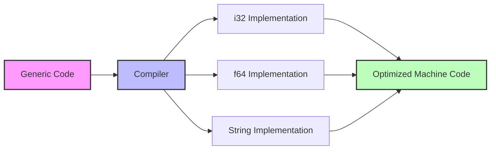

# Rust Generics Basics

## Introduction

Generics are one of Rust's most powerful features, allowing you to write flexible, reusable code without sacrificing performance. Unlike other languages where generics might incur runtime costs, Rust implements generics through *monomorphization* - creating specific versions of generic code at compile time.

In this tutorial, we'll explore the basics of Rust generics, learning how to create functions, structs, enums, and methods that work with multiple data types while maintaining Rust's safety guarantees.

## What Are Generics?

Generics allow you to define code that works with multiple types rather than a single concrete type. Think of generics as a way to write a template for your code, which the compiler then fills in with specific types when used.

Without generics, you might write multiple versions of the same function for different types:

```rust
fn largest_i32(list: &[i32]) -> i32 {
    let mut largest = list[0];
    
    for &item in list {
        if item > largest {
            largest = item;
        }
    }
    
    largest
}

fn largest_char(list: &[char]) -> char {
    let mut largest = list[0];
    
    for &item in list {
        if item > largest {
            largest = item;
        }
    }
    
    largest
}
```

This approach leads to code duplication. With generics, you can write a single function that handles multiple types.

## Generic Functions

Let's rewrite our largest function using generics:

```rust
fn largest<T: PartialOrd + Copy>(list: &[T]) -> T {
    let mut largest = list[0];
    
    for &item in list {
        if item > largest {
            largest = item;
        }
    }
    
    largest
}

fn main() {
    let number_list = vec![34, 50, 25, 100, 65];
    let result = largest(&number_list);
    println!("The largest number is {}", result);
    
    let char_list = vec!['y', 'm', 'a', 'q'];
    let result = largest(&char_list);
    println!("The largest char is {}", result);
}
```

**Output:**
```
The largest number is 100
The largest char is y
```

Breaking down the function definition:
- `fn largest<T: PartialOrd + Copy>(list: &[T]) -> T`
- `<T: PartialOrd + Copy>` - This is where we declare the generic type parameter `T`
- `PartialOrd + Copy` - These are trait bounds (more on this later)
- `(list: &[T]) -> T` - Our function takes a slice of type `T` and returns a value of type `T`

## Generic Structs

Structs can also be generic, allowing them to hold different types of data:

```rust
struct Point<T> {
    x: T,
    y: T,
}

fn main() {
    let integer_point = Point { x: 5, y: 10 };
    let float_point = Point { x: 1.0, y: 4.0 };
    
    // This would not compile because x and y must be the same type
    // let mixed_point = Point { x: 5, y: 4.0 };
}
```

You can use multiple generic type parameters when needed:

```rust
struct Point<T, U> {
    x: T,
    y: U,
}

fn main() {
    let both_integer = Point { x: 5, y: 10 };
    let both_float = Point { x: 1.0, y: 4.0 };
    let integer_and_float = Point { x: 5, y: 4.0 };
}
```

## Generic Enums

Enums can also use generic types. In fact, two of Rust's most used enums are generic:

```rust
enum Option<T> {
    Some(T),
    None,
}

enum Result<T, E> {
    Ok(T),
    Err(E),
}
```

Let's create our own generic enum:

```rust
enum Either<T, U> {
    Left(T),
    Right(U),
}

fn main() {
    let left: Either<i32, &str> = Either::Left(5);
    let right: Either<i32, &str> = Either::Right("hello");
    
    // Process based on variant
    match left {
        Either::Left(value) => println!("Got left value: {}", value),
        Either::Right(value) => println!("Got right value: {}", value),
    }
}
```

**Output:**
```
Got left value: 5
```

## Generic Methods

You can implement methods on generic structs and enums:

```rust
struct Point<T> {
    x: T,
    y: T,
}

impl<T> Point<T> {
    fn x(&self) -> &T {
        &self.x
    }
}

// We can also implement methods for specific types
impl Point<f32> {
    fn distance_from_origin(&self) -> f32 {
        (self.x.powi(2) + self.y.powi(2)).sqrt()
    }
}

fn main() {
    let p = Point { x: 5, y: 10 };
    println!("p.x = {}", p.x());
    
    let p_float = Point { x: 3.0_f32, y: 4.0_f32 };
    println!("Distance from origin: {}", p_float.distance_from_origin());
}
```

**Output:**
```
p.x = 5
Distance from origin: 5.0
```

Methods can also define their own generic parameters:

```rust
struct Point<T, U> {
    x: T,
    y: U,
}

impl<T, U> Point<T, U> {
    fn mixup<V, W>(self, other: Point<V, W>) -> Point<T, W> {
        Point {
            x: self.x,
            y: other.y,
        }
    }
}

fn main() {
    let p1 = Point { x: 5, y: 10.4 };
    let p2 = Point { x: "Hello", y: 'c' };
    
    let p3 = p1.mixup(p2);
    
    println!("p3.x = {}, p3.y = {}", p3.x, p3.y);
}
```

**Output:**
```
p3.x = 5, p3.y = c
```

## Generic Type Constraints with Trait Bounds

Not all operations make sense for all types. For example, the `>` comparison operator doesn't work on all types. To ensure our generic code only works with appropriate types, we use *trait bounds*:

```rust
fn largest<T: PartialOrd>(list: &[T]) -> &T {
    let mut largest = &list[0];
    
    for item in list {
        if item > largest {
            largest = item;
        }
    }
    
    largest
}
```

Here, `T: PartialOrd` means "T can be any type that implements the PartialOrd trait," which guarantees the `>` operator will work.

You can specify multiple trait bounds with the `+` syntax:

```rust
fn display_and_calculate<T: Display + PartialOrd + Sum>(value: T) {
    // Implementation
}
```

Or using the `where` clause for cleaner code:

```rust
fn some_function<T, U>(t: T, u: U) -> i32
    where T: Display + Clone,
          U: Clone + Debug
{
    // Implementation
}
```

## Performance of Generics in Rust

Unlike some other languages, Rust implements generics using *monomorphization*. This means the compiler generates specific implementations of generic code for each concrete type used, eliminating any runtime cost.

When you compile:

```rust
let integer = Some(5);
let float = Some(5.0);
```

The Rust compiler creates code equivalent to:

```rust
enum Option_i32 {
    Some(i32),
    None,
}

enum Option_f64 {
    Some(f64),
    None,
}

let integer = Option_i32::Some(5);
let float = Option_f64::Some(5.0);
```

This approach means generic code in Rust runs just as fast as if you'd written type-specific code by hand!

## Practical Example: A Generic Cache

Let's build a simple generic cache that can store and retrieve values of any type:

```rust
struct Cache<T> {
    data: Option<T>,
}

impl<T> Cache<T> {
    fn new() -> Self {
        Cache { data: None }
    }
    
    fn store(&mut self, value: T) {
        self.data = Some(value);
    }
    
    fn get(&self) -> Option<&T> {
        self.data.as_ref()
    }
    
    fn clear(&mut self) {
        self.data = None;
    }
}

fn main() {
    // Integer cache
    let mut int_cache = Cache::new();
    int_cache.store(42);
    
    if let Some(value) = int_cache.get() {
        println!("Retrieved value: {}", value);
    }
    
    // String cache
    let mut string_cache = Cache::new();
    string_cache.store(String::from("Hello, generics!"));
    
    if let Some(value) = string_cache.get() {
        println!("Retrieved string: {}", value);
    }
}
```

**Output:**
```
Retrieved value: 42
Retrieved string: Hello, generics!
```

## Visual Representation of Generics

Here's a diagram showing how generics work in Rust:



## Summary

Generics in Rust allow you to write flexible, reusable code without sacrificing performance:

- Generic functions can work with multiple types using `<T>` syntax
- Generic structs and enums can hold different types of data
- Trait bounds ensure generic code only works with appropriate types
- Methods can be implemented for generic types
- Rust's monomorphization approach means generic code has no runtime performance penalty

By using generics effectively, you can write cleaner, more maintainable code that works with a variety of types while maintaining Rust's performance and safety guarantees.

## Exercises

1. Create a generic `min` function that finds the smallest value in a slice of any type that can be compared.
2. Implement a generic `Pair<T>` struct with methods for creating a new pair and getting the larger of the two values.
3. Create a generic `LinkedList<T>` struct with methods to add and remove elements.
4. Write a generic function that takes two arguments of different types and returns a tuple with both values.
5. Implement a generic `Result`-like enum that can be used to return either success or a custom error message.

## Additional Resources

- [Rust Book: Generics Chapter](https://doc.rust-lang.org/book/ch10-00-generics.html)
- [Rust By Example: Generics](https://doc.rust-lang.org/rust-by-example/generics.html)
- [Rust Reference: Generics](https://doc.rust-lang.org/reference/items/generics.html)
- [Rust Standard Library Documentation](https://doc.rust-lang.org/std/)