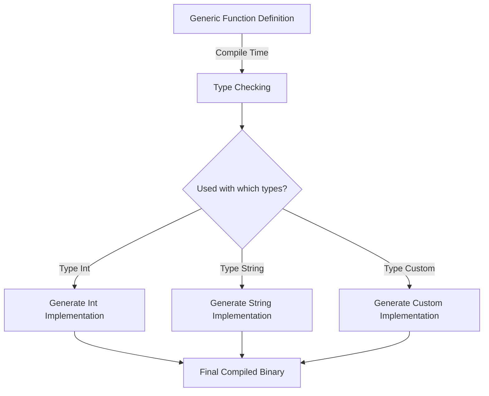

# Rust Generic Functions

## Introduction

Generic functions are a powerful feature in Rust that allow you to write flexible, reusable code that works with different types. Instead of writing separate functions for each data type, you can write a single generic function that can operate on multiple types. This reduces code duplication and makes your programs more maintainable.

In this tutorial, we'll explore how to define and use generic functions in Rust, understand their syntax, and see how they help write more concise and reusable code.

## What Are Generic Functions?

Generic functions in Rust allow you to define functions that can work with multiple types rather than being tied to a specific type. The compiler generates concrete implementations for each type the function is used with.

### Basic Syntax

Here's the basic syntax for defining a generic function in Rust:

```rust
fn function_name<T>(parameter: T) -> ReturnType {
    // Function body
}
```

The `<T>` after the function name declares a type parameter. `T` is a conventional name for a type parameter (similar to how we use 'i' for loop indices), but you can name it anything. You can also have multiple type parameters like `<T, U>`.

## Your First Generic Function

Let's start with a simple example - a function that returns the first element of an array:

```rust
fn first<T>(array: &[T]) -> &T {
    &array[0]
}

fn main() {
    let numbers = [1, 2, 3, 4, 5];
    let first_number = first(&numbers);
    println!("First number: {}", first_number);  // Output: First number: 1
    
    let characters = ['a', 'b', 'c', 'd'];
    let first_char = first(&characters);
    println!("First character: {}", first_char);  // Output: First character: a
}
```

In this example, the `first` function works with arrays of any type because we've defined it to be generic over type `T`. We can call it with an array of integers or characters, and it works the same way.

## Multiple Generic Parameters

Generic functions can have multiple type parameters. Here's an example that swaps two values of different types:

```rust
fn swap<T, U>(a: T, b: U) -> (U, T) {
    (b, a)
}

fn main() {
    let result = swap(42, "hello");
    println!("Swapped: ({}, {})", result.0, result.1);  // Output: Swapped: (hello, 42)
    
    let another_result = swap(true, 3.14);
    println!("Swapped: ({}, {})", another_result.0, another_result.1);  // Output: Swapped: (3.14, true)
}
```

Here, we've defined a function with two type parameters, `T` and `U`, allowing us to swap values of different types.

## Generic Functions with Constraints (Trait Bounds)

One of the most powerful aspects of Rust's generics is the ability to apply constraints to the generic types using trait bounds. This allows you to specify that a generic type must implement certain traits.

### Using the `PartialOrd` Trait

Let's write a function that finds the greater of two values:

```rust
fn max<T: PartialOrd>(a: T, b: T) -> T {
    if a >= b {
        a
    } else {
        b
    }
}

fn main() {
    let larger_int = max(42, 27);
    println!("Larger integer: {}", larger_int);  // Output: Larger integer: 42
    
    let larger_float = max(3.14, 2.71);
    println!("Larger float: {}", larger_float);  // Output: Larger float: 3.14
    
    let larger_char = max('a', 'z');
    println!("Larger character: {}", larger_char);  // Output: Larger character: z
    
    // This works for any type that implements PartialOrd!
}
```

The syntax `T: PartialOrd` is a trait bound that specifies that the type `T` must implement the `PartialOrd` trait, which provides methods for comparing values.

### Multiple Trait Bounds

You can specify multiple trait bounds for a single type parameter:

```rust
fn print_info<T: std::fmt::Display + Clone>(value: T) {
    let cloned = value.clone();
    println!("Value: {}", cloned);
}

fn main() {
    print_info("Hello, generics!");  // Output: Value: Hello, generics!
    print_info(42);  // Output: Value: 42
    
    // This would not compile:
    // print_info(vec![1, 2, 3]);  // Vec doesn't implement Display
}
```

Here, `T: std::fmt::Display + Clone` means that `T` must implement both the `Display` trait (which allows values to be formatted as strings) and the `Clone` trait (which allows values to be duplicated).

### The `where` Clause

For functions with multiple generic parameters or complex trait bounds, you can use the `where` clause for better readability:

```rust
fn compare_and_print<T, U>(t: T, u: U) -> bool
where
    T: std::fmt::Display + PartialEq,
    U: std::fmt::Display + PartialEq + From<T>,
{
    println!("Comparing {} and {}", t, u);
    let u2: U = U::from(t);
    u == u2
}
```

The `where` clause makes the function signature cleaner and easier to read, especially when you have multiple generic parameters with trait bounds.

## Practical Example: A Generic Data Processing Function

Let's look at a more practical example. Here's a function that processes a vector of elements, transforming each element using a provided function:

```rust
fn transform<T, U, F>(input: Vec<T>, transformer: F) -> Vec<U>
where
    F: Fn(T) -> U,
{
    let mut result = Vec::with_capacity(input.len());
    
    for item in input {
        result.push(transformer(item));
    }
    
    result
}

fn main() {
    // Transform a vector of integers by doubling each value
    let numbers = vec![1, 2, 3, 4, 5];
    let doubled = transform(numbers, |x| x * 2);
    println!("Doubled: {:?}", doubled);  // Output: Doubled: [2, 4, 6, 8, 10]
    
    // Transform a vector of strings to their lengths
    let words = vec!["hello".to_string(), "world".to_string(), "rust".to_string()];
    let lengths = transform(words, |s| s.len());
    println!("Lengths: {:?}", lengths);  // Output: Lengths: [5, 5, 4]
}
```

In this example, our `transform` function is generic over three types:
- `T`: The type of elements in the input vector
- `U`: The type of elements in the output vector
- `F`: The type of the transformer function, which must implement the `Fn(T) -> U` trait

## Generic Methods in Structs and Enums

You can also define generic methods on structs and enums. Here's an example of a simple generic container:

```rust
struct Container<T> {
    value: T,
}

impl<T> Container<T> {
    // Generic constructor
    fn new(value: T) -> Self {
        Container { value }
    }
    
    // Generic getter
    fn get(&self) -> &T {
        &self.value
    }
    
    // Generic setter
    fn set(&mut self, value: T) {
        self.value = value;
    }
}

impl<T: std::fmt::Display> Container<T> {
    // This method is only available for types that implement Display
    fn print(&self) {
        println!("Container value: {}", self.value);
    }
}

fn main() {
    let mut int_container = Container::new(42);
    println!("Value: {}", int_container.get());  // Output: Value: 42
    
    int_container.set(99);
    int_container.print();  // Output: Container value: 99
    
    let string_container = Container::new("Hello, Rust!".to_string());
    string_container.print();  // Output: Container value: Hello, Rust!
}
```

In this example, we define a generic `Container` struct that can hold any type. We implement generic methods that work with any type, as well as specialized methods that only work with types that implement certain traits.

## Visualizing Generic Functions

Here's a diagram showing how generic functions work in Rust:



This process, known as monomorphization, is how Rust implements zero-cost abstractions - generic code is compiled to specific implementations for each type it's used with, resulting in the same performance as if you had written separate functions for each type.

## Benefits of Generic Functions

1. **Type Safety**: Rust's compiler ensures that your generic code is used correctly with appropriate types.
2. **Code Reuse**: Write a function once and use it with many different types.
3. **Performance**: Unlike some languages where generics involve runtime costs, Rust's generics are resolved at compile time, resulting in optimized code with no runtime overhead.
4. **Expressiveness**: Generic code can express algorithms and data structures in a way that focuses on their logic rather than specific types.

## Common Patterns with Generic Functions

### The `Into` Trait for Flexible Arguments

The `Into` trait allows for flexible function parameters that can accept different types that can be converted into the required type:

```rust
fn process_name<T: Into<String>>(name: T) {
    let name_string = name.into();
    println!("Processing name: {}", name_string);
}

fn main() {
    process_name("Alice");  // &str literal
    process_name("Bob".to_string());  // String
    
    let name: &str = "Charlie";
    process_name(name);  // &str reference
}
```

This function can accept both string literals (`&str`) and `String` objects because both types implement `Into<String>`.

### The `AsRef` Trait for Reference Conversions

The `AsRef` trait is useful when you want to accept different types that can be viewed as a reference to a specific type:

```rust
fn print_bytes<T: AsRef<[u8]>>(data: T) {
    let bytes = data.as_ref();
    println!("Bytes: {:?}", bytes);
}

fn main() {
    print_bytes("Hello, Rust!".as_bytes());  // &[u8] from &str
    print_bytes(vec![1, 2, 3, 4]);  // Vec<u8>
    print_bytes(b"Raw bytes");  // &[u8; N]
}
```

This function can accept anything that can be viewed as a slice of bytes.

## Summary

Generic functions in Rust provide a powerful way to write flexible, reusable code without sacrificing performance or type safety. By defining functions that work with any type or with types that meet specific constraints, you can create more maintainable and elegant code.

Key takeaways:
- Generic functions allow you to write code that works with multiple types
- Type parameters are specified in angle brackets: `<T>`
- Trait bounds can be used to constrain the types that can be used with your generic function
- Rust's generics are implemented via monomorphization, so there's no runtime performance penalty
- Common traits like `PartialOrd`, `Display`, `Into`, and `AsRef` can make your generic functions more flexible and useful

## Exercises

1. Write a generic function that finds the minimum value in a slice.
2. Create a generic function that converts a vector of one type to a vector of another type, given a conversion function.
3. Implement a generic `zip` function that combines two vectors into a vector of tuples.
4. Write a generic binary search function for any type that implements `Ord`.
5. Create a generic memoization function that caches the results of expensive function calls.

## Additional Resources

- [The Rust Book: Generic Data Types](https://doc.rust-lang.org/book/ch10-01-syntax.html)
- [Rust by Example: Generics](https://doc.rust-lang.org/rust-by-example/generics.html)
- [Rust Standard Library Documentation](https://doc.rust-lang.org/std/index.html) - Many examples of generic functions in action
- [Rustonomicon: Subtyping and Variance](https://doc.rust-lang.org/nomicon/subtyping.html) - For a deeper understanding of how generics work in Rust