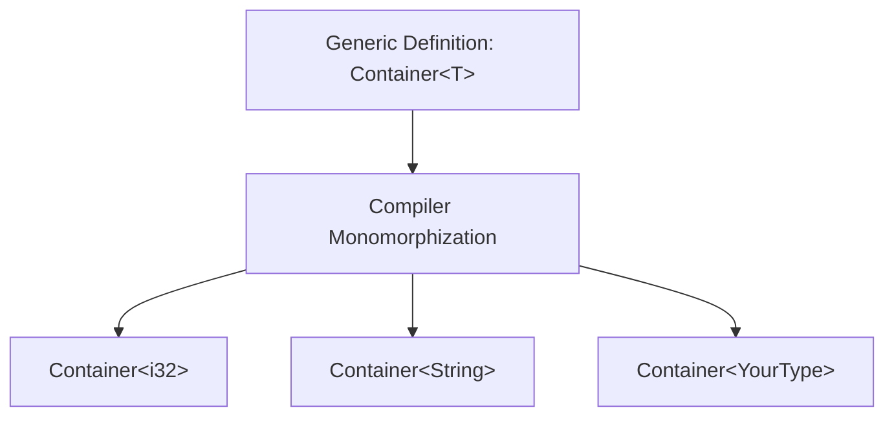

# Rust Generic Structs

## Introduction

When programming, we often need to create data structures that work with different types. For example, you might want a "container" that can hold an integer, a string, or a custom type. Instead of writing separate implementations for each type, Rust allows us to use **generics** to write flexible, reusable code.

In this tutorial, we'll explore how to use generics with Rust structs. Generic structs are structures that can work with multiple data types through a single definition, making your code more concise and maintainable.

## Understanding Generic Structs

A generic struct is a struct that can work with any type that meets certain requirements. Let's start with a simple example:

```rust
struct Container<T> {
    value: T,
}

fn main() {
    let integer_container = Container { value: 42 };
    let string_container = Container { value: String::from("Hello, Rust!") };
    
    println!("Integer: {}", integer_container.value);  // Output: Integer: 42
    println!("String: {}", string_container.value);    // Output: String: Hello, Rust!
}
```

In this example:
- We define a `Container<T>` struct, where `T` is a type parameter
- We create two instances of `Container`: one for an integer and one for a string
- The compiler creates specialized versions of our struct for each type

## Type Parameters in Structs

The angle brackets `<T>` after the struct name indicate that `T` is a type parameter. You can use any identifier, but by convention, single uppercase letters are used:

- `T` for "type"
- `E` for "element"
- `K` for "key"
- `V` for "value"

Let's look at a more complex example with multiple type parameters:

```rust
struct Pair<T, U> {
    first: T,
    second: U,
}

fn main() {
    let pair = Pair {
        first: 1,
        second: "hello",
    };
    
    println!("Pair: ({}, {})", pair.first, pair.second);
    // Output: Pair: (1, hello)
}
```

Here, we define a `Pair<T, U>` struct that holds two values of potentially different types.

## Implementing Methods on Generic Structs

You can define methods on generic structs using the `impl` keyword:

```rust
struct Point<T> {
    x: T,
    y: T,
}

impl<T> Point<T> {
    fn new(x: T, y: T) -> Self {
        Point { x, y }
    }
    
    fn get_x(&self) -> &T {
        &self.x
    }
    
    fn get_y(&self) -> &T {
        &self.y
    }
}

fn main() {
    let integer_point = Point::new(5, 10);
    let float_point = Point::new(1.0, 2.0);
    
    println!("Integer point: ({}, {})", integer_point.get_x(), integer_point.get_y());
    // Output: Integer point: (5, 10)
    
    println!("Float point: ({}, {})", float_point.get_x(), float_point.get_y());
    // Output: Float point: (1, 2)
}
```

Notice that we need to declare `<T>` after `impl` to tell Rust that we're implementing methods on a generic type.

## Type Constraints with Traits

Sometimes you want to restrict which types can be used with your generic struct. You can do this using trait bounds:

```rust
use std::fmt::Display;

struct Wrapper<T: Display> {
    value: T,
}

impl<T: Display> Wrapper<T> {
    fn print(&self) {
        println!("Value: {}", self.value);
    }
}

fn main() {
    let wrap_int = Wrapper { value: 42 };
    wrap_int.print();  // Output: Value: 42
    
    let wrap_string = Wrapper { value: String::from("Rust") };
    wrap_string.print();  // Output: Value: Rust
    
    // This would not compile:
    // let wrap_vec = Wrapper { value: vec![1, 2, 3] };
    // Because Vec<i32> doesn't implement Display
}
```

In this example, the `Wrapper<T: Display>` struct can only be used with types that implement the `Display` trait (types that can be formatted as strings).

## Generic Structs with Default Values

You can provide default type parameters using the following syntax:

```rust
struct OptionalContainer<T = i32> {
    value: T,
}

fn main() {
    // Uses the default type (i32)
    let default_container = OptionalContainer { value: 42 };
    
    // Explicitly specify a different type
    let string_container: OptionalContainer<String> = OptionalContainer {
        value: String::from("Hello"),
    };
    
    println!("Default: {}", default_container.value);  // Output: Default: 42
    println!("String: {}", string_container.value);    // Output: String: Hello
}
```

## Real-World Example: A Generic Result Cache

Let's create a more practical example: a cache that stores results of computations:

```rust
use std::collections::HashMap;
use std::hash::Hash;

struct ResultCache<K, V> {
    cache: HashMap<K, V>,
}

impl<K: Eq + Hash, V: Clone> ResultCache<K, V> {
    fn new() -> Self {
        ResultCache {
            cache: HashMap::new(),
        }
    }
    
    fn get_or_compute<F>(&mut self, key: K, compute_fn: F) -> V 
    where
        F: FnOnce() -> V,
    {
        if let Some(value) = self.cache.get(&key) {
            println!("Cache hit!");
            value.clone()
        } else {
            println!("Cache miss, computing value...");
            let value = compute_fn();
            self.cache.insert(key, value.clone());
            value
        }
    }
}

fn main() {
    let mut string_cache = ResultCache::<String, String>::new();
    
    // First call - will compute the value
    let result1 = string_cache.get_or_compute(
        "key1".to_string(), 
        || {
            // Simulate expensive computation
            println!("Performing expensive computation...");
            "computed value".to_string()
        }
    );
    
    println!("Result: {}", result1);
    
    // Second call with same key - will use cached value
    let result2 = string_cache.get_or_compute(
        "key1".to_string(), 
        || {
            println!("This won't be printed");
            "computed value".to_string()
        }
    );
    
    println!("Result: {}", result2);
}
```

Output:
```
Cache miss, computing value...
Performing expensive computation...
Result: computed value
Cache hit!
Result: computed value
```

This example demonstrates:
1. A generic cache that works with any key and value types
2. Type constraints to ensure the key can be used in a HashMap
3. A practical use of generics to store computation results
4. Closure parameters for defining computation logic

## Memory Layout of Generic Structs

When you use generic structs, Rust performs monomorphization at compile time. This means Rust generates specialized versions of your generic code for each concrete type used:



This approach offers zero-cost abstractions—you get the flexibility of generics without runtime performance penalties.

## Summary

Generic structs in Rust allow you to write flexible, reusable code that works with various types. Key points to remember:

- Use angle brackets to define type parameters: `struct Container<T>`
- You can use multiple type parameters: `struct Pair<T, U>`
- Implement methods on generic structs using `impl<T> MyStruct<T>`
- Add trait bounds to restrict which types can be used: `struct Wrapper<T: Display>`
- Rust performs monomorphization at compile time, generating optimized code for each concrete type

By mastering generic structs, you can write more concise, maintainable, and efficient Rust code that handles a variety of data types without duplication.

## Exercises

1. Create a generic `Stack<T>` struct that implements `push`, `pop`, and `peek` methods.
2. Implement a `Result<T, E>` look-alike that can hold either a success value or an error.
3. Create a `Pair<T>` struct where both elements must be of the same type, and implement a `swap` method that exchanges the values.
4. Design a `Matrix<T>` struct that can work with different numeric types.

## Additional Resources

- [The Rust Book - Generic Data Types](https://doc.rust-lang.org/book/ch10-01-syntax.html)
- [Rust by Example - Generics](https://doc.rust-lang.org/rust-by-example/generics.html)
- [Rust Standard Library Documentation](https://doc.rust-lang.org/std/)
- [The Rustonomicon - Advanced Rust](https://doc.rust-lang.org/nomicon/)