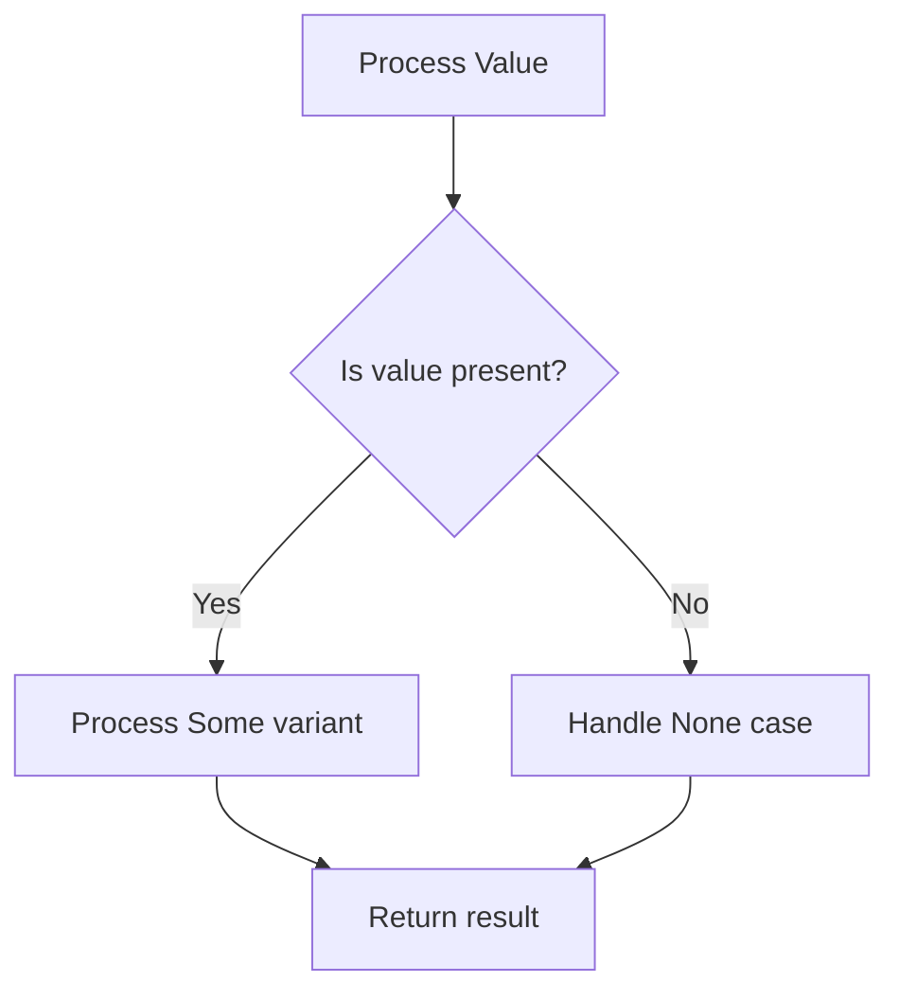

# Rust Generic Enums

## Introduction

Generic enums are a powerful feature in Rust that allow you to create enumeration types that can work with different data types. Just like generic functions and structs, generic enums help you write flexible, reusable code without sacrificing Rust's strong type safety. In this tutorial, we'll explore how to define and use generic enums, understand their benefits, and see practical examples of how they solve real programming problems.

## What are Generic Enums?

An enum (short for enumeration) in Rust is a type that can be one of several variants. When we make an enum generic, we're essentially saying: "this enum can work with different types, which we'll specify when we use it."

Let's start with a basic example to understand the syntax:

```rust
enum Result<T, E> {
    Ok(T),
    Err(E),
}
```

In this example, `Result` is a generic enum with two type parameters: `T` and `E`. The `Ok` variant holds a value of type `T`, and the `Err` variant holds a value of type `E`. This means we can use `Result` with any combination of types!

## Basic Generic Enum Examples

### Option Enum

One of the most commonly used generic enums in Rust is `Option<T>`:

```rust
enum Option<T> {
    Some(T),
    None,
}
```

Here's how you might use it:

```rust
fn main() {
    // Option with an integer
    let some_number: Option<i32> = Some(5);
    
    // Option with a string
    let some_text: Option<String> = Some(String::from("Hello"));
    
    // Option with no value
    let absent_number: Option<i32> = None;
    
    // Print the values
    println!("some_number: {:?}", some_number); // Output: some_number: Some(5)
    println!("some_text: {:?}", some_text);     // Output: some_text: Some("Hello")
    println!("absent_number: {:?}", absent_number); // Output: absent_number: None
}
```

The `Option<T>` enum is so fundamental to Rust that it's included in the prelude, meaning you don't need to explicitly import it.

### Custom Generic Enum

Let's create our own generic enum to represent different types of messages:

```rust
enum Message<T> {
    Text(String),
    Data(T),
    Quit,
}

fn main() {
    // Message with integer data
    let msg1 = Message::Text(String::from("Hello, Rust!"));
    let msg2 = Message::Data(42);
    let msg3 = Message::Quit;
    
    process_message(msg1);
    process_message(msg2);
    process_message(msg3);
}

fn process_message<T: std::fmt::Debug>(msg: Message<T>) {
    match msg {
        Message::Text(text) => println!("Text message: {}", text),
        Message::Data(data) => println!("Data received: {:?}", data),
        Message::Quit => println!("Quit command received"),
    }
}
```

Output:
```
Text message: Hello, Rust!
Data received: 42
Quit command received
```

## Multiple Type Parameters

Just like with generic functions and structs, enums can have multiple type parameters:

```rust
enum Either<L, R> {
    Left(L),
    Right(R),
}

fn main() {
    let left = Either::Left::<i32, String>(42);
    let right = Either::Right::<i32, String>(String::from("Hello"));
    
    match left {
        Either::Left(value) => println!("Left value: {}", value),
        Either::Right(value) => println!("Right value: {}", value),
    }
    
    match right {
        Either::Left(value) => println!("Left value: {}", value),
        Either::Right(value) => println!("Right value: {}", value),
    }
}
```

Output:
```
Left value: 42
Right value: Hello
```

## Generic Enums with Trait Bounds

You can also add trait bounds to your generic enums, ensuring that the type parameters implement specific traits:

```rust
enum Status<T: std::fmt::Display> {
    Success(T),
    Failure(String),
}

fn main() {
    // This works because i32 implements Display
    let status1 = Status::Success(200);
    
    // This works because String implements Display
    let status2 = Status::Success(String::from("OK"));
    
    // This would NOT compile:
    // let status3 = Status::Success(vec![1, 2, 3]);
    // Because Vec<i32> doesn't implement Display
    
    print_status(status1);
    print_status(status2);
}

fn print_status<T: std::fmt::Display>(status: Status<T>) {
    match status {
        Status::Success(value) => println!("Success: {}", value),
        Status::Failure(err) => println!("Failure: {}", err),
    }
}
```

Output:
```
Success: 200
Success: OK
```

## Where to Use Generic Enums

Generic enums are particularly useful in the following scenarios:

1. **Error handling**: The `Result<T, E>` enum is perfect for functions that might fail.
2. **Optional values**: `Option<T>` elegantly handles the case where a value might be absent.
3. **State machines**: Different states can hold different types of data.
4. **Message passing**: When different message types need to be handled by the same system.

## Practical Example: Building a Simple Cache

Let's build a simple cache that can store different types of values:

```rust
enum CacheEntry<T> {
    Empty,
    Filled(T, u64), // Value and timestamp
}

struct Cache<T> {
    entries: Vec<CacheEntry<T>>,
}

impl<T: Clone> Cache<T> {
    fn new(size: usize) -> Self {
        let mut entries = Vec::with_capacity(size);
        for _ in 0..size {
            entries.push(CacheEntry::Empty);
        }
        Cache { entries }
    }
    
    fn store(&mut self, index: usize, value: T) {
        if index < self.entries.len() {
            // Store with current timestamp (simplified)
            let timestamp = std::time::SystemTime::now()
                .duration_since(std::time::UNIX_EPOCH)
                .unwrap()
                .as_secs();
            
            self.entries[index] = CacheEntry::Filled(value, timestamp);
        }
    }
    
    fn retrieve(&self, index: usize) -> Option<T> {
        if index >= self.entries.len() {
            return None;
        }
        
        match &self.entries[index] {
            CacheEntry::Filled(value, _) => Some(value.clone()),
            CacheEntry::Empty => None,
        }
    }
}

fn main() {
    // Cache for integers
    let mut int_cache = Cache::new(5);
    int_cache.store(0, 42);
    int_cache.store(2, 123);
    
    println!("Value at index 0: {:?}", int_cache.retrieve(0)); // Some(42)
    println!("Value at index 1: {:?}", int_cache.retrieve(1)); // None
    println!("Value at index 2: {:?}", int_cache.retrieve(2)); // Some(123)
    
    // Cache for strings
    let mut string_cache = Cache::new(3);
    string_cache.store(0, String::from("Hello"));
    string_cache.store(1, String::from("Rust"));
    
    println!("String at index 0: {:?}", string_cache.retrieve(0)); // Some("Hello")
    println!("String at index 1: {:?}", string_cache.retrieve(1)); // Some("Rust")
    println!("String at index 2: {:?}", string_cache.retrieve(2)); // None
}
```

This cache example demonstrates how generic enums can be used to represent different states of entries (empty or filled) while also being flexible about what type of data is stored.

## Understanding the Flow Control with Generic Enums

One of the most powerful aspects of Rust's enums is pattern matching. Let's visualize how flow control works with a generic enum:



This pattern of explicitly handling all possible variants makes your code more robust by forcing you to consider all cases.

## Common Patterns with Generic Enums

### The Map Pattern

One common pattern is to transform the value inside an enum without unwrapping it:

```rust
fn main() {
    let number = Some(5);
    
    // Transform the value inside Some, if it exists
    let doubled = number.map(|n| n * 2);
    
    println!("Original: {:?}", number);  // Original: Some(5)
    println!("Doubled: {:?}", doubled);  // Doubled: Some(10)
    
    // Works with None too
    let nothing: Option<i32> = None;
    let still_nothing = nothing.map(|n| n * 2);
    
    println!("Nothing: {:?}", still_nothing);  // Nothing: None
}
```

### The Unwrap or Default Pattern

Another common pattern is to provide a default value when unwrapping:

```rust
fn main() {
    let number = Some(5);
    let no_number: Option<i32> = None;
    
    // Unwrap with a default
    let unwrapped1 = number.unwrap_or(0);
    let unwrapped2 = no_number.unwrap_or(0);
    
    println!("Unwrapped Some: {}", unwrapped1);  // Unwrapped Some: 5
    println!("Unwrapped None: {}", unwrapped2);  // Unwrapped None: 0
}
```

## Summary

Generic enums in Rust provide a powerful way to create flexible, type-safe code:

- They allow you to define variants that can work with different types
- They combine the expressiveness of enums with the flexibility of generics
- They're used extensively in Rust's standard library with `Option<T>` and `Result<T, E>`
- They can be constrained using trait bounds
- They work well with Rust's pattern matching to ensure all cases are handled

By mastering generic enums, you gain a fundamental tool for writing robust, reusable Rust code that clearly expresses your intent while maintaining Rust's safety guarantees.

## Further Exercises

1. Create a generic `Tree<T>` enum that can represent a binary tree structure.
2. Implement a `find` method for your tree that returns an `Option<&T>`.
3. Create a generic `LinkedList<T>` enum with `Cons` and `Nil` variants.
4. Write a function that converts between two different generic enum types.
5. Implement the `Either<L, R>` enum with methods like `map_left` and `map_right`.

## Additional Resources

- [Rust Book: Enums](https://doc.rust-lang.org/book/ch06-00-enums.html)
- [Rust Book: Generic Types](https://doc.rust-lang.org/book/ch10-01-syntax.html)
- [Rust By Example: Generics](https://doc.rust-lang.org/rust-by-example/generics.html)
- [Rust API documentation for `Option<T>`](https://doc.rust-lang.org/std/option/enum.Option.html)
- [Rust API documentation for `Result<T, E>`](https://doc.rust-lang.org/std/result/enum.Result.html)